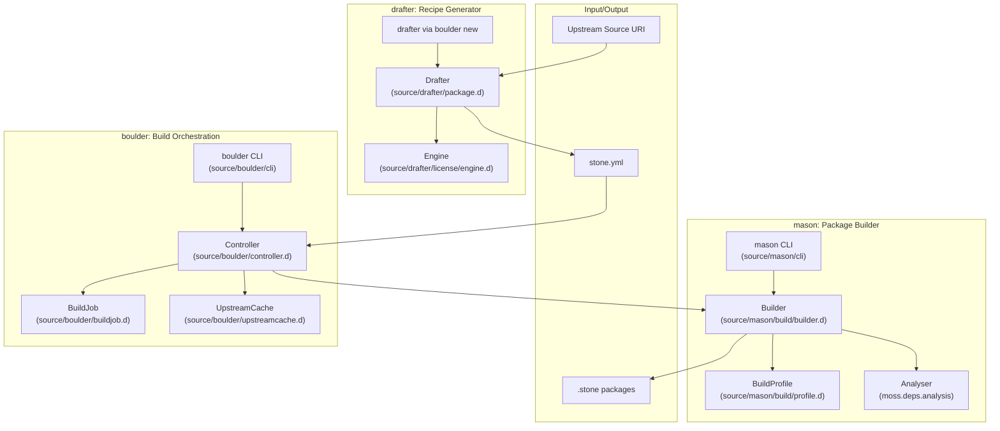
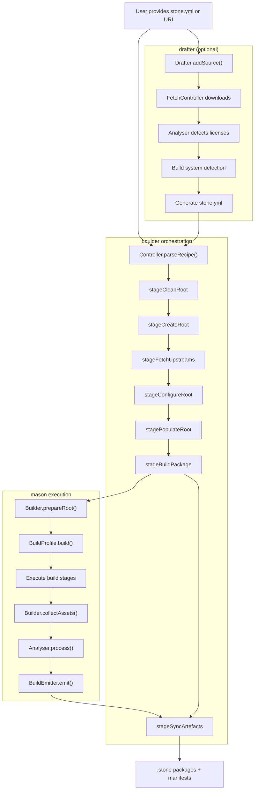
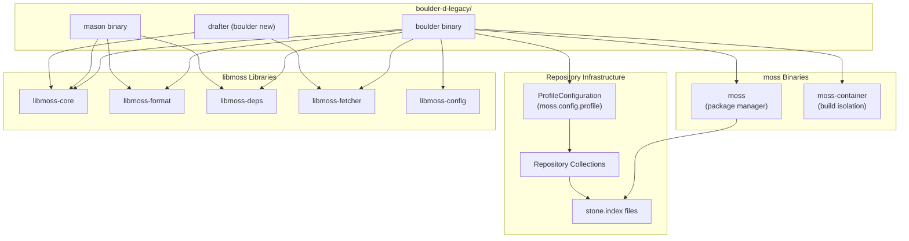

# Overview

Relevant source files

* [.gitignore](../.gitignore)
* [data/default-x86\_64.conf](../data/default-x86_64.conf)
* [data/environment.in](../data/environment.in)
* [data/meson.build](../data/meson.build)
* [dub.json](../dub.json)
* [source/boulder/controller.d](../source/boulder/controller.d)
* [source/boulder/stages/clean\_root.d](../source/boulder/stages/clean_root.d)
* [source/boulder/stages/package.d](../source/boulder/stages/package.d)
* [source/drafter/license/engine.d](../source/drafter/license/engine.d)
* [source/drafter/package.d](../source/drafter/package.d)
* [source/mason/build/analysers/binary.d](../source/mason/build/analysers/binary.d)
* [source/mason/build/analysers/cmake.d](../source/mason/build/analysers/cmake.d)
* [source/mason/build/analysers/package.d](../source/mason/build/analysers/package.d)
* [source/mason/build/analysers/pkgconfig.d](../source/mason/build/analysers/pkgconfig.d)
* [source/mason/build/analysers/rejects.d](../source/mason/build/analysers/rejects.d)
* [source/mason/build/builder.d](../source/mason/build/builder.d)
* [source/mason/meson.build](../source/mason/meson.build)

boulder-d-legacy/ is a build system for creating `.stone` binary packages for the Serpent OS ecosystem and the moss package manager. It orchestrates the entire build process from source code to distributable packages, providing automated recipe generation, build execution, and package emission.

This page introduces the architecture and three main subsystems: **boulder** (build orchestration), **mason** (package compilation and creation), and **drafter** (recipe generation). For detailed information about specific subsystems, see [Boulder: Build Orchestration](2-boulder:-build-orchestration), [Mason: Package Builder](3-mason:-package-builder), and [Drafter: Recipe Generator](4-drafter:-recipe-generator).

## System Components

boulder-d-legacy/ consists of three integrated command-line tools, each with a distinct purpose in the package creation workflow:



**Diagram: System Component Overview**

Sources: [source/boulder/controller.d20-512](../source/boulder/controller.d#L20-L512) [source/mason/build/builder.d17-503](../source/mason/build/builder.d#L17-L503) [source/drafter/package.d26-375](../source/drafter/package.d#L26-L375)

### boulder: Build Orchestration

**boulder** is the main orchestration tool that coordinates the complete build lifecycle. The `Controller` class ([source/boulder/controller.d44-512](../source/boulder/controller.d#L44-L512)) manages recipe parsing, environment setup, dependency resolution, and delegates actual compilation to mason.

| Component | Purpose | Key File |
| --- | --- | --- |
| `Controller` | Main build coordinator | [source/boulder/controller.d44-512](../source/boulder/controller.d#L44-L512) |
| `BuildJob` | Build configuration and path management | [source/boulder/buildjob.d](../source/boulder/buildjob.d) |
| `UpstreamCache` | Source download and caching | [source/boulder/upstreamcache.d](../source/boulder/upstreamcache.d) |
| Build Stages | Sequential execution phases | [source/boulder/stages/package.d41-52](../source/boulder/stages/package.d#L41-L52) |

The build process executes through a series of stages defined in [source/boulder/stages/package.d41-52](../source/boulder/stages/package.d#L41-L52):

```
static auto buildStages = [
    &stageCleanRoot, &stageCreateRoot, &stageFetchUpstreams, &stageConfigureRoot,
    &stagePopulateRoot, &stageShareUpstreams, &stageBuildPackage,
    &stageSyncArtefacts,
];
```

Sources: [source/boulder/controller.d1-512](../source/boulder/controller.d#L1-L512) [source/boulder/stages/package.d1-160](../source/boulder/stages/package.d#L1-L160)

### mason: Package Builder

**mason** performs the actual compilation and package creation. The `Builder` class ([source/mason/build/builder.d48-503](../source/mason/build/builder.d#L48-L503)) executes build scripts, analyzes installed files, and emits `.stone` packages with metadata.

| Component | Purpose | Key File |
| --- | --- | --- |
| `Builder` | Compilation coordinator | [source/mason/build/builder.d48-503](../source/mason/build/builder.d#L48-L503) |
| `BuildProfile` | Architecture-specific build execution | [source/mason/build/profile.d](../source/mason/build/profile.d) |
| `Analyser` | File analysis and dependency detection | [moss.deps.analysis](../moss.deps.analysis) |
| `BuildEmitter` | Package creation | [source/mason/build/emitter.d](../source/mason/build/emitter.d) |
| `BuildCollector` | File collection and organization | [source/mason/build/collector.d](../source/mason/build/collector.d) |

mason runs multiple analysis chains to detect file types and dependencies ([source/mason/build/builder.d305-337](../source/mason/build/builder.d#L305-L337)):

```
const auto boulderChains = [
    AnalysisChain("badFiles", [&dropBadPaths], 100),
    AnalysisChain("binary", [&handleBinaryFiles], 100),
    AnalysisChain("elves", [&acceptElfFiles, &scanElfFiles, &deferElfInclusion], 90),
    AnalysisChain("pkgconfig", [&acceptPkgconfigFiles, &handlePkgconfigFiles, &includeFile], 50),
    AnalysisChain("cmake", [&acceptCmakeFiles, &handleCmakeFiles, &includeFile], 50),
    AnalysisChain("default", [&includeFile], 0),
];
```

Sources: [source/mason/build/builder.d1-503](../source/mason/build/builder.d#L1-L503) [source/mason/build/analysers/package.d1-23](../source/mason/build/analysers/package.d#L1-L23)

### drafter: Recipe Generator

**drafter** automates the creation of `stone.yml` recipe files from upstream source URIs. The `Drafter` class ([source/drafter/package.d71-375](../source/drafter/package.d#L71-L375)) downloads sources, detects licenses, identifies build systems, and generates a complete recipe skeleton.

| Component | Purpose | Key File |
| --- | --- | --- |
| `Drafter` | Recipe generation coordinator | [source/drafter/package.d71-375](../source/drafter/package.d#L71-L375) |
| `Engine` | License detection via Levenshtein distance | [source/drafter/license/engine.d189-300](../source/drafter/license/engine.d#L189-L300) |
| Build Chains | Build system detection | [source/drafter/build/](../source/drafter/build/) |
| Metadata Helpers | URI parsing for package info | [source/drafter/metadata/](../source/drafter/metadata/) |

The license engine uses Levenshtein distance matching against SPDX license texts ([source/drafter/license/engine.d217-253](../source/drafter/license/engine.d#L217-L253)), with a minimum confidence threshold of 88% ([source/drafter/license/engine.d39](../source/drafter/license/engine.d#L39-L39)).

Sources: [source/drafter/package.d1-375](../source/drafter/package.d#L1-L375) [source/drafter/license/engine.d1-300](../source/drafter/license/engine.d#L1-L300)

## Build Workflow

The complete workflow from source URI to binary package follows this sequence:



**Diagram: Complete Build Workflow**

Sources: [source/boulder/controller.d225-313](../source/boulder/controller.d#L225-L313) [source/boulder/stages/package.d41-52](../source/boulder/stages/package.d#L41-L52) [source/mason/build/builder.d184-241](../source/mason/build/builder.d#L184-L241) [source/drafter/package.d141-189](../source/drafter/package.d#L141-L189)

## Integration with moss Ecosystem

boulder-d-legacy/ integrates deeply with the moss package management ecosystem through both library linkage and binary execution:



**Diagram: moss Ecosystem Integration**

The `Controller` locates moss binaries relative to its own location ([source/boulder/controller.d62-65](../source/boulder/controller.d#L62-L65)):

```
auto binDir = thisExePath.dirName;
_mossBinary = binDir.buildNormalizedPath("moss").absolutePath;
_containerBinary = binDir.buildNormalizedPath("moss-container").absolutePath;
```

Profile configuration ([source/boulder/controller.d70-98](../source/boulder/controller.d#L70-L98)) defines repository collections used for dependency resolution. The default profile configuration is located at [data/default-x86\_64.conf1-20](../data/default-x86_64.conf#L1-L20)

Sources: [source/boulder/controller.d54-125](../source/boulder/controller.d#L54-L125) [dub.json14-17](../dub.json#L14-L17) [data/default-x86\_64.conf1-20](../data/default-x86_64.conf#L1-L20)

## Key Artifacts

boulder-d-legacy/ produces and consumes several file types:

| Artifact | Purpose | Format | Produced By |
| --- | --- | --- | --- |
| `stone.yml` | Build recipe | YAML | drafter or manually created |
| `.stone` | Binary package | moss binary format | mason via `BuildEmitter` |
| `manifest.bin` | Binary metadata | Custom binary | mason via `BuildEmitter` |
| `manifest.jsonc` | Human-readable metadata | JSON with comments | mason via `BuildEmitter` |
| `stone.index` | Repository index | moss format | moss binary |

The build process transforms a `stone.yml` recipe into one or more `.stone` packages, each with accompanying manifests. These packages are moss-compatible and can be installed via the moss package manager.

Sources: [source/mason/build/emitter.d](../source/mason/build/emitter.d) [source/mason/build/manifest/package.d](../source/mason/build/manifest/package.d)

## Confinement and Security

boulder supports two execution modes ([source/boulder/controller.d54-58](../source/boulder/controller.d#L54-L58)):

* **Confined builds** (default): Executes mason inside `moss-container` for isolation
* **Unconfined builds** (`-u` flag): Executes mason directly on the host (for debugging)

The `Controller.confinement` property ([source/boulder/controller.d147-150](../source/boulder/controller.d#L147-L150)) controls this behavior. Confined builds provide security isolation but require both `moss` and `moss-container` binaries to be available ([source/boulder/controller.d100-114](../source/boulder/controller.d#L100-L114)).

Sources: [source/boulder/controller.d54-119](../source/boulder/controller.d#L54-L119) [source/boulder/stages/package.d83-87](../source/boulder/stages/package.d#L83-L87)

## Project Structure

The repository uses DUB and Meson for building ([dub.json1-30](../dub.json#L1-L30) [source/mason/meson.build1-42](../source/mason/meson.build#L1-L42)):

```
boulder-d-legacy//
├── source/
│   ├── boulder/          # Build orchestration
│   │   ├── controller.d  # Main controller
│   │   ├── buildjob.d    # Build configuration
│   │   ├── stages/       # Build stages
│   │   └── upstreamcache.d
│   ├── mason/            # Package builder
│   │   ├── build/
│   │   │   ├── builder.d
│   │   │   ├── analysers/
│   │   │   ├── emitter.d
│   │   │   └── profile.d
│   │   └── cli/
│   └── drafter/          # Recipe generator
│       ├── package.d
│       ├── license/
│       ├── build/
│       └── metadata/
├── data/
│   ├── macros/           # Build macro definitions
│   └── default-x86_64.conf
└── dub.json
```

The project depends on libmoss ([dub.json14-17](../dub.json#L14-L17)), which must be available in a sibling directory (`../libmoss`).

Sources: [dub.json1-30](../dub.json#L1-L30) [source/mason/meson.build1-42](../source/mason/meson.build#L1-L42) [data/meson.build1-21](../data/meson.build#L1-L21)