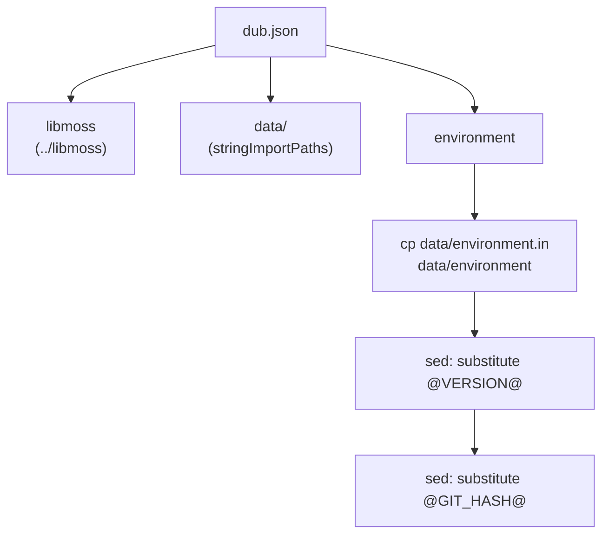
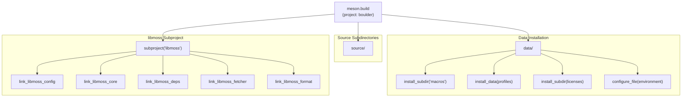
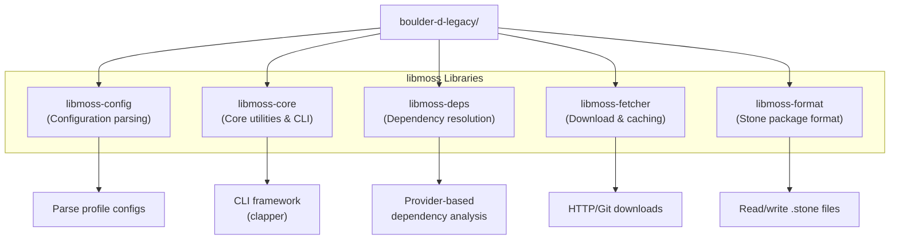
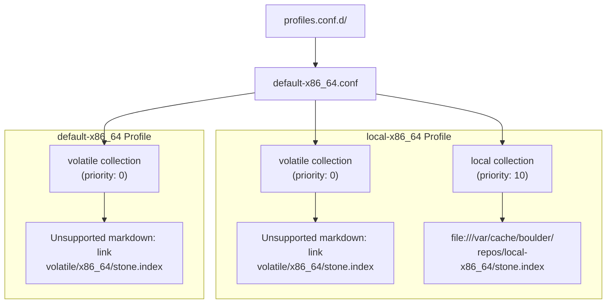

# Project Structure

Relevant source files

* [.gitignore](../.gitignore)
* [.gitmodules](../.gitmodules)
* [data/default-x86\_64.conf](../data/default-x86_64.conf)
* [data/environment.in](../data/environment.in)
* [data/meson.build](../data/meson.build)
* [dub.json](../dub.json)
* [meson.build](../meson.build)

This page describes the physical organization of the boulder-d-legacy/ repository, including its directory structure, build system configuration, external dependencies, and how the three main tools (boulder, mason, and drafter) are organized within the codebase. For information about how these tools function at runtime, see [Boulder: Build Orchestration](2-boulder:-build-orchestration), [Mason: Package Builder](3-mason:-package-builder), and [Drafter: Recipe Generator](4-drafter:-recipe-generator).

## Repository Layout

The boulder-d-legacy/ repository is organized into several top-level directories that separate source code, configuration data, build scripts, and external dependencies:

**Directory Structure:**

| Directory | Purpose |
| --- | --- |
| `source/boulder/` | Boulder orchestrator source code - manages build lifecycle and stages |
| `source/mason/` | Mason builder source code - performs compilation and package creation |
| `source/drafter/` | Drafter generator source code - creates skeletal stone.yml recipes |
| `data/macros/` | Macro definitions for build systems, architectures, and standard paths |
| `data/profiles.conf.d/` | Build profile configurations defining repository collections |
| `license-list-data/` | Git submodule containing SPDX license database for drafter's license detection |
| `serpent-style/` | Git submodule containing D language coding style enforcement rules |

Sources: [meson.build1-52](../meson.build#L1-L52) [dub.json1-30](../dub.json#L1-L30) [.gitmodules1-3](../.gitmodules#L1-L3) [data/meson.build1-21](../data/meson.build#L1-L21)

## Build System Configuration

Boulder supports two build systems: **DUB** (D's native package manager) and **Meson** (cross-platform build system). Both build configurations target the same source tree but serve different purposes.

### DUB Configuration

The DUB build system is defined in `dub.json` and primarily used for development workflows:

Key DUB configuration aspects:

| Property | Value | Purpose |
| --- | --- | --- |
| `name` | `"boulder"` | Package name |
| `version` | `"1.0.1"` | Package version |
| `targetPath` | `"bin"` | Binary output directory |
| `dependencies.libmoss.path` | `"../libmoss"` | Local libmoss dependency |
| `stringImportPaths` | `["data"]` | Compile-time string import directory |
| `toolchainRequirements.ldc` | `">=1.31.0"` | Minimum LDC compiler version |

The DUB build performs pre-build substitution of version information into `data/environment` from the template `data/environment.in` [dub.json22-25](../dub.json#L22-L25)

Sources: [dub.json1-30](../dub.json#L1-L30)

### Meson Configuration

The Meson build system is the primary production build configuration:

The Meson build [meson.build1-52](../meson.build#L1-L52):

* Requires LDC version ≥ 1.31.0 [meson.build11-13](../meson.build#L11-L13)
* Imports libmoss as a subproject with `default_library=static` and version requirement `>=1.2.0` [meson.build18-23](../meson.build#L18-L23)
* Extracts five libmoss library linker dependencies [meson.build26-38](../meson.build#L26-L38)
* Installs macro definitions to `$PREFIX/share/boulder/macros/` [data/meson.build1-3](../data/meson.build#L1-L3)
* Installs build profiles to `$PREFIX/share/boulder/profiles.conf.d/` [data/meson.build5-9](../data/meson.build#L5-L9)
* Installs SPDX license database to `$PREFIX/share/boulder/licenses/` [meson.build44-46](../meson.build#L44-L46)
* Configures version information into `data/environment` using git describe [data/meson.build11-21](../data/meson.build#L11-L21)

Sources: [meson.build1-52](../meson.build#L1-L52) [data/meson.build1-21](../data/meson.build#L1-L21)

## libmoss Dependencies

Boulder depends on five distinct libmoss libraries, each providing specific functionality:

**Library Purposes:**

| Library | Primary Functionality | Used By |
| --- | --- | --- |
| `libmoss-config` | Parse profile configurations and repository collections | Boulder (profile loading) |
| `libmoss-core` | Core utilities including CLI framework (clapper), logging, paths | All three tools |
| `libmoss-deps` | Dependency resolution through provider analysis (BinaryName, PkgconfigName, etc.) | Mason (dependency detection) |
| `libmoss-fetcher` | Download and cache remote files via HTTP/Git | Boulder (upstream fetching), Drafter (source download) |
| `libmoss-format` | Read and write `.stone` package files in the moss binary format | Mason (package emission) |

The libmoss dependency is configured as a local path dependency in DUB [dub.json15-17](../dub.json#L15-L17) and as a Meson subproject with static linking [meson.build18-23](../meson.build#L18-L23) This tight integration allows boulder to leverage the moss ecosystem's package management capabilities.

Sources: [meson.build18-38](../meson.build#L18-L38) [dub.json14-17](../dub.json#L14-L17)

## Tool Architecture and Module Organization

The three main tools are organized as separate D packages under the `source/` directory, with shared dependencies on libmoss:

```mermaid
flowchart TD

boulder_main["boulder.main"]
boulder_controller["boulder.controller"]
boulder_stages["boulder.stages.*"]
boulder_buildjob["boulder.buildjob"]
boulder_upstreamcache["boulder.upstreamcache"]
boulder_cli["boulder.cli.build<br>boulder.cli.new<br>boulder.cli.delete_cache"]
mason_main["mason.main"]
mason_builder["mason.build.builder"]
mason_profile["mason.build.profile"]
mason_context["mason.build.context"]
mason_analysers["mason.build.analysers.*"]
mason_emitter["mason.build.emitter"]
mason_collector["mason.build.collector"]
drafter_main["drafter.main"]
drafter_drafter["drafter.drafter"]
drafter_analyser["drafter.analyser"]
drafter_license["drafter.license.*"]
drafter_metadata["drafter.metadata.*"]
drafter_chains["drafter.build.chain.*"]
moss_core["moss.core.*"]
moss_config["moss.config.*"]
moss_deps["moss.deps.*"]
moss_fetcher["moss.fetcher.*"]
moss_format["moss.format.*"]

boulder_controller --> moss_config
boulder_controller --> moss_fetcher
boulder_stages --> moss_core
mason_builder --> moss_deps
mason_emitter --> moss_format
drafter_drafter --> moss_fetcher
drafter_license --> moss_core

subgraph libmoss ["libmoss"]
    moss_core
    moss_config
    moss_deps
    moss_fetcher
    moss_format
end

subgraph subGraph2 ["drafter Package"]
    drafter_main
    drafter_drafter
    drafter_analyser
    drafter_license
    drafter_metadata
    drafter_chains
end

subgraph subGraph1 ["mason Package"]
    mason_main
    mason_builder
    mason_profile
    mason_context
    mason_analysers
    mason_emitter
    mason_collector
end

subgraph subGraph0 ["boulder Package"]
    boulder_main
    boulder_controller
    boulder_stages
    boulder_buildjob
    boulder_upstreamcache
    boulder_cli
end
```

**Compilation Targets:**

The build produces three separate executables:

| Executable | Entry Point | Primary Modules | Purpose |
| --- | --- | --- | --- |
| `boulder` | `boulder.main` | `controller`, `stages.*`, `buildjob`, `upstreamcache` | Build orchestration through sequential stages |
| `mason` | `mason.main` | `build.builder`, `build.profile`, `build.analysers.*`, `build.emitter` | Package compilation and binary creation |
| `drafter` | `drafter.main` | `drafter`, `analyser`, `license.*`, `metadata.*`, `build.chain.*` | Automated stone.yml recipe generation |

**Tool Relationships:**

* **Boulder** invokes **Mason** as a subprocess during the `stageBuildPackage` build stage
* **Boulder** manages the build environment and source preparation, then delegates compilation to **Mason**
* **Mason** operates independently on a prepared build root, performing compilation and analysis
* **Drafter** is a standalone tool that generates initial recipes which **Boulder** can then process

This separation allows each tool to focus on its specific responsibility while sharing common functionality through libmoss.

Sources: [meson.build1-52](../meson.build#L1-L52) [dub.json1-30](../dub.json#L1-L30)

## Configuration and Data Files

The `data/` directory contains runtime configuration that controls build behavior:

### Profile Configuration

Build profiles define repository collections for dependency resolution. The default profile configuration [data/default-x86\_64.conf1-20](../data/default-x86_64.conf#L1-L20) defines two profiles:

The `local-x86_64` profile adds a local repository collection with higher priority (10 vs 0), allowing locally built packages to override remote packages during dependency resolution.

### Macro Definitions

The `data/macros/` directory contains YAML-based macro definitions that control build script generation (see [Configuration System](5-configuration-system) for detailed documentation on macro functionality).

### Environment Configuration

The `data/environment.in` template [data/environment.in1-2](../data/environment.in#L1-L2) defines build-time version information that is substituted during the build process:

| Variable | Source | Usage |
| --- | --- | --- |
| `@VERSION@` | `meson.project_version()` or `$DUB_PACKAGE_VERSION` | Boulder version reported by `--version` |
| `@GIT_HASH@` | `git describe --always --dirty` | Git commit identifier for development builds |

This information is compiled into the binaries as string imports, allowing runtime version reporting without hardcoded values.

Sources: [data/default-x86\_64.conf1-20](../data/default-x86_64.conf#L1-L20) [data/environment.in1-2](../data/environment.in#L1-L2) [data/meson.build11-21](../data/meson.build#L11-L21) [dub.json22-28](../dub.json#L22-L28)

## Installation Layout

When built with Meson, boulder installs files to standard system locations:

| Component | Install Path | Purpose |
| --- | --- | --- |
| Executables | `$PREFIX/bin/` | `boulder`, `mason`, `drafter` binaries |
| Macros | `$PREFIX/share/boulder/macros/` | Build system and architecture macro definitions |
| Profiles | `$PREFIX/share/boulder/profiles.conf.d/` | Default profile configurations |
| Licenses | `$PREFIX/share/boulder/licenses/` | SPDX license database for drafter |

This standard layout allows boulder to locate its configuration files at runtime using compile-time configured paths.

Sources: [meson.build40-52](../meson.build#L40-L52) [data/meson.build1-9](../data/meson.build#L1-L9)