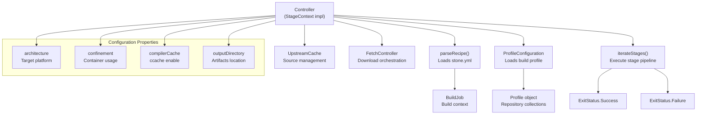
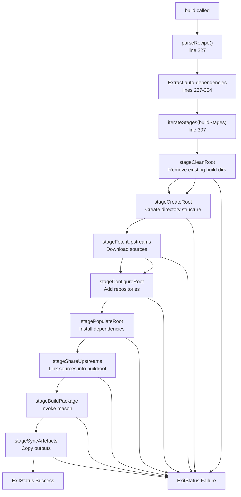
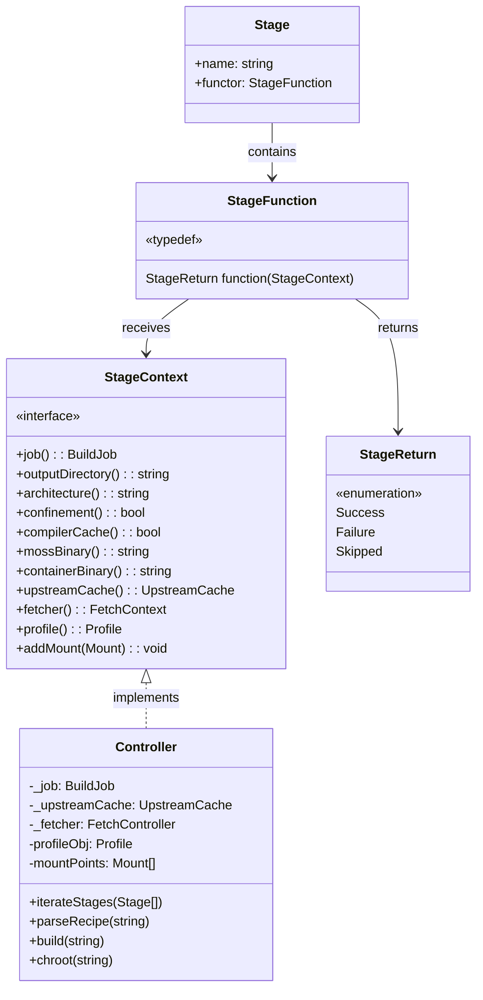
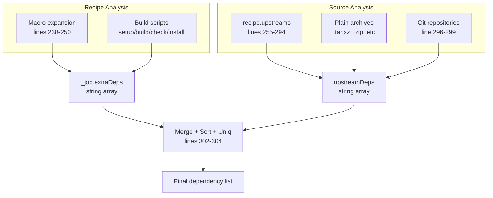
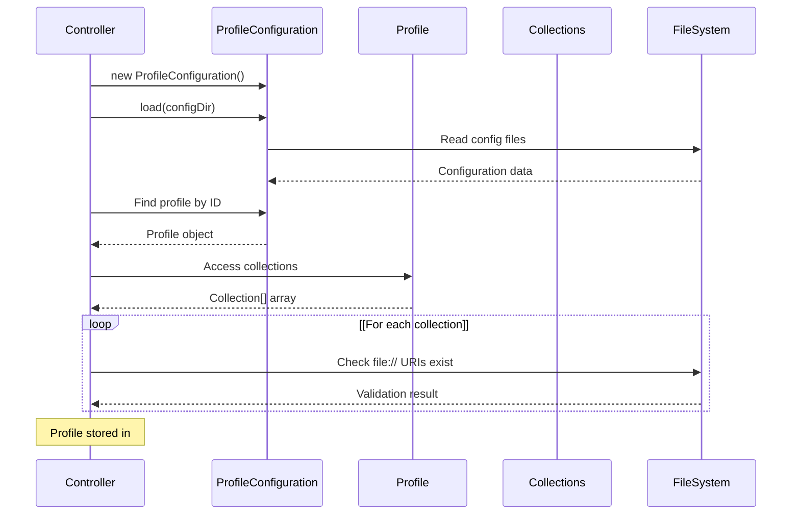
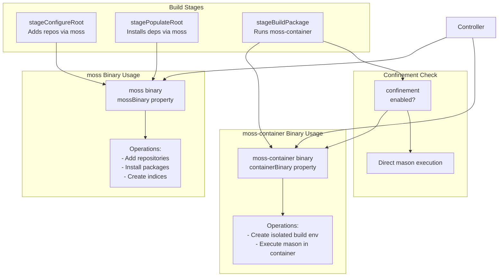
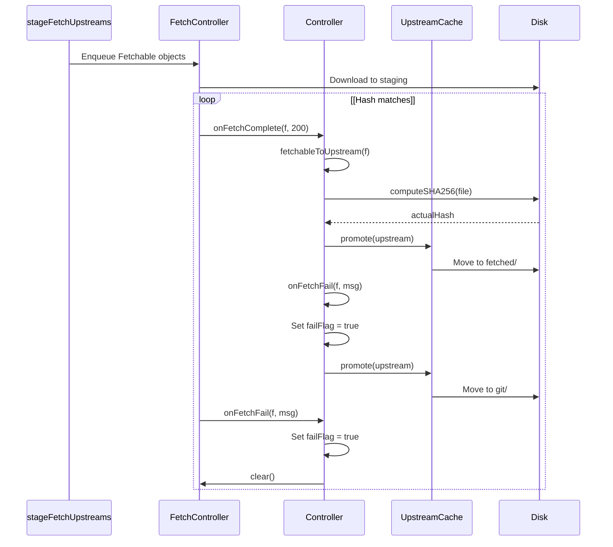
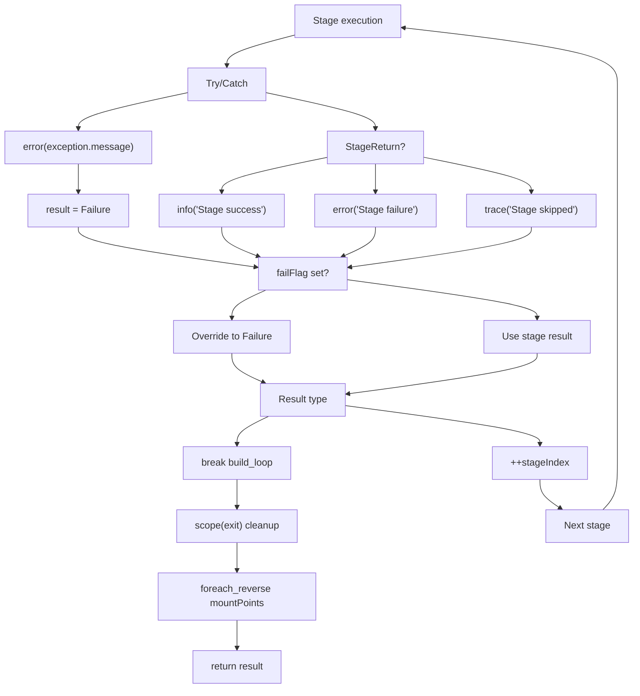
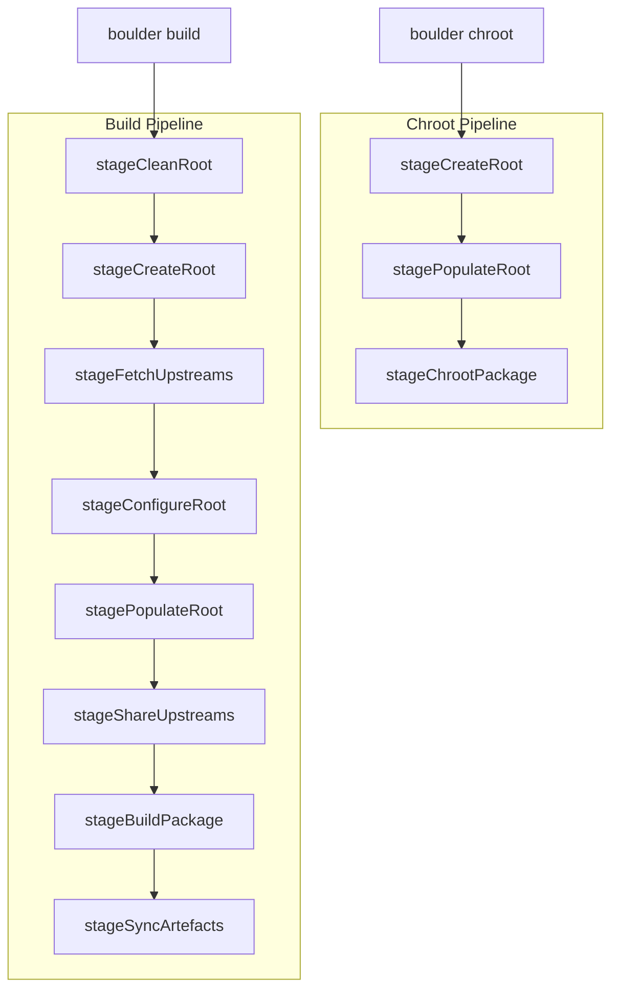
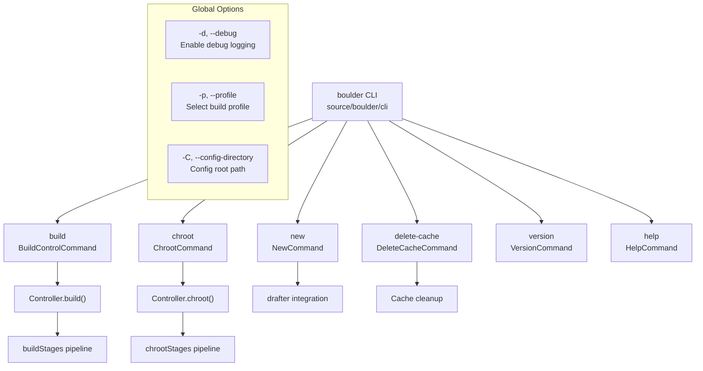

# Boulder: Build Orchestration

Relevant source files

* [source/boulder/cli/deletecache\_command.d](../source/boulder/cli/deletecache_command.d)
* [source/boulder/cli/package.d](../source/boulder/cli/package.d)
* [source/boulder/controller.d](../source/boulder/controller.d)
* [source/boulder/main.d](../source/boulder/main.d)
* [source/boulder/stages/clean\_root.d](../source/boulder/stages/clean_root.d)
* [source/boulder/stages/package.d](../source/boulder/stages/package.d)

Boulder is the top-level orchestration component in the boulder-d-legacy/ system that manages the complete package build lifecycle. It coordinates all phases of building a package from a `stone.yml` recipe file, including source fetching, dependency resolution, environment setup, and invocation of the mason build system. Boulder operates through a sequential pipeline of stages, each responsible for a specific aspect of the build preparation and execution.

For information about the actual compilation and package creation process, see [Mason: Package Builder](3-mason:-package-builder). For recipe file format details, see [Stone.yml Recipe Format](6-stone.yml-recipe-format). For the underlying configuration system, see [Configuration System](5-configuration-system).

## Controller: The Main Orchestrator

The `Controller` class serves as the primary entry point for all build operations. It implements the `StageContext` interface and coordinates the execution of build stages.

**Controller Responsibilities**



Sources: [source/boulder/controller.d44-125](../source/boulder/controller.d#L44-L125) [source/boulder/stages/package.d58-121](../source/boulder/stages/package.d#L58-L121)

**Key Methods**

| Method | Purpose | Returns |
| --- | --- | --- |
| `parseRecipe(string)` | Parse stone.yml file into Spec | `BuildJob` |
| `build(string)` | Execute full build pipeline | `ExitStatus` |
| `chroot(string)` | Enter interactive build environment | `ExitStatus` |
| `iterateStages(Stage[])` | Execute sequence of stages | `StageReturn` |

The Controller manages critical resources including paths to `moss` and `moss-container` binaries, the upstream source cache, and the fetch controller for parallel downloads. It also tracks mount points to ensure proper cleanup on both successful and failed builds.

Sources: [source/boulder/controller.d198-313](../source/boulder/controller.d#L198-L313) [source/boulder/controller.d321-347](../source/boulder/controller.d#L321-L347) [source/boulder/controller.d355-418](../source/boulder/controller.d#L355-L418)

## Build Lifecycle Pipeline

Boulder executes builds through a fixed sequence of stages defined in `buildStages`. Each stage performs a specific operation and returns a status indicating success, failure, or that it was skipped.

**Sequential Stage Execution**



Sources: [source/boulder/stages/package.d41-45](../source/boulder/stages/package.d#L41-L45) [source/boulder/controller.d225-313](../source/boulder/controller.d#L225-L313)

**Stage Definitions**

The `buildStages` array defines the complete pipeline:

```
static auto buildStages = [
    &stageCleanRoot,        // Clean previous artifacts
    &stageCreateRoot,       // Create build directory tree
    &stageFetchUpstreams,   // Download and validate sources
    &stageConfigureRoot,    // Configure moss repositories
    &stagePopulateRoot,     // Install build dependencies
    &stageShareUpstreams,   // Hardlink sources into buildroot
    &stageBuildPackage,     // Execute mason build
    &stageSyncArtefacts,    // Copy .stone packages to output
];
```

Each stage is represented by a `Stage` struct containing a name and a `StageFunction` functor. For details on individual stages, see [Build Stages](2.3-build-stages).

Sources: [source/boulder/stages/package.d41-52](../source/boulder/stages/package.d#L41-L52)

## Stage Execution System

**Stage Interface Definition**



Sources: [source/boulder/stages/package.d58-160](../source/boulder/stages/package.d#L58-L160) [source/boulder/controller.d44-512](../source/boulder/controller.d#L44-L512)

**Stage Execution Flow**

The `iterateStages()` method in Controller handles the sequential execution logic:

1. **Iteration**: Loop through stages array maintaining an index
2. **Invocation**: Call each stage's functor with the Controller as context
3. **Error Handling**: Catch exceptions and convert to `StageReturn.Failure`
4. **Flow Control**: Advance index on Success/Skipped, break loop on Failure
5. **Cleanup**: Unmount all tracked mount points in reverse order (scope exit)

The mount tracking system ensures that any filesystems mounted during stages (e.g., by populate\_root or build\_package) are properly unmounted even if a later stage fails.

Sources: [source/boulder/controller.d355-418](../source/boulder/controller.d#L355-L418) [source/boulder/controller.d420-426](../source/boulder/controller.d#L420-L426)

## Dependency Auto-Detection

Before executing stages, the Controller performs automatic dependency detection to ensure all required tools are available in the build environment.

**Auto-Dependency Sources**



**Archive Format Detection**

Boulder automatically adds extraction tool dependencies based on upstream file extensions:

| Extension | Required Dependencies |
| --- | --- |
| `.xz` | `binary(tar)`, `binary(xz)` |
| `.zst` | `binary(tar)`, `binary(zstd)` |
| `.bz2` | `binary(tar)`, `binary(bzip2)` |
| `.gz` | `binary(tar)`, `binary(gzip)` |
| `.zip` | `binary(unzip)` |
| `.rpm` | `binary(rpm2cpio)`, `binary(cpio)` |
| `.deb` | `binary(ar)` |

Git sources automatically add `binary(git)` to the dependency list.

Sources: [source/boulder/controller.d237-304](../source/boulder/controller.d#L237-L304)

## Profile and Configuration Integration

Boulder uses the `ProfileConfiguration` system to manage repository collections and build settings.

**Profile Loading Sequence**



The default profile is `"default-x86_64"` but can be overridden via the `-p` CLI flag. Profiles contain repository collections that specify where to fetch build dependencies. For more details on profile configuration, see [Build Profiles and Repository Configuration](5.5-build-profiles-and-repository-configuration).

Sources: [source/boulder/controller.d69-99](../source/boulder/controller.d#L69-L99) [source/boulder/cli/package.d41](../source/boulder/cli/package.d#L41-L41)

## Integration with moss Ecosystem

Boulder tightly integrates with the moss package management system through both binary invocation and library linkage.

**Binary Integration Points**



The Controller locates moss binaries relative to its own installation path. For confined builds (the default), both binaries must be present. For unconfined builds (via `-u` flag), only the moss binary is required.

Sources: [source/boulder/controller.d62-119](../source/boulder/controller.d#L62-L119)

**Library Integration**

Boulder links against multiple libmoss libraries for core functionality:

* **moss.core**: Utility functions (ExitStatus, computeSHA256, mounts)
* **moss.fetcher**: Download orchestration (FetchController, Fetchable)
* **moss.format.source**: Recipe parsing (Spec, UpstreamType)
* **moss.config**: Profile and repository configuration

For details on how boulder uses libmoss for dependency analysis, see [Dependency Resolution and Analysis](7.2-dependency-resolution-and-analysis).

Sources: [source/boulder/controller.d24-38](../source/boulder/controller.d#L24-L38)

## Fetch System and Upstream Cache

The Controller manages source downloads through the `FetchController` and validates/caches them via `UpstreamCache`.

**Download and Validation Flow**



The `onFetchComplete` callback validates checksums for plain archives before promoting them from staging to the permanent cache. Git repositories are validated by verifying the requested ref exists.

Sources: [source/boulder/controller.d121-124](../source/boulder/controller.d#L121-L124) [source/boulder/controller.d438-494](../source/boulder/controller.d#L438-L494)

**Upstream Matching**

The `fetchableToUpstream()` helper method matches completed downloads to their upstream definitions in the recipe:

* **Plain upstreams**: Matched by comparing the expected SHA256 hash with the download's filename (which is the hash)
* **Git upstreams**: Matched by comparing the URI basename

This mapping is necessary because the fetch system uses generic `Fetchable` objects while the recipe defines typed `UpstreamDefinition` objects.

Sources: [source/boulder/controller.d481-494](../source/boulder/controller.d#L481-L494)

## Error Handling and Cleanup

Boulder implements comprehensive error handling to ensure proper cleanup regardless of build outcome.

**Error Propagation**



The `failFlag` is set by download failures and forces all subsequent stages to fail immediately, preventing execution with incomplete sources.

Sources: [source/boulder/controller.d372-402](../source/boulder/controller.d#L372-L402) [source/boulder/controller.d403-416](../source/boulder/controller.d#L403-L416)

**Mount Point Cleanup**

The Controller tracks all mount points created during build stages and unmounts them in reverse order using a `scope(exit)` block. This ensures cleanup occurs even when exceptions are thrown:

* Unmount flags: `UnmountFlags.Force | UnmountFlags.Detach`
* Order: Reverse order of mount creation (LIFO)
* Error handling: Log failures but continue unmounting remaining mounts

Sources: [source/boulder/controller.d403-416](../source/boulder/controller.d#L403-L416) [source/boulder/controller.d420-426](../source/boulder/controller.d#L420-L426)

## Chroot Command Support

In addition to building packages, Boulder supports entering an interactive chroot environment for debugging and development.

**Chroot vs Build Stages**



The `chroot()` method uses a reduced stage set defined in `chrootStages`. It reuses an existing build root if available, or creates a new one if needed. The method automatically adds useful interactive tools (`git`, `nano`, `vim`) to the dependency list.

Sources: [source/boulder/controller.d321-347](../source/boulder/controller.d#L321-L347) [source/boulder/stages/package.d50-52](../source/boulder/stages/package.d#L50-L52)

## CLI Command Mapping

**Boulder Subcommand Dispatch**



All boulder commands inherit global options defined in the `BoulderCLI` struct. These options are processed before subcommand execution and affect Controller initialization.

Sources: [source/boulder/cli/package.d28-48](../source/boulder/cli/package.d#L28-L48) [source/boulder/main.d32-42](../source/boulder/main.d#L32-L42)