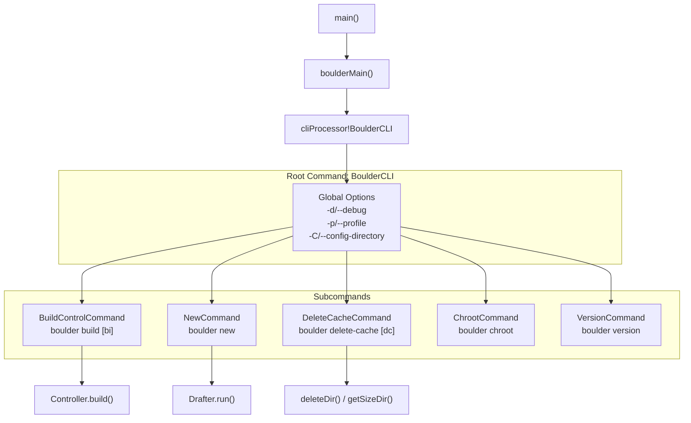
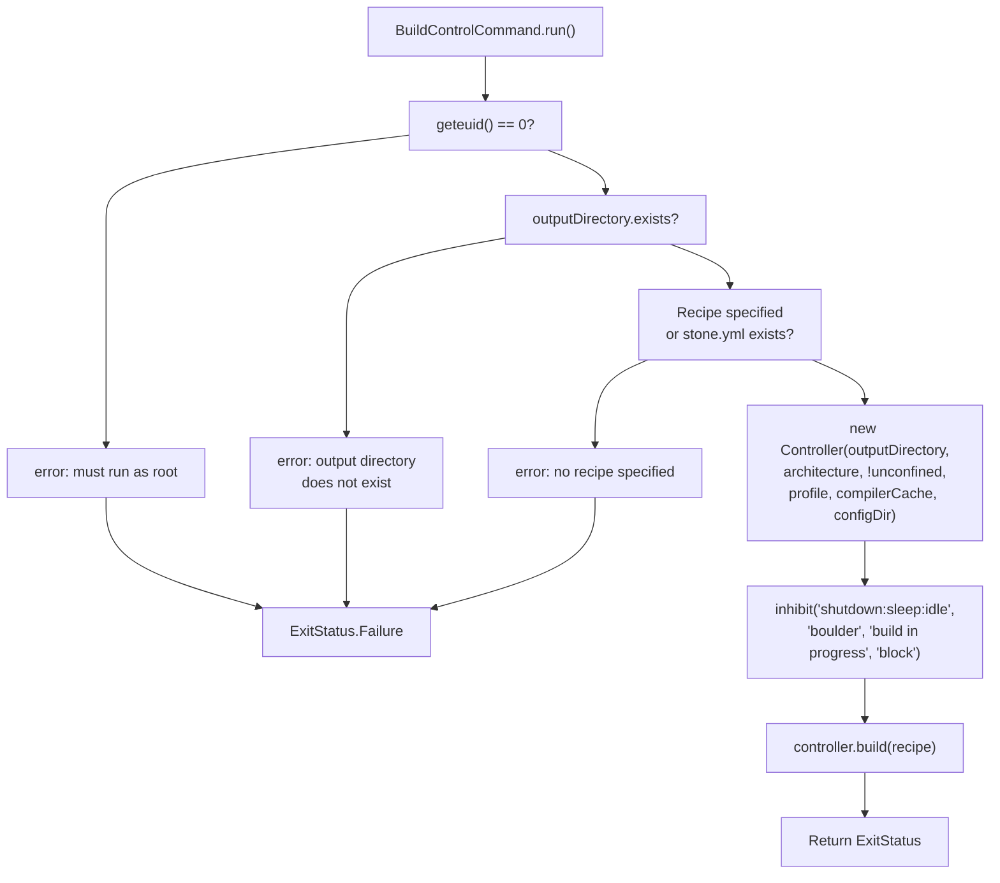
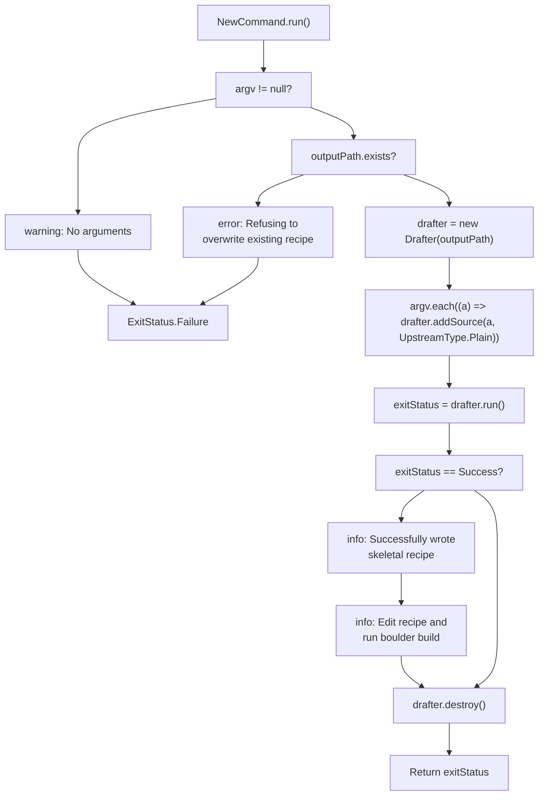
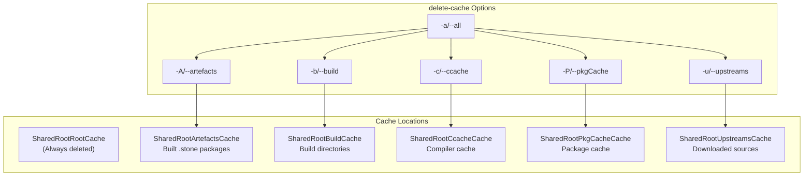

# Boulder CLI Commands

Relevant source files

* [.github/workflows/d.yml](../.github/workflows/d.yml)
* [source/boulder/cli/build\_command.d](../source/boulder/cli/build_command.d)
* [source/boulder/cli/deletecache\_command.d](../source/boulder/cli/deletecache_command.d)
* [source/boulder/cli/new\_command.d](../source/boulder/cli/new_command.d)
* [source/boulder/cli/package.d](../source/boulder/cli/package.d)
* [source/boulder/cli/version\_command.d](../source/boulder/cli/version_command.d)
* [source/boulder/main.d](../source/boulder/main.d)

This page documents the command-line interface for the `boulder` build orchestration tool. It covers all available subcommands, their options, usage patterns, and execution flow. For information about the Controller and build lifecycle that these commands invoke, see [Controller and Build Lifecycle](2.2-controller-and-build-lifecycle). For details about the mason package builder that boulder invokes, see [Mason: Package Builder](3-mason:-package-builder).

## Command Overview

Boulder provides five primary subcommands for package building, recipe generation, and cache management:

| Command | Alias | Purpose | Requires Root |
| --- | --- | --- | --- |
| `build` | `bi` | Build binary .stone packages from recipes | Yes |
| `new` | - | Generate skeletal stone.yml recipe from URI | No |
| `delete-cache` | `dc` | Delete cached assets and build artifacts | Yes (except `-s`) |
| `chroot` | - | Enter build environment for debugging | Yes |
| `version` | - | Display version information | No |

Sources: [source/boulder/main.d34-40](../source/boulder/main.d#L34-L40) [source/boulder/cli/package.d18-23](../source/boulder/cli/package.d#L18-L23)

## CLI Architecture



**CLI Command Structure**: The boulder binary uses the `moss.core.cli` framework to dispatch to different command implementations. The `BoulderCLI` struct defines global options that apply to all subcommands, while each subcommand implements its specific `run()` method.

Sources: [source/boulder/main.d32-42](../source/boulder/main.d#L32-L42) [source/boulder/cli/package.d28-48](../source/boulder/cli/package.d#L28-L48)

## Global Options

The `BoulderCLI` root command provides three global options that can be used with any subcommand:

| Option | Type | Default | Description |
| --- | --- | --- | --- |
| `-d, --debug` | bool | false | Enable debugging output (sets LogLevel.trace) |
| `-p, --profile` | string | "default-x86\_64" | Build profile to use for dependency resolution |
| `-C, --config-directory` | string | (empty) | Root directory for configurations |

These options must be specified **before** the subcommand name:

```
boulder --debug --profile custom-profile build stone.yml
```

Sources: [source/boulder/cli/package.d37-47](../source/boulder/cli/package.d#L37-L47)

## boulder build

The `build` command (alias: `bi`) is the primary command for building binary `.stone` packages from `stone.yml` recipes.

### Syntax

```
boulder build [options] [recipe]
```

If no recipe is specified, boulder looks for `stone.yml` in the current directory.

### Options

| Option | Type | Default | Description |
| --- | --- | --- | --- |
| `-o, --output` | string | "." | Directory to store build results |
| `-j, --jobs` | int | 0 | Number of parallel build jobs (0 = automatic) |
| `-u, --unconfined` | bool | false | Build directly on host without container |
| `-a, --architecture` | string | "native" | Target architecture for the build |
| `-c, --compiler-cache` | bool | false | Enable compiler caching (ccache) |

Sources: [source/boulder/cli/build\_command.d109-121](../source/boulder/cli/build_command.d#L109-L121)

### Execution Flow



**boulder build Command Flow**: The build command validates permissions and inputs, creates a `Controller` instance with the specified configuration, establishes a system inhibitor lock to prevent shutdown during builds, and delegates actual building to the Controller.

Sources: [source/boulder/cli/build\_command.d53-106](../source/boulder/cli/build_command.d#L53-L106)

### Root Requirement

The `build` command requires root privileges (checks `geteuid() == 0` at line 69) because it needs to:

* Create and manage build roots with proper ownership
* Install dependencies using `moss`
* Execute builds in containers via `moss-container`
* Manipulate filesystem attributes and create device nodes

### Inhibitor Lock

Boulder creates a login1 inhibitor lock (line 93) to prevent the system from shutting down, sleeping, or going idle during builds. This prevents loss of work from long-running compilations.

Sources: [source/boulder/cli/build\_command.d69-73](../source/boulder/cli/build_command.d#L69-L73) [source/boulder/cli/build\_command.d92-93](../source/boulder/cli/build_command.d#L92-L93)

## boulder new

The `new` command generates a skeletal `stone.yml` recipe from one or more upstream source URIs.

### Syntax

```
boulder new [options] URI [URI...]
```

### Options

| Option | Type | Default | Description |
| --- | --- | --- | --- |
| `-o, --output` | string | "stone.yml" | Location to output generated build recipe |

Sources: [source/boulder/cli/new\_command.d77-79](../source/boulder/cli/new_command.d#L77-L79)

### Execution Flow



**boulder new Command Flow**: The new command creates a `Drafter` instance, adds all provided URIs as plain upstreams, runs the drafter analysis to detect build systems and licenses, and outputs a generated stone.yml file.

Sources: [source/boulder/cli/new\_command.d44-75](../source/boulder/cli/new_command.d#L44-L75)

### Example Usage

```
# Generate recipe from GitHub release tarball
boulder new https://github.com/example/project/archive/v1.0.tar.gz

# Generate with custom output path
boulder new -o mypackage.yml https://example.com/source.tar.gz

# Generate from multiple sources
boulder new source1.tar.gz source2.tar.gz
```

The generated recipe includes:

* Extracted metadata (name, version, homepage)
* Detected licenses
* Identified build system with appropriate build actions
* Placeholder fields for maintainer to complete

Sources: [source/boulder/cli/new\_command.d64-70](../source/boulder/cli/new_command.d#L64-L70)

## boulder delete-cache

The `delete-cache` command (alias: `dc`) removes cached assets and build artifacts to free disk space.

### Syntax

```
boulder delete-cache [options]
```

### Options

| Option | Type | Description |
| --- | --- | --- |
| `-a, --all` | bool | Delete all assets and caches |
| `-A, --artefacts` | bool | Delete artefacts cache |
| `-b, --build` | bool | Delete build cache |
| `-c, --ccache` | bool | Delete ccache cache |
| `-P, --pkgCache` | bool | Delete pkgCache cache |
| `-u, --upstreams` | bool | Delete upstreams cache |
| `-s, --sizes` | bool | Display disk usage (does not require root) |

Sources: [source/boulder/cli/deletecache\_command.d124-144](../source/boulder/cli/deletecache_command.d#L124-L144)

### Cache Types



**Cache Management Structure**: Boulder maintains multiple cache directories for different purposes. The `SharedRootRootCache` (build roots) is always deleted, while other caches require specific flags. The `-a/--all` flag enables all cache deletion flags.

Sources: [source/boulder/cli/deletecache\_command.d68-103](../source/boulder/cli/deletecache_command.d#L68-L103)

### Cache Directory Usage

| Cache | Purpose | When to Delete |
| --- | --- | --- |
| `SharedRootRootCache` | Active build roots | Always (automatic cleanup) |
| `SharedRootArtefactsCache` | Built .stone packages | When regenerating all packages |
| `SharedRootBuildCache` | Extracted source trees | To free space or force clean builds |
| `SharedRootCcacheCache` | Compiled object cache | To troubleshoot compiler issues |
| `SharedRootPkgCacheCache` | Downloaded dependencies | To update cached packages |
| `SharedRootUpstreamsCache` | Downloaded upstream sources | To redownload sources |

Sources: [source/boulder/cli/deletecache\_command.d68-72](../source/boulder/cli/deletecache_command.d#L68-L72)

### Size Reporting

Using the `-s/--sizes` flag displays disk usage without deleting anything:

```
boulder delete-cache -s
```

This uses parallel directory traversal with atomic operations for accurate size calculation (see `getSizeDir()` function at lines 206-237).

Sources: [source/boulder/cli/deletecache\_command.d66-82](../source/boulder/cli/deletecache_command.d#L66-L82) [source/boulder/cli/deletecache\_command.d206-237](../source/boulder/cli/deletecache_command.d#L206-L237)

### Deletion Implementation

The `deleteDir()` function (lines 153-198) uses parallelized file deletion for performance:

1. Scans directory tree to separate files and directories
2. Deletes files in parallel using `std.parallelism.parallel`
3. Removes directories in depth-first order (already sorted by `dirEntries`)

Sources: [source/boulder/cli/deletecache\_command.d153-198](../source/boulder/cli/deletecache_command.d#L153-L198)

## boulder version

The `version` command displays version and copyright information.

### Syntax

```
boulder version
```

### Output

```
boulder, version <version>

Copyright © 2020-2023 Serpent OS Developers
Available under the terms of the Zlib license
```

The version string is obtained from `boulder.environment.fullVersion()`.

Sources: [source/boulder/cli/version\_command.d38-46](../source/boulder/cli/version_command.d#L38-L46)

## boulder chroot

The `chroot` command provides interactive access to build environments for debugging purposes. While the implementation file was not provided in the sources, it is imported and registered in the CLI.

Sources: [source/boulder/cli/package.d20](../source/boulder/cli/package.d#L20-L20) [source/boulder/main.d36](../source/boulder/main.d#L36-L36)

## Command Registration

All commands are registered in the main entry point:

```mermaid
flowchart TD

Args["args[]"]
Main["main()"]
BaseName["baseName(args[0])"]
Processor["cliProcessor!BoulderCLI(args)"]
AddBuild["addCommand!BuildControlCommand"]
AddChroot["addCommand!ChrootCommand"]
AddDelete["addCommand!DeleteCacheCommand"]
AddNew["addCommand!NewCommand"]
AddVersion["addCommand!VersionCommand"]
AddHelp["addCommand!HelpCommand"]
Process["clip.process(args)"]
MasonMain["masonMain()"]
Exit["return ExitStatus"]

Args --> Main
Main --> BaseName
BaseName --> Processor
BaseName --> MasonMain
Process --> Exit

subgraph boulderMain() ["boulderMain()"]
    Processor
    AddBuild
    AddChroot
    AddDelete
    AddNew
    AddVersion
    AddHelp
    Process
    Processor --> AddBuild
    AddBuild --> AddChroot
    AddChroot --> AddDelete
    AddDelete --> AddNew
    AddNew --> AddVersion
    AddVersion --> AddHelp
    AddHelp --> Process
end
```

**Command Registration Flow**: The main entry point determines whether to invoke boulder or mason based on the program name, then uses `cliProcessor` to register all subcommands. Each command struct is added using `addCommand!CommandType` before processing arguments.

Sources: [source/boulder/main.d32-42](../source/boulder/main.d#L32-L42) [source/boulder/main.d55-74](../source/boulder/main.d#L55-L74)

## Common Patterns

### Debug Mode

All commands check for debug mode from the global `BoulderCLI` context:

```
immutable useDebug = this.findAncestor!BoulderCLI.debugMode;
globalLogLevel = useDebug ? LogLevel.trace : LogLevel.info;
```

This pattern appears in all command implementations.

Sources: [source/boulder/cli/build\_command.d55-56](../source/boulder/cli/build_command.d#L55-L56) [source/boulder/cli/new\_command.d46-47](../source/boulder/cli/new_command.d#L46-L47) [source/boulder/cli/deletecache\_command.d48-49](../source/boulder/cli/deletecache_command.d#L48-L49)

### Profile and Config Directory

Commands that interact with the build system retrieve the profile and config directory from global options:

```
immutable profile = this.findAncestor!BoulderCLI.profile;
immutable configDir = this.findAncestor!BoulderCLI.configDir;
```

Sources: [source/boulder/cli/build\_command.d59-60](../source/boulder/cli/build_command.d#L59-L60)

### Exit Status

All commands return `ExitStatus` values from `moss.core`:

* `ExitStatus.Success` (0) - Command completed successfully
* `ExitStatus.Failure` (non-zero) - Command failed

Sources: [source/boulder/cli/build\_command.d57](../source/boulder/cli/build_command.d#L57-L57) [source/boulder/cli/new\_command.d52](../source/boulder/cli/new_command.d#L52-L52) [source/boulder/cli/deletecache\_command.d46](../source/boulder/cli/deletecache_command.d#L46-L46)