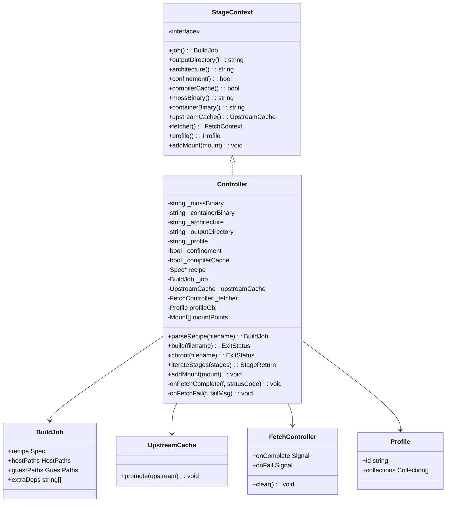
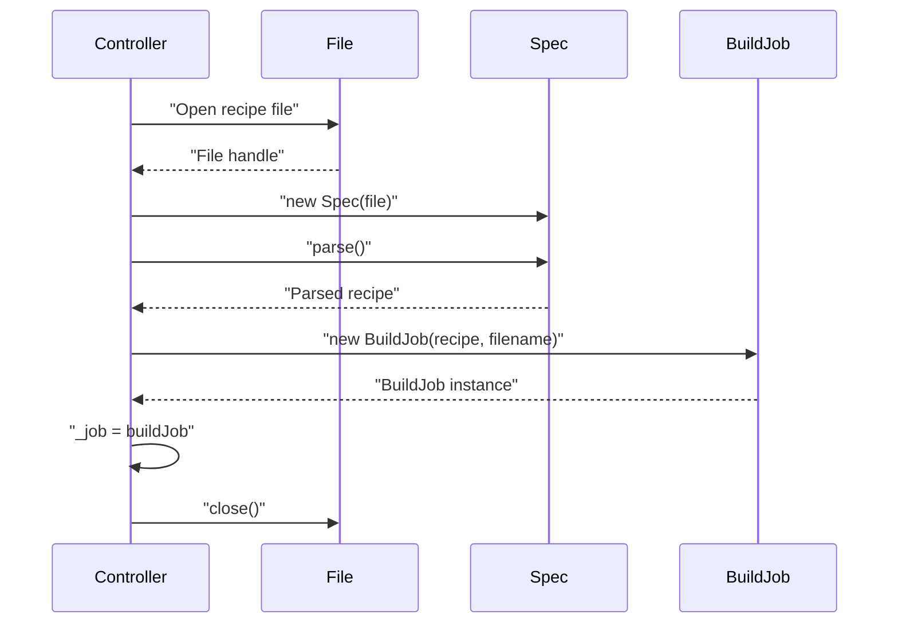
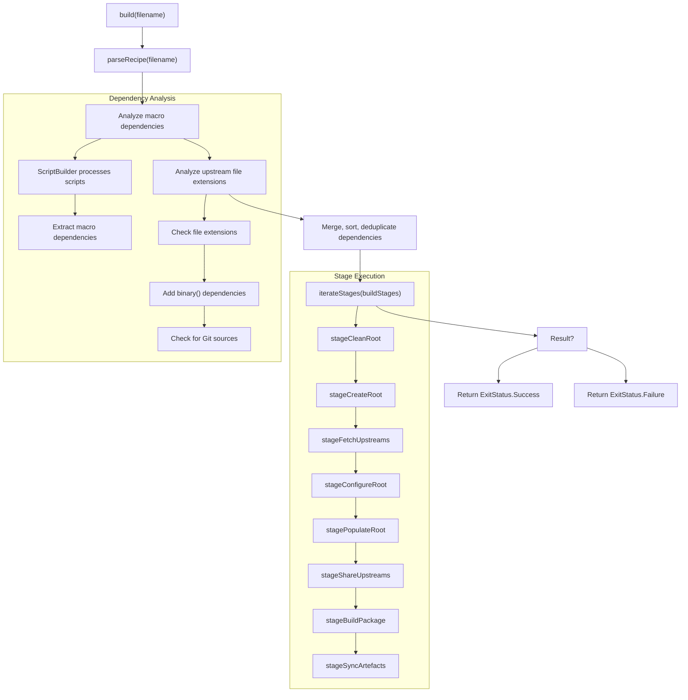
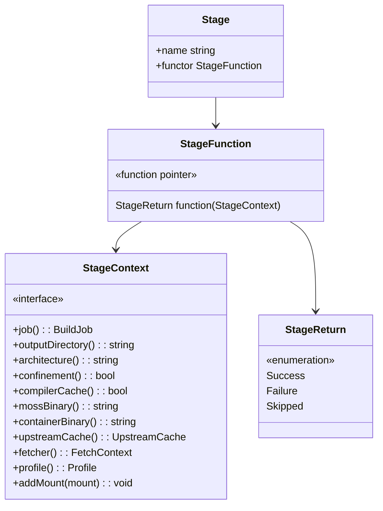
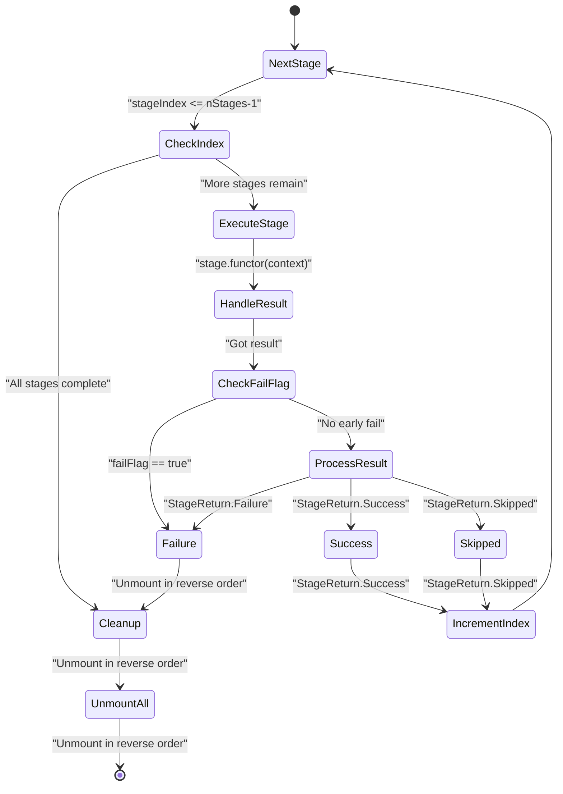
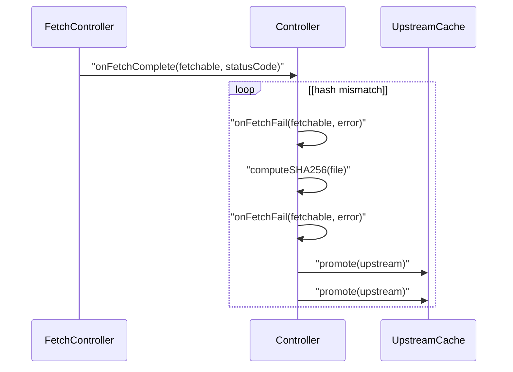
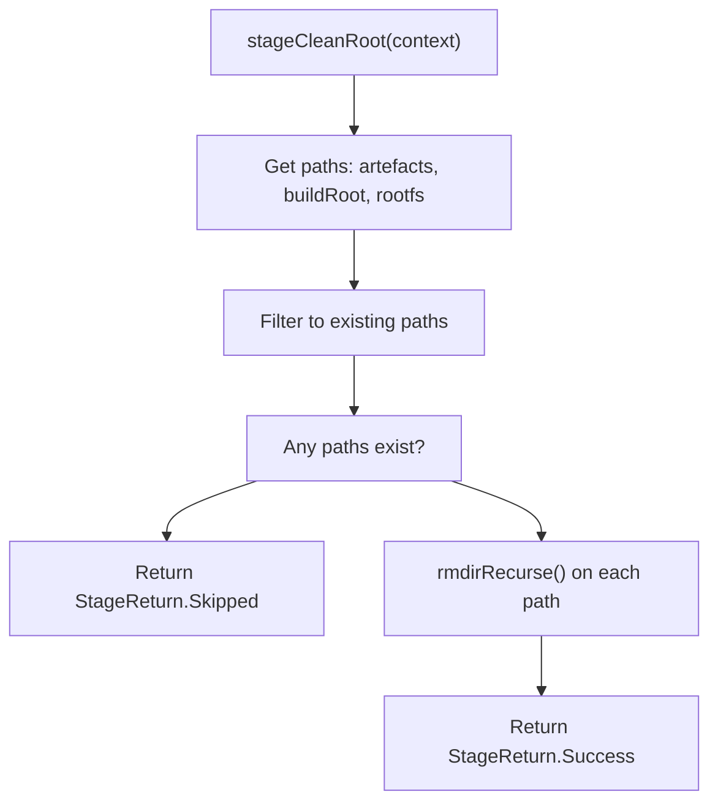

# Controller and Build Lifecycle

Relevant source files

* [source/boulder/controller.d](../source/boulder/controller.d)
* [source/boulder/stages/clean\_root.d](../source/boulder/stages/clean_root.d)
* [source/boulder/stages/package.d](../source/boulder/stages/package.d)

## Purpose and Scope

The Controller is the central orchestrator in boulder that manages the complete build lifecycle for package recipes. It parses `stone.yml` recipe files, configures the build environment, coordinates the execution of build stages, and manages resources throughout the build process.

This page covers the `Controller` class, the `StageContext` interface, stage execution mechanics, and the overall build lifecycle. For details on individual build stages, see [Build Stages](2.3-build-stages). For information about the BuildJob abstraction and path management, see [BuildJob and Path Management](2.4-buildjob-and-path-management). For upstream source handling, see [Upstream Source Cache](2.5-upstream-source-cache).

---

## Controller Class Overview

The `Controller` class ([source/boulder/controller.d44-512](../source/boulder/controller.d#L44-L512)) implements the `StageContext` interface and serves as the main entry point for all build operations. It orchestrates the build process by:

* Loading and validating build profiles and repository configurations
* Parsing recipe files and creating `BuildJob` instances
* Managing upstream source fetching and caching
* Coordinating sequential execution of build stages
* Handling build environment mounts and cleanup

### Controller Construction

The Controller is instantiated with the following configuration parameters ([source/boulder/controller.d54-125](../source/boulder/controller.d#L54-L125)):

| Parameter | Type | Purpose |
| --- | --- | --- |
| `outputDir` | string | Directory for build artifacts and outputs |
| `architecture` | string | Target architecture (e.g., "x86\_64", "native") |
| `confinement` | bool | Whether to use containerized builds via moss-container |
| `profile` | string | Build profile name to use for repository configuration |
| `compilerCache` | bool | Whether to enable compiler caching |
| `configDir` | string | Configuration directory (defaults to "/") |

During construction, the Controller:

1. Locates `moss` and `moss-container` binaries relative to the boulder executable
2. Loads profile configuration from the config directory using `ProfileConfiguration`
3. Validates that all repository collections in the profile exist on disk
4. Initializes the `UpstreamCache` for source management
5. Sets up the `FetchController` for parallel downloads

**Sources:** [source/boulder/controller.d54-125](../source/boulder/controller.d#L54-L125)

---

## Controller Class Structure



**Sources:** [source/boulder/controller.d44-512](../source/boulder/controller.d#L44-L512) [source/boulder/stages/package.d58-121](../source/boulder/stages/package.d#L58-L121)

---

## Build Profile Configuration

The Controller loads build configuration through the profile system ([source/boulder/controller.d69-98](../source/boulder/controller.d#L69-L98)):

1. **Profile Loading**: Uses `ProfileConfiguration.load()` to read profile definitions from the config directory
2. **Profile Selection**: Finds the profile matching the `_profile` parameter passed to the constructor
3. **Collection Validation**: Verifies that all repository collections defined in the profile exist on disk
4. **Repository Access**: The profile's collections define where moss will find build dependencies

For file-based repositories (URIs starting with `file://`), the Controller verifies the path exists and logs fatal errors if repositories are missing. This early validation prevents build failures due to misconfigured repositories.

**Sources:** [source/boulder/controller.d69-98](../source/boulder/controller.d#L69-L98)

---

## Recipe Parsing and BuildJob Creation

The `parseRecipe()` method ([source/boulder/controller.d203-218](../source/boulder/controller.d#L203-L218)) is the entry point for processing a recipe file:



The process:

1. Opens the recipe file for reading
2. Creates a new `Spec` instance (the recipe representation)
3. Calls `parse()` to parse the YAML content
4. Constructs a `BuildJob` from the parsed recipe and filename
5. Stores the BuildJob in `_job` for use throughout the build
6. Closes the file handle

The resulting `BuildJob` contains the parsed recipe, computed paths for host and guest filesystems, and will accumulate additional metadata during the build process.

**Sources:** [source/boulder/controller.d203-218](../source/boulder/controller.d#L203-L218)

---

## Build Lifecycle Overview

The `build()` method ([source/boulder/controller.d225-313](../source/boulder/controller.d#L225-L313)) orchestrates the complete build lifecycle:



**Sources:** [source/boulder/controller.d225-313](../source/boulder/controller.d#L225-L313) [source/boulder/stages/package.d41-45](../source/boulder/stages/package.d#L41-L45)

---

## Automatic Dependency Analysis

Before stage execution begins, the Controller performs automatic dependency analysis ([source/boulder/controller.d229-304](../source/boulder/controller.d#L229-L304)):

### Macro-Based Dependencies

The Controller examines all build scripts (setup, build, check, install, workload) using `ScriptBuilder` to identify dependencies introduced by action macros:

1. Creates a `buildContext()` instance from mason
2. For each script in the recipe, prepares and processes it through `ScriptBuilder`
3. The `ScriptBuilder` tracks dependencies from macros (e.g., `%cmake` adds cmake dependencies)
4. Accumulates `extraDependencies` from all scripts into `_job.extraDeps`

### Upstream-Based Dependencies

The Controller inspects upstream sources to determine required extraction tools based on file extensions:

| Extension | Required Dependencies |
| --- | --- |
| `.xz` | `binary(tar)`, `binary(xz)` |
| `.zst` | `binary(tar)`, `binary(zstd)` |
| `.bz2` | `binary(tar)`, `binary(bzip2)` |
| `.gz` | `binary(tar)`, `binary(gzip)` |
| `.zip` | `binary(unzip)` |
| `.rpm` | `binary(rpm2cpio)`, `cpio` |
| `.deb` | `binary(ar)` |

If any Git upstreams are present, `binary(git)` is added to dependencies.

### Dependency Deduplication

After analysis, all dependencies are merged, sorted, and deduplicated using `sort()` and `uniq()` to create the final dependency list for the build.

**Sources:** [source/boulder/controller.d229-304](../source/boulder/controller.d#L229-L304)

---

## StageContext Interface

The `StageContext` interface ([source/boulder/stages/package.d58-121](../source/boulder/stages/package.d#L58-L121)) defines the contract that the Controller implements to provide context to build stages:



Each stage function receives the `StageContext` to access:

* Current `BuildJob` with recipe and paths
* Build configuration (architecture, profile, output directory)
* Build mode settings (confinement, compiler cache)
* Shared resources (upstream cache, fetcher, moss binaries)
* Mount tracking for cleanup

**Sources:** [source/boulder/stages/package.d58-160](../source/boulder/stages/package.d#L58-L160)

---

## Stage Execution System

The `iterateStages()` method ([source/boulder/controller.d355-418](../source/boulder/controller.d#L355-L418)) executes stages sequentially with flow control:



### Stage Execution Flow

1. **Stage Selection**: Retrieves the next stage from the stages array by index
2. **Execution**: Calls the stage's functor with the Controller as `StageContext`
3. **Exception Handling**: Catches exceptions and converts them to `StageReturn.Failure`
4. **Result Processing**:
   * `StageReturn.Success`: Logs success, increments stage index, continues
   * `StageReturn.Failure`: Logs error, breaks execution loop
   * `StageReturn.Skipped`: Logs skip, increments stage index, continues
5. **Cleanup**: On any exit (success or failure), unmounts all tracked mounts in reverse order

### Default Build Stages

The default build pipeline ([source/boulder/stages/package.d41-45](../source/boulder/stages/package.d#L41-L45)):

```
stageCleanRoot → stageCreateRoot → stageFetchUpstreams → stageConfigureRoot →
stagePopulateRoot → stageShareUpstreams → stageBuildPackage → stageSyncArtefacts
```

**Sources:** [source/boulder/controller.d355-418](../source/boulder/controller.d#L355-L418) [source/boulder/stages/package.d41-45](../source/boulder/stages/package.d#L41-L45)

---

## Upstream Fetch Management

The Controller integrates with `moss-fetcher` to handle source downloads ([source/boulder/controller.d121-124](../source/boulder/controller.d#L121-L124) [source/boulder/controller.d438-494](../source/boulder/controller.d#L438-L494)):

### Fetch Setup

* Initializes `FetchController` with parallelism based on CPU count (3 parallel fetches on 4+ core systems, 1 otherwise)
* Connects callbacks: `onComplete` → `onFetchComplete()`, `onFail` → `onFetchFail()`

### Fetch Completion Flow



### Completion Handler

The `onFetchComplete()` method ([source/boulder/controller.d438-468](../source/boulder/controller.d#L438-L468)):

1. Validates HTTP status code (expects 200)
2. For plain upstreams, computes SHA256 and verifies against recipe hash
3. Promotes validated source to the upstream cache via `upstreamCache.promote()`
4. On any validation failure, calls `onFetchFail()`

### Failure Handler

The `onFetchFail()` method ([source/boulder/controller.d473-478](../source/boulder/controller.d#L473-L478)):

1. Clears the fetch queue
2. Sets `failFlag = true` to abort stage execution
3. Logs the download failure with URI and reason

**Sources:** [source/boulder/controller.d121-124](../source/boulder/controller.d#L121-L124) [source/boulder/controller.d438-494](../source/boulder/controller.d#L438-L494)

---

## Mount Management

The Controller tracks filesystem mounts to ensure proper cleanup ([source/boulder/controller.d423-426](../source/boulder/controller.d#L423-L426) [source/boulder/controller.d403-416](../source/boulder/controller.d#L403-L416)):

### Mount Tracking

* Stages call `addMount()` to register mounts (e.g., `/dev`, `/proc`, `/sys` in build root)
* Mounts are stored in the `mountPoints` array
* Each `Mount` contains target path and mount options

### Cleanup on Exit

During the `scope(exit)` block in `iterateStages()`:

1. Iterates through `mountPoints` in **reverse order** (unmount children before parents)
2. Sets unmount flags: `UnmountFlags.Force | UnmountFlags.Detach`
3. Calls `unmount()` on each mount
4. Logs errors if unmount fails, but continues cleanup

This ensures that even if a build fails, all filesystem mounts are properly released before the Controller exits.

**Sources:** [source/boulder/controller.d403-416](../source/boulder/controller.d#L403-L416) [source/boulder/controller.d423-426](../source/boulder/controller.d#L423-L426)

---

## Chroot Operation

The `chroot()` method ([source/boulder/controller.d321-347](../source/boulder/controller.d#L321-L347)) provides an interactive shell in the build environment:

1. **Recipe Parsing**: Calls `parseRecipe()` to load the recipe and create the BuildJob
2. **Environment Check**: Verifies that `hostPaths.rootfs` exists (requires prior build)
3. **Dependency Injection**: Adds useful tools (`binary(git)`, `binary(nano)`, `binary(vim)`) to the dependency list
4. **Stage Execution**: Runs `chrootStages` instead of `buildStages`:
   * `stageCreateRoot`: Ensures build root exists
   * `stagePopulateRoot`: Installs dependencies
   * `stageChrootPackage`: Executes interactive shell

This allows developers to inspect and debug the build environment interactively.

**Sources:** [source/boulder/controller.d321-347](../source/boulder/controller.d#L321-L347) [source/boulder/stages/package.d50-52](../source/boulder/stages/package.d#L50-L52)

---

## Stage Implementation Example

Stages follow a simple functional pattern. Here's the `stageCleanRoot` implementation ([source/boulder/stages/clean\_root.d26-38](../source/boulder/stages/clean_root.d#L26-L38)):



Key characteristics:

* Receives `StageContext` parameter
* Accesses context properties (e.g., `context.job.hostPaths`)
* Performs stage-specific work
* Returns appropriate `StageReturn` value
* Skips cleanly if there's nothing to do

**Sources:** [source/boulder/stages/clean\_root.d26-38](../source/boulder/stages/clean_root.d#L26-L38)

---

## Error Handling and Flow Control

The Controller uses multiple mechanisms to handle errors:

1. **Return Values**: Stages return `StageReturn.Failure` to indicate errors
2. **Exception Catching**: `iterateStages()` wraps stage execution in try-catch
3. **Fail Flag**: The `failFlag` field provides an early exit mechanism (used by fetch failures)
4. **Status Codes**: The `build()` method returns `ExitStatus` (Success/Failure) to the CLI
5. **Resource Cleanup**: `scope(exit)` ensures mounts are cleaned up regardless of exit path

This layered approach ensures that build failures are properly detected, logged, and handled without leaking resources.

**Sources:** [source/boulder/controller.d355-418](../source/boulder/controller.d#L355-L418)