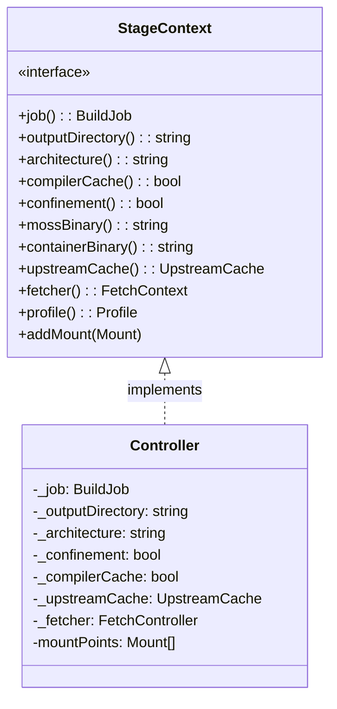
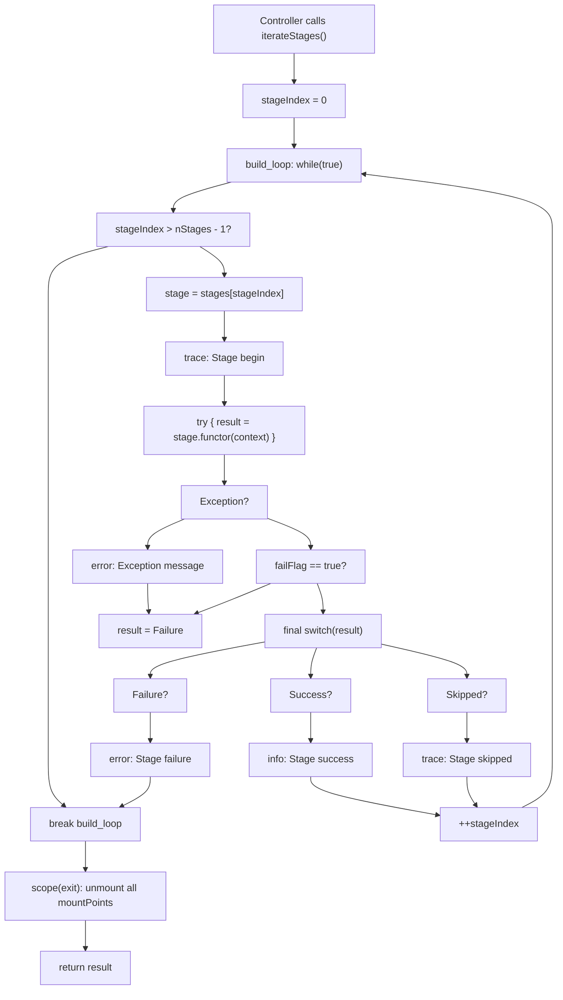
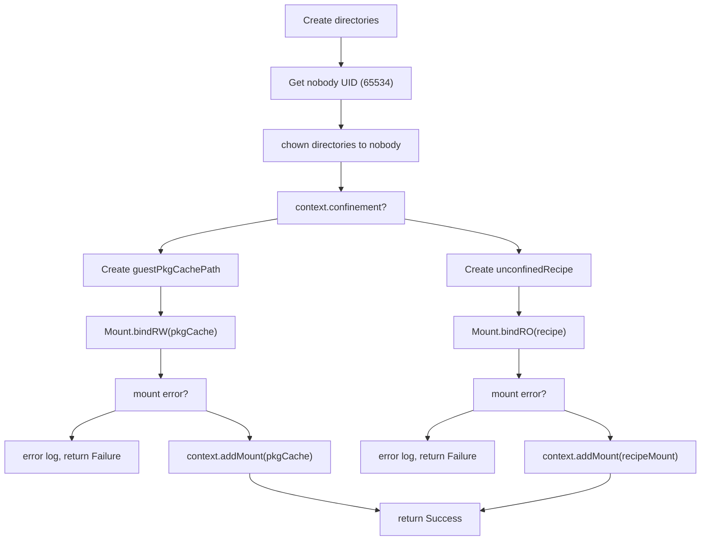
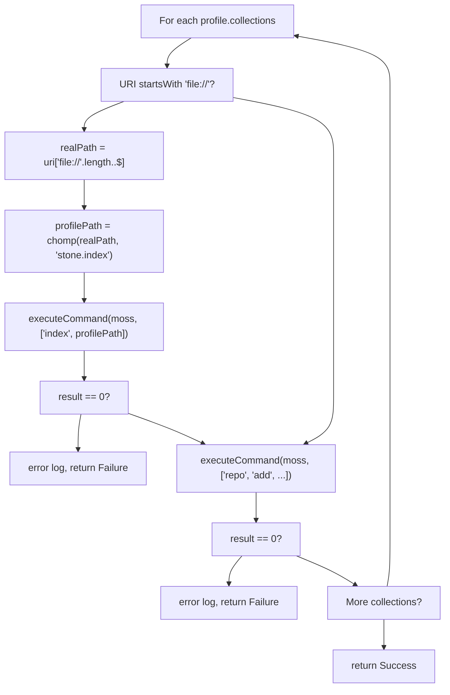
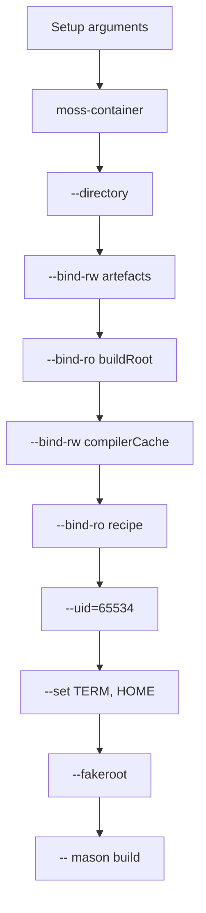
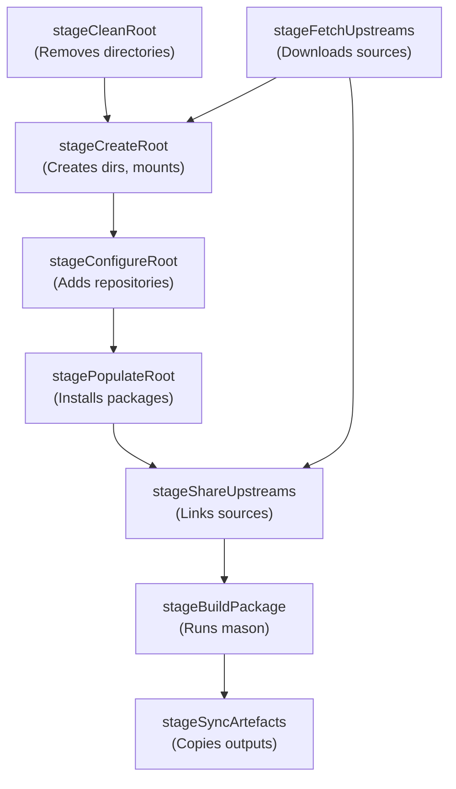

# Build Stages

Relevant source files

* [source/boulder/controller.d](../source/boulder/controller.d)
* [source/boulder/stages/build\_package.d](../source/boulder/stages/build_package.d)
* [source/boulder/stages/clean\_root.d](../source/boulder/stages/clean_root.d)
* [source/boulder/stages/configure\_root.d](../source/boulder/stages/configure_root.d)
* [source/boulder/stages/create\_root.d](../source/boulder/stages/create_root.d)
* [source/boulder/stages/package.d](../source/boulder/stages/package.d)
* [source/boulder/stages/populate\_root.d](../source/boulder/stages/populate_root.d)
* [source/mason/build/analysers/elves.d](../source/mason/build/analysers/elves.d)

This page documents the individual build stages that boulder executes during package compilation. Each stage represents a discrete task in the build lifecycle, from environment preparation to package creation. For information about how the Controller orchestrates these stages, see [Controller and Build Lifecycle](2.2-controller-and-build-lifecycle). For details about path management during builds, see [BuildJob and Path Management](2.4-buildjob-and-path-management). For upstream caching details, see [Upstream Source Cache](2.5-upstream-source-cache).

## Stage Abstraction

Boulder organizes the build process into discrete stages that execute sequentially. Each stage implements a simple functional interface and communicates execution status through return codes.

### Stage Structure

The `Stage` struct [source/boulder/stages/package.d148-159](../source/boulder/stages/package.d#L148-L159) defines the stage abstraction:

| Field | Type | Purpose |
| --- | --- | --- |
| `name` | `immutable(string)` | Human-readable identifier for logging |
| `functor` | `StageFunction` | Function pointer that executes the stage logic |

The `StageFunction` type alias is defined as [source/boulder/stages/package.d142](../source/boulder/stages/package.d#L142-L142):

```
public alias StageFunction = StageReturn function(StageContext context);
```

### Stage Return Values

The `StageReturn` enum [source/boulder/stages/package.d127-137](../source/boulder/stages/package.d#L127-L137) controls execution flow:

| Value | Meaning | Controller Behavior |
| --- | --- | --- |
| `Success` | Stage executed successfully | Continue to next stage |
| `Failure` | Stage encountered an error | Abort build, unmount filesystems |
| `Skipped` | Stage not applicable (e.g., confinement-only when unconfined) | Continue to next stage |

Sources: [source/boulder/stages/package.d127-159](../source/boulder/stages/package.d#L127-L159)

### StageContext Interface

Stages receive configuration and resources through the `StageContext` interface [source/boulder/stages/package.d58-121](../source/boulder/stages/package.d#L58-L121):



Sources: [source/boulder/stages/package.d58-121](../source/boulder/stages/package.d#L58-L121) [source/boulder/controller.d44-512](../source/boulder/controller.d#L44-L512)

## Stage Sequences

Boulder defines two predefined stage sequences:

### buildStages Array

The `buildStages` array [source/boulder/stages/package.d41-45](../source/boulder/stages/package.d#L41-L45) defines the complete package build pipeline:

```
static auto buildStages = [
    &stageCleanRoot, &stageCreateRoot, &stageFetchUpstreams, &stageConfigureRoot,
    &stagePopulateRoot, &stageShareUpstreams, &stageBuildPackage,
    &stageSyncArtefacts,
];
```

This sequence is executed by `Controller.build()` [source/boulder/controller.d225-313](../source/boulder/controller.d#L225-L313)

### chrootStages Array

The `chrootStages` array [source/boulder/stages/package.d50-52](../source/boulder/stages/package.d#L50-L52) defines stages for interactive chroot sessions:

```
static auto chrootStages = [
    &stageCreateRoot, &stagePopulateRoot, &stageChrootPackage
];
```

This sequence is executed by `Controller.chroot()` [source/boulder/controller.d321-347](../source/boulder/controller.d#L321-L347) for the `boulder chroot` command.

Sources: [source/boulder/stages/package.d41-52](../source/boulder/stages/package.d#L41-L52) [source/boulder/controller.d225-347](../source/boulder/controller.d#L225-L347)

## Stage Execution Flow

The Controller's `iterateStages()` method [source/boulder/controller.d355-418](../source/boulder/controller.d#L355-L418) executes stages sequentially:



Sources: [source/boulder/controller.d355-418](../source/boulder/controller.d#L355-L418)

## Individual Stage Descriptions

### stageCleanRoot

**Purpose:** Remove existing build artifacts from previous builds.

**Implementation:** [source/boulder/stages/clean\_root.d26-38](../source/boulder/stages/clean_root.d#L26-L38)

This stage removes three directory trees if they exist:

| Directory | Path Variable | Contents |
| --- | --- | --- |
| Artefacts | `job.hostPaths.artefacts` | Generated `.stone` packages and manifests |
| Build root | `job.hostPaths.buildRoot` | Source code and compilation artifacts |
| Root filesystem | `job.hostPaths.rootfs` | Build environment with installed dependencies |

If none of these directories exist, returns `Skipped`. Otherwise, calls `rmdirRecurse()` on each and returns `Success`.

Sources: [source/boulder/stages/clean\_root.d](../source/boulder/stages/clean_root.d)

### stageCreateRoot

**Purpose:** Create required build directories and establish filesystem mounts.

**Implementation:** [source/boulder/stages/create\_root.d31-83](../source/boulder/stages/create_root.d#L31-L83)

#### Directory Creation

Creates the following directories, all owned by the `nobody` user (UID 65534) [source/boulder/stages/create\_root.d32-56](../source/boulder/stages/create_root.d#L32-L56):

* `hostPaths.artefacts` - Package output destination
* `hostPaths.buildRoot` - Build working directory
* `hostPaths.compilerCache` - ccache storage location
* `hostPaths.pkgCache` - moss package cache

#### Mount Configuration

**Confined Builds** [source/boulder/stages/create\_root.d44-68](../source/boulder/stages/create_root.d#L44-L68):

1. Creates `guestPkgCachePath` inside the rootfs
2. Establishes bind mount: `hostPaths.pkgCache` → `guestPkgCachePath` (RW)
3. Registers mount via `context.addMount()` for cleanup

**Unconfined Builds** [source/boulder/stages/create\_root.d48-79](../source/boulder/stages/create_root.d#L48-L79):

1. Creates `unconfinedRecipe` directory
2. Establishes bind mount: `hostPaths.recipe` → `unconfinedRecipe` (RO)
3. Registers mount via `context.addMount()`



Sources: [source/boulder/stages/create\_root.d](../source/boulder/stages/create_root.d)

### stageFetchUpstreams

**Purpose:** Download and validate upstream sources defined in `stone.yml`.

**Implementation:** Referenced in [source/boulder/stages/package.d27](../source/boulder/stages/package.d#L27-L27) imported from `boulder.stages.fetch_upstreams`.

Based on Controller integration [source/boulder/controller.d121-478](../source/boulder/controller.d#L121-L478) this stage:

1. Enqueues each `UpstreamDefinition` from `recipe.upstreams` with `FetchController`
2. Downloads to `UpstreamCache.staging` directory
3. **For Plain upstreams:** Validates SHA256 hash [source/boulder/controller.d448-456](../source/boulder/controller.d#L448-L456)
4. **For Git upstreams:** Validates ref existence
5. Calls `upstreamCache.promote()` to move validated sources to permanent cache [source/boulder/controller.d459-467](../source/boulder/controller.d#L459-L467)

Fetch failures trigger `onFetchFail()` callback [source/boulder/controller.d473-478](../source/boulder/controller.d#L473-L478) which sets `failFlag = true` and causes subsequent stages to fail.

Sources: [source/boulder/stages/package.d27](../source/boulder/stages/package.d#L27-L27) [source/boulder/controller.d121-478](../source/boulder/controller.d#L121-L478)

### stageConfigureRoot

**Purpose:** Register repository collections in the build environment.

**Implementation:** [source/boulder/stages/configure\_root.d35-87](../source/boulder/stages/configure_root.d#L35-L87)

Returns `Skipped` for unconfined builds [source/boulder/stages/configure\_root.d36-40](../source/boulder/stages/configure_root.d#L36-L40)

For each collection in `context.profile.collections`:

**Local Collections** (`file://` URIs) [source/boulder/stages/configure\_root.d48-69](../source/boulder/stages/configure_root.d#L48-L69):

1. Extract real path: `chompPrefix(uri, "file://")`
2. Get profile directory: `chomp(realPath, "stone.index")`
3. Execute: `moss index <profilePath>`
4. Return `Failure` if indexing fails

**All Collections** [source/boulder/stages/configure\_root.d71-83](../source/boulder/stages/configure_root.d#L71-L83):

1. Execute: `moss -y repo add -D <rootfs> <id> <uri> -p <priority>`
2. Return `Failure` if repository addition fails



Sources: [source/boulder/stages/configure\_root.d](../source/boulder/stages/configure_root.d)

### stagePopulateRoot

**Purpose:** Install required packages into the build root filesystem.

**Implementation:** [source/boulder/stages/populate\_root.d26-84](../source/boulder/stages/populate_root.d#L26-L84)

Returns `Skipped` for unconfined builds [source/boulder/stages/populate\_root.d27-31](../source/boulder/stages/populate_root.d#L27-L31)

#### Package Categories

**Base Packages** (always installed) [source/boulder/stages/populate\_root.d34-43](../source/boulder/stages/populate_root.d#L34-L43):

```
["bash", "boulder", "coreutils", "dash", "diffutils", "gawk", "glibc-devel",
 "grep", "fakeroot", "findutils", "libarchive", "linux-headers",
 "pkgconf", "sed", "util-linux"]
```

**Compiler Cache** [source/boulder/stages/populate\_root.d40-43](../source/boulder/stages/populate_root.d#L40-L43):

* `binary(ccache)` - if `context.compilerCache == true`

**EMUL32 Support** [source/boulder/stages/populate\_root.d39-59](../source/boulder/stages/populate_root.d#L39-L59):

* `glibc-32bit-devel`, `fakeroot-32bit` - if `recipe.emul32 == true`

**Toolchain Packages** [source/boulder/stages/populate\_root.d45-69](../source/boulder/stages/populate_root.d#L45-L69):

| Toolchain | Packages | EMUL32 Additional |
| --- | --- | --- |
| GNU (default) | `binutils`, `gcc-devel` | `gcc-32bit-devel` |
| LLVM | `clang` | `clang-32bit`, `libcxx-32bit-devel` |

Toolchain determined by `recipe.options.toolchain` [source/boulder/stages/populate\_root.d62-69](../source/boulder/stages/populate_root.d#L62-L69)

**Recipe Dependencies** [source/boulder/stages/populate\_root.d72-75](../source/boulder/stages/populate_root.d#L72-L75):

* `recipe.rootBuild.buildDependencies`
* `recipe.rootBuild.checkDependencies`
* `job.extraDeps` (auto-detected, e.g., `binary(tar)`, `binary(git)`)

#### Installation Command

Executes [source/boulder/stages/populate\_root.d79-83](../source/boulder/stages/populate_root.d#L79-L83):

```
moss -y install -D <rootfs> <all_packages>
```

Sources: [source/boulder/stages/populate\_root.d](../source/boulder/stages/populate_root.d)

### stageShareUpstreams

**Purpose:** Copy or hardlink upstream sources from cache into build root.

**Implementation:** Referenced in [source/boulder/stages/package.d29](../source/boulder/stages/package.d#L29-L29) imported from `boulder.stages.share_upstreams`.

This stage makes cached sources available for extraction during the mason build by:

1. Retrieving source locations from `UpstreamCache`
2. Creating hardlinks (or copies) into `buildRoot` source directory
3. Ensuring sources are accessible to mason's prepare stage

Sources: [source/boulder/stages/package.d29](../source/boulder/stages/package.d#L29-L29)

### stageBuildPackage

**Purpose:** Execute the actual package build using mason.

**Implementation:** [source/boulder/stages/build\_package.d31-150](../source/boulder/stages/build_package.d#L31-L150)

Dispatches to either `buildPackageConfined()` or `buildPackageUnconfined()` based on `context.confinement` [source/boulder/stages/build\_package.d36-43](../source/boulder/stages/build_package.d#L36-L43)

#### Confined Build: buildPackageConfined()

**Function:** [source/boulder/stages/build\_package.d48-120](../source/boulder/stages/build_package.d#L48-L120)

Executes mason inside `moss-container` with the following configuration:



**Bind Mounts** [source/boulder/stages/build\_package.d63-78](../source/boulder/stages/build_package.d#L63-L78):

| Host Path | Guest Path | Mode |
| --- | --- | --- |
| `hostPaths.artefacts` | `guestPaths.artefacts` | RW |
| `hostPaths.buildRoot` | `guestPaths.buildRoot` | RO |
| `hostPaths.compilerCache` | `guestPaths.compilerCache` | RW |
| `hostPaths.recipe` | `guestPaths.recipe` | RO |

**Environment** [source/boulder/stages/build\_package.d55-85](../source/boulder/stages/build_package.d#L55-L85):

* `PATH=/usr/bin:/usr/sbin`
* `TERM=xterm-256color`
* `HOME=<guestPaths.buildRoot>`

**Mason Arguments** [source/boulder/stages/build\_package.d89-113](../source/boulder/stages/build_package.d#L89-L113):

```
mason build -o <guestPaths.artefacts> -b <guestPaths.buildRoot> <guestPaths.recipe>/<job.name>
```

Optional flags:

* `-n` - if `recipe.options.networking == true` [source/boulder/stages/build\_package.d96-99](../source/boulder/stages/build_package.d#L96-L99)
* `-d` - if boulder invoked with trace logging [source/boulder/stages/build\_package.d101-104](../source/boulder/stages/build_package.d#L101-L104)
* `-a <architecture>` - if non-native architecture [source/boulder/stages/build\_package.d105-108](../source/boulder/stages/build_package.d#L105-L108)
* `--compiler-cache` - if `context.compilerCache == true` [source/boulder/stages/build\_package.d110-113](../source/boulder/stages/build_package.d#L110-L113)

Sources: [source/boulder/stages/build\_package.d48-120](../source/boulder/stages/build_package.d#L48-L120)

#### Unconfined Build: buildPackageUnconfined()

**Function:** [source/boulder/stages/build\_package.d125-150](../source/boulder/stages/build_package.d#L125-L150)

Executes mason directly on host with basic privilege separation:

```
runuser -u nobody -- fakeroot -- mason build \
  -o <hostPaths.artefacts> \
  -b <hostPaths.buildRoot> \
  -a <architecture> \
  <unconfinedRecipe>/<job.name>
```

Uses `runuser` to drop privileges to `nobody` user [source/boulder/stages/build\_package.d129-131](../source/boulder/stages/build_package.d#L129-L131) No filesystem isolation provided.

Sources: [source/boulder/stages/build\_package.d125-150](../source/boulder/stages/build_package.d#L125-L150)

### stageSyncArtefacts

**Purpose:** Copy generated packages from build root to output directory.

**Implementation:** Referenced in [source/boulder/stages/package.d30](../source/boulder/stages/package.d#L30-L30) imported from `boulder.stages.sync_artefacts`.

This stage finalizes the build by:

1. Collecting `.stone` packages from artefacts directory
2. Moving or copying them to `context.outputDirectory`
3. Ensuring manifests and build metadata are preserved

Sources: [source/boulder/stages/package.d30](../source/boulder/stages/package.d#L30-L30)

### stageChrootPackage

**Purpose:** Spawn interactive shell in build environment for debugging.

**Implementation:** Referenced in [source/boulder/stages/package.d23](../source/boulder/stages/package.d#L23-L23) imported from `boulder.stages.chroot_package`.

Used by `boulder chroot` command [source/boulder/controller.d321-347](../source/boulder/controller.d#L321-L347) Additional packages installed for convenience [source/boulder/controller.d334-338](../source/boulder/controller.d#L334-L338):

* `binary(git)`
* `binary(nano)`
* `binary(vim)`

This stage provides an interactive shell for inspecting and debugging the build environment manually.

Sources: [source/boulder/stages/package.d23](../source/boulder/stages/package.d#L23-L23) [source/boulder/controller.d321-347](../source/boulder/controller.d#L321-L347)

## Stage Dependencies

Build stages have implicit dependencies that dictate their execution order:



| Stage | Required Predecessors | Creates |
| --- | --- | --- |
| `stageCleanRoot` | None | - (cleanup) |
| `stageCreateRoot` | None | Directory structure, mounts |
| `stageFetchUpstreams` | None | UpstreamCache entries |
| `stageConfigureRoot` | `stageCreateRoot` | Repository configuration |
| `stagePopulateRoot` | `stageConfigureRoot` | Installed package set |
| `stageShareUpstreams` | `stageFetchUpstreams`, `stagePopulateRoot` | Sources in buildRoot |
| `stageBuildPackage` | `stageShareUpstreams` | `.stone` packages |
| `stageSyncArtefacts` | `stageBuildPackage` | Outputs in final location |

Sources: [source/boulder/stages/package.d41-45](../source/boulder/stages/package.d#L41-L45)

## Error Handling and Mount Cleanup

The Controller's `iterateStages()` includes automatic cleanup using `scope(exit)` [source/boulder/controller.d403-416](../source/boulder/controller.d#L403-L416):

```
scope (exit)
{
    foreach_reverse (ref m; mountPoints)
    {
        trace(format!"Unmounting %s"(m));
        m.unmountFlags = UnmountFlags.Force | UnmountFlags.Detach;
        auto err = m.unmount();
        if (!err.isNull())
        {
            error(format!"Unmount failure: %s (%s)"(m.target, err.get.toString));
        }
    }
}
```

Mounts registered via `context.addMount()` are unmounted in reverse order regardless of build outcome:

* Stage returns `Failure`
* All stages complete successfully
* Exception thrown during stage execution [source/boulder/controller.d376-380](../source/boulder/controller.d#L376-L380)

This ensures filesystem resources are properly released even during error conditions.

Sources: [source/boulder/controller.d355-418](../source/boulder/controller.d#L355-L418)