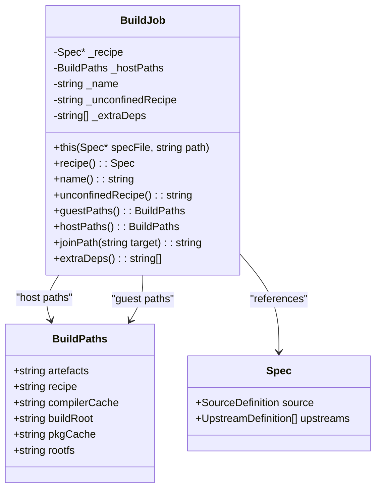
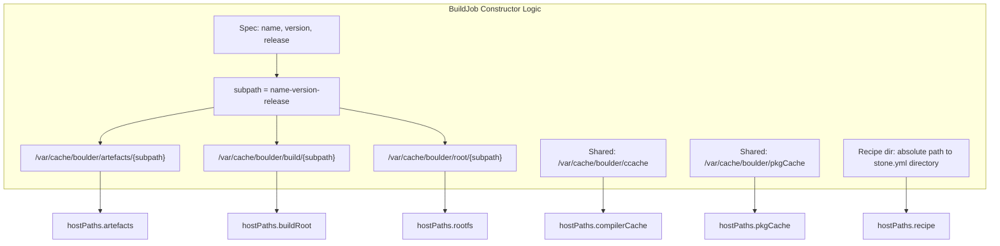
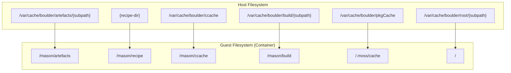
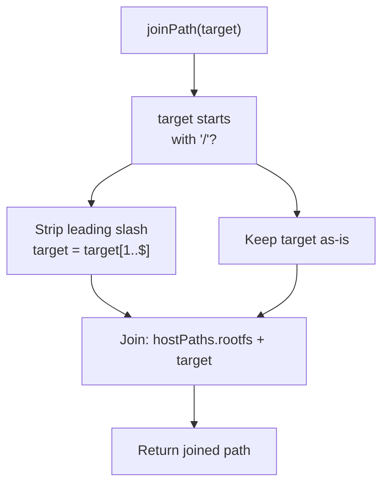
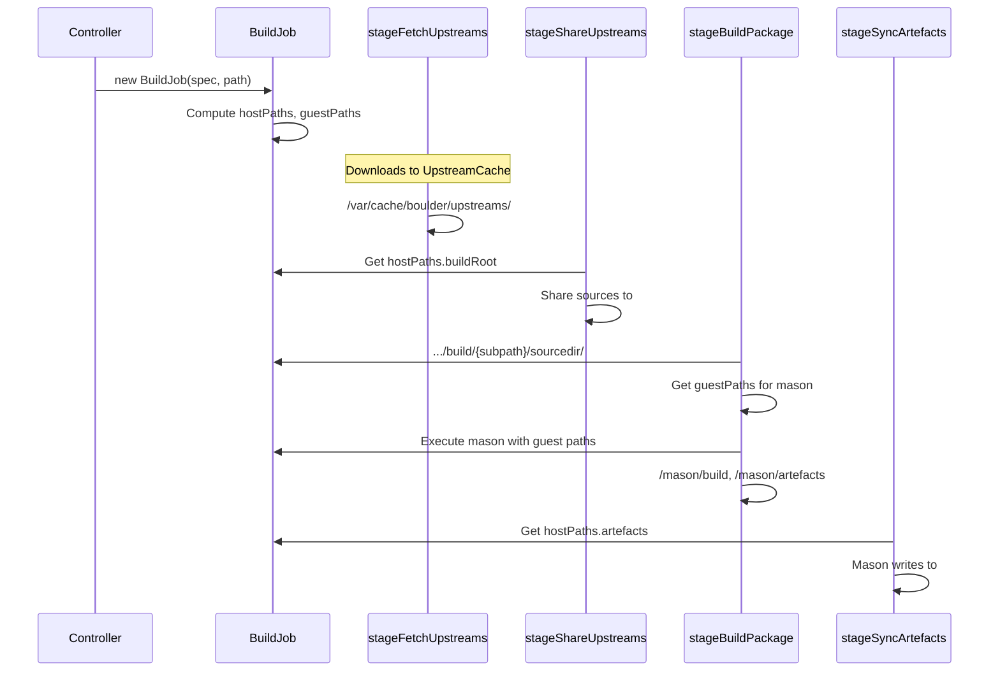
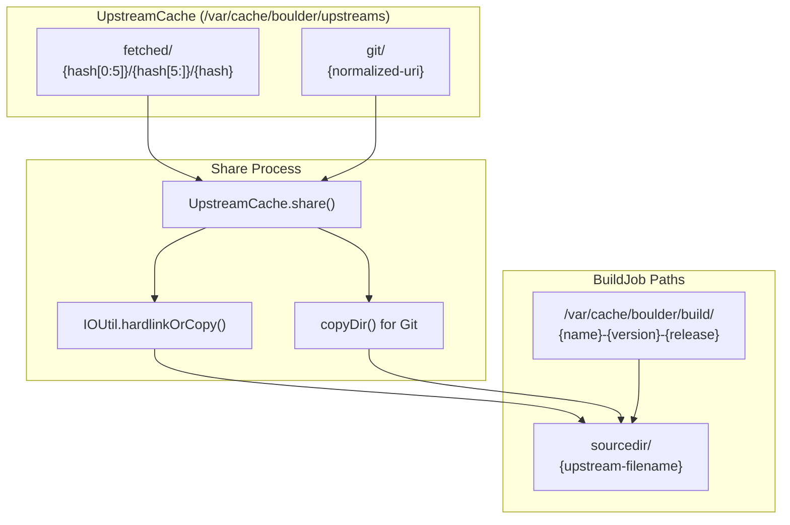

# BuildJob and Path Management

Relevant source files

* [source/boulder/buildjob.d](../source/boulder/buildjob.d)
* [source/boulder/stages/fetch\_upstreams.d](../source/boulder/stages/fetch_upstreams.d)
* [source/boulder/stages/share\_upstreams.d](../source/boulder/stages/share_upstreams.d)
* [source/boulder/stages/sync\_artefacts.d](../source/boulder/stages/sync_artefacts.d)
* [source/boulder/upstreamcache.d](../source/boulder/upstreamcache.d)

The `BuildJob` class provides path management and configuration for individual package builds in boulder. It abstracts the complex directory structure required for building packages, managing both host-side paths (where boulder runs) and guest-side paths (inside the build container). This abstraction enables boulder to organize build artifacts, cache directories, and source trees consistently across all builds.

For information about how `BuildJob` is used during build stage execution, see [Build Stages](2.3-build-stages). For details on the upstream source caching system that provides sources to build paths, see [Upstream Source Cache](2.5-upstream-source-cache).

## BuildJob Class Overview

The `BuildJob` class encapsulates all path and metadata information for a single package build. It is instantiated by the `Controller` when parsing a recipe and maintains references to both the recipe specification and all required directory paths.

**Class Definition:**



Sources: [source/boulder/buildjob.d75-190](../source/boulder/buildjob.d#L75-L190)

The `BuildJob` constructor accepts a parsed `Spec*` (recipe) and the path to the recipe file. It computes a unique `subpath` identifier using the format `{name}-{version}-{release}` and uses this to construct isolated directory paths for the build.

## Host Path Management

Host paths represent the actual filesystem locations on the build server where boulder stores build artifacts, caches, and temporary files. All host paths are rooted under `/var/cache/boulder/`.

**Static Root Directories:**

| Constant | Value | Purpose |
| --- | --- | --- |
| `SharedRootBase` | `/var/cache/boulder` | Base directory for all boulder data |
| `SharedRootArtefactsCache` | `/var/cache/boulder/artefacts` | Binary package artifacts (.stone files) |
| `SharedRootBuildCache` | `/var/cache/boulder/build` | Build working directories |
| `SharedRootCcacheCache` | `/var/cache/boulder/ccache` | Compiler cache (shared across builds) |
| `SharedRootPkgCacheCache` | `/var/cache/boulder/pkgCache` | Moss package cache |
| `SharedRootRootCache` | `/var/cache/boulder/root` | Build root filesystems |

Sources: [source/boulder/buildjob.d23-37](../source/boulder/buildjob.d#L23-L37)

**Per-Build Host Paths:**

The `BuildPaths` struct within `BuildJob` stores the computed paths for the current build:



Sources: [source/boulder/buildjob.d80-101](../source/boulder/buildjob.d#L80-L101)

The constructor performs the following path assignments:

* `hostPaths.artefacts`: Output directory for generated `.stone` packages and manifests
* `hostPaths.buildRoot`: Working directory for compilation, contains `sourcedir/`, build artifacts
* `hostPaths.rootfs`: The complete filesystem root used for the build environment
* `hostPaths.compilerCache`: Shared compiler cache directory (not per-build)
* `hostPaths.pkgCache`: Shared moss package cache (not per-build)
* `hostPaths.recipe`: Absolute path to the directory containing `stone.yml`

The `unconfinedRecipe` path at `/var/cache/boulder/recipe/{subpath}` provides a bind mount workaround for permission issues when the "nobody" user needs to read the recipe inside a container.

## Guest Path Management

Guest paths represent the directory structure as seen from inside the build container (or in unconfined builds, as presented to mason). These paths are static and consistent across all builds, providing a predictable environment for build scripts.

**Guest Path Structure:**

The `guestPaths()` method returns a static `BuildPaths` instance with fixed locations:

| Guest Path | Location | Purpose |
| --- | --- | --- |
| `artefacts` | `/mason/artefacts` | Where mason writes .stone packages |
| `recipe` | `/mason/recipe` | Recipe directory (stone.yml location) |
| `compilerCache` | `/mason/ccache` | Compiler cache mount point |
| `buildRoot` | `/mason/build` | Build working directory |
| `pkgCache` | `/.moss/cache` | Moss package cache |
| `rootfs` | `/` | Root of the container filesystem |

Sources: [source/boulder/buildjob.d139-145](../source/boulder/buildjob.d#L139-L145)

**Host-to-Guest Path Mapping:**



Sources: [source/boulder/buildjob.d139-145](../source/boulder/buildjob.d#L139-L145)

When boulder invokes `moss-container` to execute a confined build, it bind-mounts the host paths to the corresponding guest paths, ensuring that the build environment sees a consistent directory structure regardless of the underlying host organization.

## Build Directory Structure

The complete directory hierarchy under `/var/cache/boulder/` organizes all build-related data:

```
/var/cache/boulder/
├── artefacts/
│   └── {name}-{version}-{release}/
│       ├── {package}.stone
│       ├── manifest.bin
│       └── manifest.jsonc
├── build/
│   └── {name}-{version}-{release}/
│       ├── sourcedir/
│       │   ├── {upstream-file-1}
│       │   ├── {upstream-file-2}
│       │   └── {git-repo}/
│       ├── build/          (actual compilation happens here)
│       └── install_root/   (staged installation)
├── ccache/                 (shared compiler cache)
├── pkgCache/               (shared moss package cache)
├── recipe/
│   └── {name}-{version}-{release}/
│       └── stone.yml       (bind mount copy for unconfined)
├── root/
│   └── {name}-{version}-{release}/
│       ├── bin/
│       ├── lib/
│       ├── usr/
│       └── ...             (complete rootfs)
└── upstreams/              (managed by UpstreamCache)
    ├── staging/
    ├── git/
    └── fetched/
```

Sources: [source/boulder/buildjob.d23-37](../source/boulder/buildjob.d#L23-L37) [source/boulder/upstreamcache.d34-329](../source/boulder/upstreamcache.d#L34-L329)

**Key Directory Purposes:**

* **artefacts/{subpath}/**: Final build outputs that are synced to the output directory by `stageSyncArtefacts`
* **build/{subpath}/sourcedir/**: Unpacked/shared upstream sources, created by `stageShareUpstreams`
* **build/{subpath}/build/**: Compilation working directory (e.g., where `cmake`, `configure` run)
* **build/{subpath}/install\_root/**: Staging area for `make install` before packaging
* **root/{subpath}/**: Complete filesystem root with all dependencies installed
* **ccache/**: Persistent compiler cache shared across all builds for build acceleration
* **upstreams/**: Source cache managed by `UpstreamCache` (see [Upstream Source Cache](2.5-upstream-source-cache))

## Path Construction and Usage

The `BuildJob` class provides utility methods for safe path manipulation:

**joinPath Method:**

The `joinPath()` method safely joins a target path onto the rootfs tree, handling both absolute and relative paths:



Sources: [source/boulder/buildjob.d160-165](../source/boulder/buildjob.d#L160-L165)

This method ensures that paths like `/usr/bin/foo` are correctly resolved to `/var/cache/boulder/root/{subpath}/usr/bin/foo` on the host system.

## Path Flow Through Build Stages

Build paths are accessed and modified by various build stages in sequence:



Sources: [source/boulder/stages/fetch\_upstreams.d34-95](../source/boulder/stages/fetch_upstreams.d#L34-L95) [source/boulder/stages/share\_upstreams.d33-47](../source/boulder/stages/share_upstreams.d#L33-L47) [source/boulder/stages/sync\_artefacts.d37-65](../source/boulder/stages/sync_artefacts.d#L37-L65)

**Stage-by-Stage Path Usage:**

1. **stageFetchUpstreams**: Downloads sources to `UpstreamCache` (not directly using `BuildJob` paths)
2. **stageShareUpstreams**: Shares cached sources to `{buildRoot}/sourcedir/` using hardlinks/copies
3. **stageBuildPackage**: Invokes mason with `guestPaths` for build, writes artifacts to `hostPaths.artefacts`
4. **stageSyncArtefacts**: Copies/hardlinks artifacts from `hostPaths.artefacts` to the output directory

## Integration with Upstream Cache

While `BuildJob` manages build-specific paths, the `UpstreamCache` manages a separate shared cache at `/var/cache/boulder/upstreams/`. The two systems interact during the share-upstreams stage:



Sources: [source/boulder/upstreamcache.d224-253](../source/boulder/upstreamcache.d#L224-L253) [source/boulder/stages/share\_upstreams.d33-47](../source/boulder/stages/share_upstreams.d#L33-L47)

The `stageShareUpstreams` stage calls `upstreamCache.share()` for each upstream definition, which hardlinks (for plain files) or copies (for Git repositories) the cached source into `{buildRoot}/sourcedir/{filename}`. This makes the sources available inside the build environment at the guest path `/mason/build/sourcedir/`.

**Path Translation Example:**

For a package `example-1.0-1` with an upstream tarball:

1. Source cached at: `/var/cache/boulder/upstreams/fetched/a1b2c/d3e4f.../a1b2cd3e4f...`
2. Shared to host path: `/var/cache/boulder/build/example-1.0-1/sourcedir/example-1.0.tar.gz`
3. Visible in container at: `/mason/build/sourcedir/example-1.0.tar.gz`
4. Artifacts written to: `/mason/artefacts/` (guest) → `/var/cache/boulder/artefacts/example-1.0-1/` (host)
5. Final output: Synced to output directory (e.g., current working directory)

## Path Management Best Practices

The `BuildJob` abstraction provides several guarantees:

* **Isolation**: Each build has a unique `{name}-{version}-{release}` subdirectory, preventing conflicts
* **Cache Sharing**: Compiler cache and package cache are shared across builds for efficiency
* **Predictability**: Guest paths are always consistent, simplifying build script authoring
* **Safety**: `joinPath()` prevents path traversal issues when accessing the rootfs
* **Bind Mount Strategy**: The dual path system (host/guest) enables containerized builds without modifying build logic

The unconfinedRecipe path provides a workaround for permission restrictions in confined builds, allowing the "nobody" user to access the recipe files through a separate bind mount point.

Sources: [source/boulder/buildjob.d75-190](../source/boulder/buildjob.d#L75-L190)