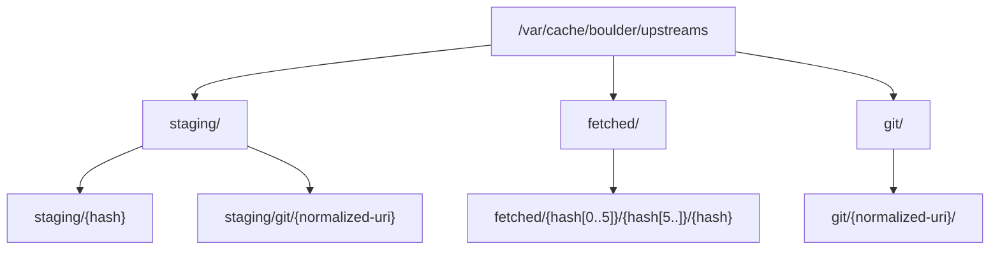
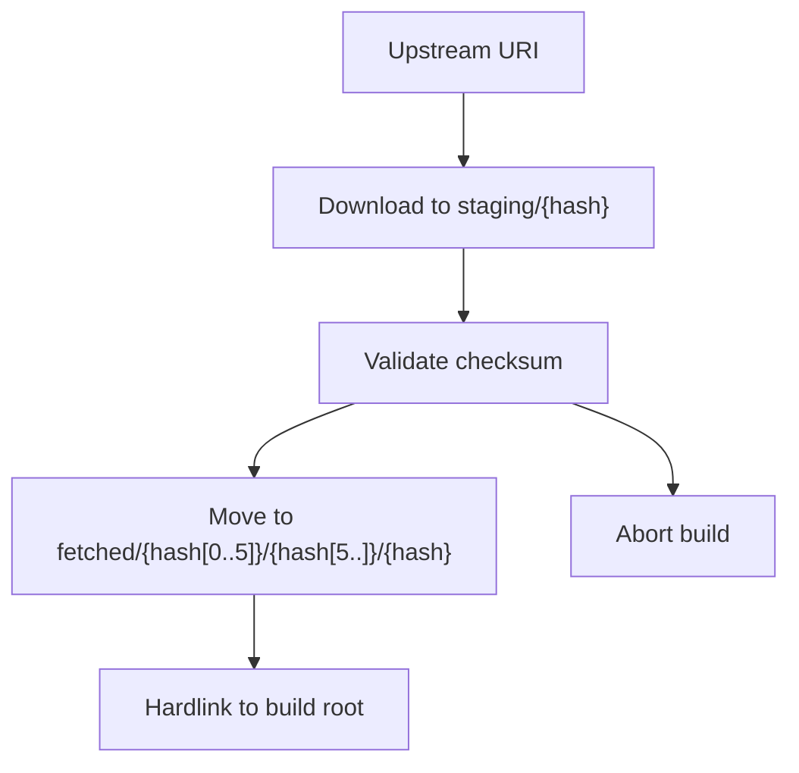
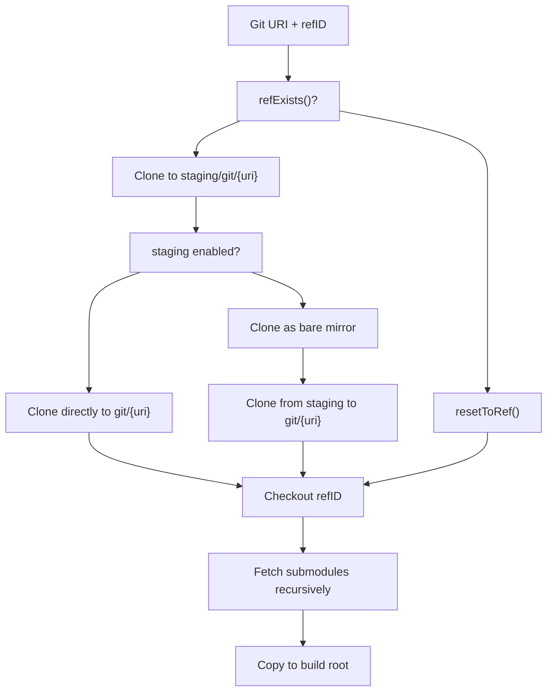
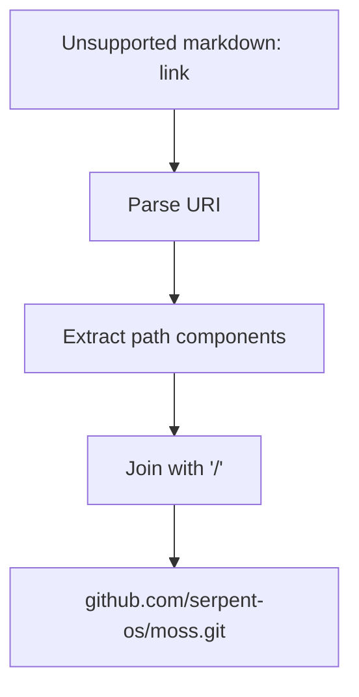
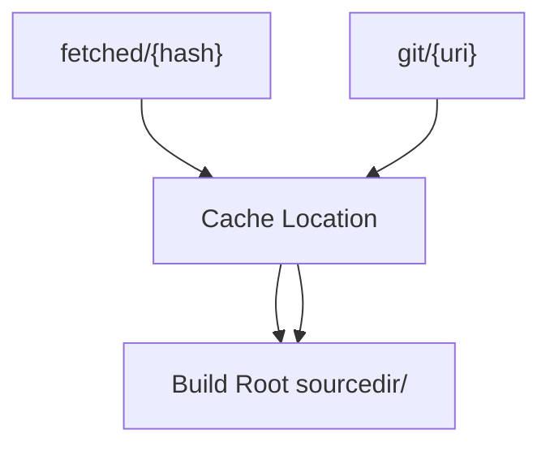
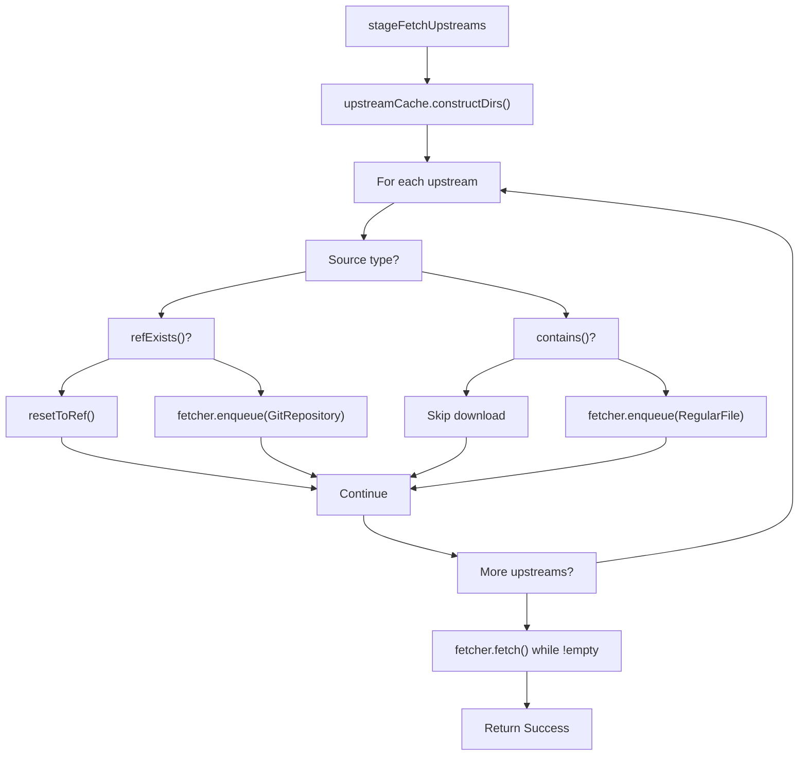
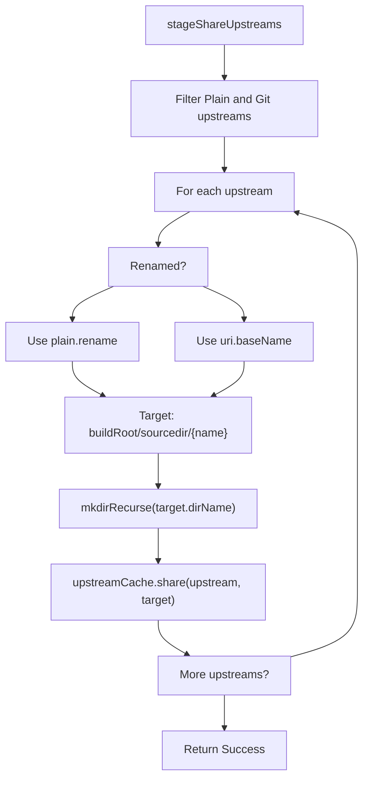

# Upstream Source Cache

Relevant source files

* [source/boulder/buildjob.d](../source/boulder/buildjob.d)
* [source/boulder/stages/fetch\_upstreams.d](../source/boulder/stages/fetch_upstreams.d)
* [source/boulder/stages/share\_upstreams.d](../source/boulder/stages/share_upstreams.d)
* [source/boulder/stages/sync\_artefacts.d](../source/boulder/stages/sync_artefacts.d)
* [source/boulder/upstreamcache.d](../source/boulder/upstreamcache.d)

The Upstream Source Cache is a persistent storage system that manages downloading, validation, and deduplication of upstream sources (tarballs, git repositories) across builds. It prevents redundant downloads and provides efficient sharing of sources into build environments through hardlinking.

For information about how sources are fetched by the build orchestrator, see [Build Stages](2.3-build-stages). For the overall structure of build paths and directory management, see [BuildJob and Path Management](2.4-buildjob-and-path-management).

## Overview

The `UpstreamCache` class provides hash-indexed and URI-indexed storage for upstream sources. It supports two primary source types:

* **Plain sources**: Regular files (tarballs, zip files) identified by content hash
* **Git sources**: Git repositories identified by URI and specific refs

The cache is located at `/var/cache/boulder/upstreams` and organized into three subdirectories to support a staged validation workflow.

**Sources:** [source/boulder/upstreamcache.d1-402](../source/boulder/upstreamcache.d#L1-L402)

## Cache Directory Structure

The upstream cache uses a three-tier directory structure for safe, validated storage:

**Diagram: UpstreamCache directory hierarchy**

| Directory | Purpose | Source Type | Path Pattern |
| --- | --- | --- | --- |
| `staging/` | Temporary storage for unvalidated downloads | Both | `staging/{hash}` or `staging/git/{uri-path}` |
| `fetched/` | Permanent storage for validated plain files | Plain | `fetched/{hash[0..5]}/{hash[5..]}/{hash}` |
| `git/` | Permanent storage for validated git repositories | Git | `git/{normalized-uri-path}` |

The `fetched/` directory uses a two-level hash prefix structure (first 5 characters, then remainder) to avoid filesystem limitations with large numbers of files in a single directory.

**Sources:** [source/boulder/upstreamcache.d313-329](../source/boulder/upstreamcache.d#L313-L329) [source/boulder/upstreamcache.d34](../source/boulder/upstreamcache.d#L34-L34)

## Source Type Handling

### Plain Sources

Plain sources (regular files) are identified by their content hash. The cache stores them using a hash-based path structure for efficient deduplication:

**Diagram: Plain source cache lifecycle**

The hash-based organization ensures that identical files from different URIs are stored only once, and validation happens before permanent storage.

**Sources:** [source/boulder/upstreamcache.d265-275](../source/boulder/upstreamcache.d#L265-L275) [source/boulder/upstreamcache.d288-297](../source/boulder/upstreamcache.d#L288-L297)

### Git Sources

Git sources are identified by URI and specific ref (commit, tag, or branch). The cache maintains full git repositories with their history:

**Diagram: Git source cache lifecycle with staging support**

Git sources support an optional staging mode where the initial clone is performed to a bare mirror before being cloned to the final location. This enables validation of ref existence before committing to permanent storage.

**Sources:** [source/boulder/upstreamcache.d79-158](../source/boulder/upstreamcache.d#L79-L158) [source/boulder/upstreamcache.d169-190](../source/boulder/upstreamcache.d#L169-L190) [source/boulder/upstreamcache.d202-219](../source/boulder/upstreamcache.d#L202-L219)

## Cache Operations

### Path Computation

The cache computes staging and final paths differently for each source type:

**Plain Sources:**

* **Staging path**: `staging/{hash}`
* **Final path**: `fetched/{hash[0..5]}/{hash[5..]}/{hash}`

**Git Sources:**

* **Staging path**: `staging/git/{normalized-uri}`
* **Final path**: `git/{normalized-uri}`

The URI normalization process converts HTTP(S) URLs to filesystem-safe paths:

**Diagram: URI normalization for git sources**

**Sources:** [source/boulder/upstreamcache.d258-275](../source/boulder/upstreamcache.d#L258-L275) [source/boulder/upstreamcache.d280-307](../source/boulder/upstreamcache.d#L280-L307) [source/boulder/upstreamcache.d335-350](../source/boulder/upstreamcache.d#L335-L350)

### Promotion Workflow

The `promote()` method moves validated sources from staging to their final cache locations:

| Operation | Plain Sources | Git Sources |
| --- | --- | --- |
| Pre-validation | Checksum verified by fetcher | Ref cloned in staging (if staging enabled) |
| Promotion action | `rename()` from staging to final | `git clone` from staging to final or `git fetch` if exists |
| Post-promotion | N/A | `git reset --hard {refID}`, then fetch submodules |
| Result | File moved atomically | Working copy at specific ref with submodules |

For git sources, if the final path already exists but doesn't contain the requested ref, `promote()` runs `git fetch` to pull new refs from the staging repository, then checks out the requested ref.

**Sources:** [source/boulder/upstreamcache.d79-158](../source/boulder/upstreamcache.d#L79-L158)

### Sharing into Build Environment

The `share()` method makes cached sources available in the build root:

**Diagram: Sharing mechanism for different source types**

* **Plain sources**: Use `IOUtil.hardlinkOrCopy()` which attempts hardlinking first (zero disk usage) and falls back to copying if hardlinking fails
* **Git sources**: Use full recursive copy via `copyDir()` to avoid issues with git metadata and .git directory

The hardlinking optimization for plain sources means that the same tarball can be "shared" into multiple build roots simultaneously with no duplication of disk space.

**Sources:** [source/boulder/upstreamcache.d224-253](../source/boulder/upstreamcache.d#L224-L253) [source/boulder/upstreamcache.d367-401](../source/boulder/upstreamcache.d#L367-L401)

## Integration with Build Pipeline

The cache integrates with boulder's build stages through two primary stages:

### stageFetchUpstreams

This stage downloads and validates all upstream sources:

**Diagram: stageFetchUpstreams execution flow**

The stage uses `moss.fetcher.Fetcher` to handle actual downloads to staging paths. After all fetches complete, sources are validated and promoted by the fetcher's validation hooks.

**Sources:** [source/boulder/stages/fetch\_upstreams.d34-95](../source/boulder/stages/fetch_upstreams.d#L34-L95)

### stageShareUpstreams

This stage copies cached sources into the build environment:

**Diagram: stageShareUpstreams execution flow**

Sources are shared into `{buildRoot}/sourcedir/` with filenames determined by their `rename` property (for plain sources) or their URI basename. The build scripts then extract and process these sources during the preparation stage.

**Sources:** [source/boulder/stages/share\_upstreams.d33-47](../source/boulder/stages/share_upstreams.d#L33-L47)

## Key API Methods

The `UpstreamCache` class provides these essential methods:

| Method | Parameters | Return | Purpose |
| --- | --- | --- | --- |
| `constructDirs()` | None | `void` | Create cache directory structure |
| `contains()` | `UpstreamDefinition` | `bool` | Check if source exists in cache |
| `stagingPath()` | `UpstreamDefinition` | `string` | Compute staging path for source |
| `finalPath()` | `UpstreamDefinition` | `string` | Compute final cache path for source |
| `promote()` | `UpstreamDefinition` | `void` | Move source from staging to final location |
| `share()` | `UpstreamDefinition, destPath` | `void` | Share cached source into build environment |
| `refExists()` | `UpstreamDefinition, refID` | `bool` | Check if git ref exists in cached repo |
| `resetToRef()` | `UpstreamDefinition, refID` | `void` | Checkout git ref and fetch submodules |

**Sources:** [source/boulder/upstreamcache.d41-402](../source/boulder/upstreamcache.d#L41-L402)

## Cache Validation and Integrity

The cache system ensures integrity through:

1. **Staged validation**: Sources download to staging first, validation occurs before promotion to permanent storage
2. **Hash verification**: Plain sources must match their declared hash (validated by `moss.fetcher`)
3. **Ref verification**: Git sources verify ref existence before checkout via `git cat-file -e {refID}`
4. **Path safety**: Git URI paths are validated to prevent directory traversal attacks

The two-phase download (staging → final) ensures that incomplete or corrupted downloads never pollute the permanent cache. If a download fails validation, it remains in staging and the build fails before promotion occurs.

**Sources:** [source/boulder/upstreamcache.d79-158](../source/boulder/upstreamcache.d#L79-L158) [source/boulder/upstreamcache.d202-219](../source/boulder/upstreamcache.d#L202-L219) [source/boulder/upstreamcache.d301-303](../source/boulder/upstreamcache.d#L301-L303)