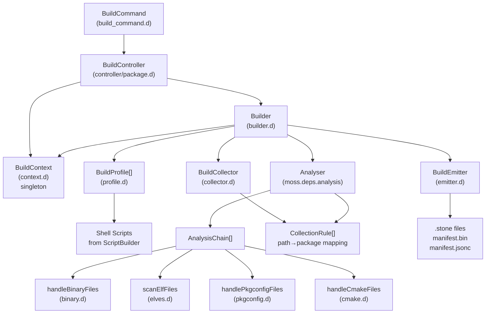
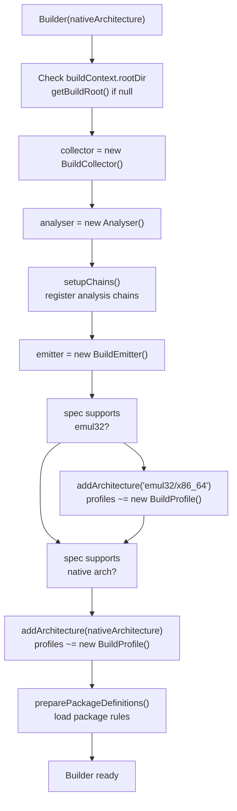
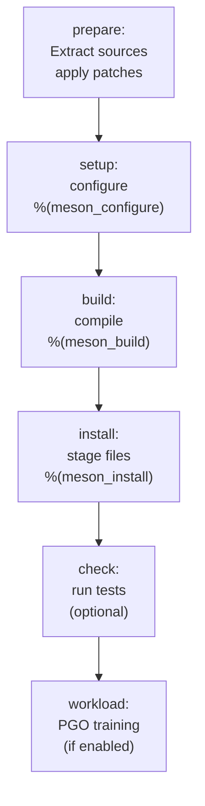
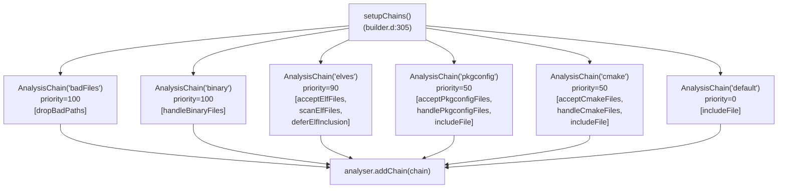
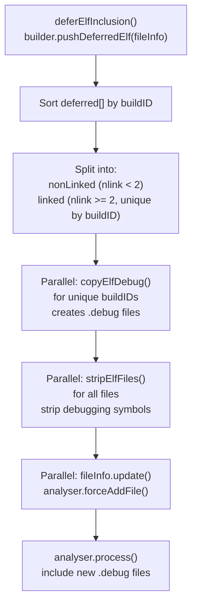
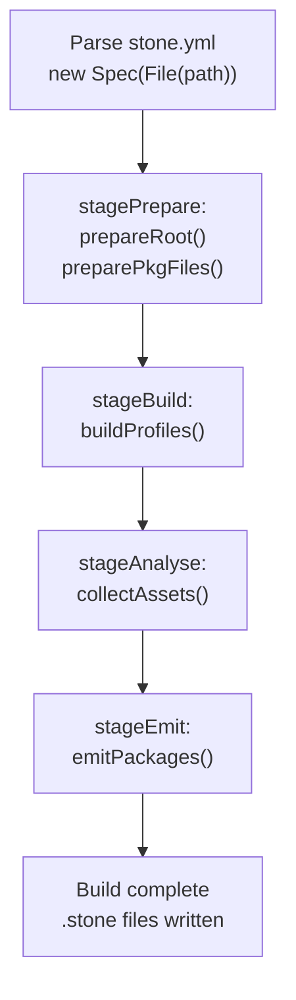

# Mason: Package Builder

Relevant source files

* [source/mason/build/analysers/binary.d](../source/mason/build/analysers/binary.d)
* [source/mason/build/analysers/cmake.d](../source/mason/build/analysers/cmake.d)
* [source/mason/build/analysers/package.d](../source/mason/build/analysers/package.d)
* [source/mason/build/analysers/pkgconfig.d](../source/mason/build/analysers/pkgconfig.d)
* [source/mason/build/analysers/rejects.d](../source/mason/build/analysers/rejects.d)
* [source/mason/build/builder.d](../source/mason/build/builder.d)
* [source/mason/build/collector.d](../source/mason/build/collector.d)
* [source/mason/build/context.d](../source/mason/build/context.d)
* [source/mason/build/controller/package.d](../source/mason/build/controller/package.d)
* [source/mason/cli/build\_command.d](../source/mason/cli/build_command.d)
* [source/mason/meson.build](../source/mason/meson.build)

## Purpose and Scope

Mason is the build execution and package creation component of boulder-d-legacy/. It compiles source code according to stone.yml recipes and produces binary .stone packages with full dependency metadata. Mason executes build stages (prepare, setup, build, install, check, workload), analyzes the installed files to detect binaries and dependencies, and emits packages ready for distribution.

For information about the overall build orchestration that invokes mason, see [Boulder: Build Orchestration](2-boulder:-build-orchestration). For details on how mason integrates with boulder's build stages, see [Build Stages](2.3-build-stages). For configuration that controls mason's behavior, see [Configuration System](5-configuration-system).

---

## Core Architecture

Mason operates through a coordinated system of components: the `Builder` orchestrates the process, `BuildProfile` executes build scripts, analysis chains scan the installed files, and `BuildEmitter` creates the final packages.

**Architecture: Mason Components**



Sources: [source/mason/cli/build\_command.d1-106](../source/mason/cli/build_command.d#L1-L106) [source/mason/build/controller/package.d1-158](../source/mason/build/controller/package.d#L1-L158) [source/mason/build/builder.d1-503](../source/mason/build/builder.d#L1-L503) [source/mason/build/context.d1-322](../source/mason/build/context.d#L1-L322)

---

## BuildContext: Global Configuration

The `BuildContext` class [source/mason/build/context.d44-321](../source/mason/build/context.d#L44-L321) is a singleton that stores global build configuration shared across all mason operations. It manages:

| Property | Type | Purpose |
| --- | --- | --- |
| `spec` | `Spec*` | Current stone.yml recipe being built |
| `rootDir` | `string` | Build root directory (e.g., `~/.moss/buildRoot/name-release`) |
| `specDir` | `string` | Directory containing the stone.yml file |
| `pkgDir` | `string` | `{rootDir}/pkgdir` - files from recipe's `pkg/` directory |
| `sourceDir` | `string` | `{rootDir}/sourcedir` - extracted source code |
| `jobs` | `int` | Number of parallel build jobs |
| `outputDirectory` | `string` | Where to write .stone packages (default: `.`) |
| `compilerCache` | `bool` | Enable compiler caching (ccache/sccache) |
| `defFiles` | `MacroFile*[string]` | Loaded architecture definitions (base, x86\_64, emul32, etc.) |
| `actionFiles` | `MacroFile*[]` | Loaded action macros (autotools, cmake, meson, cargo) |

The singleton is accessed globally via the `buildContext()` function [source/mason/build/context.d32-35](../source/mason/build/context.d#L32-L35) It loads all macro files from the installation's `share/boulder/macros/` directory [source/mason/build/context.d238-309](../source/mason/build/context.d#L238-L309) including architecture-specific definitions and build system actions.

Sources: [source/mason/build/context.d44-321](../source/mason/build/context.d#L44-L321)

---

## Builder: Core Orchestration

The `Builder` class [source/mason/build/builder.d48-503](../source/mason/build/builder.d#L48-L503) is responsible for converting a recipe into binary packages. It manages the complete lifecycle from file collection through analysis to package emission.

**Builder Initialization Flow**



Sources: [source/mason/build/builder.d57-101](../source/mason/build/builder.d#L57-L101)

### Key Builder Methods

**`prepareRoot()`** [source/mason/build/builder.d115-133](../source/mason/build/builder.d#L115-L133)

* Removes existing build root if not controlled by boulder (`!boulderRoot`)
* Creates fresh directory structure at `buildContext.rootDir`

**`preparePkgFiles()`** [source/mason/build/builder.d138-169](../source/mason/build/builder.d#L138-L169)

* Copies files from `{specDir}/pkg/` into `buildContext.pkgDir`
* These files are available to build scripts and can be included in packages

**`buildProfiles()`** [source/mason/build/builder.d184-194](../source/mason/build/builder.d#L184-L194)

* Executes `build()` on each `BuildProfile` in sequence
* Returns false if any profile build fails

**`collectAssets()`** [source/mason/build/builder.d200-210](../source/mason/build/builder.d#L200-L210)

* Collects files from each profile's `installRoot` via `collectRootfs()`
* Calls `analyser.process()` to run analysis chains
* Post-processes ELF files with `collectElves()` for debug info extraction and stripping

**`emitPackages()`** [source/mason/build/builder.d238-241](../source/mason/build/builder.d#L238-L241)

* Delegates to `emitter.emit()` to create final .stone packages

Sources: [source/mason/build/builder.d115-241](../source/mason/build/builder.d#L115-L241)

---

## BuildProfile: Multi-Architecture Builds

The `BuildProfile` class [source/mason/build/profile.d](../source/mason/build/profile.d) represents a single architecture's build configuration (e.g., x86\_64 or emul32/x86\_64). Each profile:

1. Generates architecture-specific shell scripts using `ScriptBuilder`
2. Executes build stages in sequence
3. Maintains its own `installRoot` where files are staged

Multiple profiles can be built from a single recipe when the architecture supports both native and emul32 builds. The `Builder` creates one `BuildProfile` instance per supported architecture [source/mason/build/builder.d106-110](../source/mason/build/builder.d#L106-L110)

**Build Stages Executed by BuildProfile**



Sources: [source/mason/build/profile.d](../source/mason/build/profile.d) [source/mason/build/builder.d106-110](../source/mason/build/builder.d#L106-L110)

---

## File Collection and Analysis

### BuildCollector: Path-to-Package Mapping

The `BuildCollector` [source/mason/build/collector.d76-116](../source/mason/build/collector.d#L76-L116) determines which package each file belongs to. It maintains prioritized `CollectionRule` entries that map file path patterns (globs) to package names.

```
struct CollectionRule {
    PathDefinition pathDef;  // Glob pattern like "/usr/lib/*.so.*"
    string target;           // Package name like "name-devel"
    int priority;            // Higher priority = checked first
}
```

Rules are added from two sources:

1. Base package definitions (`defFiles["base"].packages`) - priority starts at 0
2. Recipe-specific packages (`spec.rootPackage`, `spec.subPackages`) - priority starts at 1000

When `collector.packageTarget(path)` is called [source/mason/build/collector.d102-110](../source/mason/build/collector.d#L102-L110) it returns the first matching rule's target. The high priority of recipe-specific rules ensures custom package splits override base definitions.

Sources: [source/mason/build/collector.d34-116](../source/mason/build/collector.d#L34-L116) [source/mason/build/builder.d392-471](../source/mason/build/builder.d#L392-L471)

### Analysis Chain System

The `Analyser` [source/mason/build/analysers/package.d](../source/mason/build/analysers/package.d) from `moss.deps.analysis` processes files through registered `AnalysisChain` objects. Each chain has:

* A name (e.g., "elves", "pkgconfig")
* A priority (higher = runs first)
* A sequence of handler functions

**Analysis Chain Registration**



Sources: [source/mason/build/builder.d305-338](../source/mason/build/builder.d#L305-L338)

### Specialized Analysers

**Binary Provider Detection** [source/mason/build/analysers/binary.d29-46](../source/mason/build/analysers/binary.d#L29-L46)

* Files in `/usr/bin/` → `Provider(basename, ProviderType.BinaryName)`
* Files in `/usr/sbin/` → `Provider(basename, ProviderType.SystemBinaryName)`

**Pkgconfig Analysis** [source/mason/build/analysers/pkgconfig.d28-87](../source/mason/build/analysers/pkgconfig.d#L28-L87)

* Accepts files in `/*/pkgconfig/*.pc`
* Extracts provider: `Provider(basename-without-.pc, ProviderType.PkgconfigName)`
* Executes `pkg-config --print-requires` to find dependencies
* Emul32 files (in `/lib32/`) use `ProviderType.Pkgconfig32Name`

**CMake Provider Detection** [source/mason/build/analysers/cmake.d26-57](../source/mason/build/analysers/cmake.d#L26-L57)

* Accepts files in `/*/cmake/` ending with `Config.cmake` or `-config.cmake`
* Extracts provider: `Provider(basename-without-extension, ProviderType.CmakeName)`

**ELF Analysis** [source/mason/build/analysers/elves.d](../source/mason/build/analysers/elves.d)

* Detects ELF binaries and shared libraries
* Extracts SONAME, NEEDED dependencies, RPATH
* Defers files to `builder.pushDeferredElf()` for post-processing
* Post-processing: debug info extraction and stripping in parallel

**Bad Path Rejection** [source/mason/build/analysers/rejects.d27-47](../source/mason/build/analysers/rejects.d#L27-L47)

* Rejects non-`/usr/` paths
* Rejects libtool `.la` files in library directories

Sources: [source/mason/build/analysers/binary.d29-46](../source/mason/build/analysers/binary.d#L29-L46) [source/mason/build/analysers/pkgconfig.d28-87](../source/mason/build/analysers/pkgconfig.d#L28-L87) [source/mason/build/analysers/cmake.d26-57](../source/mason/build/analysers/cmake.d#L26-L57) [source/mason/build/analysers/elves.d](../source/mason/build/analysers/elves.d) [source/mason/build/analysers/rejects.d27-47](../source/mason/build/analysers/rejects.d#L27-L47)

---

## ELF Post-Processing Pipeline

ELF files require special handling for debug information and stripping. The `Builder` defers these files during initial analysis [source/mason/build/builder.d259-265](../source/mason/build/builder.d#L259-L265) and processes them in a separate phase [source/mason/build/builder.d272-301](../source/mason/build/builder.d#L272-L301)

**ELF Processing Workflow**



The uniqueness filtering prevents duplicate debug info extraction for hard-linked files (same buildID), while ensuring all instances get stripped. Debug files are created in `/usr/lib/debug/.build-id/XX/YYYYYY.debug` based on the ELF buildID.

Sources: [source/mason/build/builder.d259-301](../source/mason/build/builder.d#L259-L301) [source/mason/build/analysers/elves.d](../source/mason/build/analysers/elves.d)

---

## BuildEmitter: Package Creation

The `BuildEmitter` class [source/mason/build/emitter.d](../source/mason/build/emitter.d) creates .stone packages from analyzed files. It receives package definitions from the `Builder` and organizes files into packages based on the `Analyser`'s bucket assignments.

**Package Emission Process**

| Step | Description | File Reference |
| --- | --- | --- |
| 1. Add packages | `emitter.addPackage(source, pkgDef)` called for each package | [builder.d415](../builder.d#L415-L415) |
| 2. Collect files | `emitter.emit(outputDir, analyser)` iterates analyser buckets | [emitter.d](../emitter.d) |
| 3. Create archives | Writes .stone files with payload, metadata, indices | [emitter.d](../emitter.d) |
| 4. Write manifests | Generates binary manifest (`manifest.bin`) and JSON manifest (`manifest.jsonc`) | [manifest/](../manifest/) |

The emitter creates multiple .stone files from a single build:

* Main package: `name-version-release-build.stone`
* Subpackages: `name-subpkg-version-release-build.stone`
* Debug package: `name-dbginfo-version-release-build.stone` (if debug symbols exist)

Each .stone file contains:

* Binary payload (compressed files)
* Package metadata (name, version, dependencies, providers)
* Content addressing indices

Sources: [source/mason/build/emitter.d](../source/mason/build/emitter.d) [source/mason/build/manifest/](../source/mason/build/manifest/) [source/mason/build/builder.d415](../source/mason/build/builder.d#L415-L415)

---

## BuildController: Execution Stages

The `BuildController` [source/mason/build/controller/package.d38-157](../source/mason/build/controller/package.d#L38-L157) provides the main entry point for mason builds. It orchestrates the build lifecycle through distinct stages with timing information.

**Controller Build Stages**



Each stage is executed via `runTimed()` [source/mason/build/controller/package.d143-153](../source/mason/build/controller/package.d#L143-L153) which logs the duration. If any stage returns false, the build fails immediately.

The controller initializes the `Builder` with the target architecture [source/mason/build/controller/package.d79](../source/mason/build/controller/package.d#L79-L79) which can be "native" (auto-detected) or explicitly specified (e.g., "x86\_64", "emul32/x86\_64").

Sources: [source/mason/build/controller/package.d38-157](../source/mason/build/controller/package.d#L38-L157)

---

## Integration with Boulder

Mason is typically invoked by boulder's `stageBuildPackage` stage [see Build Stages](2.3-build-stages), but can also run standalone via the `mason build` command [source/mason/cli/build\_command.d54-95](../source/mason/cli/build_command.d#L54-L95)

**Command-line Interface**

```
mason build [options] <stone.yml>

Options:
  -j, --jobs N              Parallel build jobs (0 = automatic)
  -a, --architecture ARCH   Target architecture (default: native)
  -c, --compiler-cache      Enable ccache/sccache
  -o, --output DIR          Output directory for .stone files
  -d, --build-dir DIR       Build root directory
```

When boulder invokes mason, it:

1. Sets `buildContext.rootDir` to boulder's controlled build root
2. Copies recipe and sources into the build environment
3. Executes mason in a container (if confinement enabled) or directly
4. Collects .stone packages from the output directory

Sources: [source/mason/cli/build\_command.d54-105](../source/mason/cli/build_command.d#L54-L105) [see Build Stages](2.3-build-stages)

---

## Directory Structure

Mason organizes its work in a structured directory tree:

```
{buildContext.rootDir}/           # e.g., ~/.moss/buildRoot/nano-7.2
├── sourcedir/                    # Extracted sources (from upstream cache)
│   ├── nano-7.2/                # Unpacked tarball
│   └── ...
├── pkgdir/                       # Recipe's pkg/ directory contents
│   ├── file1                    # Available to build scripts
│   └── ...
└── install-{architecture}-{profile}/  # Per-profile install root
    └── usr/                      # Staged installation
        ├── bin/
        ├── lib/
        ├── share/
        └── ...
```

The `installRoot` directories are collected and analyzed to produce packages. Multiple install roots exist when building multiple architectures (native + emul32) or multiple profiles (standard + PGO).

Sources: [source/mason/build/context.d80-111](../source/mason/build/context.d#L80-L111) [source/mason/build/builder.d476-492](../source/mason/build/builder.d#L476-L492)