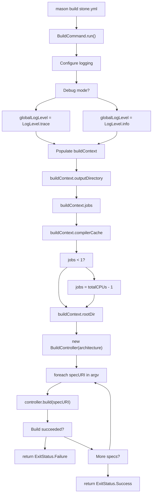
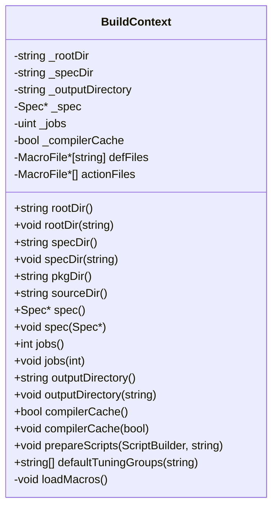
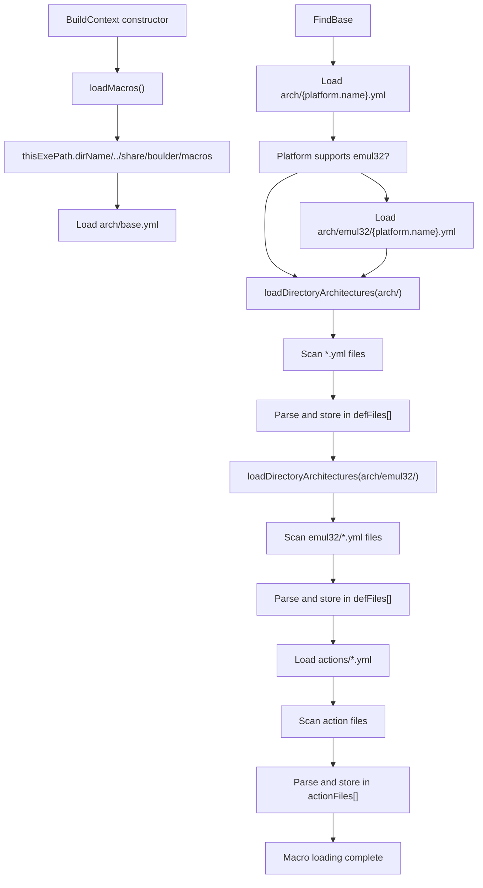
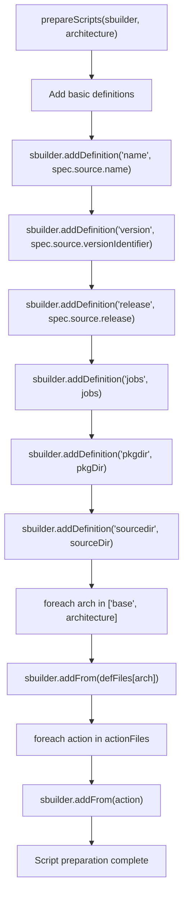
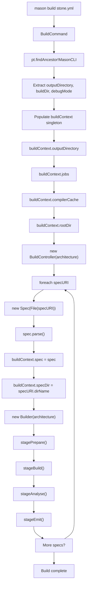

# Mason CLI and BuildContext

Relevant source files

* [source/mason/build/collector.d](../source/mason/build/collector.d)
* [source/mason/build/context.d](../source/mason/build/context.d)
* [source/mason/build/controller/package.d](../source/mason/build/controller/package.d)
* [source/mason/cli/build\_command.d](../source/mason/cli/build_command.d)

This document covers the command-line interface for the `mason build` command and the `BuildContext` singleton that holds global build configuration. Mason is invoked either directly by users or by boulder's build orchestration stages (see [boulder: Build Orchestration](2-boulder:-build-orchestration)) to perform the actual compilation, analysis, and packaging of software.

For information about the build execution stages (prepare, build, install), see [Builder and Build Profiles](3.2-builder-and-build-profiles). For details on file analysis and package emission, see [File Analysis System](3.3-file-analysis-system) and [Package Emission](3.4-package-emission).

---

## Overview

The Mason CLI system consists of two primary components:

* **BuildCommand**: The CLI frontend that parses command-line arguments and configures the build environment
* **BuildContext**: A singleton instance that holds global configuration state accessible throughout the mason build process

The BuildCommand is the entry point when mason is invoked. It processes command-line options, configures logging, populates the BuildContext singleton, and delegates to BuildController to execute the build lifecycle.

Sources: [source/mason/cli/build\_command.d1-106](../source/mason/cli/build_command.d#L1-L106) [source/mason/build/context.d1-322](../source/mason/build/context.d#L1-L322)

---

## BuildCommand Structure

The `BuildCommand` struct provides the `mason build` CLI interface. It is decorated with command metadata and contains option fields that are automatically populated by the CLI framework.

### Command Definition

```
@CommandName("build")
@CommandAlias("bi")
@CommandHelp("Build a package", "...")
@CommandUsage("[spec]")
public struct BuildCommand
```

### Available Options

| Option | Short | Long | Description | Default |
| --- | --- | --- | --- | --- |
| jobs | `-j` | `--jobs` | Number of parallel build jobs (0 = automatic) | 0 |
| architecture | `-a` | `--architecture` | Target architecture for the build | "native" |
| compilerCache | `-c` | `--compiler-cache` | Enable compiler caching | false |

The BuildCommand also inherits a `BaseCommand` struct that provides common CLI functionality.

Sources: [source/mason/cli/build\_command.d33-105](../source/mason/cli/build_command.d#L33-L105)

---

## Command Execution Flow

### BuildCommand Execution Diagram



Sources: [source/mason/cli/build\_command.d54-95](../source/mason/cli/build_command.d#L54-L95)

### Logging Configuration

Mason configures logging based on terminal detection:

```
if (isatty(0) && isatty(1))
{
    configureLogger(ColorLoggerFlags.Color | ColorLoggerFlags.Timestamps);
}
else
{
    configureLogger(ColorLoggerFlags.Timestamps);
}
```

If both stdin and stdout are TTY devices, colored output is enabled. Otherwise, timestamps-only logging is used. The log level is set to `LogLevel.trace` if debug mode is active (inherited from `MasonCLI.debugMode`), otherwise `LogLevel.info`.

Sources: [source/mason/cli/build\_command.d56-68](../source/mason/cli/build_command.d#L56-L68)

---

## BuildContext Singleton

The `BuildContext` class is a singleton that holds global build configuration. It is accessed via the `buildContext()` function, which lazily initializes the singleton instance.

### Singleton Access

```
BuildContext buildContext() @trusted
{
    return initOnce!_sharedBuildContext(new BuildContext());
}
```

Sources: [source/mason/build/context.d32-35](../source/mason/build/context.d#L32-L35)

### BuildContext Properties and Methods



Sources: [source/mason/build/context.d44-321](../source/mason/build/context.d#L44-L321)

### Key Properties

| Property | Type | Description |
| --- | --- | --- |
| `rootDir` | string | Base directory for build operations (default: ".") |
| `specDir` | string | Directory containing the stone.yml recipe |
| `pkgDir` | string | Computed as `{rootDir}/pkgdir` - staged installation directory |
| `sourceDir` | string | Computed as `{rootDir}/sourcedir` - extracted source location |
| `spec` | Spec\* | Pointer to the parsed stone.yml recipe specification |
| `jobs` | int | Number of parallel build jobs (auto-computed if 0) |
| `outputDirectory` | string | Where .stone packages are written (default: ".") |
| `compilerCache` | bool | Whether compiler caching (e.g., ccache) is enabled |

The `pkgDir` and `sourceDir` are computed properties based on `rootDir`:

```
pure @property string pkgDir() const @safe nothrow
{
    return join([_rootDir, "pkgdir"], "/");
}

pure @property string sourceDir() const @safe nothrow
{
    return join([_rootDir, "sourcedir"], "/");
}
```

Sources: [source/mason/build/context.d64-111](../source/mason/build/context.d#L64-L111) [source/mason/build/context.d130-185](../source/mason/build/context.d#L130-L185)

---

## Macro Loading System

The BuildContext automatically loads macro definitions from YAML files during construction. These macros define build system actions, architecture-specific settings, and compiler flags (see [Configuration System](5-configuration-system) for details).

### Macro File Discovery



Sources: [source/mason/build/context.d238-309](../source/mason/build/context.d#L238-L309)

### Macro File Organization

Macro files are organized in the following directory structure:

```
share/boulder/macros/
├── arch/
│   ├── base.yml              # Core definitions (paths, compilers, flags)
│   ├── x86_64.yml            # x86_64-specific settings
│   ├── aarch64.yml           # aarch64-specific settings
│   ├── emul32/
│   │   └── x86_64.yml        # 32-bit emulation on x86_64
│   └── ...
└── actions/
    ├── autotools.yml         # Autotools build actions
    ├── cmake.yml             # CMake build actions
    ├── meson.yml             # Meson build actions
    └── ...
```

The `loadMacros()` method validates that required files exist:

```
enforce(baseYml.exists, baseYml ~ " file cannot be found");
enforce(nativeYml.exists, nativeYml ~ " cannot be found");
if (plat.emul32)
{
    enforce(emulYml.exists, emulYml ~ " cannot be found");
}
```

Sources: [source/mason/build/context.d249-268](../source/mason/build/context.d#L249-L268)

### Macro File Storage

Loaded macro files are stored in two collections:

* **`defFiles`**: Map of architecture name to MacroFile pointer (e.g., `"base"`, `"x86_64"`, `"emul32/x86_64"`)
* **`actionFiles`**: Array of MacroFile pointers for build system actions

```
package:
    MacroFile*[string] defFiles;
    MacroFile*[] actionFiles;
```

Sources: [source/mason/build/context.d314-316](../source/mason/build/context.d#L314-L316)

---

## Script Preparation

The BuildContext provides the `prepareScripts()` method to configure a `ScriptBuilder` with definitions and macros. This method is called by the Builder to generate shell scripts for build stages.

### Script Preparation Flow



Sources: [source/mason/build/context.d189-212](../source/mason/build/context.d#L189-L212)

### Definitions Added to ScriptBuilder

| Variable | Source | Description |
| --- | --- | --- |
| `name` | `spec.source.name` | Package name from stone.yml |
| `version` | `spec.source.versionIdentifier` | Version string |
| `release` | `spec.source.release` | Release number |
| `jobs` | `buildContext.jobs` | Number of parallel build jobs |
| `pkgdir` | `buildContext.pkgDir` | Installation staging directory |
| `sourcedir` | `buildContext.sourceDir` | Source code directory |

These definitions can be referenced in stone.yml build scripts as `%(name)`, `%(version)`, etc.

Sources: [source/mason/build/context.d195-200](../source/mason/build/context.d#L195-L200)

### Default Tuning Groups

The `defaultTuningGroups()` method retrieves the default compiler tuning groups for a given architecture:

```
string[] defaultTuningGroups(string architecture) @trusted
{
    string[] arches = ["base", architecture];
    foreach_reverse (arch; arches)
    {
        auto archFile = defFiles[arch];
        auto groups = archFile.defaultGroups;
        if (groups.empty)
        {
            continue;
        }
        return groups;
    }
    return [];
}
```

This searches architecture-specific definitions in reverse order (architecture first, then base) and returns the first non-empty set of tuning groups found. Tuning groups control compiler optimization flags (see [Tuning Groups and Compiler Flags](5.3-tuning-groups-and-compiler-flags)).

Sources: [source/mason/build/context.d217-231](../source/mason/build/context.d#L217-L231)

---

## Integration with BuildController

The BuildController is the primary consumer of both BuildCommand and BuildContext. It orchestrates the complete build lifecycle.

### Integration Architecture



Sources: [source/mason/cli/build\_command.d70-92](../source/mason/cli/build_command.d#L70-L92) [source/mason/build/controller/package.d57-102](../source/mason/build/controller/package.d#L57-L102)

### BuildController Usage Pattern

The BuildController accesses the BuildContext singleton to retrieve configuration:

1. **Spec Assignment**: `buildContext.spec = s` sets the parsed recipe
2. **Directory Configuration**: `buildContext.specDir = path.dirName` sets the recipe directory
3. **Builder Construction**: The Builder receives the architecture and accesses buildContext internally

The BuildController executes four main stages:

| Stage | Method | Purpose |
| --- | --- | --- |
| Prepare | `stagePrepare()` | Initialize build root and package files |
| Build | `stageBuild()` | Execute build profiles (compile, install) |
| Analyse | `stageAnalyse()` | Scan installed files and collect metadata |
| Emit | `stageEmit()` | Generate .stone packages and manifests |

Sources: [source/mason/build/controller/package.d71-102](../source/mason/build/controller/package.d#L71-L102)

### Timing Instrumentation

The BuildController uses `runTimed()` to measure the duration of each stage:

```
bool runTimed(bool delegate() dg, in string label)
{
    import std.datetime.stopwatch : StopWatch, AutoStart;

    auto sw = StopWatch(AutoStart.yes);
    scope (exit)
    {
        info(format!"[%s] Finished: %s"(label, sw.peek));
    }
    return dg();
}
```

This logs messages like `[Prepare] Finished: 1 sec, 234 ms` for each completed stage.

Sources: [source/mason/build/controller/package.d143-153](../source/mason/build/controller/package.d#L143-L153)

---

## Summary

The Mason CLI and BuildContext work together to provide the entry point and global configuration for mason builds:

* **BuildCommand** parses CLI arguments (`-j`, `-a`, `-c`) and configures logging
* **BuildContext** singleton stores global state (directories, jobs, spec, macros)
* **Macro loading** happens automatically during BuildContext construction
* **BuildController** consumes both to orchestrate the build lifecycle

The BuildContext is accessible throughout the mason codebase via the `buildContext()` function, allowing components like Builder, Analyser, and Emitter to access configuration without explicit parameter passing.

Sources: [source/mason/cli/build\_command.d1-106](../source/mason/cli/build_command.d#L1-L106) [source/mason/build/context.d1-322](../source/mason/build/context.d#L1-L322) [source/mason/build/controller/package.d1-158](../source/mason/build/controller/package.d#L1-L158)