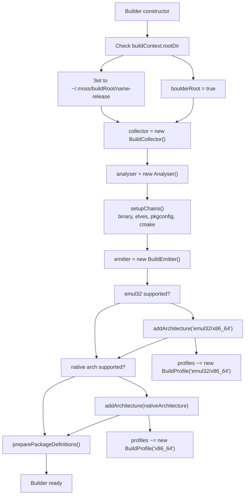
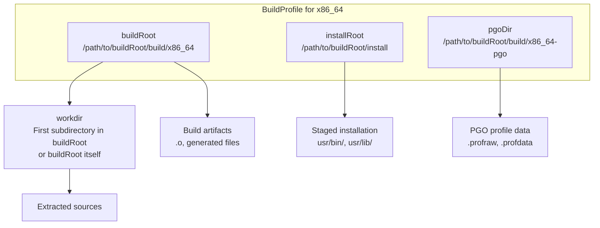
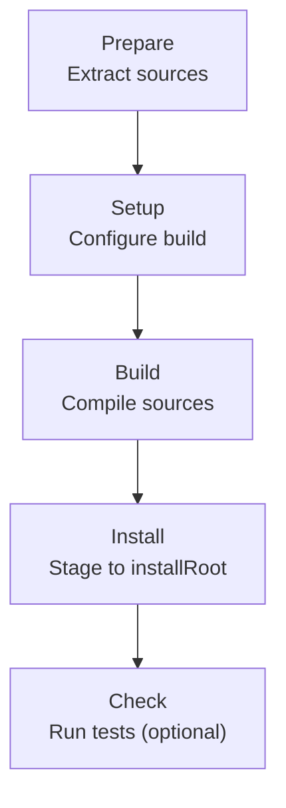
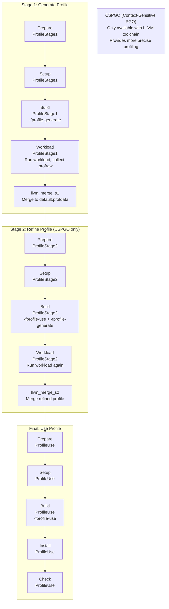
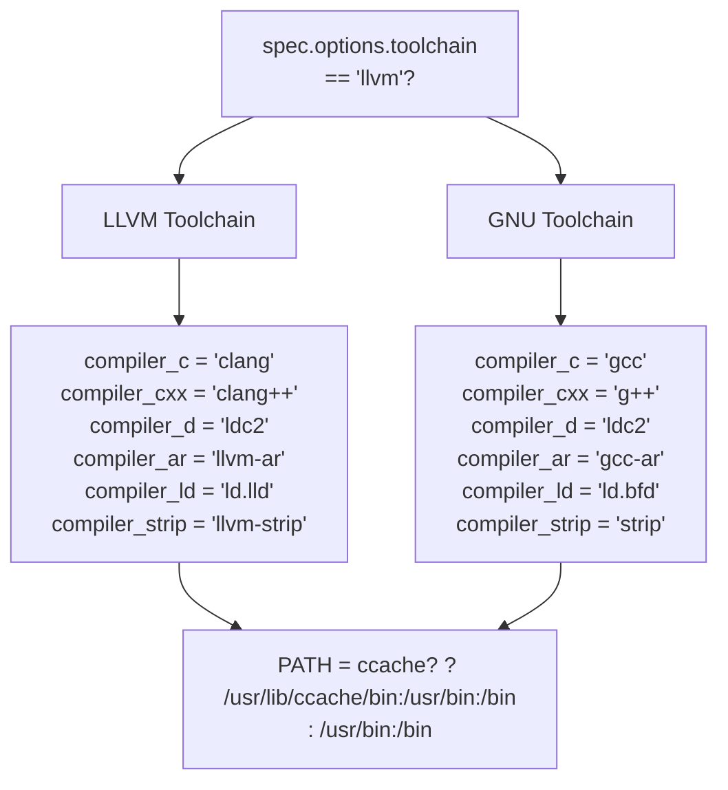
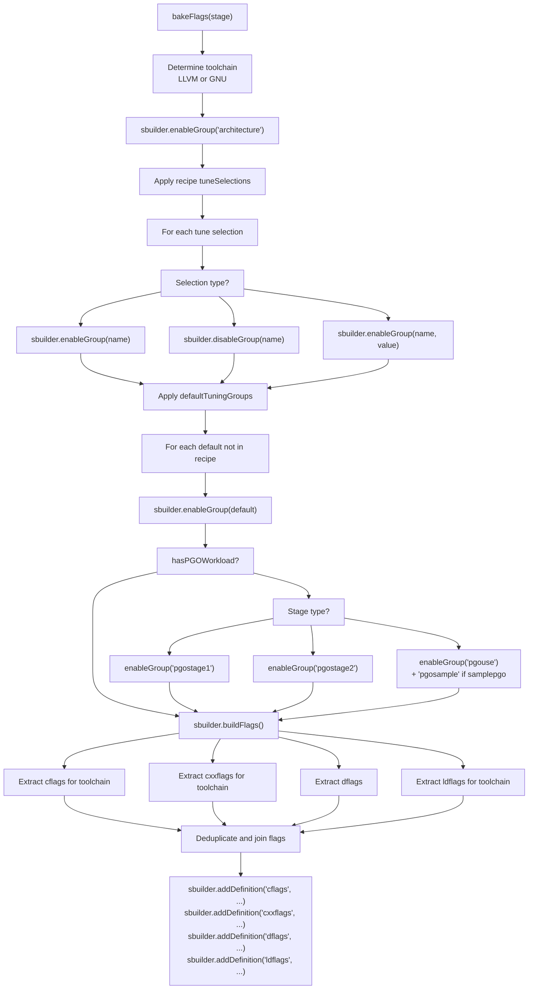
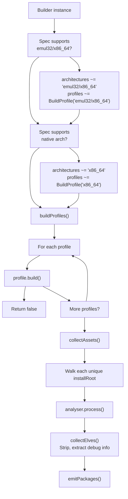
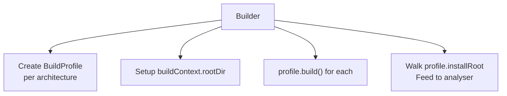
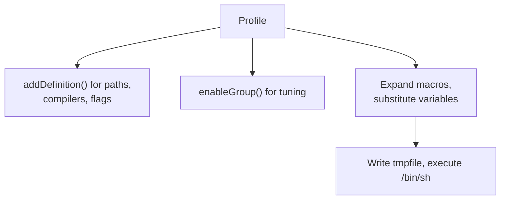

# Builder and Build Profiles

Relevant source files

* [data/macros/arch/base.yml](../data/macros/arch/base.yml)
* [source/mason/build/analysers/binary.d](../source/mason/build/analysers/binary.d)
* [source/mason/build/analysers/cmake.d](../source/mason/build/analysers/cmake.d)
* [source/mason/build/analysers/package.d](../source/mason/build/analysers/package.d)
* [source/mason/build/analysers/pkgconfig.d](../source/mason/build/analysers/pkgconfig.d)
* [source/mason/build/analysers/rejects.d](../source/mason/build/analysers/rejects.d)
* [source/mason/build/builder.d](../source/mason/build/builder.d)
* [source/mason/build/profile.d](../source/mason/build/profile.d)
* [source/mason/meson.build](../source/mason/meson.build)

This document covers the `Builder` class and `BuildProfile` struct, which form the core of mason's package building functionality. The `Builder` orchestrates the complete package build process, creating one or more `BuildProfile` instances (one per architecture) that execute the actual compilation stages. Together, they transform source code into analyzed, packaged `.stone` files.

For information about build orchestration through boulder stages, see [Build Stages](2.3-build-stages). For details on the analysis of built files, see [File Analysis System](3.3-file-analysis-system). For configuration of compilers and flags, see [Architecture Definitions](5.2-architecture-definitions) and [Tuning Groups and Compiler Flags](5.3-tuning-groups-and-compiler-flags).

---

## Builder Class Overview

The `Builder` class ([source/mason/build/builder.d48-503](../source/mason/build/builder.d#L48-L503)) serves as the top-level coordinator for mason's package building process. It is instantiated once per build invocation and manages:

* **Multiple architecture profiles**: Creates and coordinates `BuildProfile` instances for each target architecture (e.g., `x86_64`, `emul32/x86_64`)
* **File collection and analysis**: Gathers installed files from all profiles and runs analysis chains
* **Package emission**: Coordinates the creation of final `.stone` packages and manifests

### Builder Initialization



**Sources:** [source/mason/build/builder.d57-101](../source/mason/build/builder.d#L57-L101) [source/mason/build/builder.d106-110](../source/mason/build/builder.d#L106-L110)

### Key Builder Operations

| Method | Purpose | Key Actions |
| --- | --- | --- |
| `prepareRoot()` | Initialize build filesystem | Creates or cleans `buildContext.rootDir` unless managed by boulder |
| `preparePkgFiles()` | Stage package auxiliary files | Copies contents of recipe's `pkg/` directory to `buildContext.pkgDir` |
| `validateProfiles()` | Pre-flight check | Ensures all profile scripts compile before execution |
| `buildProfiles()` | Execute builds | Calls `build()` on each `BuildProfile` sequentially |
| `collectAssets()` | Gather built files | Walks `installRoot` from all profiles, runs analysis chains |
| `emitPackages()` | Create outputs | Delegates to `BuildEmitter` to generate `.stone` files |

**Sources:** [source/mason/build/builder.d115-194](../source/mason/build/builder.d#L115-L194) [source/mason/build/builder.d200-241](../source/mason/build/builder.d#L200-L241)

---

## BuildProfile Structure

A `BuildProfile` ([source/mason/build/profile.d36-652](../source/mason/build/profile.d#L36-L652)) represents a single architecture-specific build configuration. Each profile maintains its own build directory and executes a sequence of build stages tailored to that architecture.

### Architecture-Specific Paths



**Sources:** [source/mason/build/profile.d44-106](../source/mason/build/profile.d#L44-L106)

### Profile Construction

When a `BuildProfile` is constructed, it:

1. **Sets architecture-specific paths**: `buildRoot`, `installRoot`, and `pgoDir`
2. **Determines PGO staging**: Checks if the recipe defines a `workload:` section for Profile-Guided Optimization
3. **Selects stage sequence**: Builds different stage lists for PGO vs. non-PGO builds
4. **Creates ExecutionStage instances**: Populates the `stages` array with configured stages

**Sources:** [source/mason/build/profile.d44-106](../source/mason/build/profile.d#L44-L106)

---

## Build Stage Execution

Build stages represent the distinct phases of the compilation process. Each stage executes a shell script generated from the recipe's build instructions and system macros.

### Standard Build Stages

For non-PGO builds, the following stages execute sequentially:



**Sources:** [source/mason/build/profile.d92-98](../source/mason/build/profile.d#L92-L98)

### PGO Multi-Stage Build Flow

Profile-Guided Optimization builds execute in multiple passes to collect runtime profiling data:



**Sources:** [source/mason/build/profile.d54-98](../source/mason/build/profile.d#L54-L98) [source/mason/build/profile.d524-538](../source/mason/build/profile.d#L524-L538)

### Stage Insertion Logic

The `insertStage()` method ([source/mason/build/profile.d487-554](../source/mason/build/profile.d#L487-L554)) determines which script content to use for each stage:

1. **Locates BuildDefinition**: Searches for architecture-specific build instructions, falling back to root or `emul32` namespace
2. **Extracts script content**: Retrieves the appropriate method (e.g., `build()`, `install()`) from the `BuildDefinition`
3. **Prepends environment**: Always includes `environment()` script at the beginning
4. **Adds stage instance**: Only creates the `ExecutionStage` if the script is non-empty

**Sources:** [source/mason/build/profile.d487-554](../source/mason/build/profile.d#L487-L554)

### Stage Execution Flow

```mermaid
sequenceDiagram
  participant BuildProfile
  participant ExecutionStage
  participant ScriptBuilder
  participant Filesystem
  participant /bin/sh
  participant Builder

  BuildProfile->>BuildProfile: build()
  loop [Exit code != 0]
    BuildProfile->>BuildProfile: prepareScripts(stage)
    note over BuildProfile: Set definitions:
    BuildProfile->>ScriptBuilder: addDefinition(key, value)
    BuildProfile->>ScriptBuilder: loadSystemMacros()
    BuildProfile->>BuildProfile: bakeFlags(stage)
    note over BuildProfile: Enable tuning groups,
    BuildProfile->>ScriptBuilder: bake()
    BuildProfile->>ScriptBuilder: process(stage.script)
    ScriptBuilder-->>BuildProfile: Expanded script text
    BuildProfile->>Filesystem: createTemporary("/tmp/moss-stage-*")
    BuildProfile->>Filesystem: Write script to tmpfile
    BuildProfile->>/bin/sh: execute([tmpfile.path])
    /bin/sh-->>BuildProfile: Exit code
    BuildProfile->>BuildProfile: Error and return false
    BuildProfile->>Filesystem: remove(tmpfile)
  end
  BuildProfile-->>Builder: success = true
```

**Sources:** [source/mason/build/profile.d194-250](../source/mason/build/profile.d#L194-L250) [source/mason/build/profile.d135-189](../source/mason/build/profile.d#L135-L189)

---

## Script Generation and Compiler Configuration

The `BuildProfile` generates shell scripts for each stage by combining:

* Recipe instructions from `stone.yml`
* System macro definitions from `data/macros/arch/*.yml`
* Architecture-specific compiler settings
* Tuning flags and optimizations

### ScriptBuilder Configuration

The `prepareScripts()` method ([source/mason/build/profile.d271-339](../source/mason/build/profile.d#L271-L339)) populates the `ScriptBuilder` with definitions:

| Definition | Purpose | Example Values |
| --- | --- | --- |
| `installroot` | Where `make install` stages files | `/home/user/.moss/buildRoot/name-1/install` |
| `buildroot` | Build working directory | `/home/user/.moss/buildRoot/name-1/build/x86_64` |
| `workdir` | Actual compilation directory | `{buildroot}/extracted-src-1.0` |
| `compiler_c` | C compiler command | `clang` (LLVM) or `gcc` (GNU) |
| `compiler_cxx` | C++ compiler | `clang++` or `g++` |
| `compiler_ld` | Linker | `ld.lld` or `ld.bfd` |
| `compiler_cache` | ccache directory | `/mason/ccache` or `$HOME/.ccache` |
| `pgo_dir` | PGO profile storage | `{buildroot}-pgo` |

**Sources:** [source/mason/build/profile.d271-339](../source/mason/build/profile.d#L271-L339)

### Toolchain Selection



**Sources:** [source/mason/build/profile.d294-328](../source/mason/build/profile.d#L294-L328)

### Flag Resolution Process

The `bakeFlags()` method ([source/mason/build/profile.d347-430](../source/mason/build/profile.d#L347-L430)) resolves compiler and linker flags through a sophisticated tuning system:



**Sources:** [source/mason/build/profile.d347-430](../source/mason/build/profile.d#L347-L430)

### Default Tuning Groups

The base configuration defines standard tuning groups that are enabled by default ([data/macros/arch/base.yml90-102](../data/macros/arch/base.yml#L90-L102)):

* `asneeded`: Link only needed libraries (`-Wl,--as-needed`)
* `avxwidth`: Prefer 128-bit vector width
* `base`: Core compilation flags
* `bindnow`: Immediate symbol resolution
* `debug`: Debug information generation
* `fortify`: `_FORTIFY_SOURCE=2` for buffer overflow detection
* `frame-pointer`: Frame pointer handling
* `harden`: Stack protection (default: level 1)
* `icf`: Identical code folding (LLVM only)
* `optimize`: Optimization level (default: generic = `-O2`)
* `relr`: Relative relocations packing
* `symbolic`: Symbol binding mode

**Sources:** [data/macros/arch/base.yml90-277](../data/macros/arch/base.yml#L90-L277)

---

## Example: Generated Build Script

For a typical LLVM-based build with default tuning, the generated script includes:

```
#!/bin/sh
set -e
set -x
TERM="dumb"; export TERM
PKG_CONFIG_PATH="/usr/lib/pkgconfig:/usr/share/pkgconfig"; export PKG_CONFIG_PATH
CFLAGS="-march=x86-64 -mtune=generic -O2 -pipe -fPIC -mprefer-vector-width=128"; export CFLAGS
CXXFLAGS="-march=x86-64 -mtune=generic -O2 -pipe -fPIC -mprefer-vector-width=128"; export CXXFLAGS
LDFLAGS="-Wl,-O2,--gc-sections,--as-needed,-z,relro,-z,now,--icf=safe,-z,pack-relative-relocs"; export LDFLAGS
CC="clang"; export CC
CXX="clang++"; export CXX
AR="llvm-ar"; export AR
LD="ld.lld"; export LD
# ... more environment variables ...
cd "/path/to/buildRoot/build/x86_64/source-1.0" && echo "The work directory is ${PWD}"

# Recipe build commands follow...
%configure
%make
```

**Sources:** [data/macros/arch/base.yml55-88](../data/macros/arch/base.yml#L55-L88)

---

## Multi-Architecture Build Coordination

The `Builder` manages multiple `BuildProfile` instances to support multi-architecture builds (e.g., native 64-bit plus 32-bit emulation libraries):



**Sources:** [source/mason/build/builder.d87-100](../source/mason/build/builder.d#L87-L100) [source/mason/build/builder.d184-194](../source/mason/build/builder.d#L184-L194) [source/mason/build/builder.d200-241](../source/mason/build/builder.d#L200-L241)

### Emul32 Profile Handling

When building 32-bit compatibility packages:

* **Profile architecture**: Set to `emul32/x86_64` (or platform-specific equivalent)
* **Build definitions**: Falls back to `emul32` namespace if `emul32/x86_64` not found in recipe ([source/mason/build/profile.d499-502](../source/mason/build/profile.d#L499-L502))
* **Install path**: Uses shared `installRoot` but builds in separate `buildRoot`
* **Library path**: 32-bit libraries install to `/usr/lib32/`

**Sources:** [source/mason/build/profile.d468-478](../source/mason/build/profile.d#L468-L478) [source/mason/build/profile.d499-502](../source/mason/build/profile.d#L499-L502)

---

## Integration Points

### Builder → BuildProfile



**Sources:** [source/mason/build/builder.d57-101](../source/mason/build/builder.d#L57-L101) [source/mason/build/builder.d184-210](../source/mason/build/builder.d#L184-L210)

### BuildProfile → ScriptBuilder



**Sources:** [source/mason/build/profile.d271-339](../source/mason/build/profile.d#L271-L339) [source/mason/build/profile.d135-189](../source/mason/build/profile.d#L135-L189)

### BuildProfile → BuildContext

The `BuildProfile` reads shared global state from `BuildContext` singleton:

* `buildContext.spec`: Recipe specification
* `buildContext.defFiles`: Architecture definition files
* `buildContext.compilerCache`: Whether ccache is enabled
* `buildContext.prepareScripts()`: Loads system macros

**Sources:** [source/mason/build/profile.d333](../source/mason/build/profile.d#L333-L333) [source/mason/build/profile.d380-386](../source/mason/build/profile.d#L380-L386)

---

## Key Code Entities

| Entity | Type | Location | Purpose |
| --- | --- | --- | --- |
| `Builder` | Class | [source/mason/build/builder.d48](../source/mason/build/builder.d#L48-L48) | Top-level build coordinator |
| `BuildProfile` | Struct | [source/mason/build/profile.d36](../source/mason/build/profile.d#L36-L36) | Architecture-specific build executor |
| `ExecutionStage` | Struct | [source/mason/build/stage.d](../source/mason/build/stage.d) | Individual stage (prepare, build, install, etc.) |
| `StageType` | Enum | [source/mason/build/stage.d](../source/mason/build/stage.d) | Stage type flags (Prepare, Build, ProfileStage1, etc.) |
| `ScriptBuilder` | Class | [moss.format.source.script](../moss.format.source.script) | Macro expansion and script generation |
| `BuildContext` | Class | [source/mason/build/context.d](../source/mason/build/context.d) | Global build configuration singleton |
| `architectures` | Field | [source/mason/build/builder.d494](../source/mason/build/builder.d#L494-L494) | List of target architectures |
| `profiles` | Field | [source/mason/build/builder.d495](../source/mason/build/builder.d#L495-L495) | Array of `BuildProfile` pointers |
| `stages` | Field | [source/mason/build/profile.d648](../source/mason/build/profile.d#L648-L648) | Array of `ExecutionStage` pointers |
| `buildRoot` | Property | [source/mason/build/profile.d119-122](../source/mason/build/profile.d#L119-L122) | Profile's build directory path |
| `installRoot` | Property | [source/mason/build/profile.d127-130](../source/mason/build/profile.d#L127-L130) | Shared installation staging directory |

**Sources:** [source/mason/build/builder.d](../source/mason/build/builder.d) [source/mason/build/profile.d](../source/mason/build/profile.d) [source/mason/build/stage.d](../source/mason/build/stage.d)