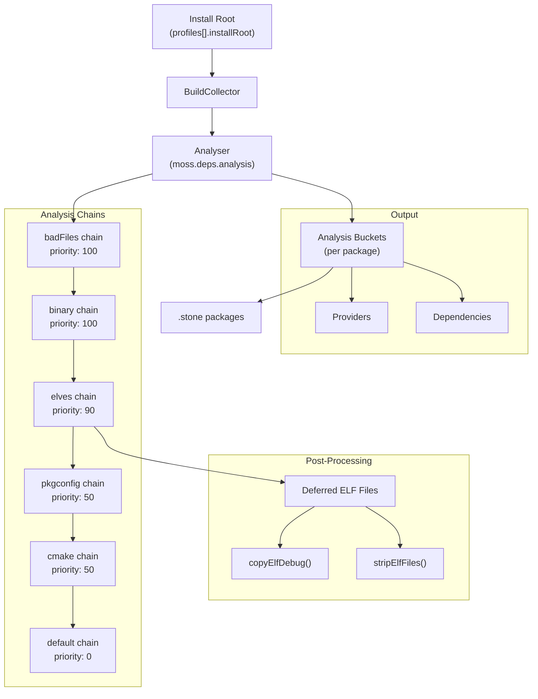
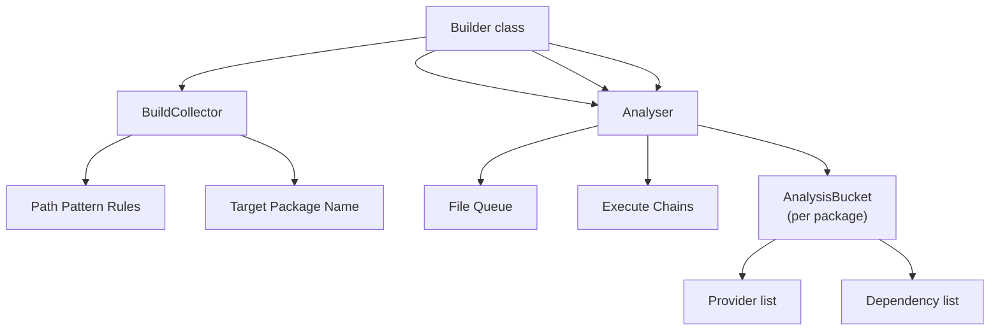
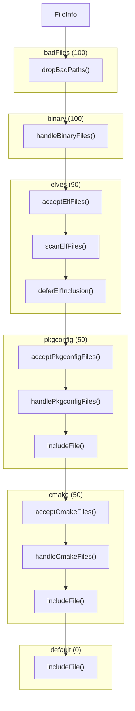
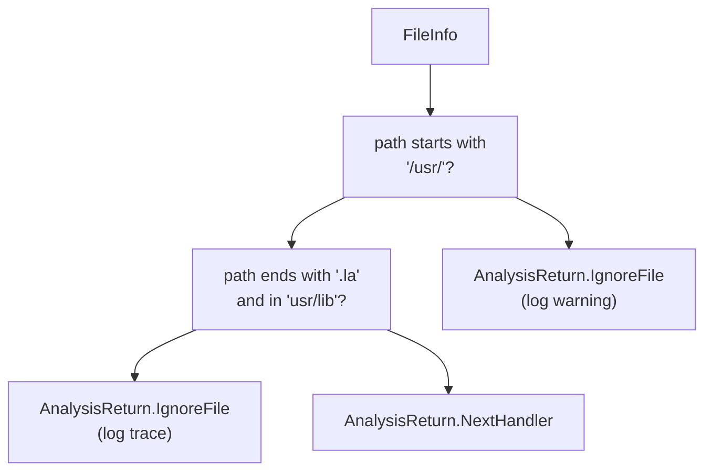
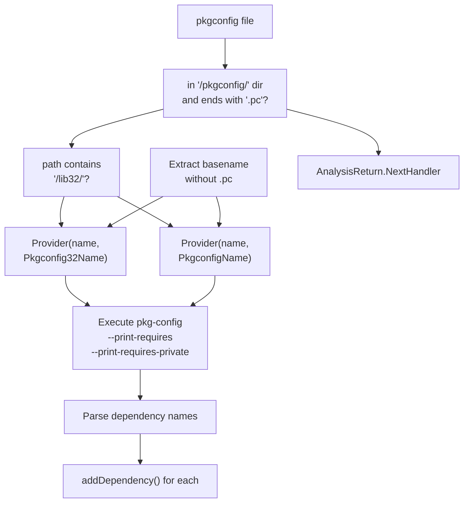
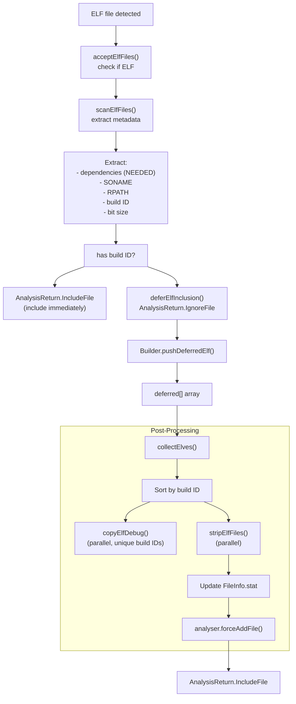
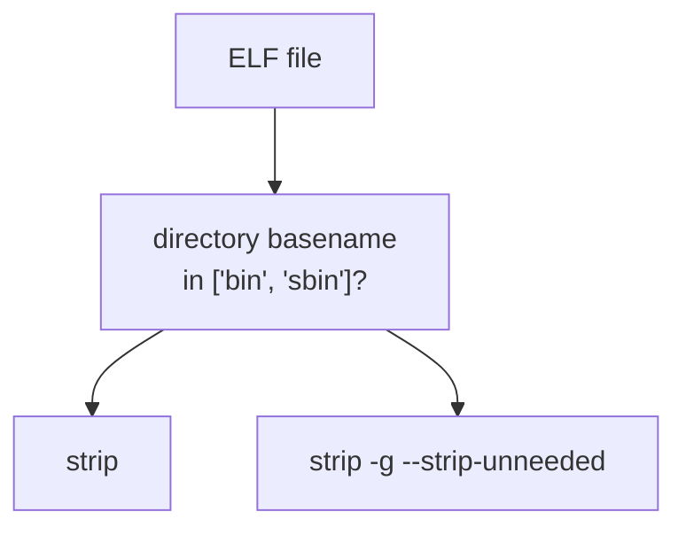
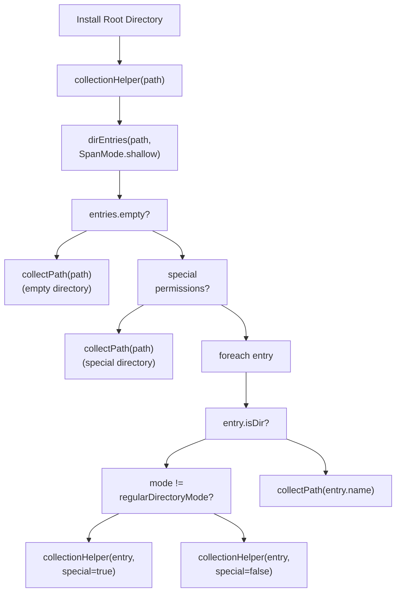

# File Analysis System

Relevant source files

* [source/boulder/stages/configure\_root.d](../source/boulder/stages/configure_root.d)
* [source/boulder/stages/populate\_root.d](../source/boulder/stages/populate_root.d)
* [source/mason/build/analysers/binary.d](../source/mason/build/analysers/binary.d)
* [source/mason/build/analysers/cmake.d](../source/mason/build/analysers/cmake.d)
* [source/mason/build/analysers/elves.d](../source/mason/build/analysers/elves.d)
* [source/mason/build/analysers/package.d](../source/mason/build/analysers/package.d)
* [source/mason/build/analysers/pkgconfig.d](../source/mason/build/analysers/pkgconfig.d)
* [source/mason/build/analysers/rejects.d](../source/mason/build/analysers/rejects.d)
* [source/mason/build/builder.d](../source/mason/build/builder.d)
* [source/mason/meson.build](../source/mason/meson.build)

The file analysis system is responsible for scanning all files installed during the build process, detecting their types and characteristics, extracting providers (capabilities the package offers), identifying dependencies, and determining which package each file belongs to. This system is a critical component of mason that bridges the gap between compiled artifacts and the metadata needed to create .stone packages.

For information about how packages are emitted after analysis, see [Package Emission](3.4-package-emission). For the build process that generates the files to analyze, see [Builder and Build Profiles](3.2-builder-and-build-profiles).

## Purpose and Scope

The analysis system processes every file in the install root after the build stages complete. It identifies:

* Binary executables and their locations (`/usr/bin`, `/usr/sbin`)
* ELF files (executables, shared libraries) and their dependencies
* Pkgconfig (`.pc`) files and their requirements
* CMake configuration files and their providers
* Files that should be rejected or excluded from packages

The system operates through a chain-of-responsibility pattern, where each file is passed through multiple analysis chains until all relevant metadata has been extracted.

Sources: [source/mason/build/builder.d69-73](../source/mason/build/builder.d#L69-L73) [source/mason/build/builder.d200-210](../source/mason/build/builder.d#L200-L210) [source/mason/build/analysers/package.d1-23](../source/mason/build/analysers/package.d#L1-L23)

## Overall Architecture



**Analysis Flow Overview**

This diagram shows how files flow from the install root through the collector and analyser, passing through prioritized analysis chains, with special handling for ELF files that are deferred for post-processing.

Sources: [source/mason/build/builder.d200-210](../source/mason/build/builder.d#L200-L210) [source/mason/build/builder.d272-301](../source/mason/build/builder.d#L272-L301) [source/mason/build/builder.d305-338](../source/mason/build/builder.d#L305-L338)

## BuildCollector and Analysis Coordination

The `BuildCollector` class determines which package each file belongs to based on path patterns defined in the recipe. The `Analyser` class from `moss.deps.analysis` coordinates the execution of analysis chains.



**Collector and Analyser Coordination**

The Builder instantiates both the collector and analyser. The collector maintains rules for path-to-package mapping, while the analyser executes chains and accumulates providers/dependencies in per-package buckets.

Sources: [source/mason/build/builder.d69-73](../source/mason/build/builder.d#L69-L73) [source/mason/build/builder.d215-232](../source/mason/build/builder.d#L215-L232) [source/mason/build/builder.d395-416](../source/mason/build/builder.d#L395-L416)

## Analysis Chain System

Analysis chains are prioritized sequences of functions that examine files. Each function in a chain can:

* Accept the file for further processing (`NextFunction`)
* Reject the file (`IgnoreFile`)
* Include the file in the package (`IncludeFile`)
* Pass to the next chain (`NextHandler`)



**Analysis Chain Execution Order**

Chains are executed in priority order (highest first). Each function returns an `AnalysisReturn` value that determines whether processing continues to the next function in the chain or skips to the next chain.

Sources: [source/mason/build/builder.d305-338](../source/mason/build/builder.d#L305-L338)

### Chain Setup and Priority

The chains are defined in `Builder.setupChains()` with explicit priorities:

| Chain Name | Priority | Functions | Purpose |
| --- | --- | --- | --- |
| `badFiles` | 100 | `dropBadPaths` | Reject non-`/usr/` paths and `.la` files |
| `binary` | 100 | `handleBinaryFiles` | Detect binaries in `/usr/bin` and `/usr/sbin` |
| `elves` | 90 | `acceptElfFiles`, `scanElfFiles`, `deferElfInclusion` | Process ELF files for stripping and debug info |
| `pkgconfig` | 50 | `acceptPkgconfigFiles`, `handlePkgconfigFiles`, `includeFile` | Extract pkgconfig providers and dependencies |
| `cmake` | 50 | `acceptCmakeFiles`, `handleCmakeFiles`, `includeFile` | Extract CMake configuration providers |
| `default` | 0 | `includeFile` | Include any remaining files |

Sources: [source/mason/build/builder.d308-332](../source/mason/build/builder.d#L308-L332)

## File Rejection Analyser

The rejection analyser (`dropBadPaths`) is the highest priority chain that filters out unwanted files before any other analysis occurs.

### Rejection Criteria

**Non-/usr/ Paths**: Any file not starting with `/usr/` is rejected. This enforces the constraint that all package files must reside under `/usr/`.

**Libtool Archive Files**: Files ending in `.la` located under `usr/lib` directories are rejected. Libtool archive files can cause build system confusion and are not needed in binary packages.



**File Rejection Logic**

Sources: [source/mason/build/analysers/rejects.d27-47](../source/mason/build/analysers/rejects.d#L27-L47)

## Binary File Analyser

The binary analyser (`handleBinaryFiles`) detects executable files in standard system directories and registers them as providers.

### Provider Types

The analyser creates two types of binary providers:

* **BinaryName**: Files in `/usr/bin/` become `Provider` objects with `ProviderType.BinaryName`
* **SystemBinaryName**: Files in `/usr/sbin/` become `Provider` objects with `ProviderType.SystemBinaryName`

The provider name is extracted by removing the directory prefix, so `/usr/bin/gcc` produces a provider named `gcc` of type `BinaryName`.

```
// Example provider extraction from source/mason/build/analysers/binary.d
if (filename.startsWith("/usr/bin/"))
{
    auto prov = Provider(fileInfo.path[`/usr/bin/`.length .. $], ProviderType.BinaryName);
    analyser.bucket(fileInfo).addProvider(prov);
}
```

This allows other packages to declare dependencies like `binary(gcc)` to ensure the gcc executable is available.

Sources: [source/mason/build/analysers/binary.d29-46](../source/mason/build/analysers/binary.d#L29-L46)

## Pkgconfig Analyser

The pkgconfig analyser handles `.pc` files in `pkgconfig` directories, extracting both providers and dependencies.

### Detection and Provider Registration

**Acceptance Criteria**: Files must be in a directory containing `/pkgconfig` and end with `.pc` extension.

**Provider Generation**: The provider name is derived from the filename with the `.pc` extension removed. For example, `/usr/lib/pkgconfig/zlib.pc` generates a provider named `zlib`.

**32-bit Detection**: Files in `/lib32/` directories generate `ProviderType.Pkgconfig32Name` providers instead of `ProviderType.PkgconfigName`.



**Pkgconfig Analysis Flow**

Sources: [source/mason/build/analysers/pkgconfig.d28-39](../source/mason/build/analysers/pkgconfig.d#L28-L39) [source/mason/build/analysers/pkgconfig.d45-87](../source/mason/build/analysers/pkgconfig.d#L45-L87)

### Dependency Extraction

The analyser executes `/usr/bin/pkg-config` with `--print-requires` and `--print-requires-private` flags to extract dependencies. The command is run with a controlled environment:

* `LC_ALL=C` for consistent output
* `PKG_CONFIG_PATH` set appropriately:
  + For 32-bit: `/usr/lib32/pkgconfig:/usr/lib/pkgconfig:/usr/share/pkgconfig`
  + For regular: `/usr/lib/pkgconfig:/usr/share/pkgconfig`

Dependencies are converted to `Dependency` objects with `DependencyType.PkgconfigName` or `DependencyType.Pkgconfig32Name` based on context.

Sources: [source/mason/build/analysers/pkgconfig.d56-86](../source/mason/build/analysers/pkgconfig.d#L56-L86)

## CMake File Analyser

The CMake analyser detects CMake configuration files and registers them as providers for CMake-based projects.

### Detection Pattern

**Acceptance Criteria**:

* Path must contain `/cmake` directory
* Filename must end with `Config.cmake` or `-config.cmake`
* Must NOT end with `-Config.cmake` (intermediate form)

### Provider Extraction

The provider name is extracted by removing the suffix:

* For `-config.cmake`: remove 13 characters
* For `Config.cmake`: remove 12 characters

Example: `/usr/lib/cmake/ZLIB/ZLIBConfig.cmake` produces a provider named `ZLIB` with `ProviderType.CmakeName`.

Sources: [source/mason/build/analysers/cmake.d26-57](../source/mason/build/analysers/cmake.d#L26-L57)

## ELF File Analyser

The ELF analyser is the most complex, handling executable and library files. It involves three stages: acceptance, scanning, and deferred processing.

### ELF Analysis Pipeline



**ELF Processing Pipeline**

The three-stage process ensures that ELF files with build IDs are stripped and have debug info extracted before being included in the package.

Sources: [source/mason/build/analysers/elves.d30-49](../source/mason/build/analysers/elves.d#L30-L49) [source/mason/build/builder.d272-301](../source/mason/build/builder.d#L272-L301)

### Debug Information Extraction

For ELF files with build IDs, debug information is extracted into a separate debug package:

**Debug File Location**: Debug info is stored at:

* 64-bit: `/usr/lib/debug/.build-id/XX/YYYYYY.debug`
* 32-bit: `/usr/lib32/debug/.build-id/XX/YYYYYY.debug`

Where `XX` is the first two characters of the build ID and `YYYYYY` is the remainder.

**Toolchain Selection**: The system uses either LLVM or GNU tools based on `buildContext.spec.options.toolchain`:

* LLVM: `/usr/bin/llvm-objcopy`
* GNU: `/usr/bin/objcopy`

**Debug Extraction Steps**:

1. Create debug directory structure
2. Execute `objcopy --only-keep-debug` to extract debug info
3. Execute `objcopy --add-gnu-debuglink` to link original file to debug info
4. Collect debug file into install root

Sources: [source/mason/build/analysers/elves.d54-110](../source/mason/build/analysers/elves.d#L54-L110)

### ELF Stripping

After debug extraction, ELF files are stripped to reduce package size:

**Strip Command Selection**:

* LLVM toolchain: `/usr/bin/llvm-strip`
* GNU toolchain: `/usr/bin/strip`

**Strip Behavior**:

* Executables in `/bin` or `/sbin` directories: full strip (no flags)
* Libraries and other ELF files: `strip -g --strip-unneeded`



**Strip Decision Logic**

Sources: [source/mason/build/analysers/elves.d116-142](../source/mason/build/analysers/elves.d#L116-L142)

### Deferred Processing Rationale

ELF files with build IDs are deferred because:

1. **Uniqueness**: Multiple hardlinked files may share the same build ID, requiring deduplication
2. **Debug Info**: Debug info extraction must happen once per unique build ID
3. **Stripping**: Files must be stripped after debug info extraction
4. **Stat Updates**: File metadata must be updated after modification

The `deferred[]` array accumulates all ELF files with build IDs. After all files are collected, they are sorted by build ID and processed in parallel batches (unique build IDs for debug extraction, all files for stripping).

Sources: [source/mason/build/builder.d259-265](../source/mason/build/builder.d#L259-L265) [source/mason/build/builder.d272-301](../source/mason/build/builder.d#L272-L301)

## File Collection Process

Before analysis begins, the Builder collects all files from the install root(s) using a depth-first traversal strategy.

### Collection Algorithm

The `collectRootfs()` method uses a custom recursive directory walker that:

1. **Handles Empty Directories**: Empty directories are explicitly collected so they can be recreated during package installation
2. **Detects Special Permissions**: Directories with non-standard mode (not `0755`) are explicitly collected
3. **Optimizes Regular Directories**: Directories with standard permissions are not explicitly stored; they will be created on-demand during installation
4. **Uses Shallow Iteration**: Processes one directory level at a time to avoid file descriptor exhaustion



**File Collection Algorithm**

The standard directory mode is defined as `S_IFDIR | S_IROTH | S_IXOTH | S_IRGRP | S_IXGRP | S_IRWXU` (octal `0755`).

Sources: [source/mason/build/builder.d344-390](../source/mason/build/builder.d#L344-L390) [source/mason/build/builder.d41-42](../source/mason/build/builder.d#L41-L42)

## Provider and Dependency Types

The analysis system produces providers and dependencies that are categorized by type:

### Provider Types

| Type | Purpose | Example |
| --- | --- | --- |
| `BinaryName` | Executable in `/usr/bin` | `gcc`, `python` |
| `SystemBinaryName` | System binary in `/usr/sbin` | `systemd`, `sshd` |
| `PkgconfigName` | pkgconfig file | `zlib`, `openssl` |
| `Pkgconfig32Name` | 32-bit pkgconfig file | `zlib` (in emul32) |
| `CmakeName` | CMake configuration | `ZLIB`, `Qt5Core` |

### Dependency Types

Dependencies mirror provider types, allowing packages to express requirements:

* `binary(gcc)` - requires the gcc binary
* `pkgconfig(zlib)` - requires zlib.pc
* `pkgconfig32(zlib)` - requires 32-bit zlib.pc
* `cmake(ZLIB)` - requires ZLIBConfig.cmake

Additionally, ELF files generate dependency and provider information based on their metadata:

* `SONAME` entries become shared library providers
* `NEEDED` entries become shared library dependencies
* RPATH information is preserved for runtime linking

For more information on how these providers and dependencies are used in the broader package ecosystem, see [Dependency Resolution and Analysis](7.2-dependency-resolution-and-analysis).

Sources: [source/mason/build/analysers/binary.d35-36](../source/mason/build/analysers/binary.d#L35-L36) [source/mason/build/analysers/pkgconfig.d52-53](../source/mason/build/analysers/pkgconfig.d#L52-L53) [source/mason/build/analysers/cmake.d54](../source/mason/build/analysers/cmake.d#L54-L54)