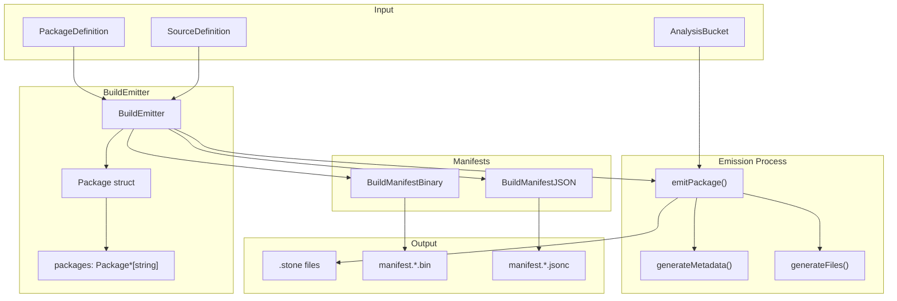
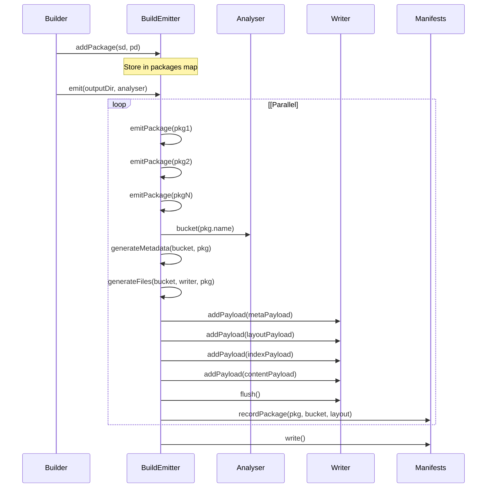
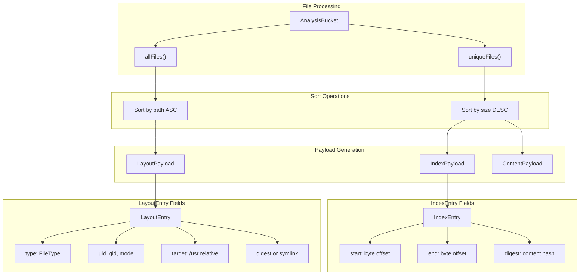

# Package Emission

Relevant source files

* [source/mason/build/emitter.d](../source/mason/build/emitter.d)
* [source/mason/build/manifest/binary\_manifest.d](../source/mason/build/manifest/binary_manifest.d)
* [source/mason/build/manifest/json\_manifest.d](../source/mason/build/manifest/json_manifest.d)
* [source/mason/build/manifest/package.d](../source/mason/build/manifest/package.d)
* [source/mason/build/package.d](../source/mason/build/package.d)
* [source/mason/build/stage.d](../source/mason/build/stage.d)
* [source/mason/build/util.d](../source/mason/build/util.d)

Package emission is the final phase of mason's build process where analyzed build results are packaged into `.stone` binary packages and accompanying manifests. The `BuildEmitter` class orchestrates this process, generating moss binary packages with multiple payloads (metadata, layout, index, content) and producing both binary and JSON manifests for build verification and dependency tracking.

For information about the analysis phase that precedes emission, see [File Analysis System](3.3-file-analysis-system). For information about the builder orchestration that invokes the emitter, see [Builder and Build Profiles](3.2-builder-and-build-profiles).

## BuildEmitter Architecture

The `BuildEmitter` class serves as the primary interface for package creation, managing the transformation of analyzed files into `.stone` packages. It maintains a collection of packages to emit and coordinates parallel package generation with manifest recording.



Sources: [source/mason/build/emitter.d33-82](../source/mason/build/emitter.d#L33-L82)

### Package Structure

Each package to be emitted is represented by the `Package` struct, which combines source and package definitions with build metadata. The filename is generated deterministically from the package name, version, release numbers, and architecture.

| Field | Type | Description |
| --- | --- | --- |
| `pd` | `PackageDefinition` | Package-specific metadata (name, summary, dependencies) |
| `source` | `SourceDefinition` | Source-level metadata (version, homepage, license) |
| `buildRelease` | `uint64_t` | Build iteration number (defaults to 1) |

The filename format follows the pattern: `{name}-{version}-{release}-{buildRelease}-{arch}.stone`

Sources: [source/mason/build/manifest/package.d32-52](../source/mason/build/manifest/package.d#L32-L52)

## Package Emission Flow

The emission process operates in two phases: parallel package generation and sequential manifest writing. Packages are emitted in parallel for performance, while manifests are written serially to maintain consistency.



Sources: [source/mason/build/emitter.d69-129](../source/mason/build/emitter.d#L69-L129)

### Empty Package Filtering

The emitter skips packages that have no files in their analysis bucket, preventing the creation of empty `.stone` packages. This occurs when package patterns match no installed files.

Sources: [source/mason/build/emitter.d94-104](../source/mason/build/emitter.d#L94-L104)

## Payload Generation

Each `.stone` package contains multiple payloads that describe the package metadata and file contents. The `moss.format.binary` library defines these payload types.

### Metadata Payload

The metadata payload contains package-level information extracted from definitions and analysis results. The `generateMetadata()` function constructs a `MetaPayload` with standardized record types.

```mermaid
flowchart TD

PKG["Package struct"]
BUCKET["AnalysisBucket"]
SD["SourceDefinition"]
PD["PackageDefinition"]
MP["MetaPayload"]
BASIC["Basic Records"]
PROV["Provider Records"]
DEPS["Dependency Records"]
CONF["Conflict Records"]
R1["Name, Version, Release"]
R2["Summary, Description"]
R3["Homepage, SourceID"]
R4["Architecture, License"]
P1["bucket.providers()"]
D1["pkg.runtimeDependencies"]
D2["bucket.dependencies()"]
C1["pkg.conflicts"]

PKG --> MP
BUCKET --> MP
MP --> BASIC
MP --> PROV
MP --> DEPS
MP --> CONF
BASIC --> R1
BASIC --> R2
BASIC --> R3
BASIC --> R4
PROV --> P1
DEPS --> D1
DEPS --> D2
CONF --> C1

subgraph subGraph2 ["Record Types"]
    BASIC
    PROV
    DEPS
    CONF
end

subgraph generateMetadata() ["generateMetadata()"]
    MP
end

subgraph subGraph0 ["Input Sources"]
    PKG
    BUCKET
    SD
    PD
end
```

Sources: [source/mason/build/manifest/package.d56-123](../source/mason/build/manifest/package.d#L56-L123)

**Metadata Record Types:**

| Record Tag | Record Type | Source |
| --- | --- | --- |
| `Name` | String | `PackageDefinition.name` |
| `Version` | String | `SourceDefinition.versionIdentifier` |
| `Release` | Uint64 | `SourceDefinition.release` |
| `BuildRelease` | Uint64 | `Package.buildRelease` |
| `Summary` | String | `PackageDefinition.summary` |
| `Description` | String | `PackageDefinition.description` |
| `Homepage` | String | `SourceDefinition.homepage` |
| `SourceID` | String | `SourceDefinition.name` |
| `Architecture` | String | Platform architecture name |
| `License` | String (multiple) | `SourceDefinition.license` (unique, sorted) |
| `Provides` | Provider (multiple) | `AnalysisBucket.providers()` |
| `Depends` | Dependency (multiple) | Merged from runtime deps and discovered deps |
| `Conflicts` | Provider (multiple) | `PackageDefinition.conflicts` |

Sources: [source/mason/build/manifest/package.d60-122](../source/mason/build/manifest/package.d#L60-L122)

### File Payloads

File data is distributed across three payloads for efficient storage and access:

1. **LayoutPayload**: File system structure (paths, permissions, types)
2. **IndexPayload**: Content addressing (digest → byte range mapping)
3. **ContentPayload**: Actual file data (compressed and deduplicated)



Sources: [source/mason/build/emitter.d134-213](../source/mason/build/emitter.d#L134-L213)

### File Deduplication Strategy

The emitter distinguishes between all files (for layout) and unique files (for content):

* **All Files**: Every file in the package, including duplicates (same digest), sorted by path for compression efficiency
* **Unique Files**: Files with distinct content digests, sorted by size (descending) to optimize compression

This separation allows multiple layout entries to reference the same content via digest, avoiding redundant storage.

Sources: [source/mason/build/emitter.d151-156](../source/mason/build/emitter.d#L151-L156)

### Path Normalization

All file paths in `.stone` packages are stored relative to `/usr/`. The emitter strips the `/usr/` prefix from install root paths during layout generation.

```
// Input:  /usr/bin/example
// Stored: bin/example
string fsTarget = file.path[5 .. $];
```

Sources: [source/mason/build/emitter.d171](../source/mason/build/emitter.d#L171-L171)

## Manifest Generation

Mason produces two manifest formats for different consumption patterns: binary for machine processing and JSON for human inspection.

### Manifest System Architecture

Sources: [source/mason/build/manifest/package.d134-159](../source/mason/build/manifest/package.d#L134-L159) [source/mason/build/manifest/binary\_manifest.d32-89](../source/mason/build/manifest/binary_manifest.d#L32-L89) [source/mason/build/manifest/json\_manifest.d33-102](../source/mason/build/manifest/json_manifest.d#L33-L102)

### Binary Manifest Format

The binary manifest uses the same moss binary format as `.stone` packages, containing `MetaPayload` instances for each emitted package. This format is consumed by boulder for build verification and indexing.

**Binary Manifest Structure:**

| Component | Description |
| --- | --- |
| File Type | `MossFileType.BuildManifest` |
| Compression | Zstd |
| Payloads | One `MetaPayload` per package |
| Metadata | Same as package metadata plus `BuildDepends` records |

The binary manifest includes build dependencies that are not part of the package metadata:

```
auto buildDeps = buildContext.spec.rootBuild.buildDependencies
    ~ buildContext.spec.rootBuild.checkDependencies;
```

Sources: [source/mason/build/manifest/binary\_manifest.d47-83](../source/mason/build/manifest/binary_manifest.d#L47-L83)

### JSON Manifest Format

The JSON manifest provides human-readable build results with a fixed schema. It includes top-level build information and per-package details.

**JSON Manifest Schema:**

```
{
    "manifest-version": "0.2",
    "source-name": "package-name",
    "source-release": "1",
    "source-version": "1.0.0",
    "packages": {
        "package-name": {
            "name": "package-name",
            "files": ["/usr/bin/example"],
            "provides": ["binary(example)"],
            "depends": ["soname(libc.so.6(x86_64))"],
            "build-depends": ["pkgconfig(zlib)"]
        }
    }
}
```

Sources: [source/mason/build/manifest/json\_manifest.d42-96](../source/mason/build/manifest/json_manifest.d#L42-L96)

**Note:** The JSON manifest includes a comment indicating it is not consumed by boulder, serving purely as documentation.

Sources: [source/mason/build/manifest/json\_manifest.d65](../source/mason/build/manifest/json_manifest.d#L65-L65)

## Integration Points

### BuildContext Integration

The emitter accesses global build context through the `buildContext` singleton to retrieve:

* Output directory path for package and manifest placement
* Build specification for dependency information
* Architecture information for filename generation

Sources: [source/mason/build/manifest/json\_manifest.d49-51](../source/mason/build/manifest/json_manifest.d#L49-L51) [source/mason/build/manifest/binary\_manifest.d51-52](../source/mason/build/manifest/binary_manifest.d#L51-L52)

### moss.format.binary Integration

The emitter extensively uses the `moss.format.binary` library for:

* **Writer**: Binary package file creation with compression
* **Payload Types**: MetaPayload, LayoutPayload, IndexPayload, ContentPayload
* **Archive Format**: Standard moss package structure

Sources: [source/mason/build/emitter.d22-24](../source/mason/build/emitter.d#L22-L24)

### Analyser Integration

The emitter receives an `Analyser` instance containing:

* **AnalysisBucket**: Per-package file collections with discovered providers and dependencies
* **FileInfo**: Individual file metadata including digests, stats, and types

The emitter queries analysis buckets by package name to retrieve files for emission.

Sources: [source/mason/build/emitter.d69](../source/mason/build/emitter.d#L69-L69) [source/mason/build/emitter.d95-98](../source/mason/build/emitter.d#L95-L98)

## Debug Package Handling

Debug information packages (with `-dbginfo` suffix) are emitted as normal packages but excluded from manifest recording to avoid cluttering build reports.

Sources: [source/mason/build/emitter.d220-223](../source/mason/build/emitter.d#L220-L223)

## Performance Considerations

### Parallel Package Emission

The `emit()` method uses `std.parallelism.parallel` to emit multiple packages concurrently, significantly improving build times for recipes that produce many subpackages.

```
foreach (p; packages.values.parallel)
{
    emitPackage(outputDirectory, p, analyser);
}
```

Sources: [source/mason/build/emitter.d74-77](../source/mason/build/emitter.d#L74-L77)

### File Sorting Strategy

Files are sorted differently based on their role:

* **Unique files** (content/index): Sorted by size descending for better compression ratios
* **All files** (layout): Sorted by path ascending for data locality during decompression

Sources: [source/mason/build/emitter.d155-156](../source/mason/build/emitter.d#L155-L156)

### Compression

Both `.stone` packages and binary manifests use Zstd compression by default for optimal balance between compression ratio and speed.

Sources: [source/mason/build/manifest/binary\_manifest.d72](../source/mason/build/manifest/binary_manifest.d#L72-L72)