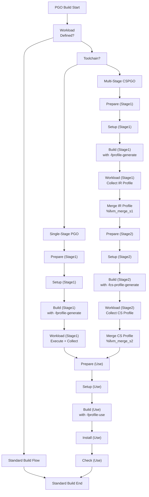
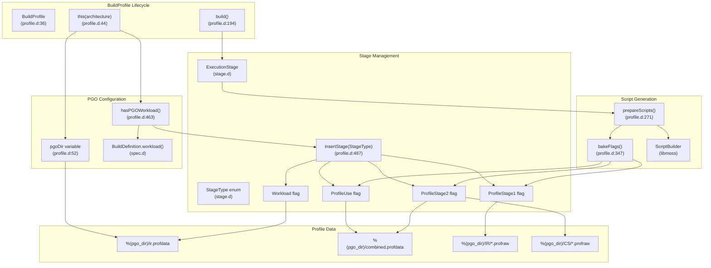
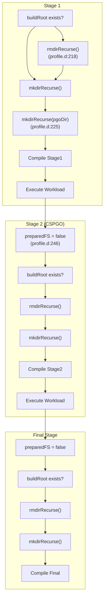
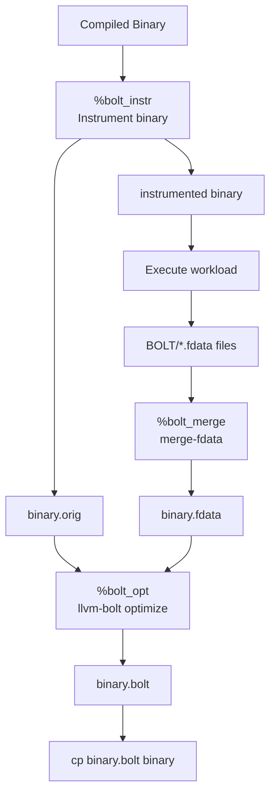

# Profile-Guided Optimization

Relevant source files

* [data/macros/actions/autotools.yml](../data/macros/actions/autotools.yml)
* [data/macros/actions/cmake.yml](../data/macros/actions/cmake.yml)
* [data/macros/actions/meson.yml](../data/macros/actions/meson.yml)
* [data/macros/actions/misc.yml](../data/macros/actions/misc.yml)
* [data/macros/actions/pgo.yml](../data/macros/actions/pgo.yml)
* [data/macros/arch/base.yml](../data/macros/arch/base.yml)
* [source/mason/build/profile.d](../source/mason/build/profile.d)

## Purpose and Scope

This document describes boulder's Profile-Guided Optimization (PGO) system, which enables building optimized binaries using runtime profiling data collected from representative workloads. The system supports both single-stage and multi-stage Context-Sensitive PGO (CSPGO) builds, as well as BOLT post-link optimization.

For information about build profiles and architecture-specific configurations, see [Build Profiles and Repository Configuration](5.5-build-profiles-and-repository-configuration). For general build flag management and tuning groups, see [Tuning Groups and Compiler Flags](5.3-tuning-groups-and-compiler-flags).

---

## Overview

Profile-Guided Optimization is an advanced compiler technique where a program is first built with instrumentation, executed with a representative workload to collect profiling data, then rebuilt using that profile data to generate more optimized code. Boulder automates this multi-stage process through the `workload` build stage.

The PGO system operates at the mason build level and supports two toolchains with different capabilities:

| Toolchain | Single-Stage PGO | Multi-Stage CSPGO | BOLT |
| --- | --- | --- | --- |
| LLVM | ✓ | ✓ | ✓ |
| GNU | ✓ | ✗ | ✗ |

Sources: [data/macros/actions/pgo.yml1-125](../data/macros/actions/pgo.yml#L1-L125) [source/mason/build/profile.d51-106](../source/mason/build/profile.d#L51-L106)

---

## PGO Build Flow

When a `workload` stage is defined in a stone.yml recipe, mason automatically constructs a multi-stage build pipeline instead of the standard single-pass build.

### Stage Sequence



**Build Flow with PGO Stages**: This diagram shows how mason constructs different stage sequences based on workload presence and toolchain configuration. The LLVM toolchain with `cspgo: true` enables a two-stage profiling approach for better optimization.

Sources: [source/mason/build/profile.d54-105](../source/mason/build/profile.d#L54-L105) [data/macros/actions/pgo.yml1-14](../data/macros/actions/pgo.yml#L1-L14)

---

## Code Entities and Stage Types

The PGO system is implemented through several key components in mason's build system:



**PGO Implementation Architecture**: This diagram maps the key code entities involved in PGO builds. The `BuildProfile` constructor determines whether PGO stages are needed by checking for a workload definition, then constructs the appropriate stage sequence with profiling flags enabled at each stage.

Sources: [source/mason/build/profile.d36-106](../source/mason/build/profile.d#L36-L106) [source/mason/build/profile.d271-339](../source/mason/build/profile.d#L271-L339) [source/mason/build/profile.d347-430](../source/mason/build/profile.d#L347-L430) [source/mason/build/profile.d463-478](../source/mason/build/profile.d#L463-L478)

---

## Single-Stage PGO

Single-stage PGO performs one instrumented build, executes the workload, then rebuilds with the collected profile.

### Configuration

Single-stage PGO is used when:

* The toolchain is GNU, OR
* The toolchain is LLVM and `cspgo` is not enabled in the stone.yml spec

### Compiler Flags

#### Stage 1: Profile Generation (LLVM)

```
# Applied during ProfileStage1
c:   -fprofile-generate=%(pgo_dir)/IR
cxx: -fprofile-generate=%(pgo_dir)/IR
ld:  -fprofile-generate=%(pgo_dir)/IR
```
#### Stage 1: Profile Generation (GNU)

```
# Applied during ProfileStage1
c:   -fprofile-generate -fprofile-dir=%(pgo_dir)
cxx: -fprofile-generate -fprofile-dir=%(pgo_dir)
ld:  -fprofile-generate -fprofile-dir=%(pgo_dir)
```

#### Profile Use Stage (LLVM)

```
# Applied during ProfileUse
c:   -fprofile-use=%(pgo_dir)/combined.profdata
cxx: -fprofile-use=%(pgo_dir)/combined.profdata
ld:  -fprofile-use=%(pgo_dir)/combined.profdata
```

#### Profile Use Stage (GNU)

```
# Applied during ProfileUse
c:   -fprofile-use -fprofile-dir=%(pgo_dir) -fprofile-correction
cxx: -fprofile-use -fprofile-dir=%(pgo_dir) -fprofile-correction
ld:  -fprofile-use -fprofile-dir=%(pgo_dir) -fprofile-correction
```

Sources: [data/macros/actions/pgo.yml97-124](../data/macros/actions/pgo.yml#L97-L124) [source/mason/build/profile.d389-407](../source/mason/build/profile.d#L389-L407)

---

## Multi-Stage CSPGO (Context-Sensitive PGO)

Context-Sensitive PGO is an advanced two-stage profiling technique available only with the LLVM toolchain. It refines IR-level profiles with context-sensitive information for improved optimization.

### Configuration

Multi-stage CSPGO is enabled when:

* `toolchain: llvm` in the stone.yml spec, AND
* `cspgo: true` in the stone.yml spec

### Stage Breakdown

| Stage | Purpose | Flags | Output |
| --- | --- | --- | --- |
| ProfileStage1 | Generate IR profile | `-fprofile-generate=%(pgo_dir)/IR` | `%(pgo_dir)/IR/default*.profraw` |
| Workload (S1) | Execute and merge | `%llvm_merge_s1` | `%(pgo_dir)/ir.profdata` + `combined.profdata` |
| ProfileStage2 | Generate CS profile | `-fprofile-use=%(pgo_dir)/ir.profdata` `-fcs-profile-generate=%(pgo_dir)/CS` | `%(pgo_dir)/CS/default*.profraw` |
| Workload (S2) | Execute and merge | `%llvm_merge_s2` | `%(pgo_dir)/combined.profdata` (updated) |
| ProfileUse | Final optimized build | `-fprofile-use=%(pgo_dir)/combined.profdata` | Optimized binary |

### Profile Merging

After each workload stage, raw profile data must be merged:

```
# After Stage 1 Workload (%llvm_merge_s1)
llvm-profdata merge --failure-mode=all \
    -output=%(pgo_dir)/ir.profdata \
    %(pgo_dir)/IR/default*.profraw
cp %(pgo_dir)/ir.profdata %(pgo_dir)/combined.profdata

# After Stage 2 Workload (%llvm_merge_s2)
rm %(pgo_dir)/combined.profdata
llvm-profdata merge --failure-mode=all \
    -output=%(pgo_dir)/combined.profdata \
    %(pgo_dir)/ir.profdata \
    %(pgo_dir)/CS/default*.profraw
```

The `%llvm_merge_s1` and `%llvm_merge_s2` macros are automatically appended to workload scripts when using LLVM toolchain.

Sources: [data/macros/actions/pgo.yml4-13](../data/macros/actions/pgo.yml#L4-L13) [source/mason/build/profile.d56-80](../source/mason/build/profile.d#L56-L80) [source/mason/build/profile.d524-539](../source/mason/build/profile.d#L524-L539)

---

## Build Directory Management

PGO builds require special handling of the build directory to ensure clean state between profiling stages:



**Build Directory Lifecycle**: The build root is recreated before each profiling stage to ensure a clean compilation environment. The `pgoDir` persists across stages to accumulate profile data.

The key implementation is in the `build()` method:

* After each `Workload` stage, `preparedFS` is reset to `false` [source/mason/build/profile.d244-247](../source/mason/build/profile.d#L244-L247)
* This triggers directory cleanup before the next `Prepare` stage [source/mason/build/profile.d213-229](../source/mason/build/profile.d#L213-L229)
* The `pgoDir` is only created once during Stage 1 [source/mason/build/profile.d223-226](../source/mason/build/profile.d#L223-L226)

Sources: [source/mason/build/profile.d194-250](../source/mason/build/profile.d#L194-L250)

---

## Defining PGO Workloads

To enable PGO builds, a `workload` section must be defined in the stone.yml recipe:

```
build:
    - setup: |
        %configure
    - build: |
        %make
    - install: |
        %make_install
    - workload: |
        # Execute representative workload
        ./myprogram --benchmark
        ./myprogram --test-suite
```

The workload should:

1. Execute the program with representative inputs
2. Cover hot code paths that benefit from optimization
3. Complete in reasonable time (typically seconds to minutes)

### Workload Detection

The `hasPGOWorkload()` method determines whether PGO stages should be constructed:

```
bool hasPGOWorkload() @safe
{
    BuildDefinition buildDef = buildContext.spec.rootBuild;
    if (architecture in buildContext.spec.profileBuilds)
    {
        buildDef = buildContext.spec.profileBuilds[architecture];
    }
    else if (architecture.startsWith("emul32/") &&
             "emul32" in buildContext.spec.profileBuilds)
    {
        buildDef = buildContext.spec.profileBuilds["emul32"];
    }

    return buildDef.workload() != null;
}
```

This checks the root build definition and architecture-specific overrides for a workload definition.

Sources: [source/mason/build/profile.d463-478](../source/mason/build/profile.d#L463-L478) [source/mason/build/profile.d61-62](../source/mason/build/profile.d#L61-L62)

---

## Sample PGO Option

When the workload does not comprehensively cover all code paths, the `samplepgo` option can be enabled to inform the compiler that the profile data is incomplete:

```
options:
    toolchain: llvm
    samplepgo: true
    cspgo: true
```

This enables additional flags during the ProfileUse stage:

| Toolchain | Flag |
| --- | --- |
| LLVM | `-fno-profile-sample-accurate` |
| GNU | `-fprofile-partial-training` |

These flags prevent the compiler from aggressively optimizing or de-optimizing unprofiled code paths.

Flag application logic:

```
if (hasPGOWorkload)
{
    // ... stage-specific flags ...
    else if ((stage.type & StageType.ProfileUse) == StageType.ProfileUse)
    {
        sbuilder.enableGroup("pgouse");
        if (buildContext.spec.options.samplepgo == true)
        {
            sbuilder.enableGroup("pgosample");
        }
    }
}
```

Sources: [source/mason/build/profile.d399-406](../source/mason/build/profile.d#L399-L406) [data/macros/actions/pgo.yml86-95](../data/macros/actions/pgo.yml#L86-L95)

---

## BOLT Post-Link Optimization

BOLT (Binary Optimization and Layout Tool) is a post-link optimizer that can further improve performance by reordering code based on runtime profiles. It is only available with LLVM toolchain.

### BOLT Workflow



**BOLT Optimization Flow**: BOLT performs binary-level optimization by instrumenting the compiled binary, collecting runtime data, and applying layout optimizations.

### BOLT Macros

#### Instrumentation

```
%bolt_instr <binary> [options]
```

Creates `<binary>.orig` and generates an instrumented version. Example:

```
workload: |
    %bolt_instr %(installroot)%(bindir)/myapp
    %(installroot)%(bindir)/myapp --run-tests
```

#### Profile Merging

```
%bolt_merge <binary>
```

Merges all `.fdata` files for the binary into a single profile.

#### Optimization

```
%bolt_opt <binary> [options]
```

Applies BOLT optimizations using the collected profile data. Default flags include:

* `-reorder-blocks=cache+`
* `-reorder-functions=hfsort+`
* `-split-functions=3`
* `-split-all-cold`
* `-split-eh`
* `-icf=1`

### Alternative: Performance Counters

BOLT can also use `perf` data instead of instrumentation:

```
%bolt_perf <command> [args]
%bolt_perf2bolt <binary>
%bolt_opt <binary>
```

This approach collects hardware performance counter data, avoiding instrumentation overhead but requiring appropriate kernel capabilities.

Sources: [data/macros/actions/pgo.yml15-63](../data/macros/actions/pgo.yml#L15-L63)

---

## PGO Directory Structure

During PGO builds, profile data is stored in a dedicated directory alongside the build root:

```
%(rootDir)/
├── build/
│   └── x86_64/              # buildRoot
│       └── (source files)
├── build/x86_64-pgo/         # pgoDir
│   ├── IR/                   # Stage 1 raw profiles (LLVM)
│   │   └── default*.profraw
│   ├── CS/                   # Stage 2 raw profiles (LLVM CSPGO)
│   │   └── default*.profraw
│   ├── BOLT/                 # BOLT instrumentation data
│   │   └── binary.fdata
│   ├── ir.profdata           # Merged IR profile
│   ├── combined.profdata     # Final combined profile
│   └── *.gcda                # GNU profile data
└── install/
    └── (installed files)
```

The `pgoDir` is defined as:

```
pgoDir = buildRoot ~ "-pgo";  // e.g., "build/x86_64-pgo"
```

And made available to build scripts via the `%(pgo_dir)` variable.

Sources: [source/mason/build/profile.d52](../source/mason/build/profile.d#L52-L52) [source/mason/build/profile.d330](../source/mason/build/profile.d#L330-L330) [data/macros/arch/base.yml330](../data/macros/arch/base.yml#L330-L330)

---

## Flag Enablement Implementation

The `bakeFlags()` method in `BuildProfile` applies PGO-specific compiler flags based on the current stage type:

```
void bakeFlags(ExecutionStage* stage, ref ScriptBuilder sbuilder) @safe
{
    // ... other flag setup ...

    /* Enable PGO flags at correct stages of build */
    if (hasPGOWorkload)
    {
        if ((stage.type & StageType.ProfileStage1) == StageType.ProfileStage1)
        {
            sbuilder.enableGroup("pgostage1");
        }
        else if ((stage.type & StageType.ProfileStage2) == StageType.ProfileStage2)
        {
            sbuilder.enableGroup("pgostage2");
        }
        else if ((stage.type & StageType.ProfileUse) == StageType.ProfileUse)
        {
            sbuilder.enableGroup("pgouse");
            if (buildContext.spec.options.samplepgo == true)
            {
                sbuilder.enableGroup("pgosample");
            }
        }
    }

    // ... flag stringification ...
}
```

The tuning groups (`pgostage1`, `pgostage2`, `pgouse`, `pgosample`) are defined in [data/macros/actions/pgo.yml64-81](../data/macros/actions/pgo.yml#L64-L81) and reference the corresponding flag definitions in [data/macros/actions/pgo.yml83-124](../data/macros/actions/pgo.yml#L83-L124)

The `ScriptBuilder.enableGroup()` method activates these tuning groups, which then includes their associated flags in the `CFLAGS`, `CXXFLAGS`, and `LDFLAGS` environment variables exported by the `scriptBase` template.

Sources: [source/mason/build/profile.d347-430](../source/mason/build/profile.d#L347-L430) [data/macros/actions/pgo.yml64-124](../data/macros/actions/pgo.yml#L64-L124) [data/macros/arch/base.yml54-89](../data/macros/arch/base.yml#L54-L89)

---

## Integration with Stone.yml

PGO configuration is specified in the stone.yml recipe's `options` section:

```
name: mypackage
version: 1.0.0

options:
    # Use LLVM toolchain for CSPGO support
    toolchain: llvm

    # Enable multi-stage context-sensitive PGO
    cspgo: true

    # Optional: indicate incomplete workload coverage
    samplepgo: false

build:
    - setup: |
        %meson
    - build: |
        %meson_build
    - install: |
        %meson_install
    - workload: |
        # Execute the program with representative workload
        %(installroot)%(bindir)/mypackage --benchmark
```

The `BuildContext` singleton parses these options and makes them available via `buildContext.spec.options`.

Sources: [source/mason/build/profile.d56-58](../source/mason/build/profile.d#L56-L58) [source/mason/build/profile.d402](../source/mason/build/profile.d#L402-L402)