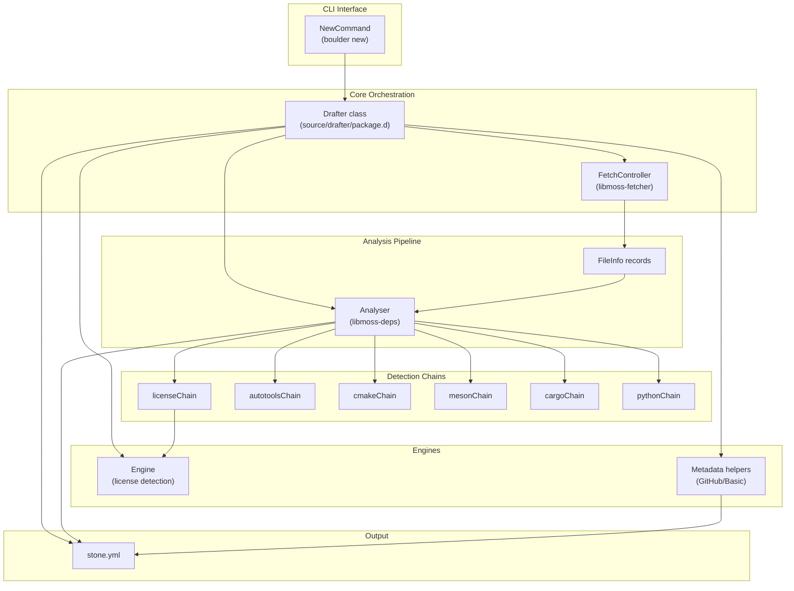
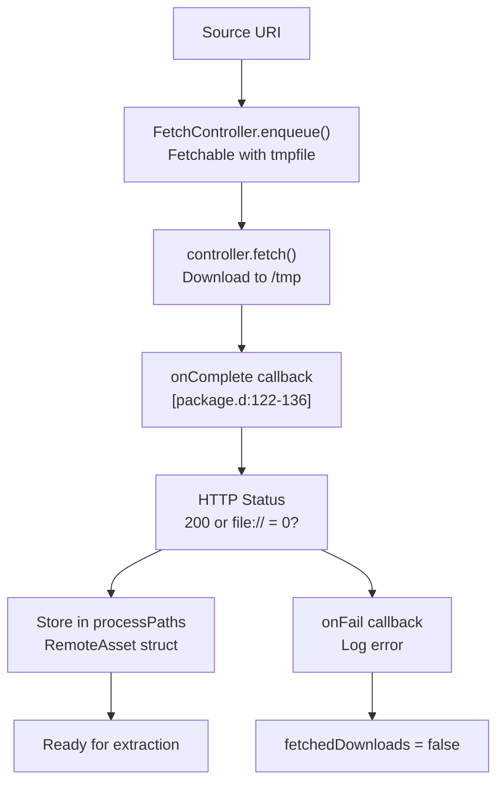
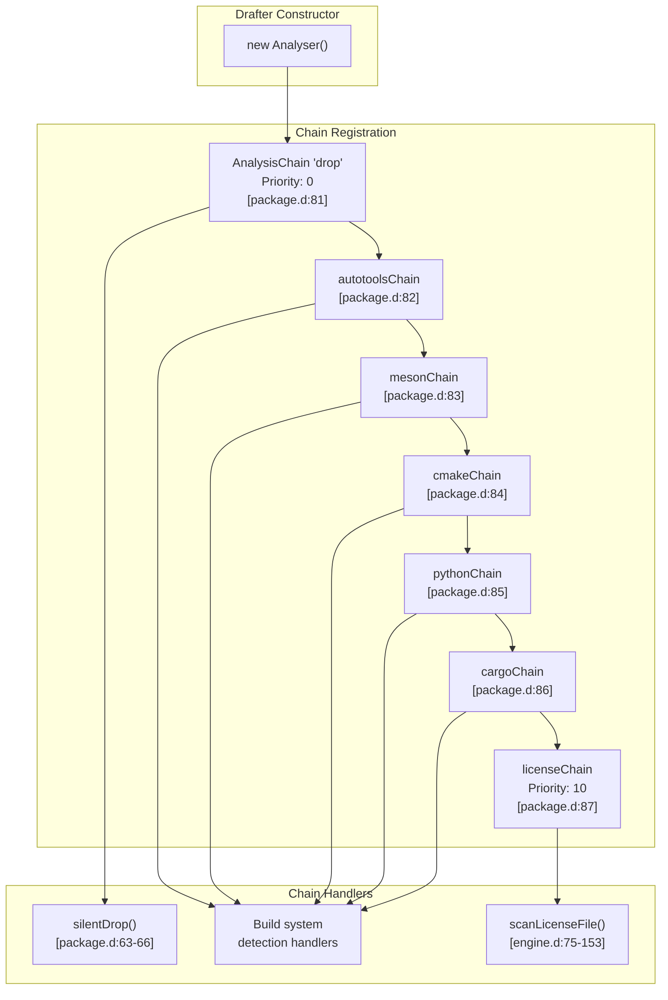
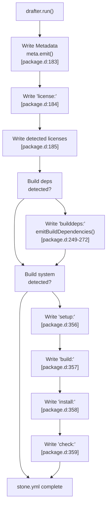

# Drafter: Recipe Generator

Relevant source files

* [.github/workflows/d.yml](../.github/workflows/d.yml)
* [source/boulder/cli/build\_command.d](../source/boulder/cli/build_command.d)
* [source/boulder/cli/new\_command.d](../source/boulder/cli/new_command.d)
* [source/boulder/cli/version\_command.d](../source/boulder/cli/version_command.d)
* [source/drafter/license/engine.d](../source/drafter/license/engine.d)
* [source/drafter/package.d](../source/drafter/package.d)

Drafter is a tool that automates the creation of skeletal `stone.yml` recipe files from upstream source URIs. It downloads source archives, analyzes their contents to detect build systems and licenses, extracts metadata from URIs (particularly GitHub repositories), and generates a complete initial recipe that includes upstreams, licenses, build dependencies, and build commands. This automation significantly reduces the manual effort required to package software for Serpent OS.

Drafter is invoked through the `boulder new` command and integrates metadata extraction, license detection, and build system detection to produce recipes that are often immediately usable or require minimal manual adjustment.

For details on how build systems are identified and configured, see [Build System Detection](4.3-build-system-detection). For license analysis specifics, see [License Detection Engine](4.2-license-detection-engine). For metadata extraction from URIs, see [Metadata Extraction](4.1-metadata-extraction).

## Architecture Overview

The Drafter system consists of several coordinated components that work together to transform a source URI into a complete recipe file.

**Drafter System Components**



Sources: [source/drafter/package.d1-376](../source/drafter/package.d#L1-L376) [source/boulder/cli/new\_command.d1-81](../source/boulder/cli/new_command.d#L1-L81) [source/drafter/license/engine.d1-301](../source/drafter/license/engine.d#L1-L301)

The `Drafter` class ([source/drafter/package.d71-375](../source/drafter/package.d#L71-L375)) orchestrates the entire recipe generation process. It uses `FetchController` from libmoss-fetcher to download sources, `Analyser` from libmoss-deps to scan extracted files, and various analysis chains to detect build systems and licenses. The `Engine` class ([source/drafter/license/engine.d189-300](../source/drafter/license/engine.d#L189-L300)) performs license identification using Levenshtein distance matching.

## Drafter Lifecycle

The recipe generation process follows a well-defined sequence of operations.

**Drafter Execution Flow**

```mermaid
flowchart TD

Start["boulder new URI"]
Construct["NewCommand.run()<br>[new_command.d:44-75]"]
Create["new Drafter(outputPath)<br>[package.d:76-99]"]
AddSource["drafter.addSource(uri)<br>[package.d:208-213]"]
Run["drafter.run()<br>[package.d:141-189]"]
Download["Download Sources<br>FetchController.fetch()"]
Validate["Validate Downloads<br>onComplete callbacks<br>[package.d:122-136]"]
Extract["Extract Archives<br>exploreAssets()<br>[package.d:274-322]"]
ComputeHash["Compute SHA256 hashes<br>[package.d:295]"]
UpdateMeta["Update Metadata.upstreams<br>[package.d:296-301]"]
Scan["Scan Source Trees<br>analyser.addFile()<br>[package.d:319]"]
Process["Process Analysis Chains<br>analyser.process()<br>[package.d:181]"]
EmitMeta["Emit Metadata<br>meta.emit()<br>[package.d:183]"]
EmitLicenses["Emit Licenses<br>[package.d:184-185]"]
EmitDeps["emitBuildDependencies()<br>[package.d:249-272]"]
EmitBuild["emitBuild()<br>[package.d:327-360]"]
Output["stone.yml written"]
End["ExitStatus.Success"]

Start --> Construct
Construct --> Create
Create --> AddSource
AddSource --> Run
Run --> Download
Download --> Validate
Validate --> Extract
Extract --> ComputeHash
ComputeHash --> UpdateMeta
UpdateMeta --> Scan
Scan --> Process
Process --> EmitMeta
EmitMeta --> EmitLicenses
EmitLicenses --> EmitDeps
EmitDeps --> EmitBuild
EmitBuild --> Output
Output --> End
```



Sources: [source/drafter/package.d141-189](../source/drafter/package.d#L141-L189) [source/boulder/cli/new\_command.d44-75](../source/boulder/cli/new_command.d#L44-L75)

The `run()` method ([source/drafter/package.d141-189](../source/drafter/package.d#L141-L189)) coordinates the entire process:

1. **Download Phase**: Sources are enqueued with `addSource()` ([source/drafter/package.d208-213](../source/drafter/package.d#L208-L213)) and downloaded via `FetchController`. The `onComplete()` callback ([source/drafter/package.d122-136](../source/drafter/package.d#L122-L136)) validates downloads and stores them in `processPaths`.
2. **Extraction Phase**: `exploreAssets()` ([source/drafter/package.d274-322](../source/drafter/package.d#L274-L322)) extracts archives using `tar`, computes SHA256 hashes, creates `UpstreamDefinition` records, and adds all files to the analyser.
3. **Analysis Phase**: `analyser.process()` runs all registered analysis chains (license, build system detection) on the extracted files.
4. **Output Phase**: Recipe sections are emitted in sequence: metadata, licenses, build dependencies, and build commands.

## Integration with Boulder CLI

Drafter is invoked through the `boulder new` command, which provides a simple interface for recipe generation.

**Command Usage**

| Component | Description |
| --- | --- |
| Command | `boulder new [URI]` |
| Implementation | `NewCommand` struct in [source/boulder/cli/new\_command.d35-80](../source/boulder/cli/new_command.d#L35-L80) |
| Default Output | `stone.yml` in current directory |
| Output Option | `-o, --output` flag to specify alternative path |

Sources: [source/boulder/cli/new\_command.d32-80](../source/boulder/cli/new_command.d#L32-L80)

The `NewCommand` struct ([source/boulder/cli/new\_command.d35-80](../source/boulder/cli/new_command.d#L35-L80)) handles CLI invocation:

```
boulder new https://example.com/package-1.2.3.tar.gz
boulder new -o mypackage.yml https://example.com/package-1.2.3.tar.gz
```

The command performs validation checks ([source/boulder/cli/new\_command.d55-59](../source/boulder/cli/new_command.d#L55-L59)):

* Ensures at least one URI argument is provided
* Refuses to overwrite existing recipe files
* Creates a `Drafter` instance with the specified output path
* Adds all URI arguments as plain sources

## Source Download and Management

Drafter uses libmoss-fetcher's `FetchController` to download and validate sources before extraction.

**Download and Validation Pipeline**



Sources: [source/drafter/package.d113-136](../source/drafter/package.d#L113-L136) [source/drafter/package.d208-213](../source/drafter/package.d#L208-L213)

The `RemoteAsset` struct ([source/drafter/package.d54-58](../source/drafter/package.d#L54-L58)) tracks downloaded files:

| Field | Type | Purpose |
| --- | --- | --- |
| `sourceURI` | `string` | Original upstream URI |
| `localPath` | `string` | Temporary file path on disk |

Downloads are validated in `onComplete()` ([source/drafter/package.d122-136](../source/drafter/package.d#L122-L136)):

* HTTP 200 status indicates successful download
* Status 0 for `file://` URIs indicates local file access
* Failed downloads trigger `onFail()` ([source/drafter/package.d113-117](../source/drafter/package.d#L113-L117)) and set `fetchedDownloads = false`
* Successful downloads are stored in `processPaths` array

All temporary files are cleaned up in the `scope(exit)` block ([source/drafter/package.d145-158](../source/drafter/package.d#L145-L158)).

## Analysis Chain System

The analysis chain architecture allows multiple specialized detectors to examine extracted source files concurrently.

**Analysis Chain Registration**



Sources: [source/drafter/package.d79-87](../source/drafter/package.d#L79-L87) [source/drafter/license/engine.d158-160](../source/drafter/license/engine.d#L158-L160)

Chains are registered in the `Drafter` constructor ([source/drafter/package.d76-99](../source/drafter/package.d#L76-L99)):

1. **Drop Chain** ([source/drafter/package.d81](../source/drafter/package.d#L81-L81)): Uses `silentDrop()` handler ([source/drafter/package.d63-66](../source/drafter/package.d#L63-L66)) to ignore uninteresting files with priority 0
2. **Build System Chains** ([source/drafter/package.d82-86](../source/drafter/package.d#L82-L86)): Detect autotools, meson, cmake, python, and cargo build systems (see [Build System Detection](4.3-build-system-detection))
3. **License Chain** ([source/drafter/package.d87](../source/drafter/package.d#L87-L87)): Scans for license files with priority 10 (see [License Detection Engine](4.2-license-detection-engine))

The `analyser.userdata` field ([source/drafter/package.d80](../source/drafter/package.d#L80-L80)) is set to the `Drafter` instance, allowing chain handlers to access drafter methods like `incrementBuildConfidence()` ([source/drafter/package.d194-203](../source/drafter/package.d#L194-L203)) and `insertLicense()` ([source/drafter/package.d215-221](../source/drafter/package.d#L215-L221)).

## Build Confidence Scoring

Drafter uses a confidence scoring system to determine which build system is most likely correct when multiple indicators are found.

**Confidence System**

| Method | Purpose |
| --- | --- |
| `incrementBuildConfidence()` | Called by build system detection chains to increment confidence for a `BuildType` |
| `confidence` map | `ulong[BuildType]` mapping build types to confidence scores |
| Selection Logic | Highest confidence score wins ([source/drafter/package.d341](../source/drafter/package.d#L341-L341)) |

Sources: [source/drafter/package.d194-203](../source/drafter/package.d#L194-L203) [source/drafter/package.d327-360](../source/drafter/package.d#L327-L360)

Each build system detection chain calls `incrementBuildConfidence()` ([source/drafter/package.d194-203](../source/drafter/package.d#L194-L203)) when it finds characteristic files. The `emitBuild()` method ([source/drafter/package.d327-360](../source/drafter/package.d#L327-L360)) selects the build system with the highest confidence:

1. Sort `BuildType` keys by confidence score descending ([source/drafter/package.d341](../source/drafter/package.d#L341-L341))
2. Select the highest scoring `BuildType`
3. Convert to build helper using `buildTypeToHelper()` ([source/drafter/package.d344](../source/drafter/package.d#L344-L344))
4. Emit setup, build, install, and check sections if non-null ([source/drafter/package.d346-359](../source/drafter/package.d#L346-L359))

## Recipe Generation and Output

The final stage assembles all detected information into a complete `stone.yml` recipe file.

**Recipe Output Structure**



Sources: [source/drafter/package.d183-189](../source/drafter/package.d#L183-L189) [source/drafter/package.d249-272](../source/drafter/package.d#L249-L272) [source/drafter/package.d327-360](../source/drafter/package.d#L327-L360)

The output file (`outputFile` field, [source/drafter/package.d96](../source/drafter/package.d#L96-L96)) is written sequentially:

**Metadata Section** ([source/drafter/package.d183](../source/drafter/package.d#L183-L183)): Generated by `Metadata.emit()`, includes:

* Package name, version, release
* Homepage, summary (if extracted)
* Upstream definitions with URIs and SHA256 hashes

**License Section** ([source/drafter/package.d184-185](../source/drafter/package.d#L184-L185)): Lists all detected SPDX license identifiers stored in the `_licenses` RedBlackTree ([source/drafter/package.d95](../source/drafter/package.d#L95-L95)).

**Build Dependencies Section** ([source/drafter/package.d249-272](../source/drafter/package.d#L249-L272)): The `emitBuildDependencies()` method:

* Merges dependencies from all `analyser.buckets`
* Converts to strings and sorts
* Emits deduplicated list under `builddeps:` key

**Build Commands Section** ([source/drafter/package.d327-360](../source/drafter/package.d#L327-L360)): The `emitBuild()` method:

* Selects highest-confidence build system
* Retrieves build helper (see [Build System Detection](4.3-build-system-detection))
* Emits `setup:`, `build:`, `install:`, and `check:` sections if defined

The destructor ([source/drafter/package.d101-108](../source/drafter/package.d#L101-L108)) closes the output file and deletes it if the run failed, ensuring partial recipes are not left on disk.

## Error Handling and Cleanup

Drafter implements robust cleanup to ensure temporary files are removed even when errors occur.

**Cleanup Strategy**

| Resource | Cleanup Mechanism | Location |
| --- | --- | --- |
| Downloaded files | `scope(exit)` removes `processPaths` | [source/drafter/package.d145-158](../source/drafter/package.d#L145-L158) |
| Extracted directories | `scope(exit)` removes `directories` | [source/drafter/package.d145-158](../source/drafter/package.d#L145-L158) |
| Partial output file | Destructor deletes on failure | [source/drafter/package.d101-108](../source/drafter/package.d#L101-L108) |

Sources: [source/drafter/package.d101-108](../source/drafter/package.d#L101-L108) [source/drafter/package.d145-158](../source/drafter/package.d#L145-L158)

The `scope(exit)` block in `run()` ([source/drafter/package.d145-158](../source/drafter/package.d#L145-L158)) ensures:

* All downloaded temporary files in `processPaths` are removed with `std.file.remove()`
* All extraction directories in `directories` are removed with `std.file.rmdirRecurse()`

The destructor ([source/drafter/package.d101-108](../source/drafter/package.d#L101-L108)) checks the `run_` status field:

* If `ExitStatus.Failure` and output file exists, it is deleted
* This prevents partial, invalid recipes from remaining on disk

Download failures are handled by setting `fetchedDownloads = false` ([source/drafter/package.d116](../source/drafter/package.d#L116-L116)) in the `onFail()` callback, which causes `run()` to exit early with failure status ([source/drafter/package.d165-170](../source/drafter/package.d#L165-L170)).