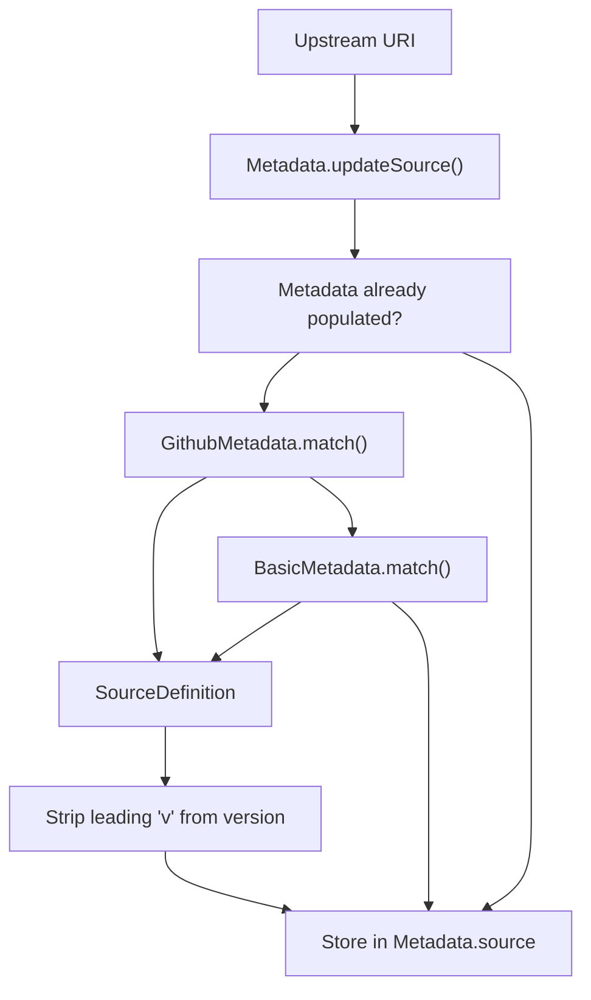
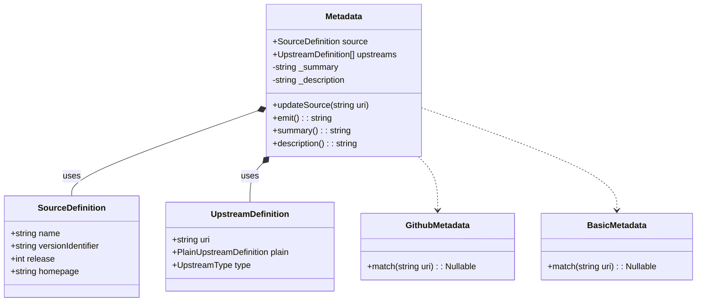
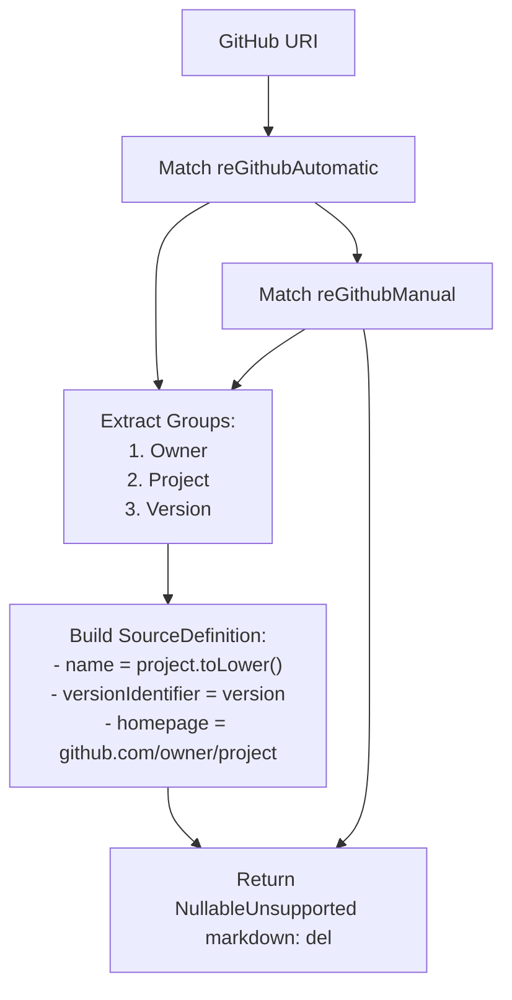
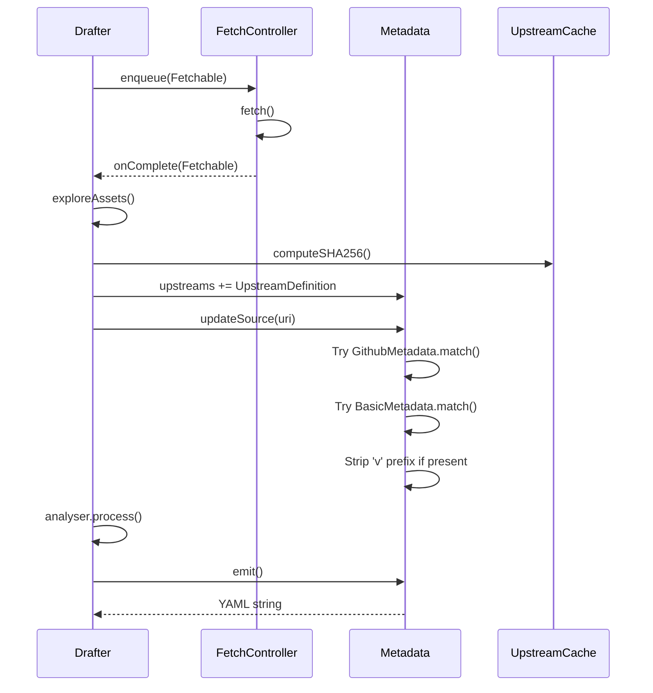

# Metadata Extraction

Relevant source files

* [source/drafter/build/autotools.d](../source/drafter/build/autotools.d)
* [source/drafter/build/cmake.d](../source/drafter/build/cmake.d)
* [source/drafter/license/engine.d](../source/drafter/license/engine.d)
* [source/drafter/license/package.d](../source/drafter/license/package.d)
* [source/drafter/metadata/basic.d](../source/drafter/metadata/basic.d)
* [source/drafter/metadata/github.d](../source/drafter/metadata/github.d)
* [source/drafter/metadata/package.d](../source/drafter/metadata/package.d)
* [source/drafter/package.d](../source/drafter/package.d)

## Purpose and Scope

This document describes how drafter automatically extracts package metadata (name, version, homepage) from upstream source URIs. This metadata extraction is the first step in generating a complete stone.yml recipe file, providing the foundational package information that maintainers would otherwise need to enter manually.

For information about license detection, see [License Detection Engine](4.2-license-detection-engine). For build system detection, see [Build System Detection](4.3-build-system-detection).

## Overview

The metadata extraction system uses a chain-of-responsibility pattern where specialized helpers attempt to parse URIs in priority order. Each helper implements pattern matching for specific URI formats (e.g., GitHub URLs) and extracts structured package information. This automated extraction reduces manual effort and ensures consistency in generated recipe files.



**Diagram: Metadata Helper Selection Flow**

Sources: [source/drafter/metadata/package.d59-90](../source/drafter/metadata/package.d#L59-L90)

## Metadata Structure

The `Metadata` struct serves as the central container for all extracted package information. It aggregates data from multiple sources and provides methods for updating and emitting this information into the final stone.yml recipe.

| Field | Type | Purpose |
| --- | --- | --- |
| `source` | `SourceDefinition` | Package name, version, release number, and homepage |
| `upstreams` | `UpstreamDefinition[]` | List of upstream sources with URIs and checksums |
| `_summary` | `string` | Package summary (placeholder initially) |
| `_description` | `string` | Package description (placeholder initially) |

**Key Methods:**

* **`updateSource(in string uri)`** - Attempts to populate `source` from the URI if not already set, iterating through metadata helpers [source/drafter/metadata/package.d60-90](../source/drafter/metadata/package.d#L60-L90)
* **`emit()`** - Generates the YAML-formatted metadata section for the stone.yml file [source/drafter/metadata/package.d95-105](../source/drafter/metadata/package.d#L95-L105)



**Diagram: Metadata Component Relationships**

Sources: [source/drafter/metadata/package.d36-111](../source/drafter/metadata/package.d#L36-L111) [source/drafter/metadata/github.d](../source/drafter/metadata/github.d) [source/drafter/metadata/basic.d](../source/drafter/metadata/basic.d)

## Helper Architecture

The metadata extraction system uses a prioritized list of helper types defined in [source/drafter/metadata/package.d30](../source/drafter/metadata/package.d#L30-L30):

```
static immutable metadataHelpers = ["Github", "Basic",];
```

Each helper must implement a `match()` method with the signature:

```
Nullable!(SourceDefinition, SourceDefinition.init) match(in string uri)
```

The system uses compile-time reflection (`static foreach`) to instantiate and invoke each helper sequentially. The first helper returning a non-null result wins, and the loop terminates. This design allows:

1. **Specificity ordering** - More specific patterns (GitHub) are tried before generic ones (Basic)
2. **Easy extensibility** - New helpers can be added by inserting them into the array
3. **Zero-cost abstraction** - The loop is unrolled at compile time

Sources: [source/drafter/metadata/package.d68-89](../source/drafter/metadata/package.d#L68-L89)

## GitHub Metadata Extraction

The `GithubMetadata` helper specializes in parsing GitHub URLs to extract project information. It recognizes two distinct GitHub URL patterns using regular expressions.

### URL Patterns

**Automatic Archive Pattern** (`reGithubAutomatic`):

```
https://github.com/{owner}/{project}/archive/refs/tags/{version}.{ext}
```

Regex: [source/drafter/metadata/github.d27-28](../source/drafter/metadata/github.d#L27-L28)

**Manual Release Pattern** (`reGithubManual`):

```
https://github.com/{owner}/{project}/releases/download/{version}/{filename}
```

Regex: [source/drafter/metadata/github.d43-44](../source/drafter/metadata/github.d#L43-L44)

### Extraction Process



**Diagram: GitHub Metadata Extraction Flow**

The helper uses capture groups to extract components [source/drafter/metadata/github.d33-38](../source/drafter/metadata/github.d#L33-L38):

* **Group 1**: Repository owner
* **Group 2**: Project name
* **Group 3**: Version/tag identifier

The resulting `SourceDefinition` uses the project name (lowercased) as the package name and constructs a canonical homepage URL.

Sources: [source/drafter/metadata/github.d49-78](../source/drafter/metadata/github.d#L49-L78)

## Basic/Fallback Metadata Extraction

When GitHub-specific patterns don't match, the `BasicMetadata` helper provides a fallback strategy that works with standard archive naming conventions.

### Archive Pattern

The basic helper matches filenames following this pattern:

```
{name}-{version}.{extension}
```

Regex: [source/drafter/metadata/basic.d27-28](../source/drafter/metadata/basic.d#L27-L28)

**Supported extensions**: `zip`, `tar`, `sh`, `bin.*`

### Example Matches

| Input URI | Extracted Name | Extracted Version |
| --- | --- | --- |
| `https://example.com/foo-1.2.3.tar.gz` | `foo` | `1.2.3` |
| `https://cdn.site/myapp-2.0.0.zip` | `myapp` | `2.0.0` |
| `https://dl.org/lib_util-0.1-beta.tar.xz` | `lib_util` | `0.1-beta` |

The homepage is set to the directory portion of the URI (using `dirName()`), which may not be accurate but provides a starting point for maintainer review [source/drafter/metadata/basic.d57](../source/drafter/metadata/basic.d#L57-L57)

Sources: [source/drafter/metadata/basic.d39-60](../source/drafter/metadata/basic.d#L39-L60)

## Integration with Drafter Workflow

Metadata extraction occurs during the source exploration phase of drafter's lifecycle, after upstream archives have been downloaded and extracted but before build system or license analysis.

### Workflow Integration



**Diagram: Metadata Extraction in Drafter Lifecycle**

The key integration points are:

1. **Source Download** - `FetchController` downloads the upstream archive [source/drafter/package.d160-163](../source/drafter/package.d#L160-L163)
2. **Extraction** - Drafter extracts archives to temporary directories [source/drafter/package.d274-322](../source/drafter/package.d#L274-L322)
3. **Hash Computation** - SHA256 hash is computed for the archive [source/drafter/package.d294-295](../source/drafter/package.d#L294-L295)
4. **Metadata Update** - `updateSource()` is called with the source URI [source/drafter/package.d300](../source/drafter/package.d#L300-L300)
5. **Output Generation** - `emit()` produces the YAML metadata section [source/drafter/package.d183](../source/drafter/package.d#L183-L183)

Sources: [source/drafter/package.d141-189](../source/drafter/package.d#L141-L189) [source/drafter/package.d274-322](../source/drafter/package.d#L274-L322)

## Output Generation

The `emit()` method generates the metadata section of the stone.yml recipe using a template file. The template includes placeholders for name, version, release, homepage, upstreams, summary, and description.

### Template Structure

The template is embedded at compile time from `recipeTemplate.yml` [source/drafter/metadata/package.d100](../source/drafter/metadata/package.d#L100-L100):

```
name        : {package_name}
version     : {version}
release     : {release_number}
homepage    : {homepage_url}
upstreams   :
    {upstream_list}
summary     : {summary_text}
description : |
    {description_text}
```

### Emission Process

The `emit()` method:

1. Formats upstream definitions with URI and hash [source/drafter/metadata/package.d102](../source/drafter/metadata/package.d#L102-L102)
2. Wraps description text to 60 characters with proper indentation [source/drafter/metadata/package.d104](../source/drafter/metadata/package.d#L104-L104)
3. Strips trailing whitespace from the final output [source/drafter/metadata/package.d97](../source/drafter/metadata/package.d#L97-L97)

**Default placeholders** for summary and description are "UPDATE SUMMARY" and "UPDATE DESCRIPTION", signaling to maintainers that these fields require manual completion [source/drafter/metadata/package.d109-110](../source/drafter/metadata/package.d#L109-L110)

Sources: [source/drafter/metadata/package.d95-111](../source/drafter/metadata/package.d#L95-L111)

## Version Normalization

A common convention in version control systems is to prefix version tags with 'v' (e.g., `v1.2.3`). The metadata extraction system automatically strips this prefix to produce clean version identifiers suitable for package management [source/drafter/metadata/package.d80-82](../source/drafter/metadata/package.d#L80-L82):

```
if (source.versionIdentifier.startsWith("v"))
{
    source.versionIdentifier = source.versionIdentifier[1 .. $];
}
```

This normalization ensures consistency regardless of upstream tagging conventions, converting `v1.2.3` to `1.2.3`.

Sources: [source/drafter/metadata/package.d80-82](../source/drafter/metadata/package.d#L80-L82)