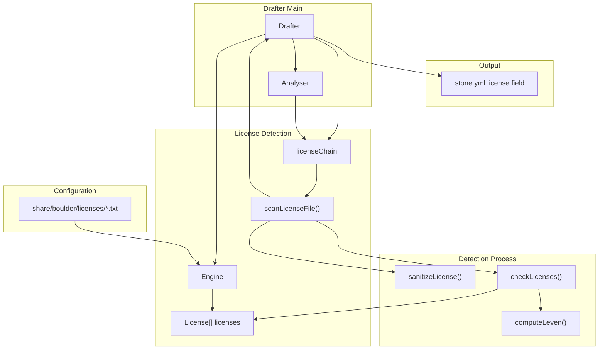
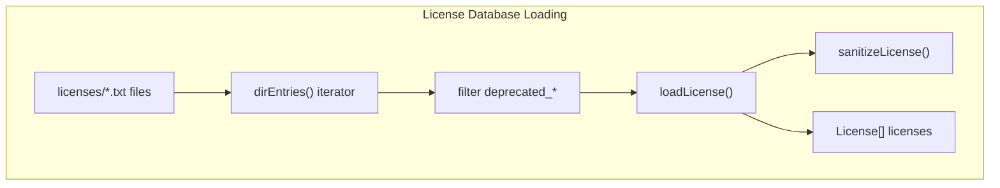
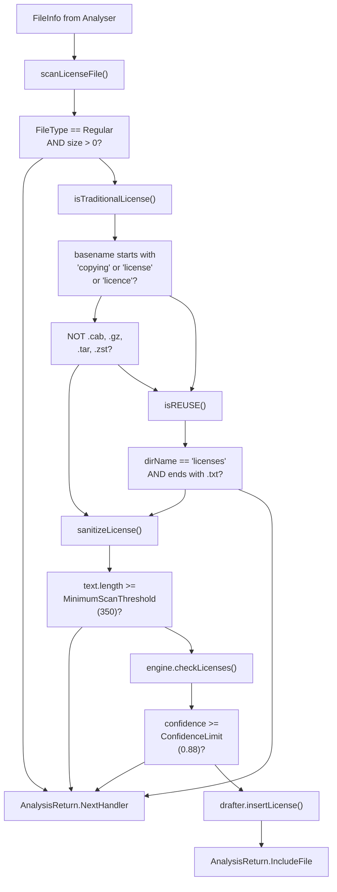
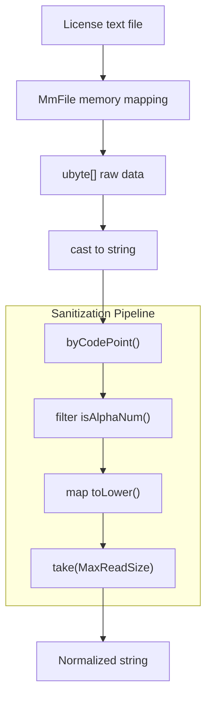
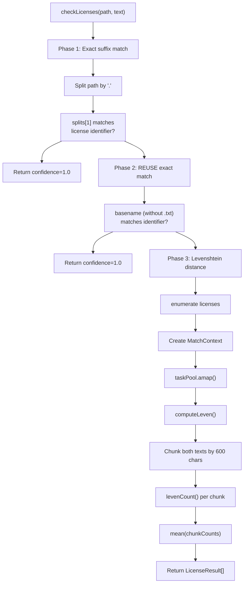
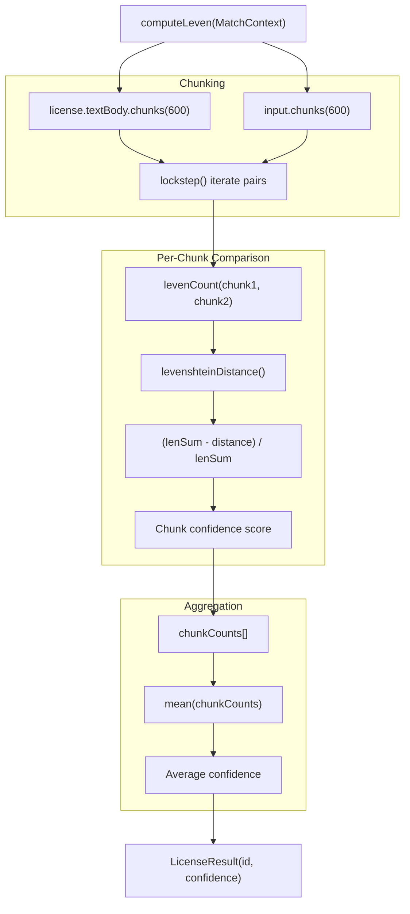
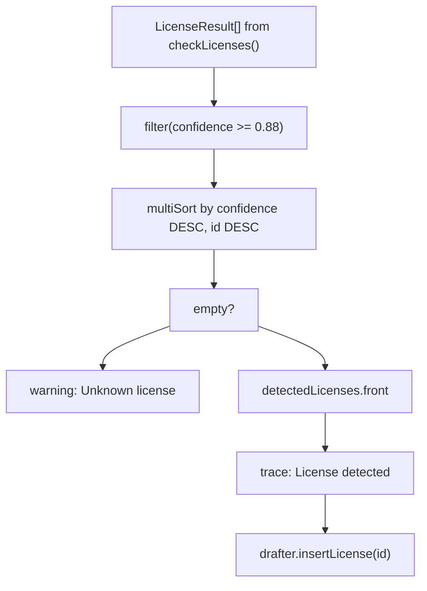
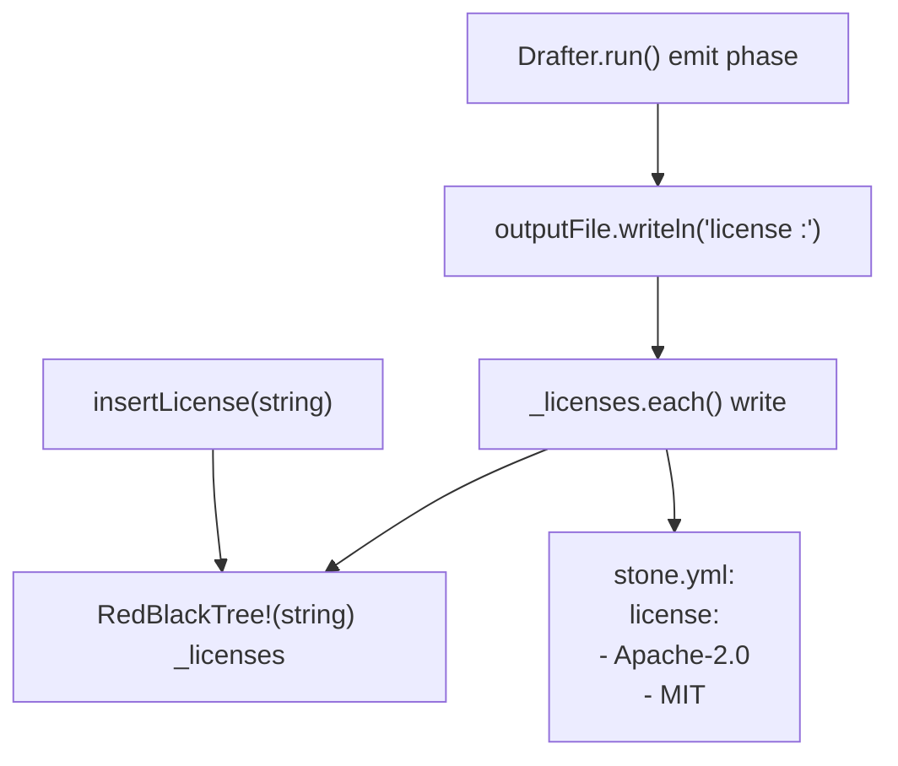
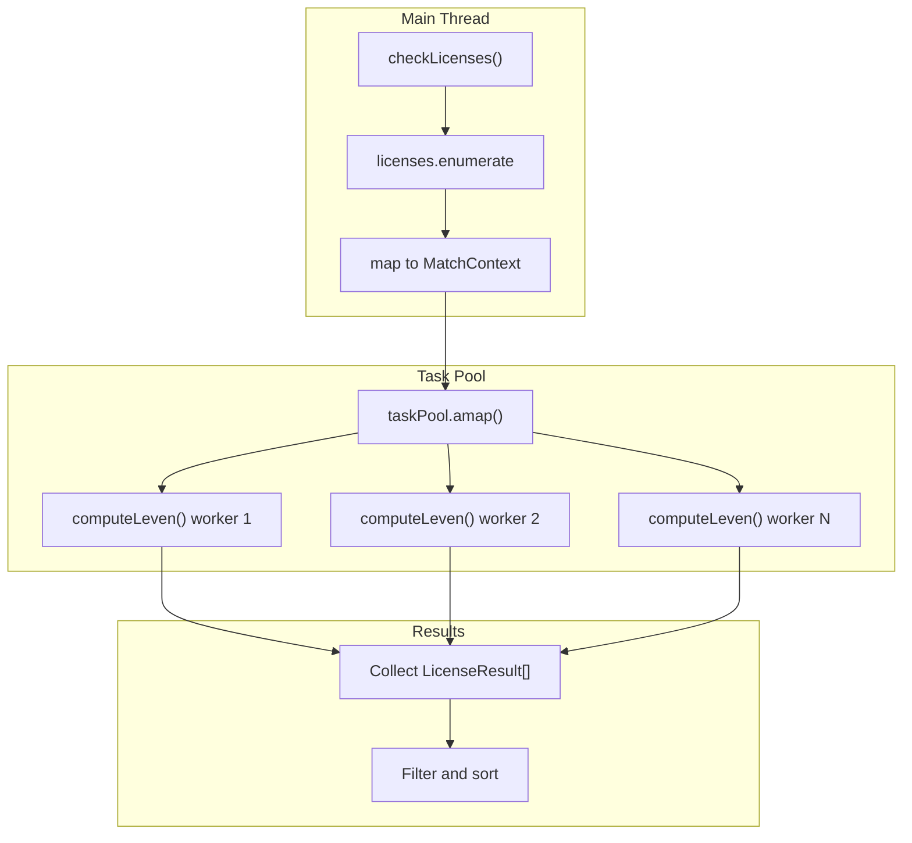

# License Detection Engine

Relevant source files

* [source/drafter/license/engine.d](../source/drafter/license/engine.d)
* [source/drafter/package.d](../source/drafter/package.d)

The License Detection Engine is the subsystem within drafter that automatically identifies software licenses in extracted source archives. It uses Levenshtein distance-based text similarity matching against a database of SPDX license texts to detect licenses with high confidence. The engine scans for traditional license files (COPYING, LICENSE, etc.) and REUSE-compliant license declarations, outputting SPDX identifiers to the generated `stone.yml` recipe.

For information about how drafter uses this engine as part of the overall recipe generation process, see [Drafter: Recipe Generator](4-drafter:-recipe-generator). For details on the other detection systems (build system detection), see [Build System Detection](4.3-build-system-detection).

## Architecture Overview

The License Detection Engine is implemented in the `Engine` class and integrates with drafter's analysis chain system. The engine preloads a database of SPDX license texts at startup and provides similarity matching functionality during source tree analysis.

**Integration with Drafter Analysis System**

Sources: [source/drafter/package.d71-99](../source/drafter/package.d#L71-L99) [source/drafter/license/engine.d189-212](../source/drafter/license/engine.d#L189-L212)

The `Engine` is instantiated when a `Drafter` object is created ([source/drafter/package.d90-94](../source/drafter/package.d#L90-L94)). The engine loads its license database from `share/boulder/licenses/*.txt` relative to the boulder executable path. The `licenseChain` analysis chain ([source/drafter/license/engine.d158-160](../source/drafter/license/engine.d#L158-L160)) is registered with the `Analyser`, giving it a priority of 10.

## License Database Structure

The engine maintains an in-memory database of SPDX licenses loaded from text files. Each license is represented by the `License` struct with an identifier and normalized text body.

| Component | Type | Purpose |
| --- | --- | --- |
| `License[]` | Array | In-memory storage of all SPDX licenses |
| `identifier` | string | SPDX license identifier (e.g., "Apache-2.0") |
| `textBody` | string | Sanitized, normalized license text |

**Database Loading Process**

Sources: [source/drafter/license/engine.d195-212](../source/drafter/license/engine.d#L195-L212) [source/drafter/license/engine.d177-183](../source/drafter/license/engine.d#L177-L183)

The `loadFromDirectory()` method ([source/drafter/license/engine.d195-212](../source/drafter/license/engine.d#L195-L212)) scans for `.txt` files in the license directory, explicitly filtering out files starting with `deprecated_` ([source/drafter/license/engine.d201-202](../source/drafter/license/engine.d#L201-L202)). Each license file is processed by `loadLicense()` ([source/drafter/license/engine.d177-183](../source/drafter/license/engine.d#L177-L183)), which extracts the SPDX identifier from the filename (stripping the `.txt` extension) and sanitizes the license text.

## License File Detection

The engine identifies license files in source trees using pattern matching on file paths and names. It supports both traditional license file naming conventions and REUSE-compliant directory structures.

**File Detection Logic**

Sources: [source/drafter/license/engine.d75-153](../source/drafter/license/engine.d#L75-L153)

The `scanLicenseFile()` function ([source/drafter/license/engine.d75-153](../source/drafter/license/engine.d#L75-L153)) is the main handler in the `licenseChain`. It implements two detection strategies:

1. **Traditional licenses** ([source/drafter/license/engine.d88-108](../source/drafter/license/engine.d#L88-L108)): Files whose basename (case-insensitive) starts with "copying", "license", or "licence", excluding archive formats (.cab, .gz, .tar, .zst)
2. **REUSE compliance** ([source/drafter/license/engine.d113-118](../source/drafter/license/engine.d#L113-L118)): Files in a `licenses/` directory that end with `.txt`

Only regular files with size > 0 are considered ([source/drafter/license/engine.d77-80](../source/drafter/license/engine.d#L77-L80)).

## Text Normalization

Before comparison, both database licenses and detected license files undergo identical text sanitization to ensure consistent matching despite formatting differences.

| Transformation | Purpose |
| --- | --- |
| Extract alphanumeric codepoints only | Remove punctuation, whitespace, special characters |
| Convert to lowercase | Case-insensitive comparison |
| Truncate to `MaxReadSize` (1800 chars) | Focus on substantive license text |

**Sanitization Implementation**

Sources: [source/drafter/license/engine.d58-67](../source/drafter/license/engine.d#L58-L67) [source/drafter/license/engine.d126-138](../source/drafter/license/engine.d#L126-L138)

The `sanitizeLicense()` function ([source/drafter/license/engine.d58-67](../source/drafter/license/engine.d#L58-L67)) uses memory-mapped file I/O for efficiency. It processes the text as Unicode codepoints, filtering to keep only alphanumeric characters ([source/drafter/license/engine.d64](../source/drafter/license/engine.d#L64-L64)), converting each to lowercase ([source/drafter/license/engine.d65](../source/drafter/license/engine.d#L65-L65)), and truncating to `MaxReadSize` of 1800 characters ([source/drafter/license/engine.d41](../source/drafter/license/engine.d#L41-L41) [source/drafter/license/engine.d66](../source/drafter/license/engine.d#L66-L66)).

Files shorter than `MinimumScanThreshold` (350 characters) after sanitization are rejected as likely non-license files ([source/drafter/license/engine.d46](../source/drafter/license/engine.d#L46-L46) [source/drafter/license/engine.d135-138](../source/drafter/license/engine.d#L135-L138)).

## License Matching Algorithm

The engine uses a multi-phase matching strategy with increasing computational cost:

**Three-Phase Matching Strategy**

Sources: [source/drafter/license/engine.d217-253](../source/drafter/license/engine.d#L217-L253)

The `checkLicenses()` method ([source/drafter/license/engine.d217-253](../source/drafter/license/engine.d#L217-L253)) implements three phases:

1. **Suffix matching** ([source/drafter/license/engine.d226-235](../source/drafter/license/engine.d#L226-L235)): If the filename is like `COPYING.Apache-2.0`, the suffix is checked against license identifiers for an exact match (confidence 1.0)
2. **REUSE basename matching** ([source/drafter/license/engine.d237-245](../source/drafter/license/engine.d#L237-L245)): For REUSE-compliant files, the basename without extension is matched against identifiers (confidence 1.0)
3. **Levenshtein similarity** ([source/drafter/license/engine.d248-252](../source/drafter/license/engine.d#L248-L252)): All licenses are compared in parallel using `taskPool.amap()` with the `computeLeven()` function

## Levenshtein Distance Calculation

The core similarity computation uses chunked Levenshtein distance to balance accuracy and performance.

**Chunked Distance Calculation**

Sources: [source/drafter/license/engine.d281-291](../source/drafter/license/engine.d#L281-L291) [source/drafter/license/engine.d265-272](../source/drafter/license/engine.d#L265-L272)

The `computeLeven()` function ([source/drafter/license/engine.d281-291](../source/drafter/license/engine.d#L281-L291)) divides both license texts into 600-character chunks ([source/drafter/license/engine.d283](../source/drafter/license/engine.d#L283-L283)). Each chunk pair is compared using `levenCount()` ([source/drafter/license/engine.d265-272](../source/drafter/license/engine.d#L265-L272)), which:

1. Calculates the Levenshtein distance between two chunks ([source/drafter/license/engine.d269](../source/drafter/license/engine.d#L269-L269))
2. Computes the total length sum ([source/drafter/license/engine.d270](../source/drafter/license/engine.d#L270-L270))
3. Returns normalized similarity: `(lenSum - distance) / lenSum` ([source/drafter/license/engine.d271](../source/drafter/license/engine.d#L271-L271))

The final confidence is the mean of all chunk confidences ([source/drafter/license/engine.d289](../source/drafter/license/engine.d#L289-L289)).

## Confidence Thresholds and Filtering

The engine applies confidence thresholds to ensure only high-quality license matches are included in the generated recipe.

| Constant | Value | Purpose |
| --- | --- | --- |
| `ConfidenceLimit` | 0.88 | Minimum confidence for license acceptance (88%) |
| `MinimumScanThreshold` | 350 | Minimum sanitized text length for comparison |
| `MaxReadSize` | 1800 | Maximum characters to compare per license |
| `ChunkSize` | 600 | Chunk size for Levenshtein comparison |

**Result Processing**

Sources: [source/drafter/license/engine.d140-152](../source/drafter/license/engine.d#L140-L152)

After matching, results are filtered to require at least 88% confidence ([source/drafter/license/engine.d39](../source/drafter/license/engine.d#L39-L39) [source/drafter/license/engine.d141](../source/drafter/license/engine.d#L141-L141)). The results are sorted first by confidence (descending), then by identifier (descending) to ensure "or-later" variants appear before "only" variants for compliance purposes ([source/drafter/license/engine.d143](../source/drafter/license/engine.d#L143-L143)).

If no licenses meet the threshold, a warning is logged ([source/drafter/license/engine.d146](../source/drafter/license/engine.d#L146-L146)), but processing continues. Otherwise, the highest-confidence license is selected ([source/drafter/license/engine.d149](../source/drafter/license/engine.d#L149-L149)) and inserted into the drafter's license set ([source/drafter/license/engine.d151](../source/drafter/license/engine.d#L151-L151)).

## Output Integration

Detected licenses are accumulated in a `RedBlackTree` data structure in the `Drafter` class to ensure uniqueness and sorted output.

**License Output**

Sources: [source/drafter/package.d95](../source/drafter/package.d#L95-L95) [source/drafter/package.d215-221](../source/drafter/package.d#L215-L221) [source/drafter/package.d184-185](../source/drafter/package.d#L184-L185)

The `Drafter` class maintains a `RedBlackTree` of license strings ([source/drafter/package.d95](../source/drafter/package.d#L95-L95) [source/drafter/package.d371](../source/drafter/package.d#L371-L371)). The `insertLicense()` method ([source/drafter/package.d215-221](../source/drafter/package.d#L215-L221)) uses synchronized insertion to ensure thread-safety, as license detection runs in parallel.

During the emit phase ([source/drafter/package.d184-185](../source/drafter/package.d#L184-L185)), all detected licenses are written to the output `stone.yml` file with the `license :` field header.

## Parallel Processing Architecture

The engine leverages D's `std.parallelism` to perform license comparisons concurrently, significantly reducing analysis time for large license databases.

**Parallel Matching**

Sources: [source/drafter/license/engine.d248-252](../source/drafter/license/engine.d#L248-L252)

The `taskPool.amap()` call ([source/drafter/license/engine.d252](../source/drafter/license/engine.d#L252-L252)) distributes the license comparison work across available CPU cores. Each worker independently executes `computeLeven()` on a subset of licenses, returning a `LicenseResult` with the calculated confidence score. This parallelization is safe because each license comparison is independent and read-only.