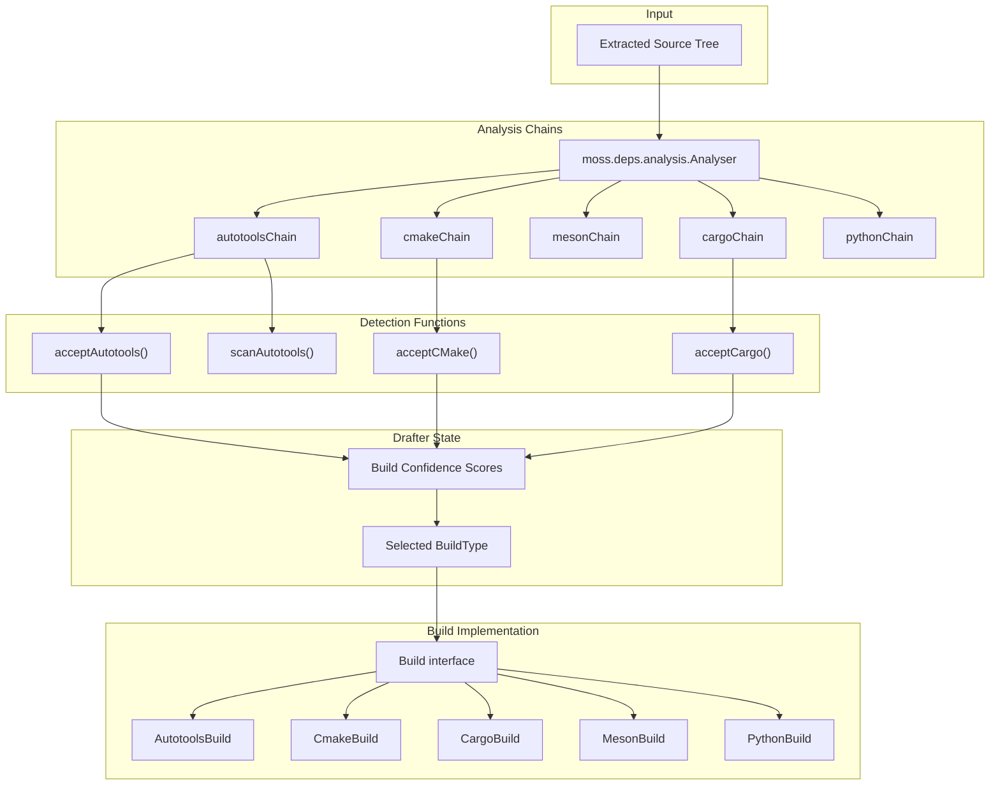
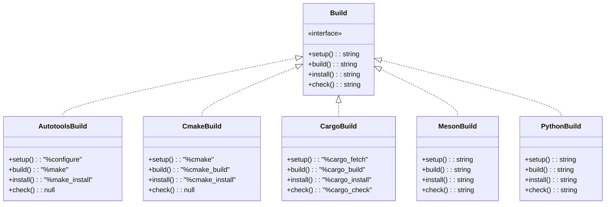
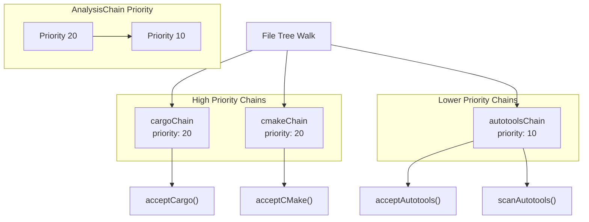
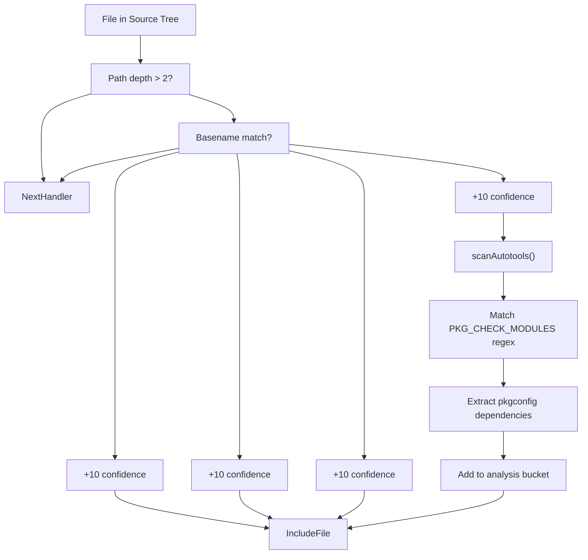
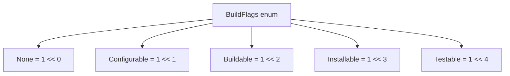
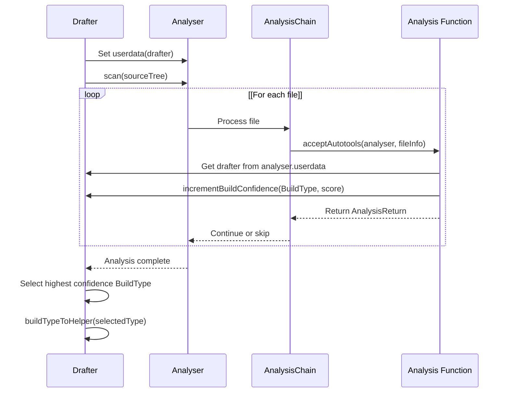

# Build System Detection

Relevant source files

* [source/drafter/build/autotools.d](../source/drafter/build/autotools.d)
* [source/drafter/build/cargo.d](../source/drafter/build/cargo.d)
* [source/drafter/build/cmake.d](../source/drafter/build/cmake.d)
* [source/drafter/build/package.d](../source/drafter/build/package.d)
* [source/drafter/license/package.d](../source/drafter/license/package.d)
* [source/drafter/meson.build](../source/drafter/meson.build)
* [source/drafter/metadata/basic.d](../source/drafter/metadata/basic.d)
* [source/drafter/metadata/github.d](../source/drafter/metadata/github.d)
* [source/drafter/metadata/package.d](../source/drafter/metadata/package.d)

The build system detection subsystem in drafter automatically identifies which build system a software package uses by scanning the extracted source code for characteristic files and patterns. This allows drafter to generate appropriate build commands in the stone.yml recipe without manual intervention. The detection system supports autotools, CMake, Meson, Cargo, and Python build systems.

For information about how drafter uses the detected build system to generate complete recipes, see [Drafter: Recipe Generator](4-drafter:-recipe-generator). For details on the license detection system that runs alongside build detection, see [License Detection Engine](4.2-license-detection-engine).

## Architecture Overview

The build system detection operates through an analysis chain architecture where multiple specialized handlers examine the source tree. Each handler looks for specific files or patterns that indicate a particular build system, incrementing a confidence score when matches are found. The build system with the highest confidence score is selected and used to generate the build instructions.

**Sources:** [source/drafter/build/package.d1-164](../source/drafter/build/package.d#L1-L164) [source/drafter/build/autotools.d1-115](../source/drafter/build/autotools.d#L1-L115) [source/drafter/build/cmake.d1-82](../source/drafter/build/cmake.d#L1-L82) [source/drafter/build/cargo.d1-69](../source/drafter/build/cargo.d#L1-L69)

## Build Type Enumeration

The `BuildType` enum defines all supported build systems. Each type maps to a specific build system with its own detection logic and command generation.

| Build Type | String Value | Description |
| --- | --- | --- |
| `Autotools` | `"autotools"` | Uses configure/make/install routine |
| `CMake` | `"cmake"` | CMake-based builds |
| `Meson` | `"meson"` | Uses meson + ninja |
| `PythonPEP517` | `"pythonpep517"` | Python PEP 517 builds |
| `PythonSetuptools` | `"PythonSetuptools"` | Python setuptools-based builds |
| `Cargo` | `"cargo"` | Rust cargo builds |
| `Unknown` | `"unknown"` | Unsupported or undetected tooling |

The `buildTypeToHelper()` function converts a `BuildType` enum value to its corresponding `Build` implementation instance using compile-time reflection. It returns `null` for `BuildType.Unknown`.

**Sources:** [source/drafter/build/package.d54-90](../source/drafter/build/package.d#L54-L90) [source/drafter/build/package.d27-49](../source/drafter/build/package.d#L27-L49)

## Build Interface

The `Build` interface defines the contract that all build system implementations must fulfill. Each implementation provides the shell commands for the four standard build stages.

Each method returns a string containing the macro or command to execute for that stage. Returning `null` indicates that stage is not supported or not typically needed for that build system. These strings use macros (e.g., `%configure`, `%cmake`) that are expanded by mason during the actual build. For details on these action macros, see [Action Macros](5.4-action-macros).

**Sources:** [source/drafter/build/package.d92-117](../source/drafter/build/package.d#L92-L117) [source/drafter/build/autotools.d91-114](../source/drafter/build/autotools.d#L91-L114) [source/drafter/build/cmake.d55-81](../source/drafter/build/cmake.d#L55-L81) [source/drafter/build/cargo.d45-68](../source/drafter/build/cargo.d#L45-L68)

## Analysis Chain Architecture

Each build system has an `AnalysisChain` that consists of one or more analysis functions. The analyser walks the source tree and invokes each chain on every file. Each function in the chain can return:

* `AnalysisReturn.NextHandler` - Skip to the next chain
* `AnalysisReturn.NextFunction` - Continue to next function in this chain
* `AnalysisReturn.IncludeFile` - Include file and continue

Chains are executed in priority order (higher priority first). The cargo and CMake chains have priority 20, while autotools has priority 10. This ensures more specific build systems are checked before more generic ones.

**Sources:** [source/drafter/build/cargo.d43](../source/drafter/build/cargo.d#L43-L43) [source/drafter/build/cmake.d53](../source/drafter/build/cmake.d#L53-L53) [source/drafter/build/autotools.d88-89](../source/drafter/build/autotools.d#L88-L89)

## Autotools Detection

The autotools detection chain looks for characteristic files in the source tree root (maximum depth of 2 subdirectories). When found, it increments the build confidence score for `BuildType.Autotools`.

### Detection Logic

| File Name | Confidence Increment | Action |
| --- | --- | --- |
| `configure.ac` | +10 | Continue to next function |
| `configure` | +10 | Include file |
| `Makefile.am` | +10 | Include file |
| `Makefile` | +10 | Include file |

The `acceptAutotools()` function performs file detection. If a `configure.ac` file is found, the `scanAutotools()` function parses it to extract `pkgconfig` dependencies using the pattern `PKG_CHECK_MODULES()`.

The regular expression `reConfigurePkgconfig` matches `PKG_CHECK_MODULES()` macro calls in `configure.ac` files to extract pkgconfig dependencies. This information is added to the analysis bucket for dependency tracking.

**Sources:** [source/drafter/build/autotools.d36-63](../source/drafter/build/autotools.d#L36-L63) [source/drafter/build/autotools.d68-83](../source/drafter/build/autotools.d#L68-L83) [source/drafter/build/autotools.d30-31](../source/drafter/build/autotools.d#L30-L31)

## CMake Detection

CMake detection is simpler than autotools. The `acceptCMake()` function looks for `CMakeLists.txt` files at a maximum depth of 2 subdirectories.

When `CMakeLists.txt` is found, the confidence score for `BuildType.CMake` is incremented by 20 points. This larger increment (compared to autotools' +10) reflects the higher certainty that a CMakeLists.txt file indicates a CMake-based build.

The `CmakeBuild` class generates the standard CMake macro commands:

* **setup**: `%cmake` - Configures the build
* **build**: `%cmake_build` - Compiles the project
* **install**: `%cmake_install` - Installs to the staging directory
* **check**: `null` - No standard test command

**Sources:** [source/drafter/build/cmake.d26-48](../source/drafter/build/cmake.d#L26-L48) [source/drafter/build/cmake.d55-81](../source/drafter/build/cmake.d#L55-L81)

## Cargo Detection

Cargo detection identifies Rust projects by looking for `Cargo.toml` files. The `acceptCargo()` function checks the basename of each file in the source tree.

When `Cargo.toml` is found, the confidence score for `BuildType.Cargo` is set to 100 points. This high confidence value reflects that `Cargo.toml` is an unambiguous indicator of a Cargo-based Rust project.

The `CargoBuild` class provides all four build stages:

* **setup**: `%cargo_fetch` - Fetches dependencies
* **build**: `%cargo_build` - Compiles the project
* **install**: `%cargo_install` - Installs binaries
* **check**: `%cargo_check` - Runs tests

**Sources:** [source/drafter/build/cargo.d26-38](../source/drafter/build/cargo.d#L26-L38) [source/drafter/build/cargo.d45-68](../source/drafter/build/cargo.d#L45-L68)

## Build Flags and Options

The `BuildFlags` enum allows implementations to declare which build stages they support:

The `BuildOptions` struct allows customization of the build process:

| Field | Type | Default | Description |
| --- | --- | --- | --- |
| `workingDir` | `string` | `null` | Explicitly requested working directory |
| `flags` | `BuildFlags` | `None` | Capability flags for the build |

These options allow build implementations to communicate their capabilities and requirements to the drafter tool. For example, some build systems may not have a separate configuration stage, while others may not support test execution.

**Sources:** [source/drafter/build/package.d119-163](../source/drafter/build/package.d#L119-L163)

## Integration with Drafter

The build system detection integrates with the main `Drafter` class through the analysis system. The `Drafter` instance is passed as userdata to the `Analyser`, allowing detection functions to call `incrementBuildConfidence()` when they find relevant files.

After scanning completes, drafter selects the `BuildType` with the highest confidence score and instantiates the corresponding `Build` implementation. This implementation is then used to generate the `setup`, `build`, `install`, and `check` sections of the stone.yml recipe.

**Sources:** [source/drafter/build/autotools.d38](../source/drafter/build/autotools.d#L38-L38) [source/drafter/build/cmake.d28](../source/drafter/build/cmake.d#L28-L28) [source/drafter/build/cargo.d28](../source/drafter/build/cargo.d#L28-L28) [source/drafter/build/package.d27-49](../source/drafter/build/package.d#L27-L49)

## Characteristic Files Summary

The following table summarizes the characteristic files that each build system detection chain looks for:

| Build System | Characteristic Files | Confidence Score | Depth Limit |
| --- | --- | --- | --- |
| Autotools | `configure.ac`, `configure`, `Makefile.am`, `Makefile` | +10 per file | 2 subdirectories |
| CMake | `CMakeLists.txt` | +20 | 2 subdirectories |
| Meson | `meson.build` | Varies | Implementation specific |
| Cargo | `Cargo.toml` | +100 | None (checks all files) |
| Python PEP517 | `pyproject.toml` | Varies | Implementation specific |
| Python Setuptools | `setup.py` | Varies | Implementation specific |

The depth limit prevents false positives from files deep in vendored dependencies or test subdirectories. Cargo uses a much higher confidence score because `Cargo.toml` is unambiguous, while autotools files like `Makefile` can appear in various contexts.

**Sources:** [source/drafter/build/autotools.d36-63](../source/drafter/build/autotools.d#L36-L63) [source/drafter/build/cmake.d26-48](../source/drafter/build/cmake.d#L26-L48) [source/drafter/build/cargo.d26-38](../source/drafter/build/cargo.d#L26-L38)