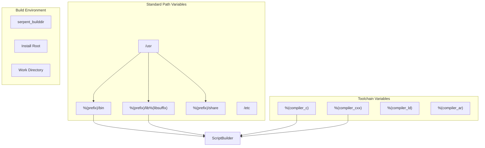
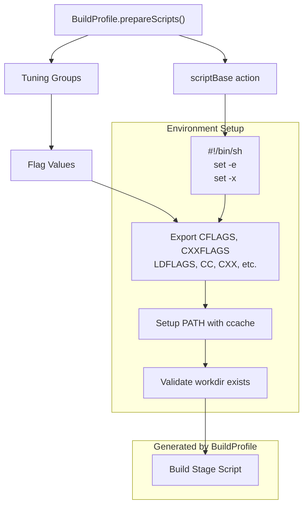
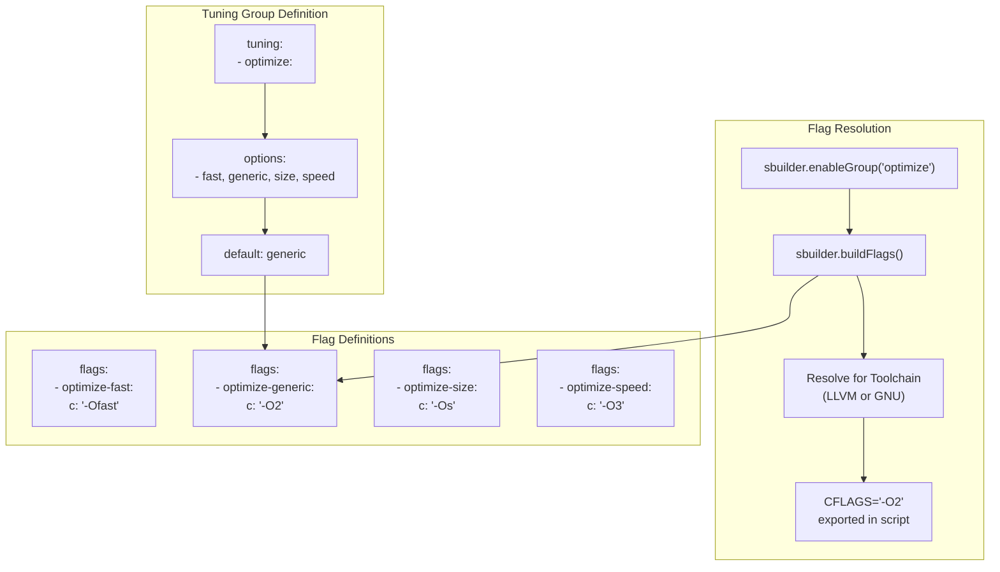
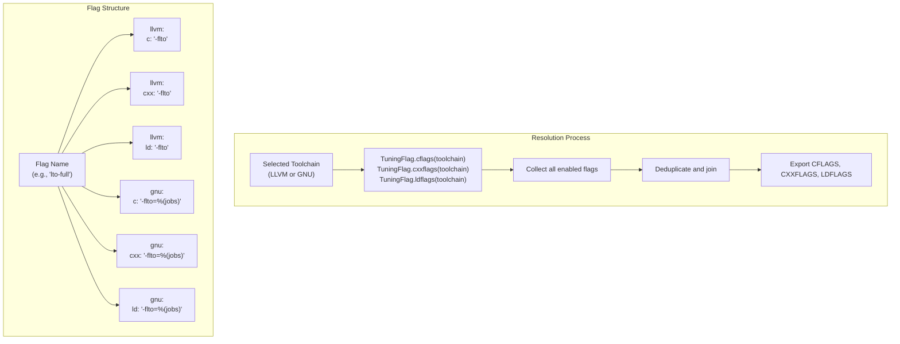
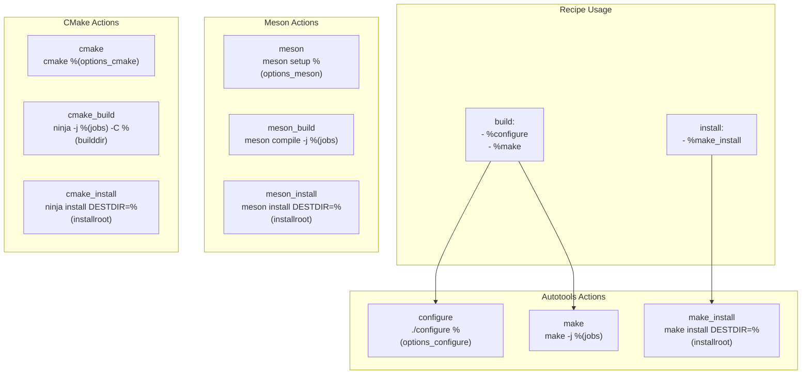
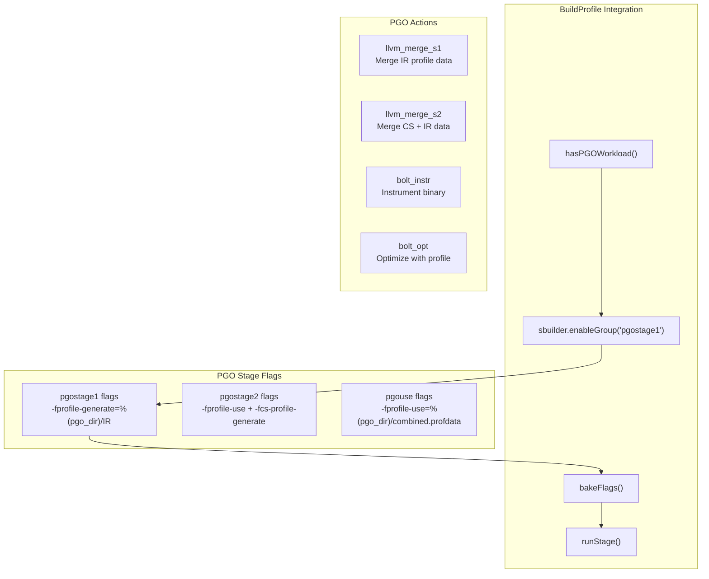
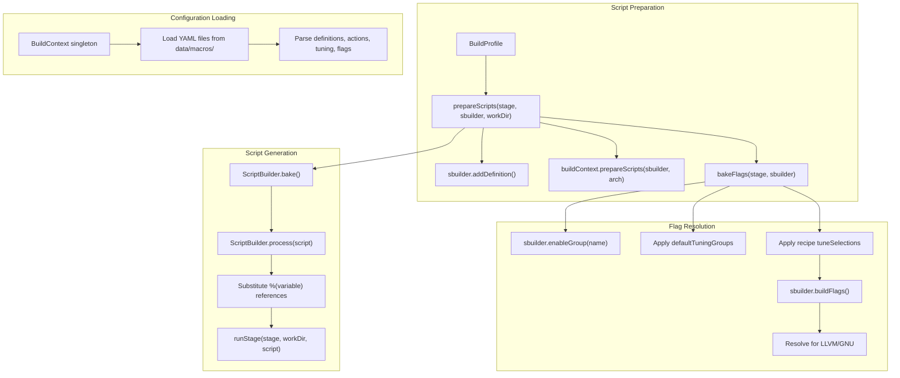

# Configuration System

Relevant source files

* [data/macros/actions/autotools.yml](../data/macros/actions/autotools.yml)
* [data/macros/actions/cmake.yml](../data/macros/actions/cmake.yml)
* [data/macros/actions/meson.yml](../data/macros/actions/meson.yml)
* [data/macros/actions/misc.yml](../data/macros/actions/misc.yml)
* [data/macros/actions/pgo.yml](../data/macros/actions/pgo.yml)
* [data/macros/arch/base.yml](../data/macros/arch/base.yml)
* [source/mason/build/profile.d](../source/mason/build/profile.d)

The Configuration System provides the macro definitions, compiler flags, tuning groups, and action commands that control how packages are built in boulder. It consists of YAML configuration files that define variables, build actions, toolchain-specific flags, and optimization settings. These configurations are processed by `ScriptBuilder` and integrated into build scripts by `BuildProfile`.

For information about how these configurations are used during recipe parsing and execution, see [Boulder CLI Commands](2.1-boulder-cli-commands) and [Builder and Build Profiles](3.2-builder-and-build-profiles). For details on specific action macros available in recipes, see [Action Macros](5.4-action-macros).

## Configuration File Organization

The configuration system is organized hierarchically in the `data/macros/` directory:

```mermaid
flowchart TD

Base["data/macros/arch/base.yml<br>(Core Definitions)"]
X86["data/macros/arch/x86_64.yml<br>(x86_64 Architecture)"]
Emul32["data/macros/arch/emul32/x86_64.yml<br>(32-bit Compatibility)"]
AArch64["data/macros/arch/aarch64.yml<br>(ARM64 Architecture)"]
Stage1["data/macros/arch/x86_64-stage1.yml<br>(Bootstrap Stage)"]
Autotools["data/macros/actions/autotools.yml"]
CMake["data/macros/actions/cmake.yml"]
Meson["data/macros/actions/meson.yml"]
Cargo["data/macros/actions/cargo.yml"]
PGO["data/macros/actions/pgo.yml"]
Misc["data/macros/actions/misc.yml"]
ScriptBuilder["ScriptBuilder"]
BuildProfile["BuildProfile"]
BuildContext["BuildContext"]
GeneratedScript["Generated Shell Script"]

Base --> ScriptBuilder
X86 --> ScriptBuilder
Emul32 --> ScriptBuilder
AArch64 --> ScriptBuilder
Stage1 --> ScriptBuilder
Autotools --> ScriptBuilder
CMake --> ScriptBuilder
Meson --> ScriptBuilder
Cargo --> ScriptBuilder
PGO --> ScriptBuilder
Misc --> ScriptBuilder
ScriptBuilder --> GeneratedScript

subgraph subGraph1 ["Build Process Integration"]
    ScriptBuilder
    BuildProfile
    BuildContext
    BuildContext --> ScriptBuilder
    BuildProfile --> ScriptBuilder
end

subgraph subGraph0 ["Configuration Files"]
    Base
    X86
    Emul32
    AArch64
    Stage1
    Autotools
    CMake
    Meson
    Cargo
    PGO
    Misc
end
```



**Sources:** [data/macros/arch/base.yml1-614](../data/macros/arch/base.yml#L1-L614) [source/mason/build/profile.d271-339](../source/mason/build/profile.d#L271-L339)

## Core Configuration Structure

Configuration files are YAML documents with four main sections:

| Section | Purpose | Example Usage |
| --- | --- | --- |
| `definitions` | Variable definitions and substitutable values | Standard paths, compiler names, build directories |
| `actions` | Reusable command snippets and macros | `%configure`, `%cmake`, `%make_install` |
| `tuning` | Tuning group definitions with enable/disable logic | `optimize`, `lto`, `harden`, `debug` |
| `flags` | Compiler and linker flags organized by feature | Architecture flags, optimization levels, hardening options |
| `packages` | Package split templates | Main package, `-devel`, `-docs`, `-32bit` |

**Sources:** [data/macros/arch/base.yml3-614](../data/macros/arch/base.yml#L3-L614)

## Variable Definitions

The `definitions` section establishes the core variables used throughout the build system:



### Core Path Definitions

The base configuration defines standard filesystem hierarchy paths:

```
- prefix         : "/usr"
- bindir         : "%(prefix)/bin"
- sbindir        : "%(prefix)/sbin"
- libdir         : "%(prefix)/lib%(libsuffix)"
- datadir        : "%(prefix)/share"
- sysconfdir     : "/etc"
```

These variables support recursive substitution, where `%(variable)` references are expanded. The `libsuffix` variable is empty for 64-bit builds and set to "32" for emul32 builds.

**Sources:** [data/macros/arch/base.yml6-27](../data/macros/arch/base.yml#L6-L27)

### Toolchain Variables

Compiler and toolchain variables are defined as indirect references that resolve to actual tool names based on the selected toolchain:

```
- cc             : "%(compiler_c)"
- cxx            : "%(compiler_cxx)"
- ld             : "%(compiler_ld)"
- ar             : "%(compiler_ar)"
```

The `prepareScripts()` method in `BuildProfile` sets the `compiler_*` variables based on whether the LLVM or GNU toolchain is selected:

**Sources:** [data/macros/arch/base.yml34-48](../data/macros/arch/base.yml#L34-L48) [source/mason/build/profile.d293-328](../source/mason/build/profile.d#L293-L328)

## Action Macros and scriptBase

The `actions` section defines reusable command snippets. The most fundamental action is `scriptBase`, which forms the header of every generated build script:



The `scriptBase` template exports the build environment variables after they've been resolved from tuning groups and flag definitions:

**Sources:** [data/macros/arch/base.yml52-89](../data/macros/arch/base.yml#L52-L89) [source/mason/build/profile.d271-339](../source/mason/build/profile.d#L271-L339)

## Tuning Groups and Flag Resolution

Tuning groups provide a hierarchical system for enabling compiler and linker flags. Each group can be enabled, disabled, or configured with options:



### Tuning Group Types

Tuning groups support three configuration modes:

1. **Simple Enable/Disable**: Groups like `bindnow`, `asneeded`, `relr`
2. **Options with Default**: Groups like `optimize` (fast/generic/size/speed), `lto` (full/thin)
3. **Conditional Enable**: Groups that enable multiple flags, like `noplt` which also enables `bindnow`

**Sources:** [data/macros/arch/base.yml104-277](../data/macros/arch/base.yml#L104-L277)

### Default Tuning Groups

The configuration defines a set of default tuning groups that are automatically enabled unless explicitly disabled in the recipe:

```
defaultTuningGroups:
    - asneeded
    - avxwidth
    - base
    - bindnow
    - debug
    - fortify
    - frame-pointer
    - harden
    - icf
    - optimize
    - relr
    - symbolic
```

The `BuildProfile.bakeFlags()` method applies these defaults during script preparation:

**Sources:** [data/macros/arch/base.yml90-102](../data/macros/arch/base.yml#L90-L102) [source/mason/build/profile.d379-386](../source/mason/build/profile.d#L379-L386)

## Flag Definitions and Toolchain-Specific Behavior

Flags are organized by feature name and support toolchain-specific values:



### Flag Organization

Flags are categorized by their purpose:

| Category | Example Flags | Controlled By |
| --- | --- | --- |
| Architecture | `-march=x86-64-v2`, `-mtune=generic` | `architecture` tuning group |
| Optimization | `-O2`, `-O3`, `-Ofast`, `-Os` | `optimize` tuning group |
| LTO | `-flto`, `-flto=thin` | `lto` tuning group |
| Hardening | `-fstack-protector`, `-D_FORTIFY_SOURCE=2` | `harden`, `fortify` tuning groups |
| Debug | `-g`, `-gline-tables-only` | `debug` tuning group |
| Linking | `-Wl,-z,relro,-z,now`, `-Wl,--as-needed` | `bindnow`, `asneeded` tuning groups |

**Sources:** [data/macros/arch/base.yml278-527](../data/macros/arch/base.yml#L278-L527)

### Toolchain-Specific Flags

Many flags have different syntax between LLVM and GNU toolchains:

```
- lto-full:
    gnu:
        c         : "-flto=%(jobs)"
        cxx       : "-flto=%(jobs)"
        ld        : "-flto=%(jobs)"
    llvm:
        c         : "-flto"
        cxx       : "-flto"
        d         : "-flto=full"
        ld        : "-flto"
```

The `bakeFlags()` method resolves these based on the toolchain selected in the recipe:

**Sources:** [data/macros/arch/base.yml369-387](../data/macros/arch/base.yml#L369-L387) [source/mason/build/profile.d347-430](../source/mason/build/profile.d#L347-L430)

## Build System Action Macros

Action macros provide reusable commands for common build system operations:



### Autotools Actions

The autotools action macros provide standard GNU Autotools build workflow:

* `%configure`: Runs `./configure` with standard path arguments
* `%make`: Executes parallel make with job count from `%(jobs)`
* `%make_install`: Installs to `DESTDIR=%(installroot)`
* `%reconfigure`: Runs `autoreconf -vfi` then configures
* `%autogen`: Runs `autogen.sh` then configures

The `options_configure` definition provides standard arguments:

```
- options_configure: |
    --prefix="%(prefix)" \
    --bindir="%(bindir)" \
    --libdir="%(libdir)" \
    --sysconfdir="%(sysconfdir)" \
    ...
```

**Sources:** [data/macros/actions/autotools.yml1-63](../data/macros/actions/autotools.yml#L1-L63)

### CMake Actions

CMake actions use Ninja as the build backend:

* `%cmake`: Configures with Ninja generator and release build type
* `%cmake_unity`: Enables unity builds for faster compilation
* `%cmake_build`: Compiles with Ninja
* `%cmake_install`: Installs to `DESTDIR`
* `%cmake_test`: Runs CTest test suite

The `options_cmake` definition ensures proper flag propagation:

```
- options_cmake: |
    -G Ninja -S . -B "%(builddir)" \
    -DCMAKE_C_FLAGS="${CFLAGS}" \
    -DCMAKE_CXX_FLAGS="${CXXFLAGS}" \
    -DCMAKE_BUILD_TYPE="Release" \
    ...
```

**Sources:** [data/macros/actions/cmake.yml1-53](../data/macros/actions/cmake.yml#L1-L53)

### Meson Actions

Meson actions follow a similar pattern:

* `%meson`: Runs `meson setup` with buildtype=plain
* `%meson_unity`: Enables unity builds
* `%meson_build`: Compiles the project
* `%meson_install`: Installs without rebuilding
* `%meson_test`: Runs test suite

**Sources:** [data/macros/actions/meson.yml1-50](../data/macros/actions/meson.yml#L1-L50)

### Utility Actions

The misc actions provide common file installation and manipulation operations:

* `%install_bin`: Installs executables to `%(bindir)` with 0755 permissions
* `%install_exe`: Generic executable installation with custom target
* `%install_file`: Installs files with 0644 permissions
* `%install_dir`: Creates directories with 0755 permissions
* `%patch`: Applies patch files with `patch -p1`
* `%tmpfiles`: Creates systemd tmpfiles.d entries
* `%sysusers`: Creates systemd sysusers.d entries

**Sources:** [data/macros/actions/misc.yml1-54](../data/macros/actions/misc.yml#L1-L54)

## Profile-Guided Optimization (PGO) Configuration

PGO builds require specialized flags and actions that vary by build stage:



### PGO Tuning Groups

PGO builds enable specific tuning groups at different stages:

* `pgostage1`: First instrumented build generating IR profiles
* `pgostage2`: Second build using IR profiles and generating context-sensitive profiles
* `pgouse`: Final optimized build using merged profile data
* `pgosample`: Indicates incomplete workload coverage

The `BuildProfile` constructor determines PGO staging and the `insertStage()` method enables appropriate groups:

**Sources:** [data/macros/actions/pgo.yml64-125](../data/macros/actions/pgo.yml#L64-L125) [source/mason/build/profile.d61-98](../source/mason/build/profile.d#L61-L98) [source/mason/build/profile.d389-407](../source/mason/build/profile.d#L389-L407)

### PGO Action Macros

PGO-specific actions handle profile data management:

* `%llvm_merge_s1`: Merges stage 1 IR profile data
* `%llvm_merge_s2`: Merges stage 2 context-sensitive data with IR data
* `%bolt_instr`: Instruments binaries with LLVM-BOLT
* `%bolt_opt`: Applies BOLT optimizations using collected profiles
* `%bolt_perf`: Collects perf data for sample-based PGO

**Sources:** [data/macros/actions/pgo.yml1-63](../data/macros/actions/pgo.yml#L1-L63)

## Integration with Build Execution

The configuration system integrates into the build process through several key methods:



### Script Preparation Flow

When `BuildProfile.build()` is called, it iterates through build stages and prepares each script:

1. **Add Core Definitions** (lines 274-276): `installroot`, `buildroot`, `workdir`
2. **Set Compiler Variables** (lines 293-328): Based on LLVM or GNU toolchain selection
3. **Load System Macros** (line 333): Calls `buildContext.prepareScripts()` to load architecture-specific configurations
4. **Resolve Flags** (line 335): Calls `bakeFlags()` to enable tuning groups and resolve flags
5. **Bake Builder** (line 338): Finalizes `ScriptBuilder` with all definitions and flags
6. **Process Script** (line 236): Expands variables and macros in the stage script
7. **Execute Script** (line 238): Runs the generated shell script

**Sources:** [source/mason/build/profile.d194-250](../source/mason/build/profile.d#L194-L250) [source/mason/build/profile.d271-339](../source/mason/build/profile.d#L271-L339)

### Variable Substitution

The `ScriptBuilder.process()` method performs variable substitution:

* `%(variable)` references are expanded recursively
* `%%` is escaped to `%` in the final output (line 236)
* Undefined variables cause script generation to fail

This ensures all paths, compiler names, and flag values are properly resolved before script execution.

**Sources:** [source/mason/build/profile.d236](../source/mason/build/profile.d#L236-L236)

## Package Template System

The base configuration defines standard package split templates:

| Package Pattern | Purpose | Typical Contents |
| --- | --- | --- |
| `%(name)` | Main package | Runtime binaries, libraries, data |
| `%(name)-devel` | Development files | Headers, static libraries, pkg-config files |
| `%(name)-docs` | Documentation | gtk-doc, API documentation |
| `%(name)-dbginfo` | Debug symbols | Split debug information in `/usr/lib/debug` |
| `%(name)-32bit` | 32-bit compat | 32-bit libraries in `/usr/lib32` |
| `%(name)-32bit-devel` | 32-bit development | 32-bit development files |
| `%(name)-libs` | Library subpackage | Shared libraries that can be split |

Each template includes:

* **summary**: Brief description with `%(name)` substitution
* **description**: Detailed explanation of the subpackage purpose
* **paths**: Glob patterns for file inclusion
* **rundeps**: Runtime dependencies on other subpackages

Recipes can reference these templates and add custom paths to split files appropriately.

**Sources:** [data/macros/arch/base.yml529-614](../data/macros/arch/base.yml#L529-L614)