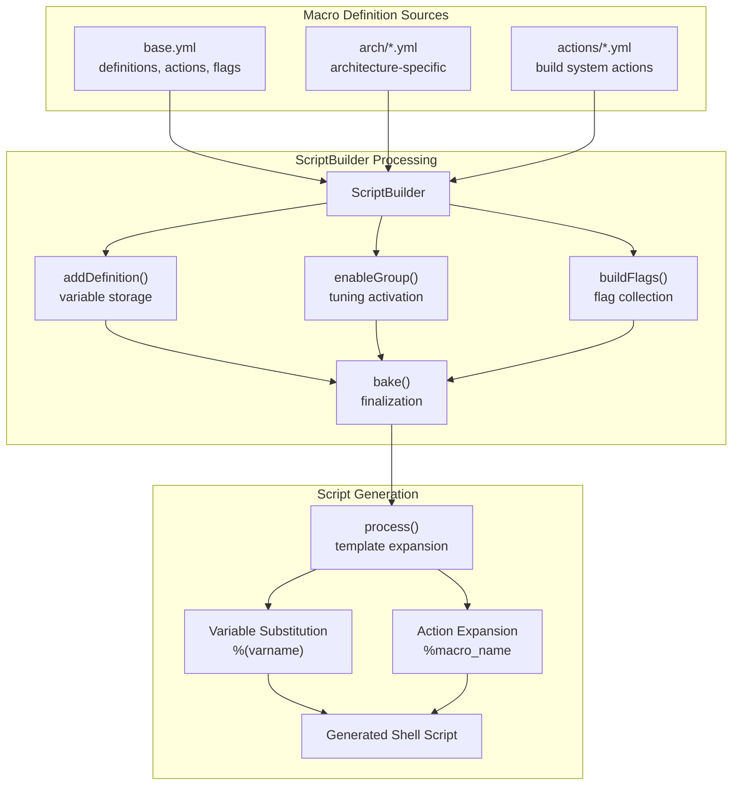
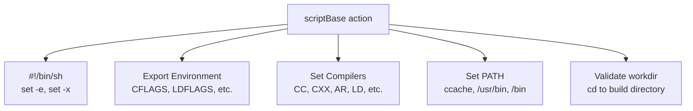
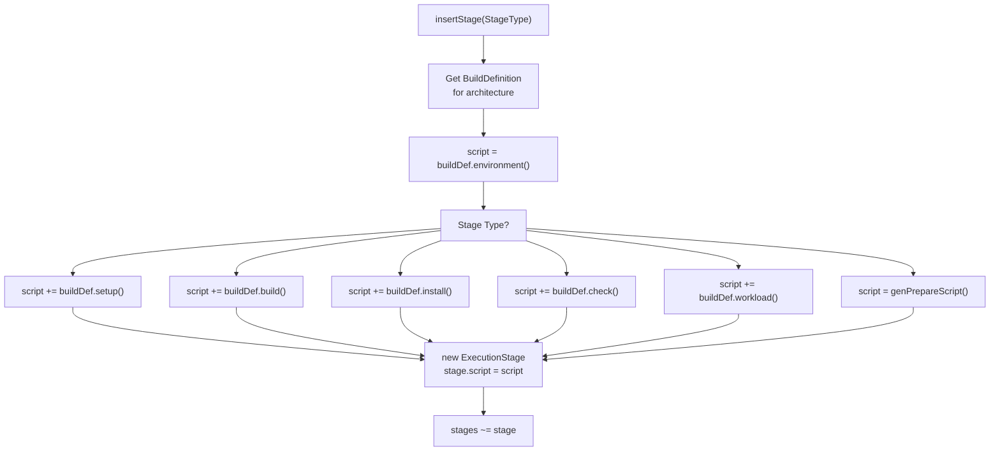
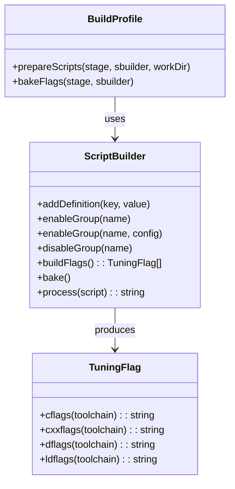
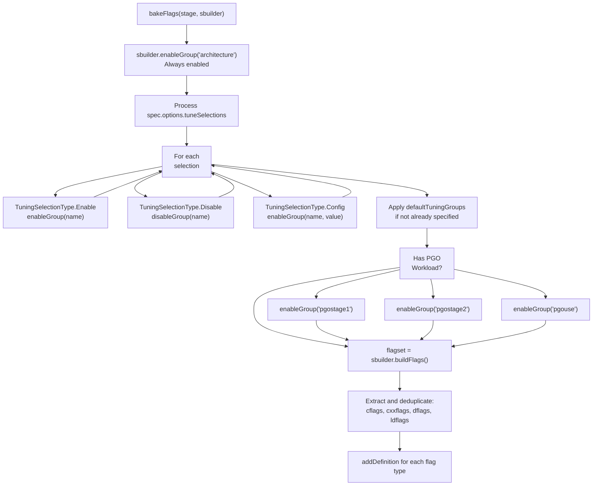

# Macro System Overview

Relevant source files

* [data/macros/arch/base.yml](../data/macros/arch/base.yml)
* [source/mason/build/profile.d](../source/mason/build/profile.d)

## Purpose and Scope

This page documents the macro definition and expansion system used throughout boulder and mason. The macro system provides variable substitution, reusable action snippets, and compiler flag management that allow stone.yml recipes to reference standardized build commands and paths. Macros are defined in YAML configuration files and expanded by the `ScriptBuilder` class during script generation.

For information about specific architecture configurations that use this macro system, see [Architecture Definitions](5.2-architecture-definitions). For details about predefined build action macros, see [Action Macros](5.4-action-macros). For tuning group details and flag resolution, see [Tuning Groups and Compiler Flags](5.3-tuning-groups-and-compiler-flags).

---

## System Architecture

The macro system consists of three primary components: YAML-based macro definitions, the `ScriptBuilder` class that processes these definitions, and the runtime variable substitution that occurs during script generation.



**Sources:** [data/macros/arch/base.yml1-614](../data/macros/arch/base.yml#L1-L614) [source/mason/build/profile.d233-339](../source/mason/build/profile.d#L233-L339)

---

## Variable Definitions

Variables are defined in the `definitions` section of macro files and are substituted using the `%(varname)` syntax. Variables can reference other variables, creating a hierarchy of definitions that are resolved during expansion.

### Standard Variable Categories

| Category | Examples | Purpose |
| --- | --- | --- |
| **Paths** | `%(prefix)`, `%(libdir)`, `%(bindir)` | Standard filesystem locations |
| **Compilers** | `%(cc)`, `%(cxx)`, `%(ar)`, `%(ld)` | Compiler toolchain commands |
| **Build Directories** | `%(buildroot)`, `%(installroot)`, `%(workdir)` | Build-time directory paths |
| **Flags** | `%(cflags)`, `%(ldflags)`, `%(dflags)` | Compiler and linker flags |
| **Metadata** | `%(name)`, `%(version)`, `%(vendorID)` | Package metadata |

### Variable Definition Structure

Variables are defined with a simple key-value structure in YAML:

```
definitions:
    - prefix         : "/usr"
    - libdir         : "%(prefix)/lib%(libsuffix)"
    - bindir         : "%(prefix)/bin"
    - pkgconfigpath  : "%(libdir)/pkgconfig:/usr/share/pkgconfig"
```

The variable `%(libdir)` references `%(prefix)`, demonstrating the hierarchical substitution system. During script building, the `ScriptBuilder` resolves these dependencies to produce final values.

**Sources:** [data/macros/arch/base.yml3-50](../data/macros/arch/base.yml#L3-L50)

---

## Action Macros

Actions are reusable script snippets defined in the `actions` section. They are invoked in stone.yml recipes using the `%action_name` syntax and expand into shell commands during script generation.

### scriptBase Template

The most fundamental action is `scriptBase`, which provides the environment setup prepended to all build scripts:



The `scriptBase` action is automatically merged at the beginning of all generated build scripts. It exports critical environment variables like `CFLAGS`, `LDFLAGS`, `CC`, `CXX`, and sets up the shell environment with error checking.

**Sources:** [data/macros/arch/base.yml52-89](../data/macros/arch/base.yml#L52-L89)

### Action Invocation in BuildProfile

When the `BuildProfile` prepares scripts, it merges the base environment with stage-specific commands:



**Sources:** [source/mason/build/profile.d487-554](../source/mason/build/profile.d#L487-L554)

---

## The ScriptBuilder Class

The `ScriptBuilder` class is the core processor for macro expansion. It accumulates definitions, tuning groups, and flags, then processes scripts to perform variable substitution and macro expansion.

### ScriptBuilder API



**Sources:** [source/mason/build/profile.d233-339](../source/mason/build/profile.d#L233-L339) [source/mason/build/profile.d347-430](../source/mason/build/profile.d#L347-L430)

### Definition Phase

The `prepareScripts` method populates the `ScriptBuilder` with all necessary definitions before script generation:

**Runtime Definitions** (added programmatically):

* `installroot`: Installation staging directory
* `buildroot`: Build working directory
* `workdir`: Current working directory for the stage
* `compiler_cache`: ccache directory path
* `pgo_dir`: Profile-Guided Optimization directory

**Compiler Definitions** (based on toolchain):

* LLVM toolchain: `clang`, `clang++`, `lld`, `llvm-ar`, etc.
* GNU toolchain: `gcc`, `g++`, `ld.bfd`, `gcc-ar`, etc.

**System Macro Loading:**

The `BuildContext.prepareScripts()` method is invoked to load macro definitions from YAML files for the target architecture.

**Sources:** [source/mason/build/profile.d271-339](../source/mason/build/profile.d#L271-L339)

---

## Tuning Groups and Flag Resolution

Tuning groups are named collections of compiler flags that can be enabled, disabled, or configured. The `bakeFlags` method resolves which flags should be active based on tuning group selections.

### Flag Resolution Process



**Sources:** [source/mason/build/profile.d347-430](../source/mason/build/profile.d#L347-L430)

### Tuning Group Structure

Tuning groups are defined in the `tuning` section of base.yml and have several configuration modes:

| Mode | Description | Example |
| --- | --- | --- |
| **enabled** | Single flag set enabled when group is active | `bindnow: enabled: bindnow` |
| **disabled** | Flag set used when group is disabled | `frame-pointer: disabled: omit-frame-pointer` |
| **options** | Multiple named configurations | `optimize: options: {fast, generic, size, speed}` |
| **default** | Default configuration when none specified | `optimize: default: generic` |

**Example from base.yml:**

```
tuning:
    - optimize:
        options:
            - fast:
                enabled: optimize-fast
            - generic:
                enabled: optimize-generic
            - size:
                enabled:
                    - optimize-size
                    - sections
            - speed:
                enabled: optimize-speed
        default: generic
```

When `optimize` is enabled without configuration, it activates `optimize-generic`. When configured as `optimize: speed`, it activates `optimize-speed` instead.

**Sources:** [data/macros/arch/base.yml104-277](../data/macros/arch/base.yml#L104-L277)

---

## Flag Definitions

Flags are defined in the `flags` section and specify compiler/linker arguments for different toolchains. Each flag entry can have toolchain-specific variants.

### Flag Structure

```
flags:
    - flag-name:
        c         : "C compiler flags"
        cxx       : "C++ compiler flags"
        d         : "D compiler flags"
        ld        : "Linker flags"
        llvm:
            c     : "LLVM-specific C flags"
        gnu:
            c     : "GCC-specific C flags"
```

The `TuningFlag` type provides methods to extract appropriate flags for the active toolchain:

* `cflags(Toolchain)`: Returns C compiler flags
* `cxxflags(Toolchain)`: Returns C++ compiler flags
* `dflags(Toolchain)`: Returns D compiler flags
* `ldflags(Toolchain)`: Returns linker flags

### Flag Collection and Deduplication

The `bakeFlags` method performs flag resolution:

1. **Collection:** `sbuilder.buildFlags()` returns all active `TuningFlag` objects
2. **Extraction:** Map each flag to its toolchain-specific string values
3. **Fixup:** Strip whitespace, remove duplicates with `uniq`, filter empty strings
4. **Definition:** Add final flag strings as `%(cflags)`, `%(cxxflags)`, etc.

This ensures that the generated scripts receive a clean, deduplicated set of compiler flags appropriate for the selected toolchain and tuning configuration.

**Sources:** [source/mason/build/profile.d409-430](../source/mason/build/profile.d#L409-L430) [data/macros/arch/base.yml278-527](../data/macros/arch/base.yml#L278-L527)

---

## Script Processing and Expansion

After the `ScriptBuilder` is configured and baked, the `process()` method expands a template script by substituting variables and expanding action macros.

### Substitution Syntax

| Syntax | Meaning | Example |
| --- | --- | --- |
| `%(varname)` | Variable substitution | `%(prefix)` → `/usr` |
| `%action_name` | Action macro expansion | `%cmake` → full cmake command sequence |
| `%%` | Escaped percent | `%%` → `%` |

### Processing Example

**Input template:**

```
cd %(workdir)
%cmake -DCMAKE_INSTALL_PREFIX=%(prefix)
```

**After processing:**

```
cd /builddir/build/x86_64/package-1.0
cmake -DCMAKE_BUILD_TYPE=RelWithDebInfo \
      -DCMAKE_INSTALL_PREFIX=/usr \
      -DCMAKE_INSTALL_LIBDIR=lib \
      ...
```

The `process()` method is called in `BuildProfile.build()` after all definitions and flags have been configured:

**Sources:** [source/mason/build/profile.d233-240](../source/mason/build/profile.d#L233-L240)

---

## Default Tuning Groups

The `defaultTuningGroups` list specifies which tuning groups are enabled by default for all builds. Recipe authors can override these defaults in their stone.yml tune sections.

**Default groups from base.yml:**

* `asneeded`: Link with `--as-needed`
* `avxwidth`: Prefer 128-bit vector width
* `base`: Basic compiler flags (always enabled)
* `bindnow`: Immediate symbol binding (`-z now`)
* `debug`: Debug information (default: `std`)
* `fortify`: Fortify source checks
* `frame-pointer`: Frame pointer handling (default: enabled)
* `harden`: Stack protection (default: `lvl1`)
* `icf`: Identical code folding (default: `safe`)
* `optimize`: Optimization level (default: `generic`)
* `relr`: Relative relocations
* `symbolic`: Symbolic linking (default: `functions`)

The `bakeFlags` method applies these defaults only if the stone.yml hasn't explicitly configured them:

**Sources:** [data/macros/arch/base.yml90-102](../data/macros/arch/base.yml#L90-L102) [source/mason/build/profile.d379-386](../source/mason/build/profile.d#L379-L386)

---

## Integration with Build Pipeline

The macro system integrates into the build pipeline at the script generation phase. The sequence from recipe to execution is:

```mermaid
sequenceDiagram
  participant stone.yml
  participant Controller
  participant BuildProfile
  participant ScriptBuilder
  participant ExecutionStage
  participant /bin/sh

  stone.yml->>Controller: parseRecipe()
  Controller->>BuildProfile: new BuildProfile(arch)
  BuildProfile->>BuildProfile: insertStage(StageType)
  note over BuildProfile: For each stage...
  BuildProfile->>ScriptBuilder: new ScriptBuilder()
  BuildProfile->>ScriptBuilder: addDefinition(key, value)
  BuildProfile->>ScriptBuilder: enableGroup(name)
  BuildProfile->>ScriptBuilder: bake()
  ScriptBuilder->>ScriptBuilder: Resolve all definitions
  BuildProfile->>ScriptBuilder: process(template)
  ScriptBuilder-->>BuildProfile: Expanded script string
  BuildProfile->>ExecutionStage: new ExecutionStage()
  BuildProfile->>ExecutionStage: stage.script = expanded
  BuildProfile->>BuildProfile: build()
  BuildProfile->>BuildProfile: runStage(stage, workdir, script)
  BuildProfile->>/bin/sh: execute script
  /bin/sh-->>BuildProfile: exit code
```

**Sources:** [source/mason/build/profile.d194-249](../source/mason/build/profile.d#L194-L249) [source/mason/build/profile.d271-339](../source/mason/build/profile.d#L271-L339)

---

## Package Template Definitions

The macro system also provides package templates in the `packages` section. These define standard subpackage patterns with paths and dependencies:

| Template | Purpose | Key Paths |
| --- | --- | --- |
| `%(name)` | Main package | All files (`*`) |
| `%(name)-devel` | Development files | `/usr/include`, `/usr/lib/*.so`, `/usr/lib/pkgconfig` |
| `%(name)-docs` | Documentation | `/usr/share/gtk-doc` |
| `%(name)-dbginfo` | Debug symbols | `/usr/lib/debug` |
| `%(name)-32bit` | 32-bit libraries | `/usr/lib32` |
| `%(name)-32bit-devel` | 32-bit development | `/usr/lib32/pkgconfig` |

These templates are referenced during package emission to automatically split files into appropriate subpackages based on their paths.

**Sources:** [data/macros/arch/base.yml529-614](../data/macros/arch/base.yml#L529-L614)