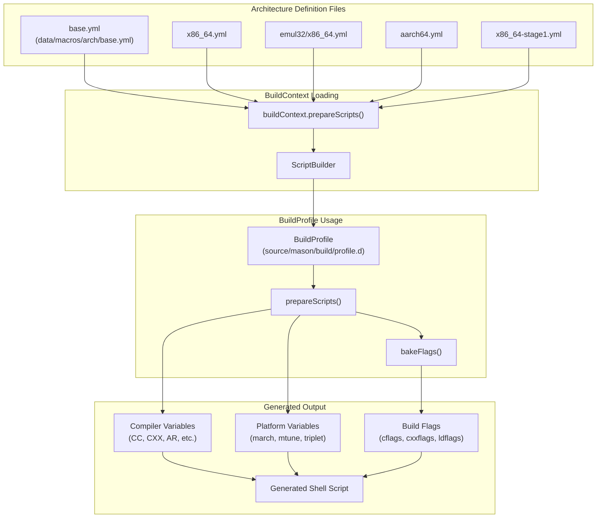
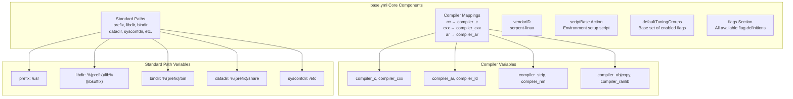
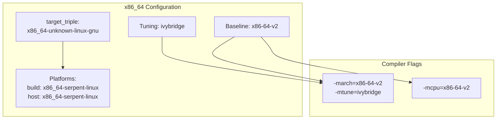
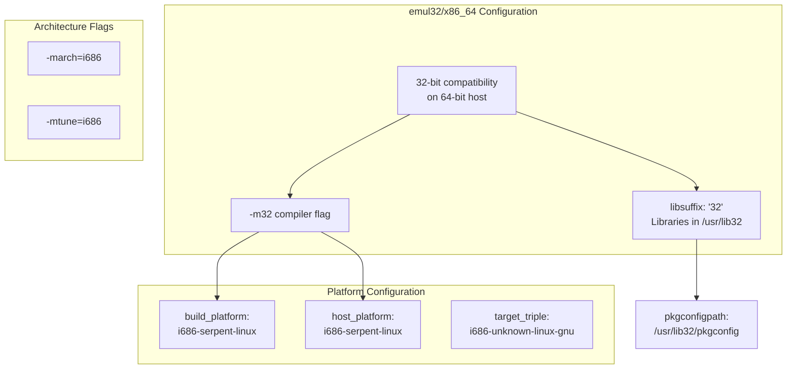
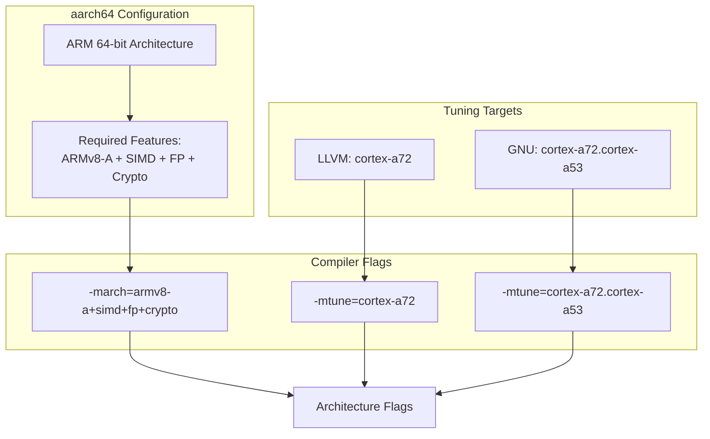
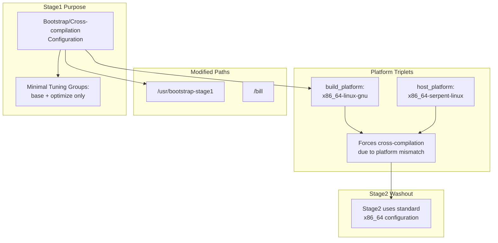
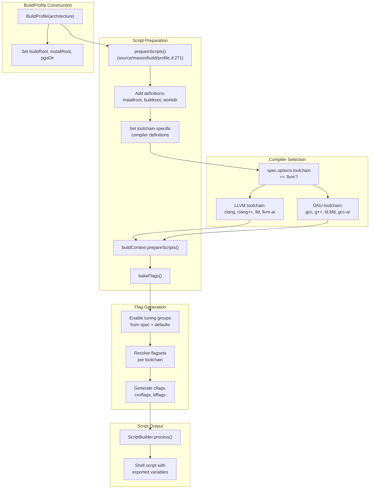
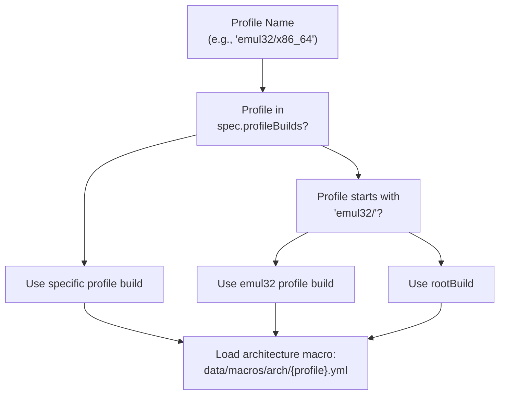

# Architecture Definitions

Relevant source files

* [data/macros/actions/cargo.yml](../data/macros/actions/cargo.yml)
* [data/macros/arch/aarch64.yml](../data/macros/arch/aarch64.yml)
* [data/macros/arch/base.yml](../data/macros/arch/base.yml)
* [data/macros/arch/emul32/x86\_64.yml](../data/macros/arch/emul32/x86_64.yml)
* [data/macros/arch/x86.yml](../data/macros/arch/x86.yml)
* [data/macros/arch/x86\_64-stage1.yml](../data/macros/arch/x86_64-stage1.yml)
* [data/macros/arch/x86\_64.yml](../data/macros/arch/x86_64.yml)
* [source/mason/build/profile.d](../source/mason/build/profile.d)

## Purpose and Scope

Architecture definitions provide platform-specific build configurations that control how packages are compiled for different processor architectures. These configuration files specify compiler settings, optimization flags, platform triples, library paths, and other architecture-dependent parameters that mason's BuildProfile uses during package compilation.

For information about how these definitions are used in flag generation and compiler selection, see [Tuning Groups and Compiler Flags](5.3-tuning-groups-and-compiler-flags). For details on the broader macro system, see [Macro System Overview](5.1-macro-system-overview).

---

## Architecture Definition System Overview



**Architecture Configuration Flow**

Sources: [data/macros/arch/base.yml1-614](../data/macros/arch/base.yml#L1-L614) [source/mason/build/profile.d271-339](../source/mason/build/profile.d#L271-L339)

---

## Available Architectures

The boulder-d-legacy/ system supports the following architecture configurations:

| Architecture | File Path | Purpose | Library Suffix |
| --- | --- | --- | --- |
| **x86\_64** | `data/macros/arch/x86_64.yml` | Primary 64-bit x86 architecture | `` (none) |
| **emul32/x86\_64** | `data/macros/arch/emul32/x86_64.yml` | 32-bit compatibility on x86\_64 hosts | `32` |
| **aarch64** | `data/macros/arch/aarch64.yml` | ARM 64-bit architecture | `` (none) |
| **x86** | `data/macros/arch/x86.yml` | Native 32-bit x86 architecture | `32` |
| **x86\_64-stage1** | `data/macros/arch/x86_64-stage1.yml` | Bootstrap stage1 configuration | `` (none) |

Sources: [data/macros/arch/x86\_64.yml1-23](../data/macros/arch/x86_64.yml#L1-L23) [data/macros/arch/emul32/x86\_64.yml1-22](../data/macros/arch/emul32/x86_64.yml#L1-L22) [data/macros/arch/aarch64.yml1-25](../data/macros/arch/aarch64.yml#L1-L25) [data/macros/arch/x86\_64-stage1.yml1-31](../data/macros/arch/x86_64-stage1.yml#L1-L31)

---

## Architecture Definition Structure

Each architecture definition file is a YAML configuration with three main sections:

### Definitions Section

The `definitions` section specifies platform-specific variables that are substituted into build scripts:

```
definitions:
    - libsuffix      : ""              # Library directory suffix (e.g., "32")
    - build_platform : x86_64-serpent-linux
    - host_platform  : x86_64-serpent-linux
    - cc             : "%(compiler_c)"
    - cxx            : "%(compiler_cxx)"
    - march          : x86-64-v2       # CPU architecture target
    - mtune          : ivybridge        # CPU tuning target
    - target_triple  : "x86_64-unknown-linux-gnu"
```

These definitions are used throughout build scripts via the `%(variable)` substitution syntax.

Sources: [data/macros/arch/x86\_64.yml3-14](../data/macros/arch/x86_64.yml#L3-L14)

### Flags Section

The `flags` section defines compiler and linker flags specific to this architecture:

```
flags:
    - architecture:
        c         : "-march=x86-64-v2 -mtune=ivybridge"
        cxx       : "-march=x86-64-v2 -mtune=ivybridge"
        d         : "-mcpu=x86-64-v2"
```

Flags can be toolchain-specific (LLVM vs GNU) by nesting under `llvm:` or `gnu:` keys.

Sources: [data/macros/arch/x86\_64.yml16-23](../data/macros/arch/x86_64.yml#L16-L23)

### Default Tuning Groups Section

The `defaultTuningGroups` section (present in base.yml and can be overridden) specifies which tuning groups are enabled by default:

```
defaultTuningGroups :
    - asneeded
    - avxwidth
    - base
    - bindnow
    - debug
    - fortify
    - frame-pointer
    - harden
    - icf
    - optimize
    - relr
    - symbolic
```

Sources: [data/macros/arch/base.yml90-102](../data/macros/arch/base.yml#L90-L102)

---

## Base Architecture Configuration

The `base.yml` file provides the foundation that all architecture-specific files inherit and override:



**Base Configuration Components**

### Standard Paths

Base paths defined in [data/macros/arch/base.yml5-27](../data/macros/arch/base.yml#L5-L27):

* `prefix` - Installation prefix (`/usr`)
* `libdir` - Library directory (`%(prefix)/lib%(libsuffix)`)
* `bindir` - Binary directory (`%(prefix)/bin`)
* `sbindir` - System binary directory (`%(prefix)/sbin`)
* `includedir` - Header directory (`%(prefix)/include`)
* `datadir` - Data directory (`%(prefix)/share`)
* `sysconfdir` - Configuration directory (`/etc`)
* `localstatedir` - Variable state directory (`/var`)

### Vendor Configuration

The `vendorID` variable ([data/macros/arch/base.yml31](../data/macros/arch/base.yml#L31-L31)) is set to `serpent-linux` and is used in platform triplets like `x86_64-serpent-linux`.

### Script Base Template

The `scriptBase` action ([data/macros/arch/base.yml55-88](../data/macros/arch/base.yml#L55-L88)) generates the environment preamble for all build scripts, exporting critical variables:

* Compiler paths (`CC`, `CXX`, `AR`, `LD`, etc.)
* Compiler flags (`CFLAGS`, `CXXFLAGS`, `LDFLAGS`, `DFLAGS`)
* Build environment (`PATH`, `PKG_CONFIG_PATH`, `CCACHE_DIR`)
* Locale settings (`LANG`, `LC_ALL`)

Sources: [data/macros/arch/base.yml1-89](../data/macros/arch/base.yml#L1-L89)

---

## Architecture-Specific Configurations

### x86\_64 Architecture



**x86\_64 Architecture Settings**

The x86\_64 architecture ([data/macros/arch/x86\_64.yml](../data/macros/arch/x86_64.yml)) targets the x86-64-v2 microarchitecture level, which requires:

* SSE3, SSSE3, SSE4.1, SSE4.2, POPCNT
* Compatible with Intel Nehalem and later, AMD Bulldozer and later

**Key Definitions:**

* `march`: `x86-64-v2` - Minimum CPU feature set
* `mtune`: `ivybridge` - Optimization target
* `target_triple`: `x86_64-unknown-linux-gnu` - LLVM/Rust target
* `libsuffix`: `""` - No library suffix (native 64-bit)

Sources: [data/macros/arch/x86\_64.yml1-23](../data/macros/arch/x86_64.yml#L1-L23)

---

### emul32/x86\_64 Architecture



**emul32/x86\_64 Multilib Configuration**

The emul32 architecture ([data/macros/arch/emul32/x86\_64.yml](../data/macros/arch/emul32/x86_64.yml)) enables 32-bit compatibility libraries on 64-bit x86\_64 systems:

**Key Features:**

* Compilers invoked with `-m32` flag ([data/macros/arch/emul32/x86\_64.yml8-10](../data/macros/arch/emul32/x86_64.yml#L8-L10))
* `libsuffix` set to `"32"`, placing libraries in `/usr/lib32`
* Platform triplets changed to `i686-serpent-linux`
* `pkgconfigpath` includes `/usr/lib32/pkgconfig` for 32-bit pkg-config files

**Usage:** This configuration is activated when building the `emul32` profile, allowing the same package to produce both 64-bit and 32-bit binaries.

Sources: [data/macros/arch/emul32/x86\_64.yml1-22](../data/macros/arch/emul32/x86_64.yml#L1-L22)

---

### aarch64 Architecture



**aarch64 Architecture Settings**

The aarch64 architecture ([data/macros/arch/aarch64.yml](../data/macros/arch/aarch64.yml)) targets ARM 64-bit systems with cryptographic extensions:

**Baseline Features:**

* ARMv8-A base instruction set
* SIMD (Advanced SIMD / NEON)
* Floating-point (FP)
* Cryptographic extensions (crypto)

**Toolchain-Specific Tuning:**
The configuration uses different tuning targets based on the compiler toolchain ([data/macros/arch/aarch64.yml18-24](../data/macros/arch/aarch64.yml#L18-L24)):

* **LLVM:** `-mtune=cortex-a72` (single core target)
* **GNU:** `-mtune=cortex-a72.cortex-a53` (big.LITTLE configuration)

**Platform Settings:**

* `target_triple`: `aarch64-unknown-linux-gnu`
* `build_platform` / `host_platform`: `aarch64-serpent-linux`

Sources: [data/macros/arch/aarch64.yml1-25](../data/macros/arch/aarch64.yml#L1-L25)

---

### x86\_64-stage1 Bootstrap Architecture



**Bootstrap Stage1 Configuration**

The x86\_64-stage1 architecture ([data/macros/arch/x86\_64-stage1.yml](../data/macros/arch/x86_64-stage1.yml)) is specifically designed for bootstrap builds:

**Modified Settings:**

* `prefix`: `/usr/bootstrap-stage1` instead of `/usr` ([data/macros/arch/x86\_64-stage1.yml9](../data/macros/arch/x86_64-stage1.yml#L9-L9))
* `bootstrap_root`: `/bill` - Bootstrap root directory
* `build_platform`: `x86_64-linux-gnu` (generic Linux)
* `host_platform`: `x86_64-serpent-linux` (forces cross-compilation)

**Reduced Tuning:**
Only two tuning groups are enabled by default ([data/macros/arch/x86\_64-stage1.yml28-30](../data/macros/arch/x86_64-stage1.yml#L28-L30)):

* `base` - Basic compilation flags
* `optimize` - Optimization flags

This minimal configuration ensures the bootstrap process has fewer dependencies and complexity. The mismatch between build and host platforms forces the build system to treat it as a cross-compilation, which is washed out in stage2 when the standard x86\_64 configuration is used.

Sources: [data/macros/arch/x86\_64-stage1.yml1-31](../data/macros/arch/x86_64-stage1.yml#L1-L31)

---

## Integration with BuildProfile



**BuildProfile Architecture Integration**

### Toolchain-Specific Compiler Setup

The `prepareScripts()` method ([source/mason/build/profile.d271-339](../source/mason/build/profile.d#L271-L339)) sets up compilers based on the toolchain specified in the recipe:

**LLVM Toolchain** ([source/mason/build/profile.d294-309](../source/mason/build/profile.d#L294-L309)):

```
compiler_c       → clang
compiler_cxx     → clang++
compiler_d       → ldc2
compiler_ar      → llvm-ar
compiler_ld      → ld.lld
compiler_objcopy → llvm-objcopy
compiler_nm      → llvm-nm
compiler_ranlib  → llvm-ranlib
compiler_strip   → llvm-strip
```

**GNU Toolchain** ([source/mason/build/profile.d313-327](../source/mason/build/profile.d#L313-L327)):

```
compiler_c       → gcc
compiler_cxx     → g++
compiler_d       → ldc2
compiler_ar      → gcc-ar
compiler_ld      → ld.bfd
compiler_objcopy → objcopy
compiler_nm      → gcc-nm
compiler_ranlib  → gcc-ranlib
compiler_strip   → strip
```

### Architecture-Specific Variable Loading

After setting compiler definitions, `buildContext.prepareScripts(sbuilder, architecture)` is called ([source/mason/build/profile.d333](../source/mason/build/profile.d#L333-L333)) to load the architecture-specific macro file, which overlays definitions on top of base.yml.

### Flag Resolution

The `bakeFlags()` method ([source/mason/build/profile.d347-430](../source/mason/build/profile.d#L347-L430)) resolves compiler flags:

1. Enables the `architecture` group (always enabled)
2. Processes tuning selections from the recipe spec
3. Applies default tuning groups for the architecture
4. Resolves flags per toolchain (LLVM vs GNU)
5. Generates final `cflags`, `cxxflags`, `dflags`, and `ldflags` strings

Sources: [source/mason/build/profile.d36-106](../source/mason/build/profile.d#L36-L106) [source/mason/build/profile.d271-430](../source/mason/build/profile.d#L271-L430)

---

## Platform Triple Usage

Platform triples are used throughout the build system for cross-compilation support and toolchain targeting:

| Variable | Purpose | Example Value |
| --- | --- | --- |
| `build_platform` | Platform where compilation occurs | `x86_64-serpent-linux` |
| `host_platform` | Platform where binaries will run | `x86_64-serpent-linux` |
| `target_triple` | LLVM/Rust target specification | `x86_64-unknown-linux-gnu` |

**Usage in Actions:**

The `target_triple` variable is used in cargo actions ([data/macros/actions/cargo.yml12](../data/macros/actions/cargo.yml#L12-L12)) for Rust cross-compilation:

```
cargo build -v -j "%(jobs)" --frozen --release --target %(target_triple)
```

The platform triplets are used by configure scripts for cross-compilation detection and toolchain configuration.

Sources: [data/macros/arch/base.yml29-31](../data/macros/arch/base.yml#L29-L31) [data/macros/actions/cargo.yml10-15](../data/macros/actions/cargo.yml#L10-L15)

---

## Architecture Definition Lookup

The BuildProfile determines which architecture definition to load based on the profile name:



**Profile Build Definition Resolution**

When a BuildProfile is constructed for a specific architecture ([source/mason/build/profile.d44](../source/mason/build/profile.d#L44-L44)), the system looks up the appropriate BuildDefinition using the logic in methods like `insertStage()` ([source/mason/build/profile.d487-503](../source/mason/build/profile.d#L487-L503)):

1. Check if the exact architecture name exists in `spec.profileBuilds`
2. If the architecture starts with `emul32/`, check for a generic `emul32` profile
3. Otherwise, fall back to `spec.rootBuild`

This allows emul32 builds to share a common build definition while still supporting architecture-specific overrides when needed.

Sources: [source/mason/build/profile.d487-503](../source/mason/build/profile.d#L487-L503)

---

## Summary

Architecture definitions form the foundation of boulder-d-legacy/'s multi-architecture build support. They provide:

* **Platform-specific compiler settings** - Toolchain selection and compiler flags
* **Target architecture specifications** - CPU baseline and tuning targets
* **Path configuration** - Library directories and installation prefixes
* **Build system integration** - Platform triples for configure scripts and Rust/cargo
* **Bootstrap support** - Special configurations for toolchain bootstrapping
* **Multilib support** - 32-bit compatibility through emul32 profiles

The architecture system integrates tightly with BuildProfile ([source/mason/build/profile.d](../source/mason/build/profile.d)) to generate appropriate build environments and compiler flags for each target platform, enabling boulder to produce optimized packages for multiple architectures from a single recipe.