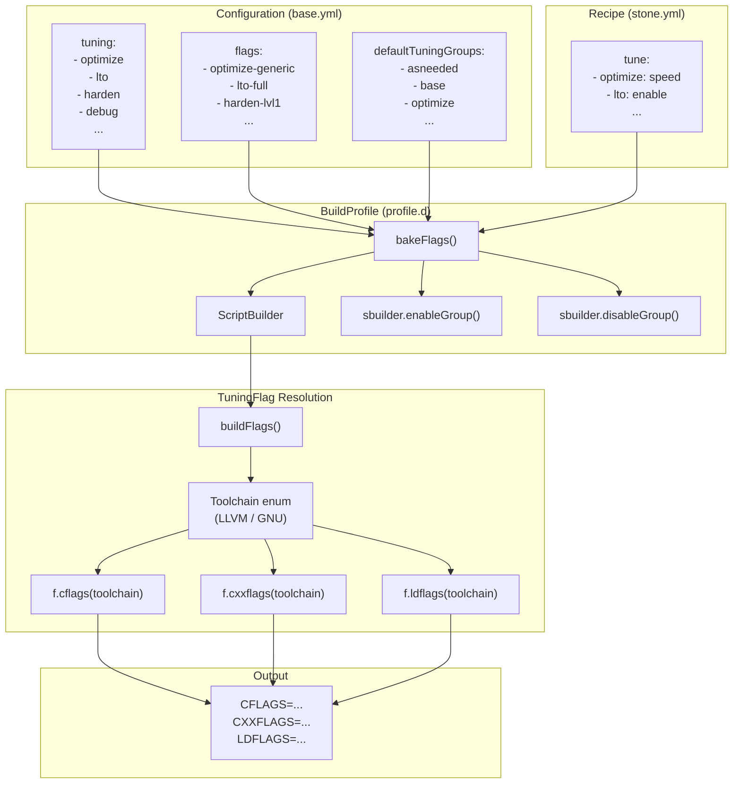
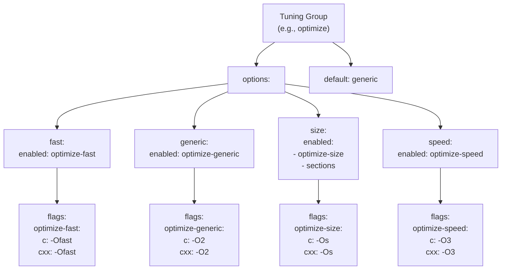
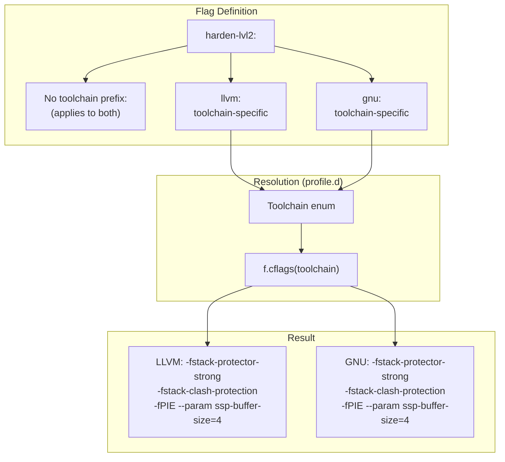

# Tuning Groups and Compiler Flags

Relevant source files

* [data/macros/arch/base.yml](../data/macros/arch/base.yml)
* [source/mason/build/profile.d](../source/mason/build/profile.d)

This page documents the tuning group system and compiler flag infrastructure that controls how packages are compiled in boulder-d-legacy/. Tuning groups provide a high-level mechanism to enable or disable sets of compiler flags (optimization levels, hardening features, debug information, LTO, PGO, etc.), while the flag definitions specify the actual compiler arguments for different toolchains (LLVM vs GNU).

For information about architecture-specific configuration including compiler toolchain selection, see [Architecture Definitions](5.2-architecture-definitions). For details on how these flags are incorporated into build scripts, see [Macro System Overview](5.1-macro-system-overview).

## System Overview

The tuning system consists of three main components:

1. **Tuning Groups** - High-level feature toggles (e.g., `optimize`, `lto`, `harden`)
2. **Flag Definitions** - Actual compiler arguments associated with each group
3. **Flag Resolution** - Runtime logic that selects appropriate flags based on toolchain and tuning selections



**Sources:** [data/macros/arch/base.yml90-527](../data/macros/arch/base.yml#L90-L527) [source/mason/build/profile.d347-430](../source/mason/build/profile.d#L347-L430)

## Default Tuning Groups

The `defaultTuningGroups` array defines which tuning groups are enabled by default for all builds unless explicitly overridden in the recipe:

```
defaultTuningGroups:
    - asneeded
    - avxwidth
    - base
    - bindnow
    - debug
    - fortify
    - frame-pointer
    - harden
    - icf
    - optimize
    - relr
    - symbolic
```

These defaults establish a baseline of optimizations and hardening features. Recipes can override any of these by explicitly enabling, disabling, or configuring them in the `tune:` section.

**Sources:** [data/macros/arch/base.yml90-102](../data/macros/arch/base.yml#L90-L102)

## Tuning Group Structure

Each tuning group in the `tuning:` section defines a logical feature that can be toggled. Groups support three states:

| State | Description |
| --- | --- |
| `enabled` | Single flag group to enable when the feature is turned on |
| `disabled` | Single flag group to enable when the feature is turned off |
| `options` | Multiple mutually-exclusive configurations with a `default` |

### Tuning Group Definition Diagram



**Sources:** [data/macros/arch/base.yml162-174](../data/macros/arch/base.yml#L162-L174) [data/macros/arch/base.yml346-367](../data/macros/arch/base.yml#L346-L367)

### Common Tuning Group Patterns

**Simple Toggle (Enabled/Disabled):**

```
- frame-pointer:
    enabled: no-omit-frame-pointer
    disabled: omit-frame-pointer
```

**Options with Default:**

```
- optimize:
    options:
        - fast:
            enabled: optimize-fast
        - generic:
            enabled: optimize-generic
        - size:
            enabled:
                - optimize-size
                - sections
        - speed:
            enabled: optimize-speed
    default: generic
```

**Always Enabled (No Toggle):**

```
- architecture:
    enabled:
        - architecture
```

**Sources:** [data/macros/arch/base.yml104-276](../data/macros/arch/base.yml#L104-L276)

## Compiler Flag Definitions

The `flags:` section maps flag group names (referenced by tuning groups) to actual compiler arguments. Each flag group specifies arguments for different compilers:

| Field | Description |
| --- | --- |
| `c` | C compiler flags (`CFLAGS`) |
| `cxx` | C++ compiler flags (`CXXFLAGS`) |
| `d` | D compiler flags (`DFLAGS`) |
| `ld` | Linker flags (`LDFLAGS`) |

### Toolchain-Specific Flag Organization



**Sources:** [data/macros/arch/base.yml333-339](../data/macros/arch/base.yml#L333-L339) [source/mason/build/profile.d420-424](../source/mason/build/profile.d#L420-L424)

### Example Flag Definitions

**Toolchain-Agnostic Flags:**

```
- base:
    c         : "-pipe -Wformat -Wformat-security -Wno-error -fPIC"
    cxx       : "-pipe -Wformat -Wformat-security -Wno-error -fPIC"
    ld        : "-Wl,-O2,--gc-sections"
    d         : "-release -Hkeep-all-bodies -relocation-model=pic -wi"
```

**Toolchain-Specific Flags:**

```
- lto-full:
    gnu:
        c         : "-flto=%(jobs)"
        cxx       : "-flto=%(jobs)"
        ld        : "-flto=%(jobs)"
    llvm:
        c         : "-flto"
        cxx       : "-flto"
        d         : "-flto=full"
        ld        : "-flto"
```

**LLVM-Only Flags:**

```
- icf-safe:
    llvm:
        ld    : "-Wl,--icf=safe"
```

**Sources:** [data/macros/arch/base.yml287-291](../data/macros/arch/base.yml#L287-L291) [data/macros/arch/base.yml370-379](../data/macros/arch/base.yml#L370-L379) [data/macros/arch/base.yml410-412](../data/macros/arch/base.yml#L410-L412)

## Major Tuning Groups

### Optimization Levels

| Group | Options | Default | Description |
| --- | --- | --- | --- |
| `optimize` | `fast`, `generic`, `size`, `speed` | `generic` | Compiler optimization level |

* **fast**: `-Ofast` (aggressive optimization, may break standards compliance)
* **generic**: `-O2` (balanced optimization)
* **size**: `-Os` (optimize for size, enables section splitting)
* **speed**: `-O3` (optimize for speed)

**Sources:** [data/macros/arch/base.yml162-174](../data/macros/arch/base.yml#L162-L174) [data/macros/arch/base.yml346-367](../data/macros/arch/base.yml#L346-L367)

### Link-Time Optimization (LTO)

| Group | Options | Default | Description |
| --- | --- | --- | --- |
| `lto` | `full`, `thin` | `full` | Link-time optimization mode |
| `ltoextra` | `full`, `thin` | `full` | Additional LTO optimizations (requires `lto`) |

**LTO Full (GNU):**

* C/C++: `-flto=%(jobs)` (uses all available jobs for parallel LTO)

**LTO Full (LLVM):**

* C/C++: `-flto`
* D: `-flto=full`

**LTO Thin (LLVM only):**

* C/C++/D: `-flto=thin`

**LTOextra** adds whole-program vtable optimizations for LLVM and devirtualization for GNU.

**Sources:** [data/macros/arch/base.yml176-192](../data/macros/arch/base.yml#L176-L192) [data/macros/arch/base.yml369-402](../data/macros/arch/base.yml#L369-L402)

### Hardening Features

| Group | Options | Default | Description |
| --- | --- | --- | --- |
| `harden` | `none`, `lvl1`, `lvl2` | `lvl1` | Stack protection level |
| `fortify` | (toggle) | enabled | `_FORTIFY_SOURCE=2` |
| `bindnow` | (toggle) | enabled | Immediate symbol binding (`-z now`) |
| `relr` | (toggle) | enabled | Relative relocations packing |

**Hardening Levels:**

* **none**: `-fno-stack-protector`
* **lvl1**: `-fstack-protector --param ssp-buffer-size=32`
* **lvl2**: `-fstack-protector-strong -fstack-clash-protection -fPIE --param ssp-buffer-size=4`

**Sources:** [data/macros/arch/base.yml145-159](../data/macros/arch/base.yml#L145-L159) [data/macros/arch/base.yml318-339](../data/macros/arch/base.yml#L318-L339)

### Debug Information

| Group | Options | Default | Description |
| --- | --- | --- | --- |
| `debug` | `lines`, `std` | `std` | Debug information level |
| `frame-pointer` | (toggle) | enabled | Frame pointer preservation |

**Debug Levels:**

* **lines (LLVM)**: `-gline-tables-only -fasynchronous-unwind-tables` (minimal debug info)
* **std (LLVM)**: `-g -fasynchronous-unwind-tables`
* **std (GNU)**: `-g -feliminate-unused-debug-types -fasynchronous-unwind-tables`

**Sources:** [data/macros/arch/base.yml117-128](../data/macros/arch/base.yml#L117-L128) [data/macros/arch/base.yml440-455](../data/macros/arch/base.yml#L440-L455)

### Identical Code Folding (ICF)

| Group | Options | Default | Description |
| --- | --- | --- | --- |
| `icf` | `safe`, `all` | `safe` | LLVM linker ICF optimization |

* **safe**: `-Wl,--icf=safe` (only fold functions provably identical)
* **all**: `-Wl,--icf=all` (aggressive folding)

ICF is only available with the LLVM toolchain.

**Sources:** [data/macros/arch/base.yml194-201](../data/macros/arch/base.yml#L194-L201) [data/macros/arch/base.yml404-412](../data/macros/arch/base.yml#L404-L412)

### Advanced Optimization Features

| Group | Description |
| --- | --- |
| `polly` | LLVM Polly loop optimizer |
| `bolt` | Prepare for LLVM BOLT post-link optimization |
| `sections` | Function/data section splitting (`-ffunction-sections -fdata-sections`) |
| `noplt` | Disable PLT (`-fno-plt`, requires `bindnow`) |
| `nosemantic` | Disable semantic interposition (`-fno-semantic-interposition`) |
| `math` | Fast math optimizations |
| `sse2avx` | Convert SSE2 to AVX (GNU only) |

**Sources:** [data/macros/arch/base.yml207-259](../data/macros/arch/base.yml#L207-L259) [data/macros/arch/base.yml419-507](../data/macros/arch/base.yml#L419-L507)

## Flag Resolution Process

The `bakeFlags()` method in `BuildProfile` resolves which compiler flags to use based on tuning selections and toolchain:

```mermaid
flowchart TD

Start["bakeFlags(stage, sbuilder)"]
SetToolchain["Set toolchain:<br>LLVM or GNU"]
EnableArch["Enable 'architecture' group<br>(always enabled)"]
ProcessTune["Process tune selections<br>from stone.yml spec"]
EnableLoop["For each tune selection:"]
EnableAction["Unsupported markdown: list"]
ApplyDefaults["Apply defaultTuningGroups"]
DefaultLoop["For each default group:"]
CheckOverride["If not overridden by spec:"]
EnableDefault["sbuilder.enableGroup(group)"]
EnablePGO["Enable PGO groups if applicable:<br>- pgostage1<br>- pgostage2<br>- pgouse"]
BuildFlags["flagset = sbuilder.buildFlags()"]
ExtractFlags["Extract flags by language:<br>- cflags = f.cflags(toolchain)<br>- cxxflags = f.cxxflags(toolchain)<br>- dflags = f.dflags(toolchain)<br>- ldflags = f.ldflags(toolchain)"]
FixupFlags["Fixup flags:<br>- Strip whitespace<br>- Remove duplicates (uniq)<br>- Join with spaces"]
AddDefs["Add definitions to ScriptBuilder:<br>- sbuilder.addDefinition('cflags', cflags)<br>- sbuilder.addDefinition('cxxflags', cxxflags)<br>- sbuilder.addDefinition('dflags', dflags)<br>- sbuilder.addDefinition('ldflags', ldflags)"]
End["Flags available in build script<br>as %(cflags), %(cxxflags), etc."]

Start --> SetToolchain
SetToolchain --> EnableArch
EnableArch --> ProcessTune
ProcessTune --> EnableLoop
EnableLoop --> EnableAction
EnableAction --> ApplyDefaults
ApplyDefaults --> DefaultLoop
DefaultLoop --> CheckOverride
CheckOverride --> EnableDefault
EnableDefault --> EnablePGO
EnablePGO --> BuildFlags
BuildFlags --> ExtractFlags
ExtractFlags --> FixupFlags
FixupFlags --> AddDefs
AddDefs --> End
```



**Sources:** [source/mason/build/profile.d347-430](../source/mason/build/profile.d#L347-L430)

### Resolution Logic Implementation

The `bakeFlags()` method performs the following steps:

1. **Determine Toolchain** ([source/mason/build/profile.d356-357](../source/mason/build/profile.d#L356-L357)):

   ```
   auto toolchain = buildContext.spec.options.toolchain == "llvm"
       ? Toolchain.LLVM : Toolchain.GNU;
   ```
2. **Enable Architecture Group** ([source/mason/build/profile.d360](../source/mason/build/profile.d#L360-L360)):

   ```
   sbuilder.enableGroup("architecture");
   ```
3. **Process Recipe Tuning Selections** ([source/mason/build/profile.d363-377](../source/mason/build/profile.d#L363-L377)):

   ```
   foreach (ref t; buildContext.spec.options.tuneSelections)
   {
       final switch (t.type)
       {
       case TuningSelectionType.Enable:
           sbuilder.enableGroup(t.name);
           break;
       case TuningSelectionType.Disable:
           sbuilder.disableGroup(t.name);
           break;
       case TuningSelectionType.Config:
           sbuilder.enableGroup(t.name, t.configValue);
           break;
       }
   }
   ```
4. **Apply Default Tuning Groups** ([source/mason/build/profile.d380-386](../source/mason/build/profile.d#L380-L386)):

   ```
   foreach (w; buildContext.defaultTuningGroups(architecture))
   {
       if (!buildContext.spec.options.hasTuningSelection(w))
       {
           sbuilder.enableGroup(w);
       }
   }
   ```
5. **Enable PGO Groups** ([source/mason/build/profile.d389-407](../source/mason/build/profile.d#L389-L407)) - For PGO builds, stage-specific groups are enabled
6. **Build and Extract Flags** ([source/mason/build/profile.d420-424](../source/mason/build/profile.d#L420-L424)):

   ```
   auto flagset = sbuilder.buildFlags();
   auto cflags = fixupFlags(flagset.map!((f) => f.cflags(toolchain)));
   auto cxxflags = fixupFlags(flagset.map!((f) => f.cxxflags(toolchain)));
   auto dflags = fixupFlags(flagset.map!((f) => f.dflags(toolchain)));
   auto ldflags = fixupFlags(flagset.map!((f) => f.ldflags(toolchain)));
   ```
7. **Store as Definitions** ([source/mason/build/profile.d426-429](../source/mason/build/profile.d#L426-L429)):

   ```
   sbuilder.addDefinition("cflags", cflags);
   sbuilder.addDefinition("cxxflags", cxxflags);
   sbuilder.addDefinition("dflags", dflags);
   sbuilder.addDefinition("ldflags", ldflags);
   ```

**Sources:** [source/mason/build/profile.d347-430](../source/mason/build/profile.d#L347-L430)

## Toolchain Detection and Compiler Variables

The toolchain selection (LLVM vs GNU) also determines which compiler binaries are used:

### LLVM Toolchain

```
compiler_c: clang
compiler_cxx: clang++
compiler_d: ldc2
compiler_ar: llvm-ar
compiler_ld: ld.lld
compiler_objcopy: llvm-objcopy
compiler_nm: llvm-nm
compiler_ranlib: llvm-ranlib
compiler_strip: llvm-strip
```

### GNU Toolchain

```
compiler_c: gcc
compiler_cxx: g++
compiler_d: ldc2  # Note: GDC support is a TODO
compiler_ar: gcc-ar
compiler_ld: ld.bfd
compiler_objcopy: objcopy
compiler_nm: gcc-nm
compiler_ranlib: gcc-ranlib
compiler_strip: strip
```

These compiler variables are set in `prepareScripts()` and made available as macro definitions like `%(cc)`, `%(cxx)`, etc.

**Sources:** [source/mason/build/profile.d293-328](../source/mason/build/profile.d#L293-L328) [data/macros/arch/base.yml33-50](../data/macros/arch/base.yml#L33-L50)

## Flag Export to Build Environment

The resolved compiler flags are exported as environment variables in the generated build script via the `scriptBase` action:

```
CFLAGS="%(cflags)"; export CFLAGS
CGO_CFLAGS="%(cflags)"; export CGO_CFLAGS
CXXFLAGS="%(cxxflags)"; export CXXFLAGS
CGO_CXXFLAGS="%(cxxflags)"; export CGO_CXXFLAGS
LDFLAGS="%(ldflags)"; export LDFLAGS
CGO_LDFLAGS="%(ldflags) -Wl,--no-gc-sections"; export CGO_LDFLAGS
DFLAGS="%(dflags)"; export DFLAGS
```

This ensures that all build systems (autotools, CMake, Meson, cargo, etc.) receive the appropriate compiler flags.

**Sources:** [data/macros/arch/base.yml62-68](../data/macros/arch/base.yml#L62-L68)

## Complete Tuning Group Reference

The following table lists all tuning groups defined in `base.yml`:

| Group | Type | Default | Description |
| --- | --- | --- | --- |
| `architecture` | Always On | N/A | Architecture-specific flags (must be overridden) |
| `base` | Toggle | Enabled | Base compiler flags (`-pipe`, `-Wformat`, etc.) |
| `debug` | Options | `std` | Debug information level (`lines`, `std`) |
| `frame-pointer` | Toggle | Enabled | Frame pointer preservation |
| `bindnow` | Toggle | Enabled | Immediate symbol binding |
| `symbolic` | Options | `functions` | Symbolic resolution (`all`, `functions`, `nonweak`) |
| `fortify` | Toggle | Enabled | Fortify source (`_FORTIFY_SOURCE=2`) |
| `harden` | Options | `lvl1` | Hardening level (`none`, `lvl1`, `lvl2`) |
| `optimize` | Options | `generic` | Optimization level (`fast`, `generic`, `size`, `speed`) |
| `lto` | Options | N/A | Link-time optimization (`full`, `thin`) |
| `ltoextra` | Options | N/A | Extended LTO optimizations (`full`, `thin`) |
| `icf` | Options | `safe` | Identical code folding (`safe`, `all`) |
| `idae` | Toggle | Disabled | Ignore data address equality (LLVM) |
| `polly` | Toggle | Disabled | LLVM Polly optimizer |
| `sections` | Toggle | Disabled | Function/data section splitting |
| `common` | Toggle | Disabled | Use `-fcommon` |
| `math` | Toggle | Disabled | Fast math optimizations |
| `noplt` | Toggle | Disabled | Disable PLT (requires `bindnow`) |
| `nosemantic` | Toggle | Disabled | Disable semantic interposition |
| `nodaed` | Toggle | Disabled | No direct access external data (LLVM) |
| `asneeded` | Toggle | Enabled | Link only needed libraries |
| `avxwidth` | Toggle | Enabled | Prefer 128-bit vector width |
| `bolt` | Toggle | Disabled | BOLT optimization preparation |
| `runpath` | Toggle | Disabled | Use runpath instead of rpath |
| `sse2avx` | Toggle | Disabled | Convert SSE2 to AVX (GNU) |
| `pch-instantiate` | Toggle | Disabled | PCH instantiate templates (LLVM) |
| `visibility` | Options | `inline` | Symbol visibility (`inline`, `hidden`) |
| `relative-vtables` | Toggle | Disabled | Relative C++ vtables (LLVM experimental) |
| `relr` | Toggle | Enabled | Pack relative relocations |

**Sources:** [data/macros/arch/base.yml104-276](../data/macros/arch/base.yml#L104-L276)