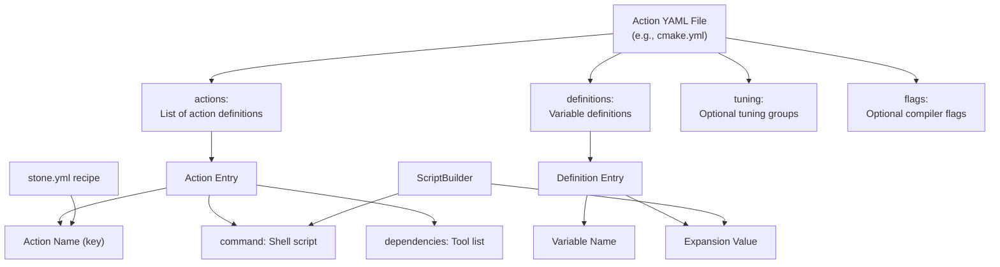
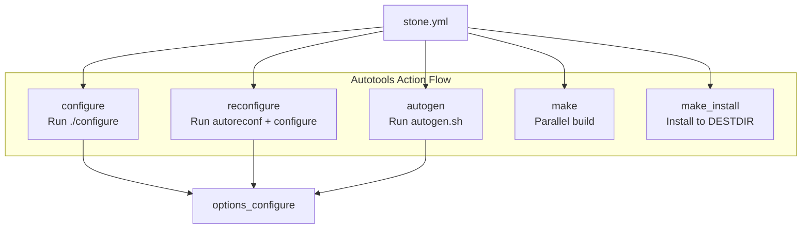
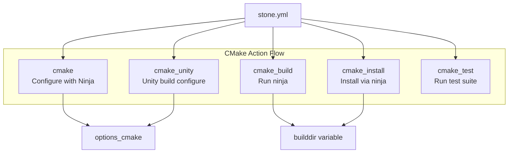
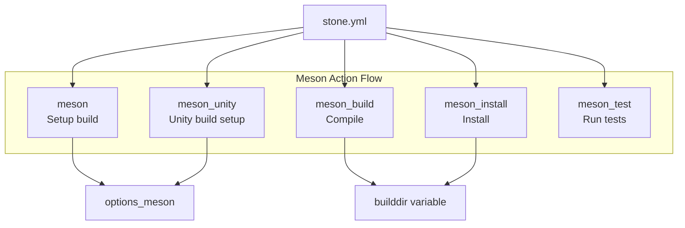
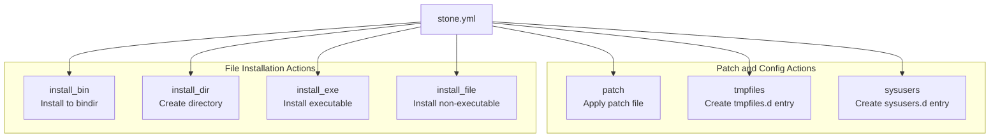
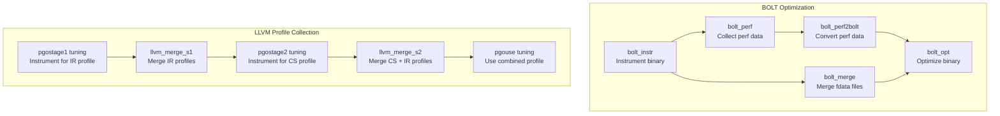
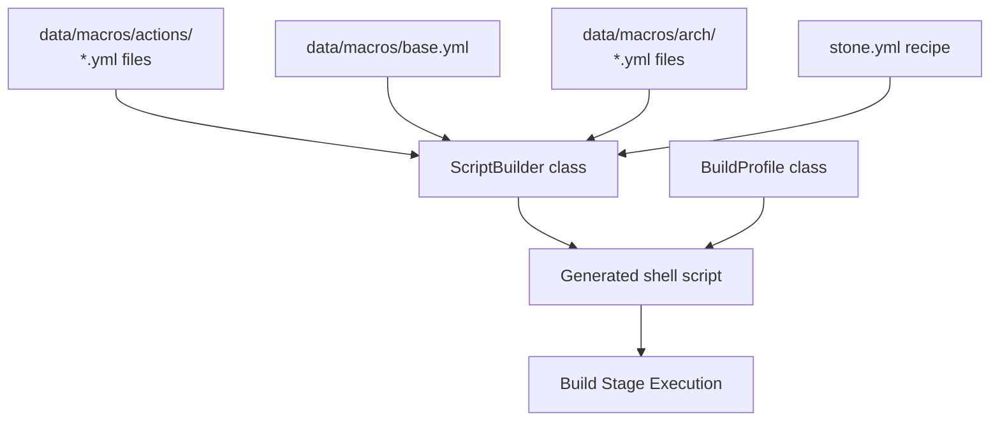

# Action Macros

Relevant source files

* [data/macros/actions/autotools.yml](../data/macros/actions/autotools.yml)
* [data/macros/actions/cmake.yml](../data/macros/actions/cmake.yml)
* [data/macros/actions/meson.yml](../data/macros/actions/meson.yml)
* [data/macros/actions/misc.yml](../data/macros/actions/misc.yml)
* [data/macros/actions/pgo.yml](../data/macros/actions/pgo.yml)

Action macros are predefined build commands that simplify common build operations in stone.yml recipes. These macros encapsulate knowledge of different build systems (autotools, cmake, meson) and provide reusable, standardized commands for configuring, building, and installing software packages. For information about the overall macro system and variable expansion, see [Macro System Overview](5.1-macro-system-overview). For architecture-specific configurations, see [Architecture Definitions](5.2-architecture-definitions). For compiler flags and tuning, see [Tuning Groups and Compiler Flags](5.3-tuning-groups-and-compiler-flags).

Action macros are defined in YAML files under `data/macros/actions/` and are loaded by the build system to provide consistent, best-practice build commands across all packages. Each action can declare build tool dependencies, ensuring required tools are available during the build process.

## Action Macro Structure

Action macros are defined in YAML format with the following components:



**Action Entry Fields:**

| Field | Type | Description |
| --- | --- | --- |
| `action_name` | key | Name used to invoke the action (e.g., `%cmake`, `%make`) |
| `command` | string | Shell commands to execute, may include variable substitutions |
| `dependencies` | list | Build tool dependencies that must be available |

**Sources:** [data/macros/actions/cmake.yml1-53](../data/macros/actions/cmake.yml#L1-L53) [data/macros/actions/autotools.yml1-63](../data/macros/actions/autotools.yml#L1-L63) [data/macros/actions/meson.yml1-50](../data/macros/actions/meson.yml#L1-L50)

## Autotools Actions

Autotools actions provide commands for the GNU Autotools build system (autoconf, automake, configure, make).

### Action Definitions



| Action | Command | Dependencies | Purpose |
| --- | --- | --- | --- |
| `configure` | `./configure %(options_configure)` | autoconf, automake | Run configure script with standard options |
| `reconfigure` | `autoreconf -vfi && %configure` | autoconf, automake | Regenerate configure script and run it |
| `autogen` | `sh ./autogen.sh && ./configure` | autoconf, automake | Run autogen.sh then configure |
| `make` | `make -j "%(jobs)"` | make | Parallel build using all available jobs |
| `make_install` | `%make install DESTDIR="%(installroot)"` | make | Install to staging directory |

### options\_configure Definition

The `options_configure` definition provides standard flags passed to autotools configure scripts:

[data/macros/actions/autotools.yml49-62](../data/macros/actions/autotools.yml#L49-L62)

**Key Options:**

* `--prefix`, `--bindir`, `--libdir`: Standard installation paths
* `--build`, `--host`: Cross-compilation platform specifications
* `--sysconfdir`, `--localstatedir`: System configuration paths

**Sources:** [data/macros/actions/autotools.yml1-63](../data/macros/actions/autotools.yml#L1-L63)

## CMake Actions

CMake actions provide commands for projects using the CMake build system with Ninja backend.

### Action Definitions



| Action | Command | Dependencies | Purpose |
| --- | --- | --- | --- |
| `cmake` | `cmake %(options_cmake)` | cmake | Configure CMake project with standard options |
| `cmake_unity` | `cmake -DCMAKE_UNITY_BUILD=ON %(options_cmake)` | cmake | Configure with unity build enabled |
| `cmake_build` | `ninja -v -j "%(jobs)" -C "%(builddir)"` | ninja | Build using Ninja backend |
| `cmake_install` | `DESTDIR="%(installroot)" ninja install ...` | ninja | Install to staging directory |
| `cmake_test` | `ninja test -v -j "%(jobs)" -C "%(builddir)"` | cmake, ninja | Run test suite via ctest |

### options\_cmake Definition

The `options_cmake` definition configures CMake with appropriate flags:

[data/macros/actions/cmake.yml42-52](../data/macros/actions/cmake.yml#L42-L52)

**Key Options:**

* `-G Ninja`: Use Ninja generator
* `-S . -B "%(builddir)"`: Source and build directories
* `-DCMAKE_C_FLAGS` / `-DCMAKE_CXX_FLAGS`: Pass compiler flags from environment
* `-DCMAKE_BUILD_TYPE="Release"`: Release build type with empty default flags
* `-DCMAKE_INSTALL_LIBDIR="lib"`: Standard library directory

**Sources:** [data/macros/actions/cmake.yml1-53](../data/macros/actions/cmake.yml#L1-L53)

## Meson Actions

Meson actions provide commands for projects using the Meson build system.

### Action Definitions



| Action | Command | Dependencies | Purpose |
| --- | --- | --- | --- |
| `meson` | `CFLAGS=... meson setup %(options_meson)` | meson | Setup Meson build with environment flags |
| `meson_unity` | `meson setup --unity on %(options_meson)` | meson | Setup with unity build enabled |
| `meson_build` | `meson compile -v -j "%(jobs)" -C "%(builddir)"` | meson | Build project |
| `meson_install` | `DESTDIR="%(installroot)" meson install ...` | meson | Install to staging directory |
| `meson_test` | `meson test --no-rebuild ... -C "%(builddir)"` | meson | Run test suite |

### options\_meson Definition

The `options_meson` definition provides standard Meson options:

[data/macros/actions/meson.yml42-49](../data/macros/actions/meson.yml#L42-L49)

**Key Options:**

* `--buildtype="plain"`: Plain build type (flags from environment)
* `--libdir="lib%(libsuffix)"`: Library directory with suffix support
* `--libexecdir="lib%(libsuffix)/%(name)"`: Per-package libexec directory

**Sources:** [data/macros/actions/meson.yml1-50](../data/macros/actions/meson.yml#L1-L50)

## Utility Actions

Utility actions provide generic commands for common package operations.



### Installation Actions

| Action | Command | Description |
| --- | --- | --- |
| `install_bin` | `install -Dm00755 -t %(installroot)/%(bindir)` | Install files to binary directory with executable permissions |
| `install_dir` | `install -dm00755` | Create directory with standard permissions |
| `install_exe` | `install -Dm00755` | Install file with executable permissions (0755) |
| `install_file` | `install -Dm00644` | Install file without executable permissions (0644) |

### Patch Action

[data/macros/actions/misc.yml27-31](../data/macros/actions/misc.yml#L27-L31)

The `patch` action applies patch files with default `-p1` stripping. Usage: `%patch %(pkgdir)/${file}`

### System Configuration Actions

| Action | Description |
| --- | --- |
| `tmpfiles` | Creates a tmpfiles.d configuration entry for systemd-tmpfiles |
| `sysusers` | Creates a sysusers.d configuration entry for systemd-sysusers |

Both actions create shell functions that write to configuration files in `%(installroot)` only for native builds (when `%(libsuffix)` is empty).

**Sources:** [data/macros/actions/misc.yml1-54](../data/macros/actions/misc.yml#L1-L54)

## PGO Actions

Profile-Guided Optimization (PGO) actions support advanced optimization workflows. For complete information on PGO builds, see [Profile-Guided Optimization](3.5-profile-guided-optimization).



### LLVM Profile Actions

| Action | Command Summary | Purpose |
| --- | --- | --- |
| `llvm_merge_s1` | `llvm-profdata merge --output=ir.profdata` | Merge stage 1 IR profiles |
| `llvm_merge_s2` | `llvm-profdata merge ir.profdata + CS profiles` | Merge stage 2 CS profiles with IR |

These actions work with tuning flags defined in the same file:

**Tuning Groups:** [data/macros/actions/pgo.yml64-81](../data/macros/actions/pgo.yml#L64-L81)

* `pgosample`: Enable partial training flags
* `pgostage1`: Enable IR profile generation
* `pgostage2`: Enable CS profile generation with IR use
* `pgouse`: Enable profile usage

**Compiler Flags:** [data/macros/actions/pgo.yml83-124](../data/macros/actions/pgo.yml#L83-L124)

* Support for both LLVM and GNU toolchains
* Different flags for C, C++, and linker stages
* Profile directories use `%(pgo_dir)` variable

### BOLT Actions

BOLT (Binary Optimization and Layout Tool) actions provide binary-level optimization:

| Action | Purpose |
| --- | --- |
| `bolt_instr` | Instrument binary to collect execution data |
| `bolt_perf` | Collect performance data using `perf record` |
| `bolt_perf2bolt` | Convert perf.data to BOLT fdata format |
| `bolt_merge` | Merge multiple fdata files |
| `bolt_opt` | Apply BOLT optimizations using profile data |

**BOLT Optimization Flags:** [data/macros/actions/pgo.yml36-40](../data/macros/actions/pgo.yml#L36-L40)

* `-reorder-blocks=cache+`: Cache-aware block reordering
* `-reorder-functions=hfsort+`: Function layout optimization
* `-split-functions=3`: Aggressive function splitting
* `-split-all-cold`: Separate cold code
* `-icf=1`: Identical code folding

**Sources:** [data/macros/actions/pgo.yml1-125](../data/macros/actions/pgo.yml#L1-L125)

## Action Macro Usage in Recipes

Actions are invoked in stone.yml recipes using the `%action_name` syntax:

```
build:
  - |
    %cmake -DCUSTOM_OPTION=ON
    %cmake_build
    %cmake_install
```

### Variable Expansion in Actions

Actions can reference variables defined in:

* Base macro definitions (see [Macro System Overview](5.1-macro-system-overview))
* Architecture definitions (see [Architecture Definitions](5.2-architecture-definitions))
* The action's own `definitions` section

Common variables used in actions:

| Variable | Description | Example Value |
| --- | --- | --- |
| `%(jobs)` | Parallel build jobs | `$(nproc)` |
| `%(builddir)` | Build directory | `solusBuildDir` |
| `%(installroot)` | Install staging directory | `/path/to/install/root` |
| `%(prefix)` | Installation prefix | `/usr` |
| `%(libdir)` | Library directory | `/usr/lib64` |
| `%(libsuffix)` | Library suffix | `64` or empty |
| `%(bindir)` | Binary directory | `/usr/bin` |
| `%(pgo_dir)` | PGO profile directory | `/path/to/pgo` |

### Dependency Resolution

When an action declares dependencies, the build system ensures those tools are available:

```
actions:
  - cmake:
      dependencies:
        - cmake
        - ninja
```

The BuildProfile system resolves these dependencies before executing the action, either installing them in the build root or verifying their presence.

**Sources:** [data/macros/actions/cmake.yml1-53](../data/macros/actions/cmake.yml#L1-L53) [data/macros/actions/autotools.yml1-63](../data/macros/actions/autotools.yml#L1-L63) [data/macros/actions/meson.yml1-50](../data/macros/actions/meson.yml#L1-L50)

## Action Macro Loading and Expansion



The ScriptBuilder class loads action definitions and expands them during build script generation:

1. **Load Phase**: Action YAML files are parsed along with base and architecture definitions
2. **Substitution Phase**: Variables like `%(jobs)`, `%(installroot)`, `%(prefix)` are expanded
3. **Script Generation Phase**: Actions referenced in stone.yml are converted to shell commands
4. **Execution Phase**: BuildProfile executes the generated script in the build environment

Actions are expanded in the context of the current build profile, which determines architecture-specific values and tuning flags.

**Sources:** [data/macros/actions/cmake.yml1-53](../data/macros/actions/cmake.yml#L1-L53) [data/macros/actions/autotools.yml1-63](../data/macros/actions/autotools.yml#L1-L63) [data/macros/actions/meson.yml1-50](../data/macros/actions/meson.yml#L1-L50) [data/macros/actions/meson.yml1-50](../data/macros/actions/meson.yml#L1-L50) [data/macros/actions/misc.yml1-54](../data/macros/actions/misc.yml#L1-L54) [data/macros/actions/pgo.yml1-125](../data/macros/actions/pgo.yml#L1-L125)