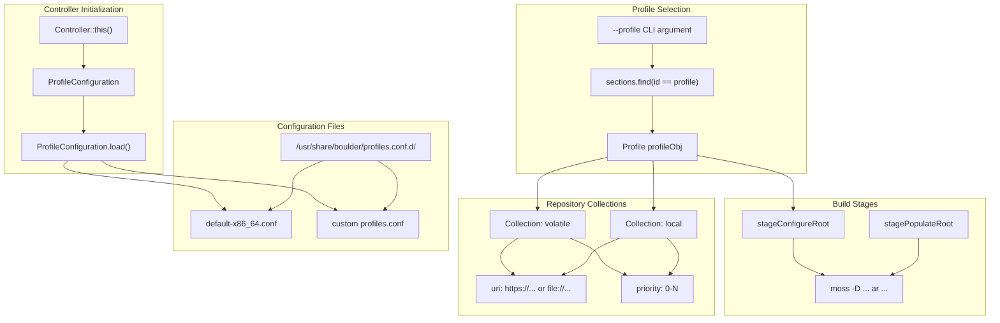
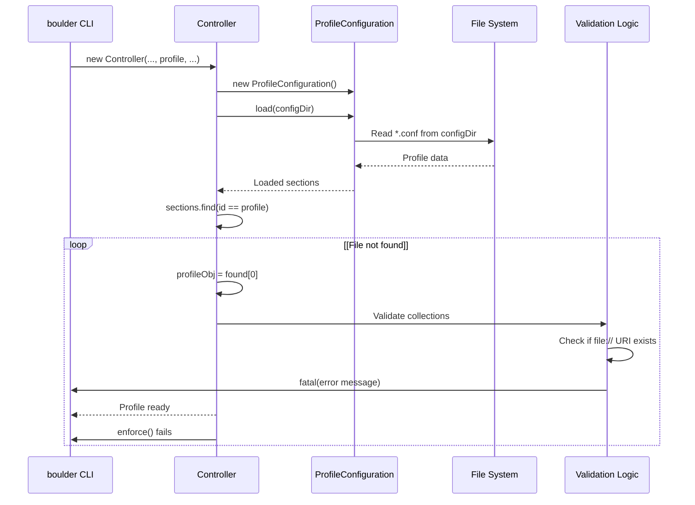
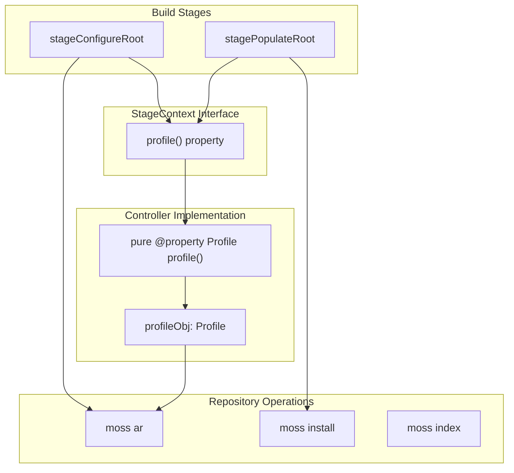
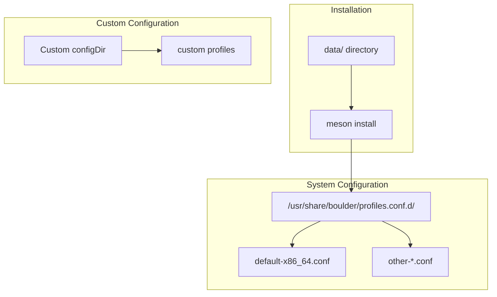
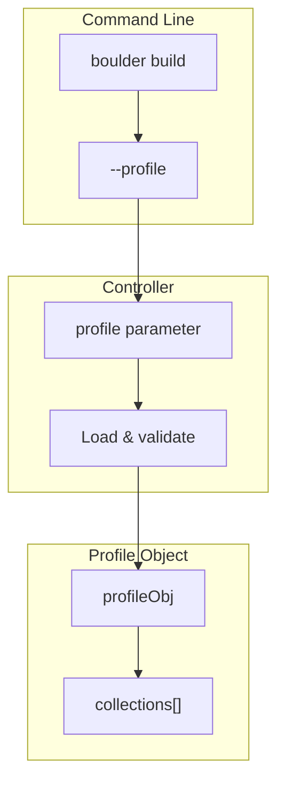

# Build Profiles and Repository Configuration

Relevant source files

* [.gitignore](../.gitignore)
* [data/default-x86\_64.conf](../data/default-x86_64.conf)
* [data/environment.in](../data/environment.in)
* [data/meson.build](../data/meson.build)
* [dub.json](../dub.json)
* [source/boulder/controller.d](../source/boulder/controller.d)
* [source/boulder/stages/clean\_root.d](../source/boulder/stages/clean_root.d)
* [source/boulder/stages/package.d](../source/boulder/stages/package.d)

## Purpose and Scope

This page documents the build profile system that controls repository configuration and dependency resolution in boulder. Build profiles define collections of package repositories (local and remote) that boulder uses to resolve build dependencies during package compilation. For information about how dependencies are resolved and analyzed during builds, see [7.2](7.2-dependency-resolution-and-analysis). For macro system configuration, see [5.1](5.1-macro-system-overview).

---

## Overview

The profile system provides a flexible mechanism for configuring which package repositories boulder uses to install build dependencies. Each profile contains one or more repository collections with associated metadata (URI, description, priority). Profiles are loaded from YAML configuration files at build time and selected via command-line arguments.

**Key Components:**

* **Profile:** A named configuration containing repository collections
* **Collection:** A package repository definition with URI and priority
* **ProfileConfiguration:** Parser and loader for profile files
* **Profile Object:** Runtime representation of the selected profile

---

## Profile Configuration Architecture



**Sources:** [source/boulder/controller.d54-84](../source/boulder/controller.d#L54-L84) [data/default-x86\_64.conf1-21](../data/default-x86_64.conf#L1-L21)

---

## Profile Configuration Format

Profile configurations use YAML syntax with a specific schema. Each profile is defined as a YAML document with collections listed beneath it.

### Profile Definition Structure

| Field | Type | Description |
| --- | --- | --- |
| Profile ID | String | Unique identifier (e.g., `default-x86_64`) |
| `collections` | Array | List of repository collection definitions |

### Collection Definition Structure

| Field | Type | Required | Description |
| --- | --- | --- | --- |
| Collection ID | String | Yes | Unique name for the collection |
| `uri` | String | Yes | Repository index URI (https:// or file://) |
| `description` | String | Yes | Human-readable description |
| `priority` | Integer | Yes | Repository priority (higher = preferred) |

### Example Profile Configuration

```
- default-x86_64:
    collections:
        - volatile:
            uri: "https://dev.serpentos.com/volatile/x86_64/stone.index"
            description: "Volatile moss repo"
            priority: 0

- local-x86_64:
    collections:
        - volatile:
            uri: "https://dev.serpentos.com/volatile/x86_64/stone.index"
            description: "Volatile moss repo"
            priority: 0

        - local:
            uri: "file:///var/cache/boulder/repos/local-x86_64/stone.index"
            description: "Local development moss repo"
            priority: 10
```

**Sources:** [data/default-x86\_64.conf1-21](../data/default-x86_64.conf#L1-L21)

---

## Profile Loading and Selection



**Sources:** [source/boulder/controller.d69-84](../source/boulder/controller.d#L69-L84) [source/boulder/controller.d86-98](../source/boulder/controller.d#L86-L98)

### Profile Loading Process

The `Controller` constructor performs profile initialization:

1. **Configuration Directory Resolution** [source/boulder/controller.d70-78](../source/boulder/controller.d#L70-L78)

   * Default: `/` (system root)
   * Custom: Specified via constructor parameter
   * Profiles loaded from `<configDir>/usr/share/boulder/profiles.conf.d/`
2. **Profile Loading** [source/boulder/controller.d79](../source/boulder/controller.d#L79-L79)

   ```
   ProfileConfiguration.load(configDir)
   ```

   Reads all `.conf` files from the configuration directory
3. **Profile Selection** [source/boulder/controller.d81-84](../source/boulder/controller.d#L81-L84)

   ```
   config.sections.find!((c) => c.id == _profile)
   enforce(!p.empty, "No build profiles available")
   profileObj = p[0]
   ```
4. **Collection Validation** [source/boulder/controller.d86-98](../source/boulder/controller.d#L86-L98)

   * Iterates through `profile.collections`
   * For `file://` URIs: validates that path exists
   * Logs fatal error if local repository is missing

---

## Profile Integration with Build Stages



**Sources:** [source/boulder/stages/package.d115](../source/boulder/stages/package.d#L115-L115) [source/boulder/controller.d430-434](../source/boulder/controller.d#L430-L434)

### StageContext Profile Access

The `StageContext` interface provides profile access to all build stages [source/boulder/stages/package.d115](../source/boulder/stages/package.d#L115-L115):

```
pure @property Profile profile() @safe @nogc nothrow;
```

The `Controller` implements this property [source/boulder/controller.d430-434](../source/boulder/controller.d#L430-L434):

```
pure @property Profile profile() @safe @nogc nothrow
{
    return profileObj;
}
```

### Stage Usage Patterns

Build stages access profile data through the `StageContext`:

1. **Repository Configuration** (`stageConfigureRoot`)

   * Iterates through `context.profile.collections`
   * Adds each collection to the build root using `moss ar`
   * Configures repository priorities
2. **Dependency Installation** (`stagePopulateRoot`)

   * Uses configured repositories to resolve dependencies
   * Installs build dependencies via `moss install`
   * Respects collection priority for package selection

---

## Profile Configuration Locations



### Standard Installation Path

Default profile configurations are installed to:

```
/usr/share/boulder/profiles.conf.d/
```

The Meson build system handles installation [data/meson.build5-9](../data/meson.build#L5-L9):

```
install_data([
    'default-x86_64.conf',
],
install_dir: get_option('prefix') / get_option('datadir') / 'boulder' / 'profiles.conf.d'
)
```

### Custom Configuration Directory

When using a custom configuration directory [source/boulder/controller.d71-78](../source/boulder/controller.d#L71-L78):

* Must be specified in `Controller` constructor
* System warns: `"Using non-standard configuration directory: <path>"`
* Profiles are loaded from `<customDir>/usr/share/boulder/profiles.conf.d/`

**Sources:** [source/boulder/controller.d70-78](../source/boulder/controller.d#L70-L78) [data/meson.build5-9](../data/meson.build#L5-L9)

---

## Repository Collection Structure

### Collection Properties

Each collection in a profile contains:

| Property | Purpose | Example |
| --- | --- | --- |
| ID | Unique collection identifier | `volatile`, `local` |
| URI | Repository index location | `https://...` or `file://...` |
| Description | Human-readable label | `"Volatile moss repo"` |
| Priority | Selection preference | `0` (default) to `N` (higher) |

### URI Schemes

**Remote Repositories (HTTPS)**

```
uri: "https://dev.serpentos.com/volatile/x86_64/stone.index"
```

* Downloaded on-demand during build
* Cached by moss package manager
* Requires network connectivity

**Local Repositories (File)**

```
uri: "file:///var/cache/boulder/repos/local-x86_64/stone.index"
```

* Must exist on filesystem [source/boulder/controller.d93-97](../source/boulder/controller.d#L93-L97)
* Used for local development builds
* No network required
* Validated during profile loading

### Priority System

Higher priority values indicate preferred repositories when multiple repositories provide the same package:

```
- volatile:
    priority: 0    # Lower priority

- local:
    priority: 10   # Higher priority - preferred
```

When resolving dependencies, moss selects packages from higher-priority repositories first.

**Sources:** [data/default-x86\_64.conf1-21](../data/default-x86_64.conf#L1-L21) [source/boulder/controller.d86-98](../source/boulder/controller.d#L86-L98)

---

## Common Profile Configurations

### Default Profile (`default-x86_64`)

Minimal profile with only upstream repositories:

```
- default-x86_64:
    collections:
        - volatile:
            uri: "https://dev.serpentos.com/volatile/x86_64/stone.index"
            description: "Volatile moss repo"
            priority: 0
```

**Use Case:** Building packages using only official repositories

### Development Profile (`local-x86_64`)

Profile including local development repository:

```
- local-x86_64:
    collections:
        - volatile:
            uri: "https://dev.serpentos.com/volatile/x86_64/stone.index"
            description: "Volatile moss repo"
            priority: 0

        - local:
            uri: "file:///var/cache/boulder/repos/local-x86_64/stone.index"
            description: "Local development moss repo"
            priority: 10
```

**Use Case:** Building packages with local development dependencies, overriding upstream versions when needed

**Sources:** [data/default-x86\_64.conf1-21](../data/default-x86_64.conf#L1-L21)

---

## Profile Selection via CLI



The profile is selected through the `Controller` constructor [source/boulder/controller.d54](../source/boulder/controller.d#L54-L54):

```
this(string outputDir, string architecture, bool confinement, string profile,
     bool compilerCache, string configDir = null)
```

The CLI layer passes the profile name (e.g., `"default-x86_64"` or `"local-x86_64"`) to the controller, which then loads and validates the corresponding profile configuration.

**Sources:** [source/boulder/controller.d54-84](../source/boulder/controller.d#L54-L84)

---

## Error Handling and Validation

### Profile Not Found

If the requested profile doesn't exist [source/boulder/controller.d81-82](../source/boulder/controller.d#L81-L82):

```
auto p = config.sections.find!((c) => c.id == _profile);
enforce(!p.empty, "No build profiles available");
```

Boulder terminates with error: `"No build profiles available"`

### Missing Local Repository

For `file://` URIs, boulder validates existence [source/boulder/controller.d86-97](../source/boulder/controller.d#L86-L97):

```
foreach (collection; this.profile.collections)
{
    if (!collection.uri.startsWith("file://"))
        continue;

    immutable realp = collection.uri["file://".length .. $];
    if (!realp.exists)
    {
        fatal(format!"Cannot find collection `%s` at %s"(collection.id, realp));
    }
}
```

Fatal error logged with collection ID and expected path.

### Configuration Directory Validation

Non-standard configuration directories trigger a warning [source/boulder/controller.d76-77](../source/boulder/controller.d#L76-L77):

```
warning(format!"Using non-standard configuration directory: %s"(configDir));
```

**Sources:** [source/boulder/controller.d76-98](../source/boulder/controller.d#L76-L98)

---

## Profile Data Flow Summary

```
flowchart TD

Start["boulder build --profile local-x86_64"]
LoadConfig["ProfileConfiguration.load(/)"]
ParseFiles["Parse profiles.conf.d/*.conf"]
SelectProfile["Find profile: local-x86_64"]
ValidateCollections["Validate file:// URIs exist"]
StoreProfile["profileObj = selected profile"]
ConfigStage["stageConfigureRoot"]
AddRepos["Add collections to build root"]
PopStage["stagePopulateRoot"]
InstallDeps["moss install dependencies"]
UsesRepos["moss uses configured repositories"]
ResolveDeps["Resolve from collections by priority"]

Start --> LoadConfig
LoadConfig --> ParseFiles
ParseFiles --> SelectProfile
SelectProfile --> ValidateCollections
ValidateCollections --> StoreProfile
StoreProfile --> ConfigStage
ConfigStage --> AddRepos
StoreProfile --> PopStage
PopStage --> InstallDeps
AddRepos --> UsesRepos
InstallDeps --> UsesRepos
UsesRepos --> ResolveDeps
```

**Sources:** [source/boulder/controller.d54-98](../source/boulder/controller.d#L54-L98) [source/boulder/stages/package.d41-52](../source/boulder/stages/package.d#L41-L52)