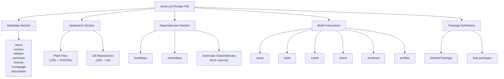
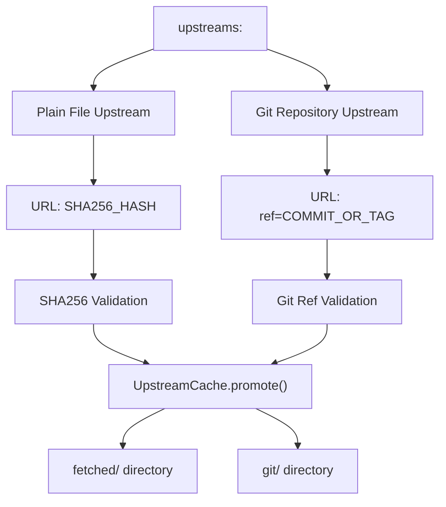
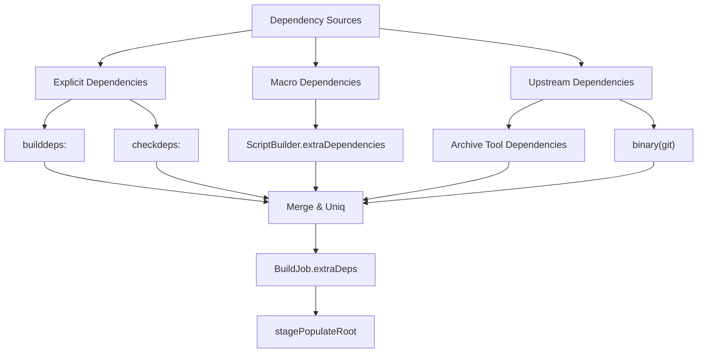
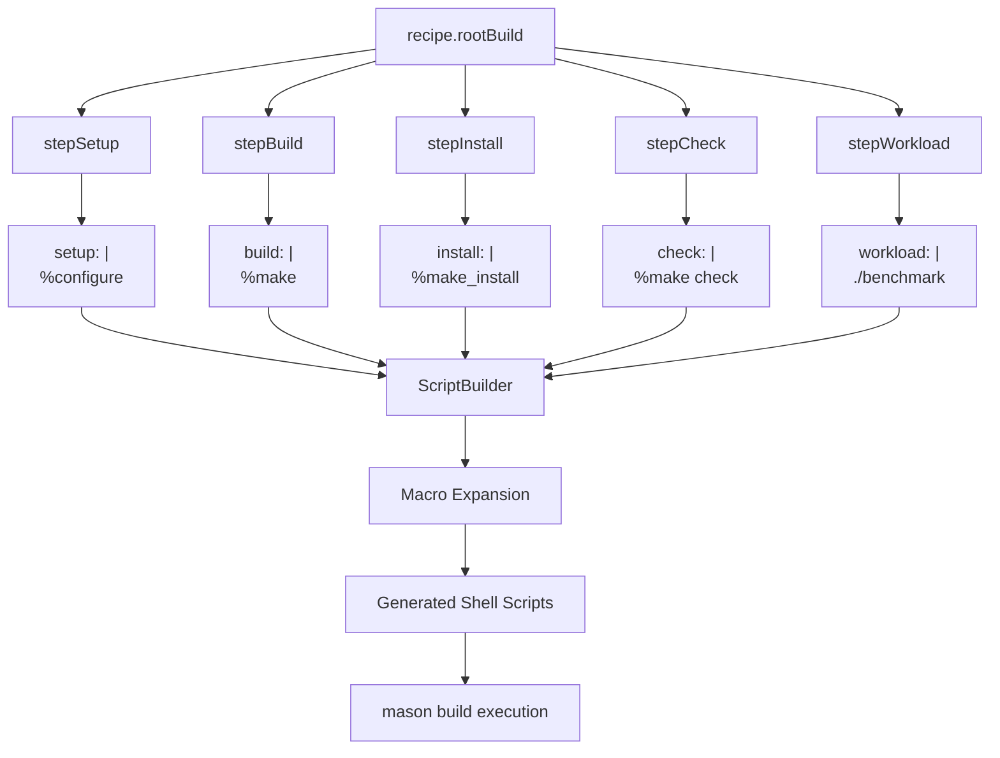
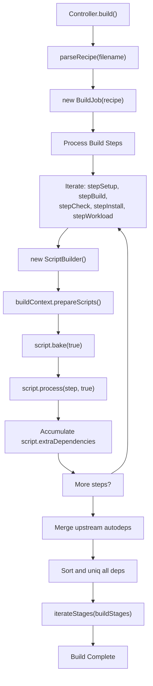
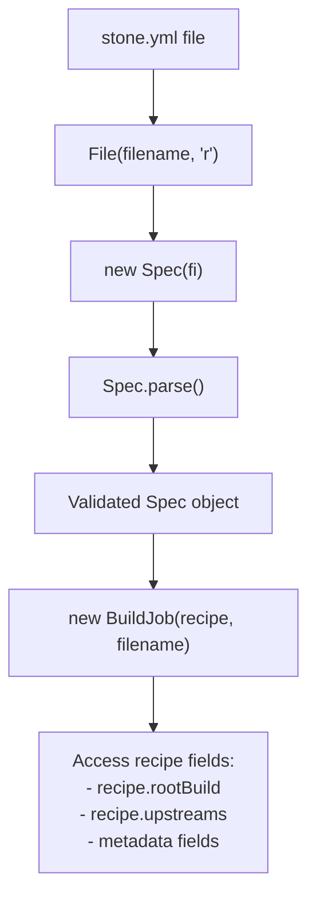

# Stone.yml Recipe Format

Relevant source files

* [source/boulder/controller.d](../source/boulder/controller.d)
* [source/boulder/stages/clean\_root.d](../source/boulder/stages/clean_root.d)
* [source/boulder/stages/package.d](../source/boulder/stages/package.d)
* [stone.yml](../stone.yml)

## Purpose and Scope

This document describes the `stone.yml` recipe format used by boulder to build packages. A stone.yml file is a YAML-based specification that defines package metadata, source locations, dependencies, and build instructions. The Controller parses these recipes [source/boulder/controller.d207-210](../source/boulder/controller.d#L207-L210) using the `Spec` class from `moss.format.source` to create BuildJob instances that orchestrate the build process.

For information about how recipes are used in the build pipeline, see [Controller and Build Lifecycle](2.2-controller-and-build-lifecycle). For details about macro expansion in build instructions, see [Macro System Overview](5.1-macro-system-overview) and [Action Macros](5.4-action-macros). For build stage execution, see [Build Stages](2.3-build-stages).

## Recipe File Structure

A stone.yml recipe is organized into several key sections that define the package and its build process:



**Sources:** [stone.yml1-21](../stone.yml#L1-L21) [source/boulder/controller.d207-210](../source/boulder/controller.d#L207-L210)

## Metadata Fields

The metadata section defines essential package information. These fields are mandatory for proper package identification and indexing:

| Field | Type | Required | Description |
| --- | --- | --- | --- |
| `name` | string | Yes | Package name (lowercase, alphanumeric with hyphens) |
| `version` | string | Yes | Upstream version number |
| `release` | integer | Yes | Serpent OS release number (increments with each rebuild) |
| `summary` | string | Yes | Short one-line description |
| `license` | string | Yes | SPDX license identifier(s) |
| `homepage` | string | Yes | Project homepage URL |
| `description` | string | No | Extended multi-line description |

**Example:**

```
name        : nano
version     : 5.5
release     : 2
summary     : GNU Text Editor
license     : GPL-3.0-or-later
homepage    : https://www.nano-editor.org/
description : |
    The GNU Text Editor
```

The Controller accesses these fields through the `Spec` object after parsing [source/boulder/controller.d207-210](../source/boulder/controller.d#L207-L210)

**Sources:** [stone.yml1-8](../stone.yml#L1-L8) [source/boulder/controller.d203-218](../source/boulder/controller.d#L203-L218)

## Upstream Source Definitions

The `upstreams` section specifies source code locations that boulder must fetch before building. Boulder validates and caches these sources using the UpstreamCache system.



**Sources:** [source/boulder/controller.d438-468](../source/boulder/controller.d#L438-L468) [source/boulder/controller.d483-494](../source/boulder/controller.d#L483-L494)

### Plain File Upstreams

Plain file upstreams consist of a URL mapped to a SHA256 hash. Boulder downloads the file, validates its checksum, and promotes it to the cache if successful:

```
upstreams:
    - https://www.nano-editor.org/dist/v5/nano-5.5.tar.xz: 390b81bf9b41ff736db997aede4d1f60b4453fbd75a519a4ddb645f6fd687e4a
```

The validation occurs in the `onFetchComplete` callback [source/boulder/controller.d438-468](../source/boulder/controller.d#L438-L468) which computes the file's SHA256 hash and compares it against the specified value.

**Sources:** [stone.yml10](../stone.yml#L10-L10) [source/boulder/controller.d448-457](../source/boulder/controller.d#L448-L457)

### Git Repository Upstreams

Git upstreams specify a repository URL with a ref (tag, branch, or commit):

```
upstreams:
    - https://github.com/example/project.git: ref=v1.2.3
    - https://github.com/example/other.git: ref=abc123def
```

Boulder clones these repositories during the fetch stage and validates that the specified ref exists [source/boulder/controller.d296-299](../source/boulder/controller.d#L296-L299)

**Sources:** [source/boulder/controller.d296-299](../source/boulder/controller.d#L296-L299) [source/boulder/controller.d486-492](../source/boulder/controller.d#L486-L492)

### Automatic Archive Extraction Dependencies

Boulder automatically adds binary dependencies based on the file extensions of plain upstreams [source/boulder/controller.d255-293](../source/boulder/controller.d#L255-L293):

| Extension | Added Dependencies |
| --- | --- |
| `.xz` | `binary(tar)`, `binary(xz)` |
| `.zst` | `binary(tar)`, `binary(zstd)` |
| `.bz2` | `binary(tar)`, `binary(bzip2)` |
| `.gz` | `binary(tar)`, `binary(gzip)` |
| `.zip` | `binary(unzip)` |
| `.rpm` | `binary(rpm2cpio)`, `cpio` |
| `.deb` | `binary(ar)` |

Git repositories trigger the addition of `binary(git)` [source/boulder/controller.d296-299](../source/boulder/controller.d#L296-L299)

**Sources:** [source/boulder/controller.d255-304](../source/boulder/controller.d#L255-L304)

## Build Dependencies

Dependencies define what packages must be installed in the build root before compilation. Boulder merges explicit dependencies with automatic dependencies from macros [source/boulder/controller.d237-250](../source/boulder/controller.d#L237-L250) and upstream types [source/boulder/controller.d255-304](../source/boulder/controller.d#L255-L304)



**Sources:** [source/boulder/controller.d237-304](../source/boulder/controller.d#L237-L304)

### Explicit Build Dependencies

The `builddeps` field lists packages required for building:

```
builddeps:
    - ncurses-devel
    - make
    - file-devel
```

These are installed during the populate-root stage before build execution.

**Sources:** [stone.yml11-14](../stone.yml#L11-L14)

### Check Dependencies

The `checkdeps` field specifies additional packages needed only for the check (test) stage:

```
checkdeps:
    - pytest
    - test-data
```

### Macro-Generated Dependencies

When boulder processes build instructions, the ScriptBuilder accumulates dependencies declared by macros [source/boulder/controller.d237-250](../source/boulder/controller.d#L237-L250):

```
foreach (scr; [recipe.rootBuild.stepSetup, recipe.rootBuild.stepBuild,
               recipe.rootBuild.stepCheck, recipe.rootBuild.stepInstall,
               recipe.rootBuild.stepWorkload])
{
    ScriptBuilder script;
    bc.spec = recipe;
    bc.prepareScripts(script, platform().name);
    script.bake(true);
    script.process(scr, true);
    _job.extraDeps = _job.extraDeps ~ script.extraDependencies;
}
```

For example, the `%cmake` macro automatically adds `binary(cmake)` as a dependency.

**Sources:** [source/boulder/controller.d237-250](../source/boulder/controller.d#L237-L250)

## Build Instructions

Build instructions are organized into stages that correspond to the phases of compilation. Each stage contains shell script fragments that are expanded through the macro system and executed in the build environment.



**Sources:** [source/boulder/controller.d238-250](../source/boulder/controller.d#L238-L250) [stone.yml15-20](../stone.yml#L15-L20)

### Setup Stage

The `setup` stage configures the build system. This typically involves running configuration scripts or generating build files:

```
setup: |
    %configure
    %patch %(pkgdir)/fixes/issue-123.patch
```

Common setup macros include:

* `%configure` - GNU autotools configuration
* `%cmake` - CMake configuration
* `%meson` - Meson configuration
* `%patch` - Apply patches

**Sources:** [stone.yml15-16](../stone.yml#L15-L16)

### Build Stage

The `build` stage performs the actual compilation:

```
build: |
    %make
```

Build macros include:

* `%make` - Parallel make execution
* `%cmake_build` - CMake build invocation
* `%meson_build` - Meson build invocation
* `%cargo_build` - Rust cargo build

**Sources:** [stone.yml17-18](../stone.yml#L17-L18)

### Install Stage

The `install` stage copies built files into the install root:

```
install: |
    %make_install
    %install_file %(pkgdir)/nano.conf %(installroot)/%(datadir)/nano/
```

Install macros include:

* `%make_install` - Standard make install
* `%cmake_install` - CMake install
* `%meson_install` - Meson install
* `%install_file` - Manual file installation
* `%install_dir` - Directory creation

**Sources:** [stone.yml19-20](../stone.yml#L19-L20)

### Check Stage

The `check` stage runs test suites (optional):

```
check: |
    %make check
```

This stage only executes if defined. It uses `checkdeps` in addition to `builddeps`.

**Sources:** [source/boulder/controller.d241](../source/boulder/controller.d#L241-L241)

### Workload Stage

The `workload` stage executes representative workloads for Profile-Guided Optimization (PGO):

```
workload: |
    ./benchmark --iterations 1000
    ./test-suite --pgo-profile
```

This stage is used when building with PGO to generate runtime profiles for optimization.

**Sources:** [source/boulder/controller.d242](../source/boulder/controller.d#L242-L242)

## Build Instruction Processing Flow

The Controller processes build instructions by iterating through each stage and delegating to the ScriptBuilder for macro expansion:



**Sources:** [source/boulder/controller.d225-313](../source/boulder/controller.d#L225-L313)

## Variable Substitution and Macros

Build instructions support variable substitution and macro expansion. Variables are enclosed in `%()`:

| Variable | Description | Example Value |
| --- | --- | --- |
| `%(name)` | Package name | `nano` |
| `%(version)` | Package version | `5.5` |
| `%(release)` | Release number | `2` |
| `%(installroot)` | Install root directory | `/mason/install` |
| `%(datadir)` | Data directory path | `/usr/share` |
| `%(libdir)` | Library directory path | `/usr/lib64` |
| `%(bindir)` | Binary directory path | `/usr/bin` |
| `%(pkgdir)` | Recipe directory path | (recipe location) |

Macros are prefixed with `%` and expanded by the macro system:

```
setup: |
    %configure --disable-static --enable-shared
```

The `%configure` macro expands to a complete autotools configuration command with standard flags, paths, and architecture-specific settings.

**Sources:** [source/boulder/controller.d238-250](../source/boulder/controller.d#L238-L250)

## Package Definitions

Recipes can define multiple packages from a single build. The default package inherits the recipe name, and additional sub-packages can be defined:

```
packages:
    - "%(name)":
        paths:
            - /usr/bin/*
        summary: Main executable

    - "%(name)-devel":
        paths:
            - /usr/include/*
            - /usr/lib64/*.so
            - /usr/lib64/pkgconfig/*
        summary: Development files
        rundeps:
            - "%(name)"

    - "%(name)-docs":
        paths:
            - /usr/share/doc/*
            - /usr/share/man/*
        summary: Documentation
```

If no `packages` section is defined, all files go into a single package with the recipe name.

## Profile-Specific Instructions

Different build profiles can have unique instructions for architecture-specific or staged builds:

```
profiles:
    - emul32:
        builddeps:
            - glibc-32bit-devel
        setup: |
            %configure --libdir=/usr/lib32
```

The profile name (e.g., `emul32`, `x86_64-stage1`) determines which profile-specific instructions are used.

## Complete Recipe Example

```
name        : example-app
version     : 2.1.0
release     : 1
summary     : Example application demonstrating stone.yml format
license     : MIT
homepage    : https://example.org
description : |
    A comprehensive example showing all major stone.yml features
    including multiple upstreams, dependencies, and build stages.

upstreams:
    - https://example.org/releases/example-app-2.1.0.tar.xz: abc123...def
    - https://github.com/example/data.git: ref=v2.1.0

builddeps:
    - cmake
    - ninja
    - libfoo-devel

checkdeps:
    - pytest

setup: |
    %cmake -GNinja \
        -DBUILD_TESTS=ON \
        -DENABLE_LTO=ON

build: |
    %cmake_build

install: |
    %cmake_install
    %install_file %(pkgdir)/example.conf %(installroot)/%(datadir)/example/

check: |
    %ninja_test

packages:
    - "%(name)":
        paths:
            - /usr/bin/*
            - /usr/lib64/*.so.*

    - "%(name)-devel":
        paths:
            - /usr/include/*
            - /usr/lib64/*.so
        rundeps:
            - "%(name)"
```

## Recipe Parsing and Validation

The Controller parses recipes using the `Spec` class from `moss.format.source`:



The parsing process [source/boulder/controller.d203-218](../source/boulder/controller.d#L203-L218):

```
auto parseRecipe(in string filename)
{
    auto fi = File(filename, "r");
    trace(format!"%s: Parsing recipe file %s"(__FUNCTION__, filename));
    recipe = new Spec(fi);
    recipe.parse();
    trace(format!"%s: Constructing BuildJob from parsed recipe %s"(__FUNCTION__, filename));
    _job = new BuildJob(recipe, filename);

    scope (exit)
    {
        fi.close();
    }

    return _job;
}
```

After parsing, the recipe is available via `recipe.rootBuild` for accessing build steps and `recipe.upstreams` for source definitions.

**Sources:** [source/boulder/controller.d203-218](../source/boulder/controller.d#L203-L218)