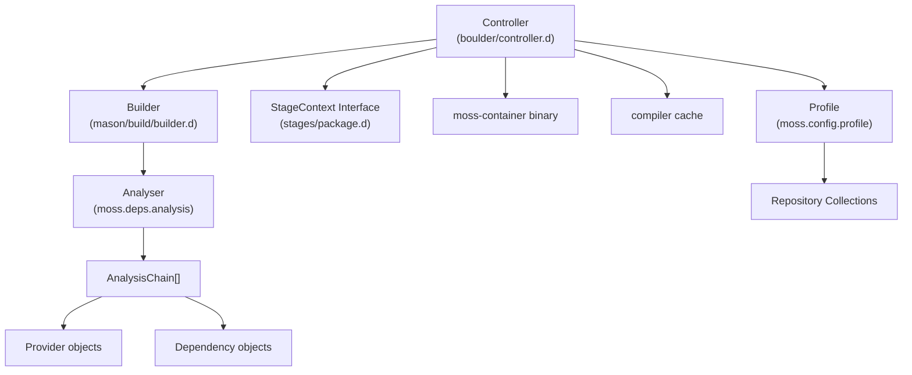
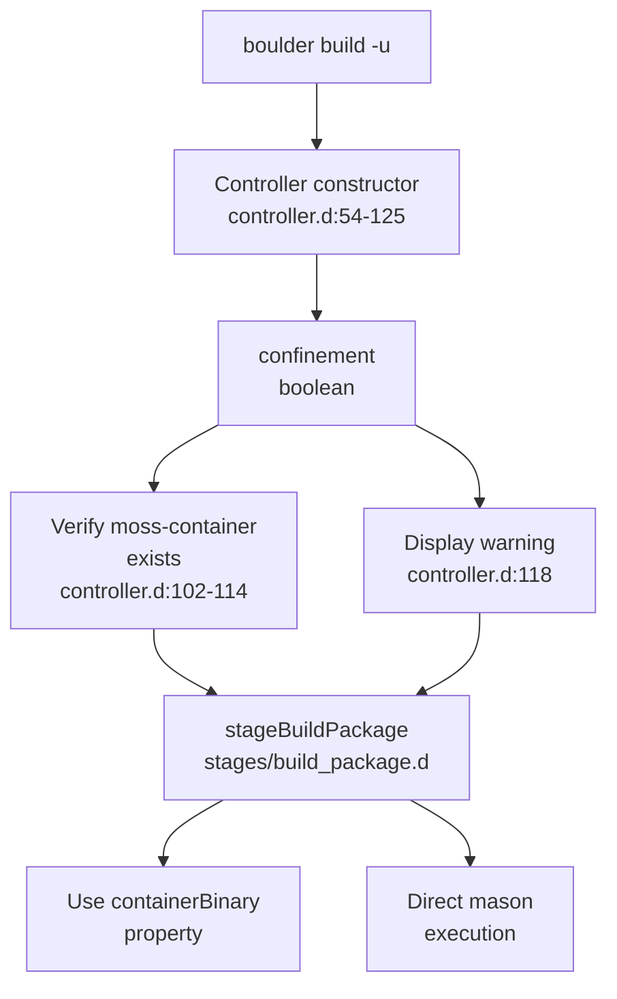
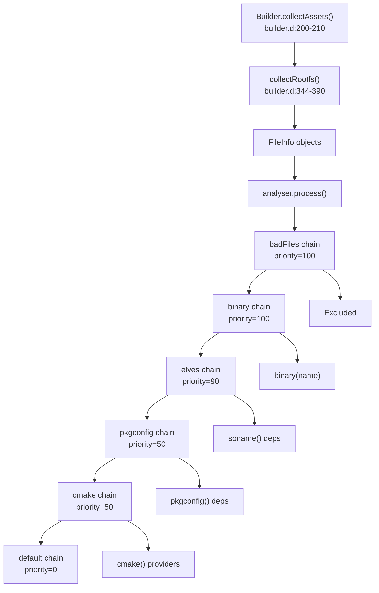
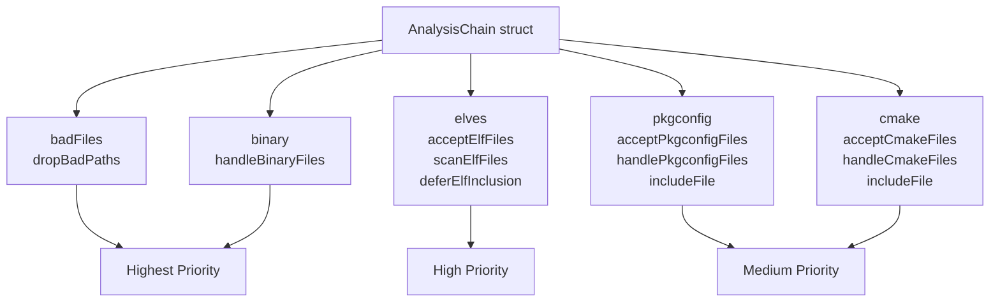
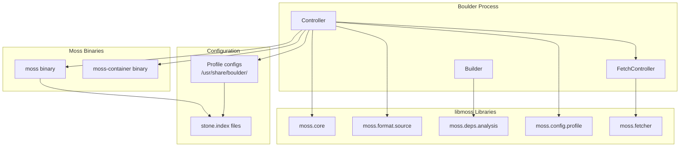
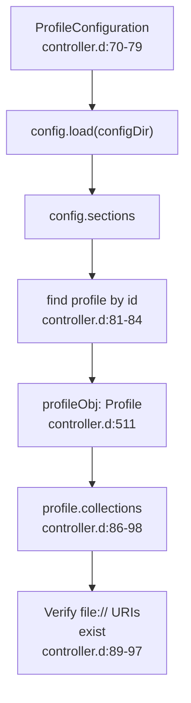
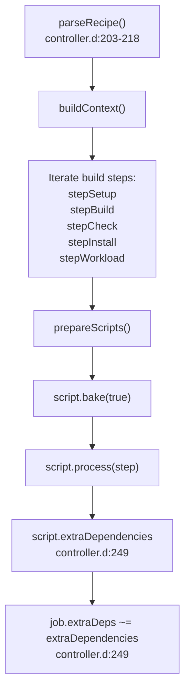
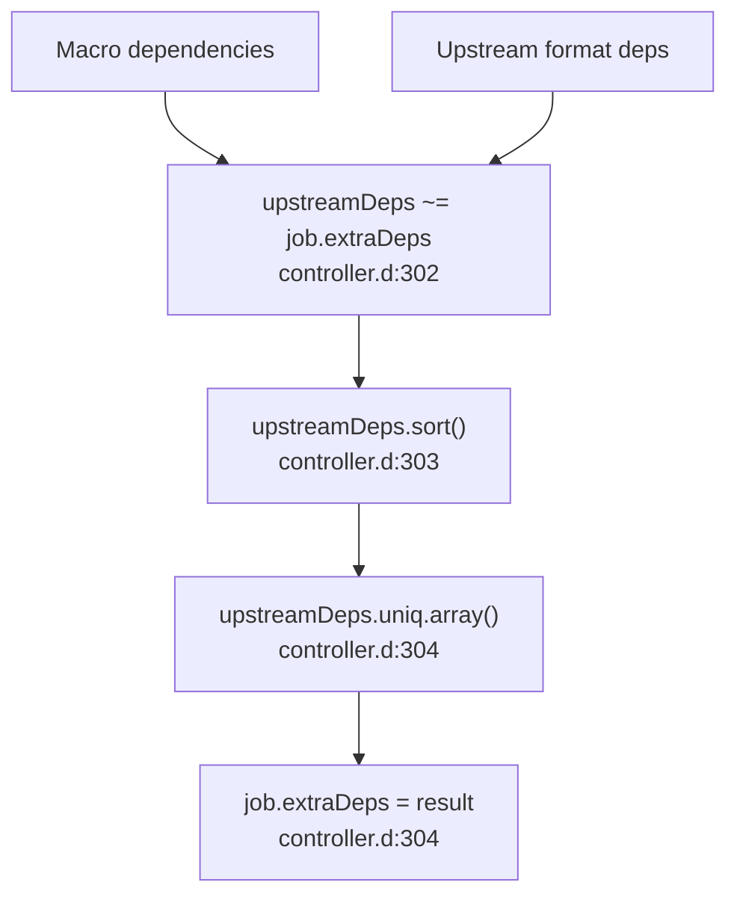
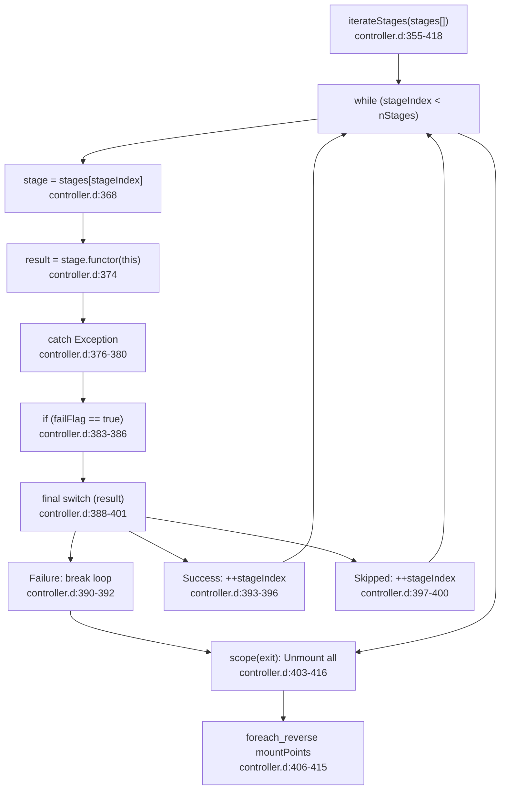

# Advanced Topics

Relevant source files

* [source/boulder/controller.d](../source/boulder/controller.d)
* [source/boulder/stages/clean\_root.d](../source/boulder/stages/clean_root.d)
* [source/boulder/stages/package.d](../source/boulder/stages/package.d)
* [source/mason/build/analysers/binary.d](../source/mason/build/analysers/binary.d)
* [source/mason/build/analysers/cmake.d](../source/mason/build/analysers/cmake.d)
* [source/mason/build/analysers/package.d](../source/mason/build/analysers/package.d)
* [source/mason/build/analysers/pkgconfig.d](../source/mason/build/analysers/pkgconfig.d)
* [source/mason/build/analysers/rejects.d](../source/mason/build/analysers/rejects.d)
* [source/mason/build/builder.d](../source/mason/build/builder.d)
* [source/mason/meson.build](../source/mason/meson.build)

This section covers advanced features and internal architecture details of the boulder-d-legacy/ build system that go beyond basic recipe creation and building. The material here is intended for developers extending boulder/mason, troubleshooting complex build issues, or understanding the deeper integration points with the moss package management ecosystem.

For basic build orchestration concepts, see [Boulder: Build Orchestration](2-boulder:-build-orchestration). For package building fundamentals, see [Mason: Package Builder](3-mason:-package-builder). This section assumes familiarity with those components and focuses on their more sophisticated capabilities.

## Overview of Advanced Build Features

The boulder-d-legacy/ system provides several advanced capabilities that distinguish it from simpler build systems:

* **Build Confinement**: Optional containerization using `moss-container` to isolate builds from the host system
* **Dependency Analysis**: Automated detection of runtime dependencies through file analysis chains
* **Ecosystem Integration**: Deep integration with moss package manager through both library linkage and binary invocation

These features work together through the `Controller` class [source/boulder/controller.d44-512](../source/boulder/controller.d#L44-L512) and `Builder` class [source/mason/build/builder.d48-503](../source/mason/build/builder.d#L48-L503) to provide a sophisticated build environment.

**Diagram: Advanced Feature Integration Points**

Sources: [source/boulder/controller.d44-512](../source/boulder/controller.d#L44-L512) [source/mason/build/builder.d48-503](../source/mason/build/builder.d#L48-L503) [source/boulder/stages/package.d58-121](../source/boulder/stages/package.d#L58-L121)

## Build Confinement Architecture

Boulder supports two build modes controlled by the `confinement` property in `StageContext`:

| Mode | Implementation | Use Case |
| --- | --- | --- |
| **Confined** | `moss-container` binary | Production builds, untrusted recipes |
| **Unconfined** | Direct host execution | Development, debugging |

The confinement decision is made at `Controller` initialization [source/boulder/controller.d54-59](../source/boulder/controller.d#L54-L59) and affects stage execution throughout the build pipeline.

**Diagram: Build Confinement Decision Flow**

The `StageContext` interface exposes the necessary properties for stages to query confinement status [source/boulder/stages/package.d87](../source/boulder/stages/package.d#L87-L87) and binary paths [source/boulder/stages/package.d93-100](../source/boulder/stages/package.d#L93-L100)

Sources: [source/boulder/controller.d54-125](../source/boulder/controller.d#L54-L125) [source/boulder/stages/package.d58-121](../source/boulder/stages/package.d#L58-L121)

## Dependency Analysis Pipeline

Mason performs sophisticated dependency analysis through the `Analyser` class and multiple analysis chains. The analysis architecture uses a chain-of-responsibility pattern where each handler can accept, reject, or pass files to the next handler.

**Diagram: File Analysis Chain Processing**

### Analysis Chain Setup

The chains are initialized in `Builder.setupChains()` [source/mason/build/builder.d305-338](../source/mason/build/builder.d#L305-L338):

**Diagram: Analysis Chain Priority Hierarchy**

### Provider and Dependency Types

The analysis chains detect various provider and dependency types:

| Analyser | Provider Type | Dependency Type | Example |
| --- | --- | --- | --- |
| **binary** [source/mason/build/analysers/binary.d29-46](../source/mason/build/analysers/binary.d#L29-L46) | `BinaryName` | N/A | `binary(gcc)` |
| **binary** | `SystemBinaryName` | N/A | `binary(systemd)` |
| **pkgconfig** [source/mason/build/analysers/pkgconfig.d45-87](../source/mason/build/analysers/pkgconfig.d#L45-L87) | `PkgconfigName` | `PkgconfigName` | `pkgconfig(zlib)` |
| **pkgconfig** | `Pkgconfig32Name` | `Pkgconfig32Name` | `pkgconfig32(openssl)` |
| **cmake** [source/mason/build/analysers/cmake.d49-57](../source/mason/build/analysers/cmake.d#L49-L57) | `CmakeName` | N/A | `cmake(Qt5Core)` |
| **elves** [source/mason/build/analysers/elves.d](../source/mason/build/analysers/elves.d) | `SonameProvides` | `SonameDepends` | `libz.so.1` |

Sources: [source/mason/build/builder.d200-338](../source/mason/build/builder.d#L200-L338) [source/mason/build/analysers/binary.d1-47](../source/mason/build/analysers/binary.d#L1-L47) [source/mason/build/analysers/pkgconfig.d1-88](../source/mason/build/analysers/pkgconfig.d#L1-L88) [source/mason/build/analysers/cmake.d1-58](../source/mason/build/analysers/cmake.d#L1-L58)

## Moss Ecosystem Integration Points

Boulder integrates with the moss ecosystem at multiple levels: library linkage, binary invocation, and configuration sharing.

**Diagram: Moss Ecosystem Integration Architecture**

### Library Integration

Boulder links against multiple libmoss libraries for core functionality:

* **moss.core**: Utilities like `computeSHA256`, exit status, mounts [source/boulder/controller.d24-26](../source/boulder/controller.d#L24-L26)
* **moss.format.source**: Recipe specification parsing (`Spec` class) [source/boulder/controller.d28](../source/boulder/controller.d#L28-L28)
* **moss.fetcher**: Download management (`FetchController`) [source/boulder/controller.d27](../source/boulder/controller.d#L27-L27)
* **moss.deps.analysis**: File analysis and dependency detection [source/mason/build/analysers/package.d1-23](../source/mason/build/analysers/package.d#L1-L23)
* **moss.config.profile**: Build profile and repository configuration [source/boulder/stages/package.d31-32](../source/boulder/stages/package.d#L31-L32)

### Binary Invocation

Boulder invokes moss binaries for package management operations. The binary paths are resolved relative to boulder's location [source/boulder/controller.d62-65](../source/boulder/controller.d#L62-L65):

* **moss**: Installing dependencies, adding repositories, indexing packages
* **moss-container**: Containerized build execution when confinement is enabled

### Configuration Sharing

The `ProfileConfiguration` class loads profile definitions that specify repository collections [source/boulder/controller.d70-98](../source/boulder/controller.d#L70-L98) These profiles are shared between boulder and moss, ensuring consistent package resolution.

**Diagram: Profile Configuration Loading Flow**

Sources: [source/boulder/controller.d24-98](../source/boulder/controller.d#L24-L98) [source/boulder/stages/package.d31-32](../source/boulder/stages/package.d#L31-L32) [source/mason/build/analysers/package.d1-23](../source/mason/build/analysers/package.d#L1-L23)

## Automatic Dependency Detection

Boulder automatically detects build dependencies based on recipe content and source types. This occurs during recipe parsing in `Controller.build()` [source/boulder/controller.d225-313](../source/boulder/controller.d#L225-L313)

### Macro-Based Dependencies

Script macros can declare dependencies through the `ScriptBuilder` [source/boulder/controller.d234-250](../source/boulder/controller.d#L234-L250):

**Diagram: Macro Dependency Extraction**

### Archive Format Dependencies

Boulder examines upstream sources to add extraction tool dependencies [source/boulder/controller.d255-292](../source/boulder/controller.d#L255-L292):

| Extension | Required Dependencies |
| --- | --- |
| `.xz` | `binary(tar)`, `binary(xz)` |
| `.zst` | `binary(tar)`, `binary(zstd)` |
| `.bz2` | `binary(tar)`, `binary(bzip2)` |
| `.gz` | `binary(tar)`, `binary(gzip)` |
| `.zip` | `binary(unzip)` |
| `.rpm` | `binary(rpm2cpio)`, `cpio` |
| `.deb` | `binary(ar)` |

Git sources add `binary(git)` [source/boulder/controller.d296-299](../source/boulder/controller.d#L296-L299)

### Dependency Consolidation

All dependencies are merged, sorted, and deduplicated before stage execution [source/boulder/controller.d301-304](../source/boulder/controller.d#L301-L304):

**Diagram: Dependency Merge and Deduplication**

Sources: [source/boulder/controller.d225-313](../source/boulder/controller.d#L225-L313)

## Stage Iteration and Error Handling

The `Controller.iterateStages()` method [source/boulder/controller.d355-418](../source/boulder/controller.d#L355-L418) provides centralized stage execution with comprehensive error handling and resource cleanup.

**Diagram: Stage Iteration Control Flow**

The `scope(exit)` block ensures that all mount points are unmounted even on error [source/boulder/controller.d403-416](../source/boulder/controller.d#L403-L416) Mount points are tracked through `Controller.addMount()` [source/boulder/controller.d423-426](../source/boulder/controller.d#L423-L426) and unmounted in reverse order with force and detach flags [source/boulder/controller.d409](../source/boulder/controller.d#L409-L409)

Sources: [source/boulder/controller.d355-426](../source/boulder/controller.d#L355-L426)

---

**Related Sections:**

* For containerized build implementation details, see [Containerized vs Unconfined Builds](7.1-containerized-vs-unconfined-builds)
* For dependency resolution mechanics, see [Dependency Resolution and Analysis](7.2-dependency-resolution-and-analysis)
* For moss binary invocation details, see [Integration with moss Ecosystem](7.3-integration-with-moss-ecosystem)