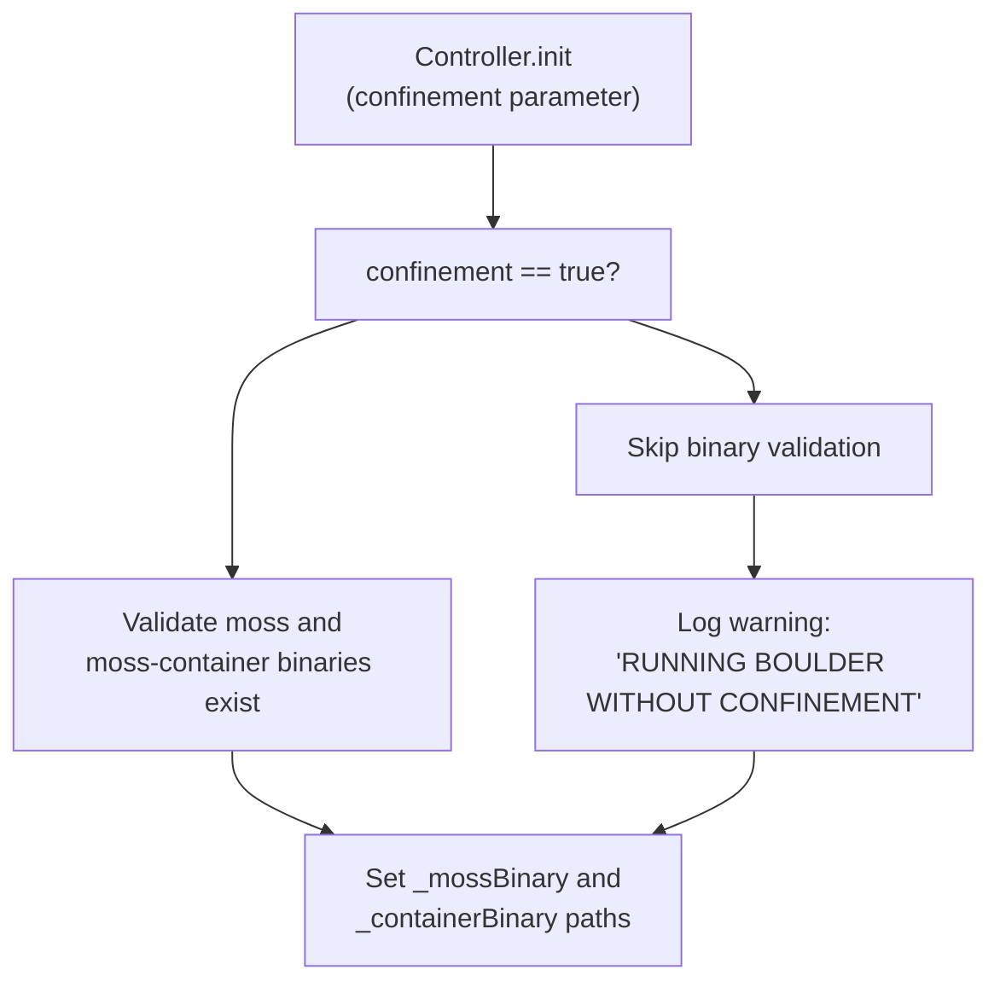
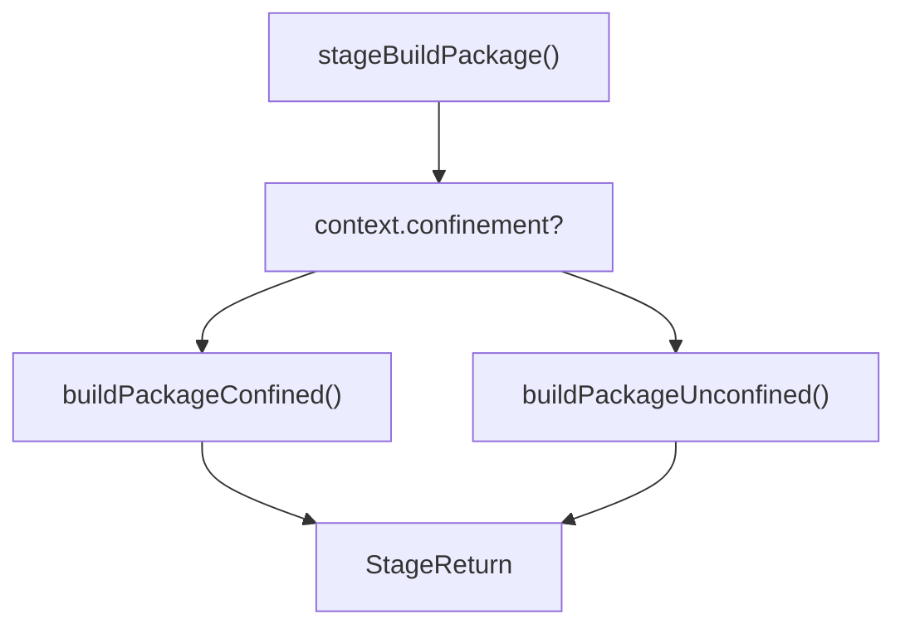
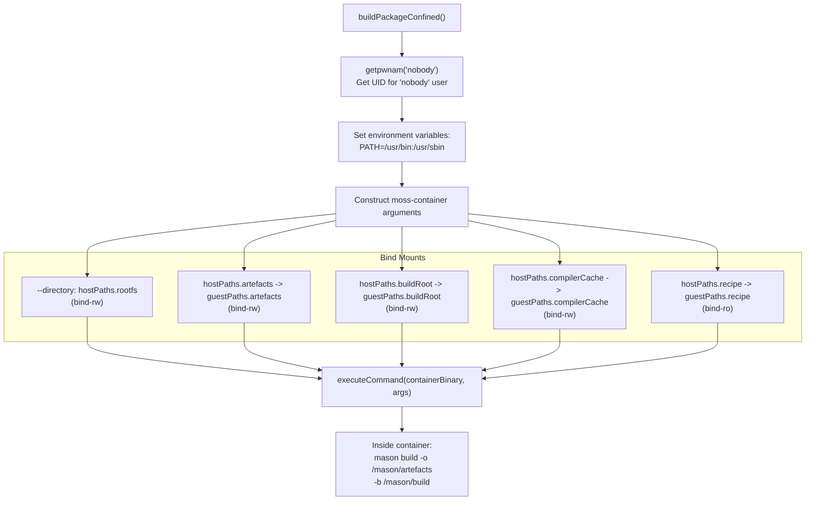
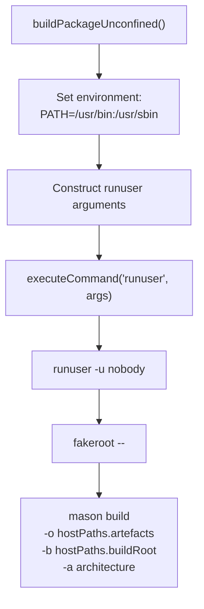
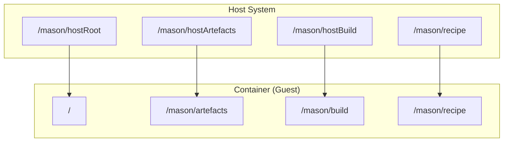
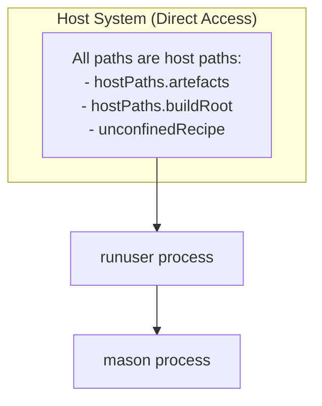
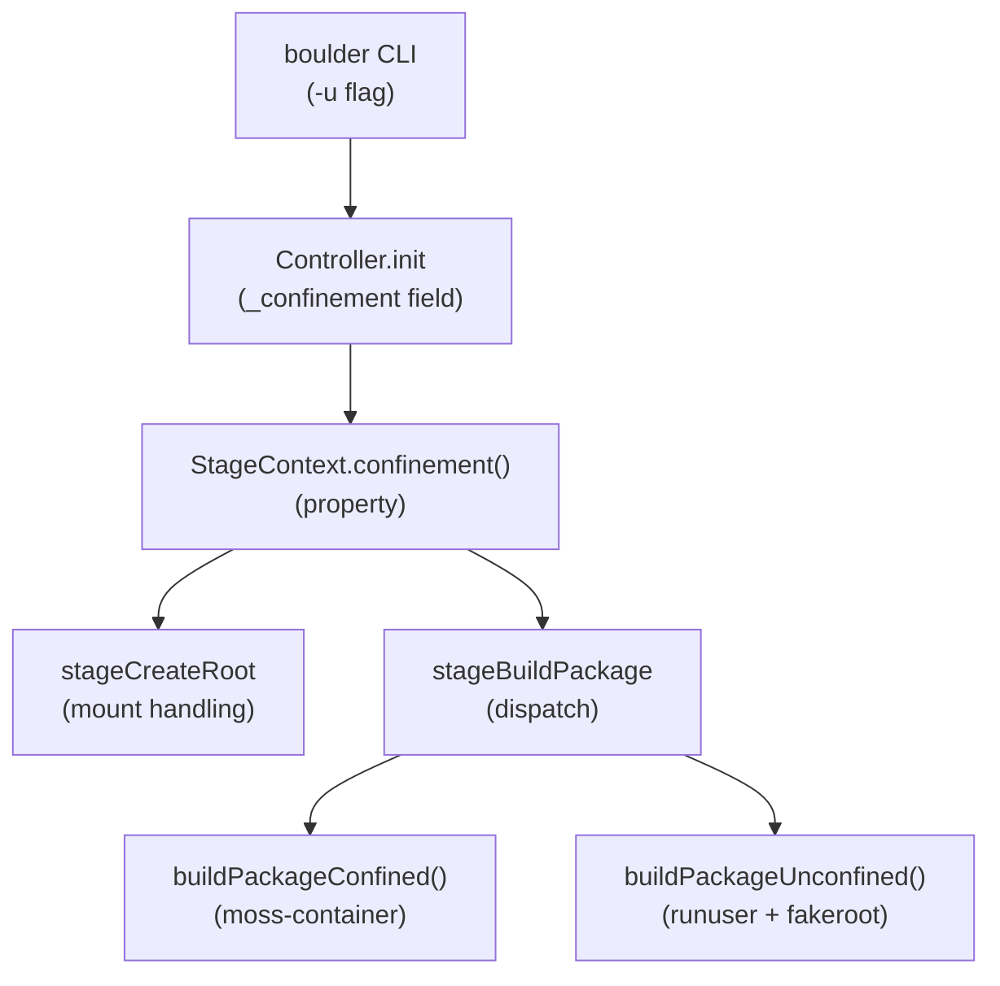

# Containerized vs Unconfined Builds

Relevant source files

* [source/boulder/controller.d](../source/boulder/controller.d)
* [source/boulder/stages/build\_package.d](../source/boulder/stages/build_package.d)
* [source/boulder/stages/clean\_root.d](../source/boulder/stages/clean_root.d)
* [source/boulder/stages/create\_root.d](../source/boulder/stages/create_root.d)
* [source/boulder/stages/package.d](../source/boulder/stages/package.d)

Boulder supports two execution modes for building packages: **containerized** (confined) and **unconfined** builds. This page explains the differences between these modes, their implementation, and when to use each.

For information about the overall build pipeline and stages, see [Build Stages](2.3-build-stages). For details on how mason executes within these environments, see [Mason: Package Builder](3-mason:-package-builder).

## Overview

Boulder can execute builds in two distinct modes:

| Mode | Description | Use Case |
| --- | --- | --- |
| **Containerized** (default) | Builds execute inside an isolated container using `moss-container` | Production builds, ensuring reproducibility and isolation |
| **Unconfined** | Builds execute directly on the host system using `runuser` and `fakeroot` | Development, debugging, when container overhead is undesirable |

The confinement mode is controlled by the `-u`/`--disable-confinement` flag passed to the `boulder` CLI. By default, builds are containerized.

Sources: [source/boulder/controller.d52-58](../source/boulder/controller.d#L52-L58) [source/boulder/controller.d147-150](../source/boulder/controller.d#L147-L150)

## Configuration and Initialization

The `Controller` class manages the confinement mode throughout the build lifecycle:

```
this(string outputDir, string architecture, bool confinement, string profile,
        bool compilerCache, string configDir = null)
{
    this._confinement = confinement;
    // ...
}
```

When confinement is enabled, the Controller validates that both `moss` and `moss-container` binaries are available:



Sources: [source/boulder/controller.d100-119](../source/boulder/controller.d#L100-L119)

## Build Execution Dispatch

The `stageBuildPackage` stage dispatches to the appropriate build implementation based on the confinement setting:



Sources: [source/boulder/stages/build\_package.d36-43](../source/boulder/stages/build_package.d#L36-L43)

## Containerized Build Flow

### Execution Environment

In containerized mode, `buildPackageConfined()` invokes `moss-container` to create an isolated execution environment. The build runs as the `nobody` user (UID 65534 or as defined in `/etc/passwd`) within the container.



### Container Arguments

The `moss-container` invocation includes the following key arguments:

| Argument | Value | Purpose |
| --- | --- | --- |
| `--directory` | `hostPaths.rootfs` | Root filesystem for the container |
| `--bind-rw` | `hostPaths.artefacts=guestPaths.artefacts` | Output directory for .stone packages |
| `--bind-rw` | `hostPaths.buildRoot=guestPaths.buildRoot` | Build directory with extracted sources |
| `--bind-rw` | `hostPaths.compilerCache=guestPaths.compilerCache` | Compiler cache directory (ccache) |
| `--bind-ro` | `hostPaths.recipe=guestPaths.recipe` | Recipe directory (read-only) |
| `--uid` | `nobodyUser` (65534) | User ID to run as |
| `-s TERM=xterm-256color` | Environment variable | Enable colored output |
| `-s HOME=...` | `guestPaths.buildRoot` | Set HOME for build processes |
| `--fakeroot` | (flag) | Enable fakeroot for file ownership simulation |
| `-n` | (optional) | Enable networking if `recipe.options.networking` is true |

The final command executed inside the container is:

```
mason build -o <artefacts> -b <buildRoot> <recipe>
```

Sources: [source/boulder/stages/build\_package.d48-120](../source/boulder/stages/build_package.d#L48-L120)

## Unconfined Build Flow

### Execution Environment

In unconfined mode, `buildPackageUnconfined()` executes the build directly on the host system using `runuser` to drop privileges and `fakeroot` to simulate root capabilities:



### Command Structure

The unconfined build uses the following command chain:

```
runuser -u nobody -- fakeroot -- mason build <args>
```

All paths used in unconfined mode are **host paths** (not guest paths), and the recipe is accessed from `hostPaths.unconfinedRecipe` which is bind-mounted from the original recipe location.

Sources: [source/boulder/stages/build\_package.d125-150](../source/boulder/stages/build_package.d#L125-L150)

## Path Management Differences

The two modes use different path mapping strategies:

### Containerized Paths

In containerized builds, there's a clear separation between host and guest paths:



### Unconfined Paths

Unconfined builds operate directly on host paths without translation:



Sources: [source/boulder/stages/build\_package.d36-150](../source/boulder/stages/build_package.d#L36-L150) [source/boulder/buildjob.d](../source/boulder/buildjob.d)

## Root Creation Differences

The `stageCreateRoot` stage behaves differently based on confinement mode:

| Operation | Containerized | Unconfined |
| --- | --- | --- |
| **Package cache** | Creates guest path and bind-mounts host cache to it | Uses host path directly |
| **Recipe access** | Bind-mounted into container at runtime | Bind-mounted to `unconfinedRecipe` path |
| **Directory ownership** | All directories owned by `nobody` user | All directories owned by `nobody` user |

### Package Cache Mount (Containerized)

```
if (context.confinement)
{
    paths ~= guestPkgCachePath;
    auto pkgCache = Mount.bindRW(context.job.hostPaths.pkgCache, guestPkgCachePath);
    auto err = pkgCache.mount();
    context.addMount(pkgCache);
}
```

### Recipe Mount (Unconfined)

```
else
{
    paths ~= context.job.unconfinedRecipe;
    auto recipeMount = Mount.bindRO(context.job.hostPaths.recipe,
                                     context.job.unconfinedRecipe);
    auto err = recipeMount.mount();
    context.addMount(recipeMount);
}
```

Sources: [source/boulder/stages/create\_root.d44-80](../source/boulder/stages/create_root.d#L44-L80)

## Security and Isolation Comparison

### Containerized Benefits

1. **Filesystem Isolation**: The build cannot access arbitrary host paths
2. **Dependency Control**: Only explicitly configured repositories are available
3. **Reproducibility**: Consistent environment across different host systems
4. **Network Control**: Networking is disabled by default (unless `recipe.options.networking` is true)

### Unconfined Trade-offs

1. **Development Speed**: No container overhead, faster iteration
2. **Debugging Access**: Easier to inspect and debug build issues
3. **Host Access**: Build has access to host filesystem (through `fakeroot` limitations)
4. **Less Isolation**: Depends on host's `/usr/bin` and `/usr/sbin`

## When to Use Each Mode

### Use Containerized Builds For:

* Production package builds for distribution
* CI/CD pipelines requiring reproducible builds
* Building untrusted or third-party packages
* Enforcing strict build dependency management
* Cross-architecture builds

### Use Unconfined Builds For:

* Local development and testing
* Debugging complex build failures
* Environments where `moss-container` is unavailable
* Performance-critical build iterations
* Situations where container setup is problematic

## Implementation Summary

The confinement decision is made at the `Controller` initialization and flows through the build pipeline via the `StageContext.confinement()` property:



Sources: [source/boulder/controller.d44-150](../source/boulder/controller.d#L44-L150) [source/boulder/stages/package.d58-121](../source/boulder/stages/package.d#L58-L121) [source/boulder/stages/build\_package.d36-150](../source/boulder/stages/build_package.d#L36-L150) [source/boulder/stages/create\_root.d31-83](../source/boulder/stages/create_root.d#L31-L83)