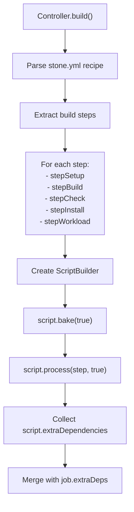
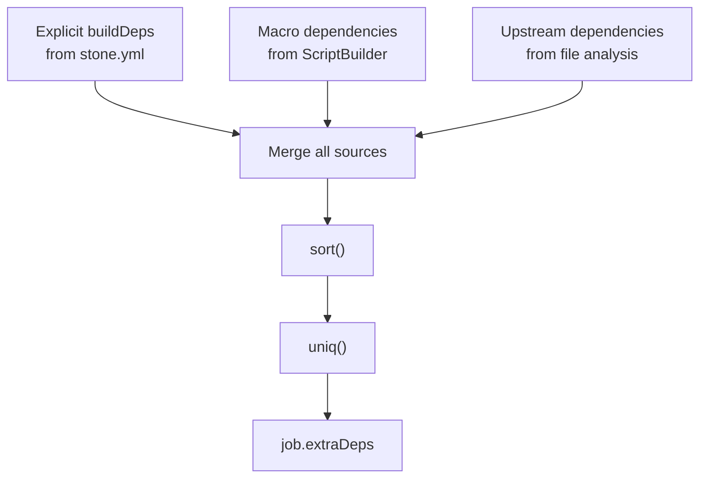
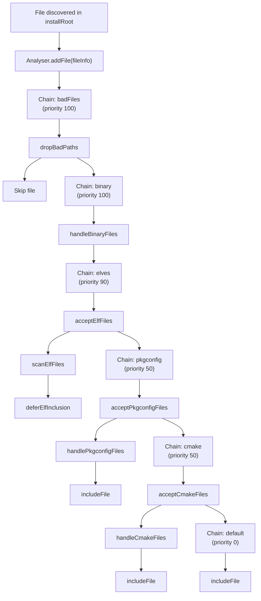
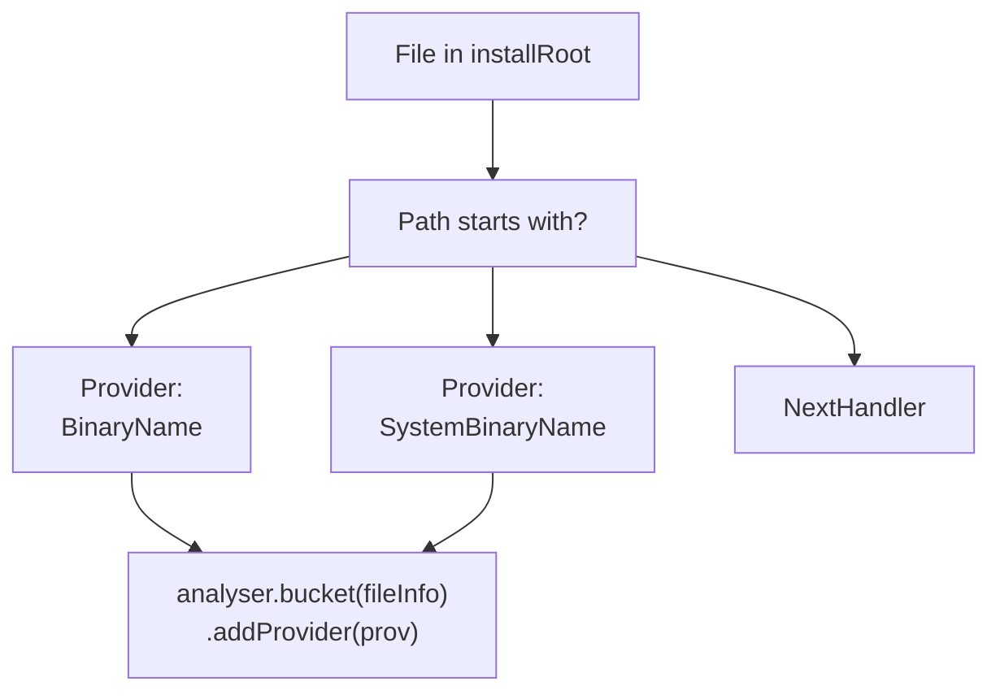
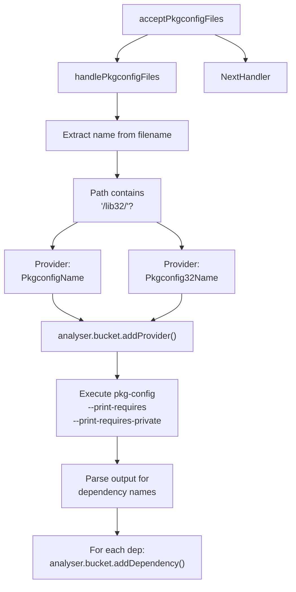
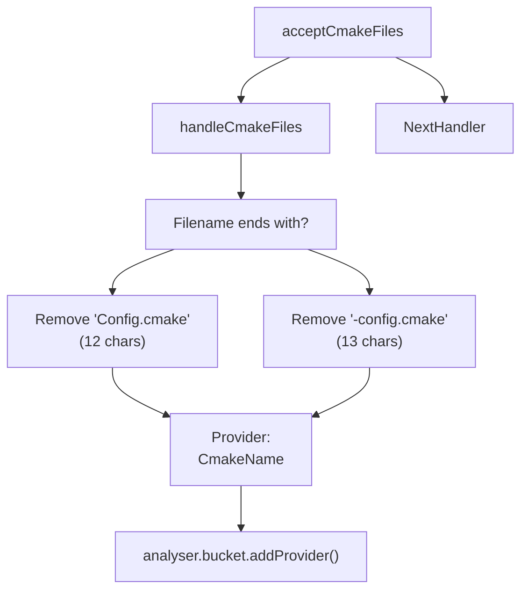
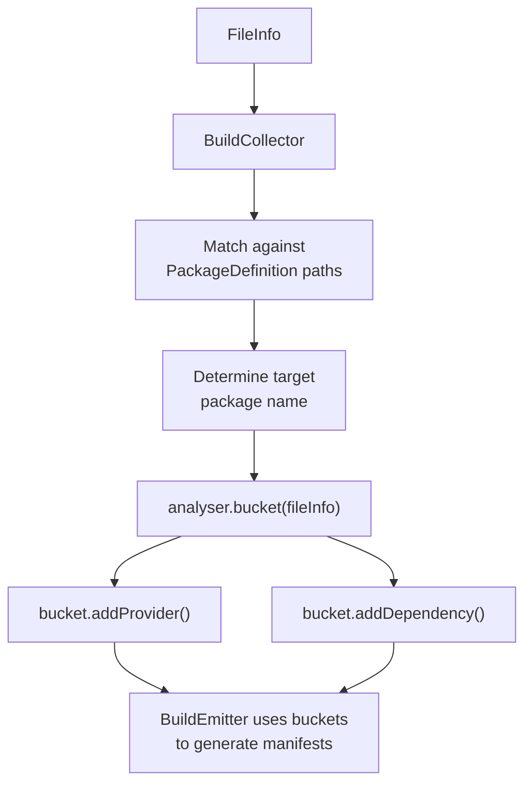
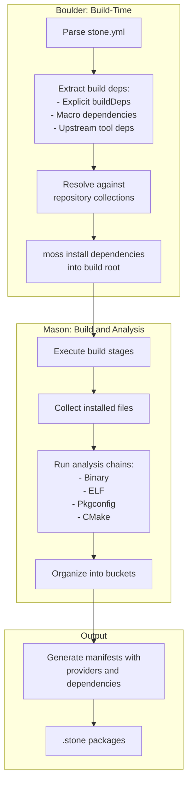

# Dependency Resolution and Analysis

Relevant source files

* [source/boulder/controller.d](../source/boulder/controller.d)
* [source/boulder/stages/clean\_root.d](../source/boulder/stages/clean_root.d)
* [source/boulder/stages/package.d](../source/boulder/stages/package.d)
* [source/mason/build/analysers/binary.d](../source/mason/build/analysers/binary.d)
* [source/mason/build/analysers/cmake.d](../source/mason/build/analysers/cmake.d)
* [source/mason/build/analysers/package.d](../source/mason/build/analysers/package.d)
* [source/mason/build/analysers/pkgconfig.d](../source/mason/build/analysers/pkgconfig.d)
* [source/mason/build/analysers/rejects.d](../source/mason/build/analysers/rejects.d)
* [source/mason/build/builder.d](../source/mason/build/builder.d)
* [source/mason/meson.build](../source/mason/meson.build)

## Overview

This page describes how boulder-d-legacy/ resolves dependencies during package building. The system performs dependency analysis in two distinct phases:

1. **Build-time dependency resolution**: Boulder determines what packages are needed to build a recipe by analyzing the stone.yml file, build scripts, and upstream sources
2. **Runtime dependency analysis**: Mason analyzes installed files to discover what providers they offer and what dependencies they require

For information about the stone.yml format where dependencies are declared, see [Stone.yml Recipe Format](6-stone.yml-recipe-format). For details about repository configuration that enables dependency resolution, see [Build Profiles and Repository Configuration](5.5-build-profiles-and-repository-configuration).

## Build-Time Dependency Resolution

Build-time dependencies are resolved before the build begins in the `Controller.build()` method. Boulder combines explicit dependencies from the recipe with automatically-detected dependencies from macros and source files.

### Explicit Build Dependencies

Recipes declare explicit build dependencies in stone.yml under the `builddeps` key. These are package names or provider specifications that must be installed before building.

**Sources:** [source/boulder/controller.d225-313](../source/boulder/controller.d#L225-L313)

### Automatic Dependency Detection from Macros

Boulder automatically extracts dependencies from action macros used in build scripts. When a recipe uses macros like `%cmake`, `%meson`, or `%cargo`, the system identifies the tools required by those actions.

The process works as follows:

**Diagram: Automatic Dependency Extraction from Build Scripts**

The `ScriptBuilder` (from libmoss) processes each build step and identifies macros that have associated dependencies. For example, the `%cmake` macro automatically adds a dependency on `binary(cmake)`.

**Sources:** [source/boulder/controller.d236-250](../source/boulder/controller.d#L236-L250)

### Automatic Dependencies from Upstream Sources

Boulder analyzes the file extensions of upstream sources to determine what extraction tools are needed. This ensures that tar, xz, zstd, unzip, and other utilities are available when needed.

| Extension | Required Dependencies |
| --- | --- |
| `.tar.xz` | `binary(tar)`, `binary(xz)` |
| `.tar.zst` | `binary(tar)`, `binary(zstd)` |
| `.tar.bz2` | `binary(tar)`, `binary(bzip2)` |
| `.tar.gz` | `binary(tar)`, `binary(gzip)` |
| `.zip` | `binary(unzip)` |
| `.rpm` | `binary(rpm2cpio)`, `cpio` |
| `.deb` | `binary(ar)` |
| Git sources | `binary(git)` |

**Sources:** [source/boulder/controller.d255-304](../source/boulder/controller.d#L255-L304)

### Dependency Merging and Deduplication

After collecting dependencies from all sources (explicit, macros, and upstreams), boulder performs merging and deduplication:

**Diagram: Dependency Collection and Deduplication**

**Sources:** [source/boulder/controller.d301-304](../source/boulder/controller.d#L301-L304)

### Repository Resolution

Once all dependencies are identified, boulder uses the active profile's repository collections to resolve them. The `stagePopulateRoot` stage invokes `moss` to install these dependencies into the build root.

Dependencies are resolved using moss's dependency resolution algorithm, which searches through configured repositories (both local and remote) for packages that provide the required capabilities.

**Sources:** [source/boulder/controller.d70-98](../source/boulder/controller.d#L70-L98)

## Runtime Dependency Analysis

After a package is built and installed, mason analyzes the installed files to discover:

* What **providers** the package offers (capabilities it provides to other packages)
* What **dependencies** the package requires at runtime

This analysis is performed by the `Analyser` class using a chain-of-responsibility pattern.

### Provider and Dependency Types

The system recognizes several types of providers and dependencies:

| Provider/Dependency Type | Description | Example |
| --- | --- | --- |
| `BinaryName` | Executable in `/usr/bin` | `binary(gcc)` |
| `SystemBinaryName` | System executable in `/usr/sbin` | `binary(systemd)` |
| `PkgconfigName` | pkgconfig file | `pkgconfig(openssl)` |
| `Pkgconfig32Name` | 32-bit pkgconfig file | `pkgconfig32(openssl)` |
| `CmakeName` | CMake configuration file | `cmake(Qt5)` |
| `SonameProvide` | Shared library SONAME | `soname(libssl.so.1.1)` |
| `SonameDependency` | Required shared library | Link-time dependency |

These types are defined in libmoss-deps and used throughout the analysis process.

**Sources:** [source/mason/build/analysers/binary.d29-46](../source/mason/build/analysers/binary.d#L29-L46) [source/mason/build/analysers/pkgconfig.d45-87](../source/mason/build/analysers/pkgconfig.d#L45-L87) [source/mason/build/analysers/cmake.d49-57](../source/mason/build/analysers/cmake.d#L49-L57)

### Analysis Chain Architecture

Mason uses an `Analyser` with multiple `AnalysisChain` objects. Each chain consists of handler functions that process files in sequence. Chains are prioritized, and each handler can accept, reject, or defer a file.

**Diagram: Analysis Chain Processing Order**

Each chain is tried in priority order (highest first). Within a chain, handlers return:

* `AnalysisReturn.IgnoreFile` - Reject the file entirely
* `AnalysisReturn.NextFunction` - Continue to next handler in same chain
* `AnalysisReturn.NextHandler` - Try the next chain

**Sources:** [source/mason/build/builder.d305-338](../source/mason/build/builder.d#L305-L338)

### Binary Provider Analysis

The `handleBinaryFiles` analyser detects executables in standard locations and registers them as providers.

**Diagram: Binary Provider Detection**

For example, if a file `/usr/bin/gcc` is installed, the system creates a `Provider("gcc", ProviderType.BinaryName)` that other packages can depend on via `binary(gcc)`.

**Sources:** [source/mason/build/analysers/binary.d29-46](../source/mason/build/analysers/binary.d#L29-L46)

### Pkgconfig Analysis

The pkgconfig analyser handles `.pc` files, extracting both providers and dependencies.

**Diagram: Pkgconfig Provider and Dependency Analysis**

The analyser invokes `pkg-config` to determine what other pkgconfig files are required. It distinguishes between regular and emul32 (32-bit) dependencies based on the file path.

**Sources:** [source/mason/build/analysers/pkgconfig.d28-87](../source/mason/build/analysers/pkgconfig.d#L28-L87)

### CMake Analysis

CMake configuration files are detected by their naming convention and registered as providers.

**Diagram: CMake Provider Detection**

Files matching patterns like `FooConfig.cmake` or `foo-config.cmake` create providers like `cmake(Foo)` or `cmake(foo)`.

**Sources:** [source/mason/build/analysers/cmake.d26-57](../source/mason/build/analysers/cmake.d#L26-L57)

### ELF and SONAME Analysis

ELF binaries and shared libraries undergo more complex analysis to extract SONAME provides and shared library dependencies. This is handled by the ELF analysis chain, which:

1. Accepts ELF files via `acceptElfFiles`
2. Scans them for metadata via `scanElfFiles`
3. Defers inclusion for post-processing via `deferElfInclusion`

After all files are collected, ELF files are post-processed in parallel to extract debug symbols and strip binaries.

**Sources:** [source/mason/build/builder.d272-301](../source/mason/build/builder.d#L272-L301)

### Bucket-Based Organization

The `Analyser` organizes providers and dependencies into "buckets" keyed by package name. Each bucket corresponds to a subpackage as determined by the `BuildCollector`'s path matching rules.

**Diagram: Bucket Organization and Emission**

This allows a single build to produce multiple packages (e.g., `foo`, `foo-devel`, `foo-utils`), each with their own sets of providers and dependencies.

**Sources:** [source/mason/build/builder.d392-471](../source/mason/build/builder.d#L392-L471)

## Complete Dependency Flow

The following diagram shows how dependency analysis integrates into the complete build process:

**Diagram: End-to-End Dependency Flow**

**Sources:** [source/boulder/controller.d225-313](../source/boulder/controller.d#L225-L313) [source/mason/build/builder.d200-241](../source/mason/build/builder.d#L200-L241)

## Key Code Entities

### Classes and Interfaces

* **`Controller`** [source/boulder/controller.d44-512](../source/boulder/controller.d#L44-L512) - Orchestrates build-time dependency resolution
* **`BuildJob`** - Contains accumulated dependencies in `extraDeps` field
* **`Analyser`** [source/mason/build/builder.d71-73](../source/mason/build/builder.d#L71-L73) - Manages runtime dependency analysis
* **`AnalysisChain`** - Defines a sequence of handler functions with priority
* **`BuildCollector`** [source/mason/build/builder.d70](../source/mason/build/builder.d#L70-L70) - Maps file paths to package names
* **`BuildEmitter`** [source/mason/build/builder.d83](../source/mason/build/builder.d#L83-L83) - Generates manifests with provider/dependency information

### Key Functions

* **`Controller.build()`** [source/boulder/controller.d225-313](../source/boulder/controller.d#L225-L313) - Main entry point for dependency extraction
* **`handleBinaryFiles()`** [source/mason/build/analysers/binary.d29-46](../source/mason/build/analysers/binary.d#L29-L46) - Binary provider detection
* **`handlePkgconfigFiles()`** [source/mason/build/analysers/pkgconfig.d45-87](../source/mason/build/analysers/pkgconfig.d#L45-L87) - Pkgconfig analysis
* **`handleCmakeFiles()`** [source/mason/build/analysers/cmake.d49-57](../source/mason/build/analysers/cmake.d#L49-L57) - CMake provider detection

### Data Structures

* **`Provider`** (from libmoss-deps) - Represents a capability provided by a package
* **`Dependency`** (from libmoss-deps) - Represents a requirement needed by a package
* **`ProviderType`** - Enum of provider types (BinaryName, PkgconfigName, CmakeName, etc.)
* **`DependencyType`** - Enum of dependency types corresponding to provider types