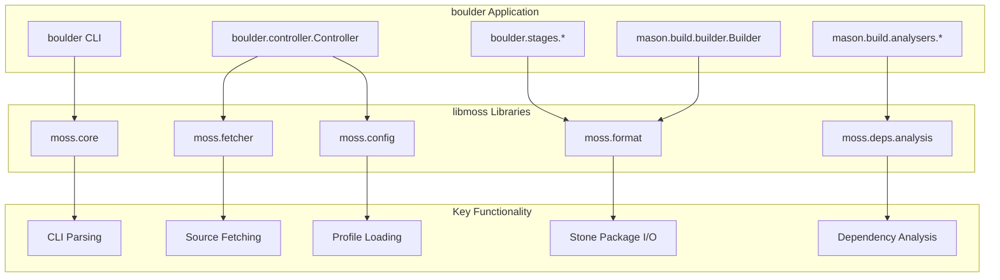
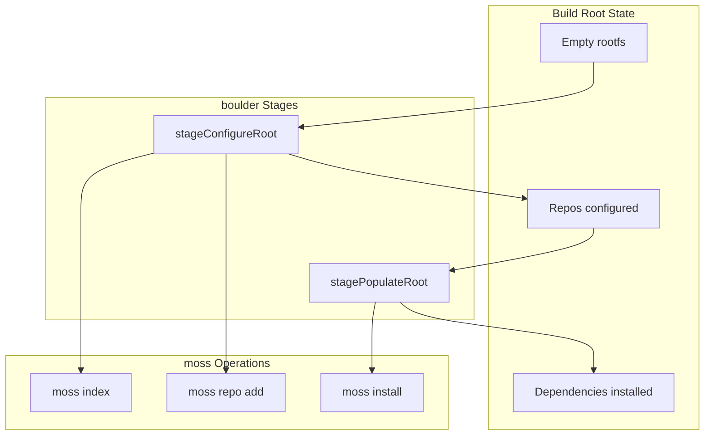
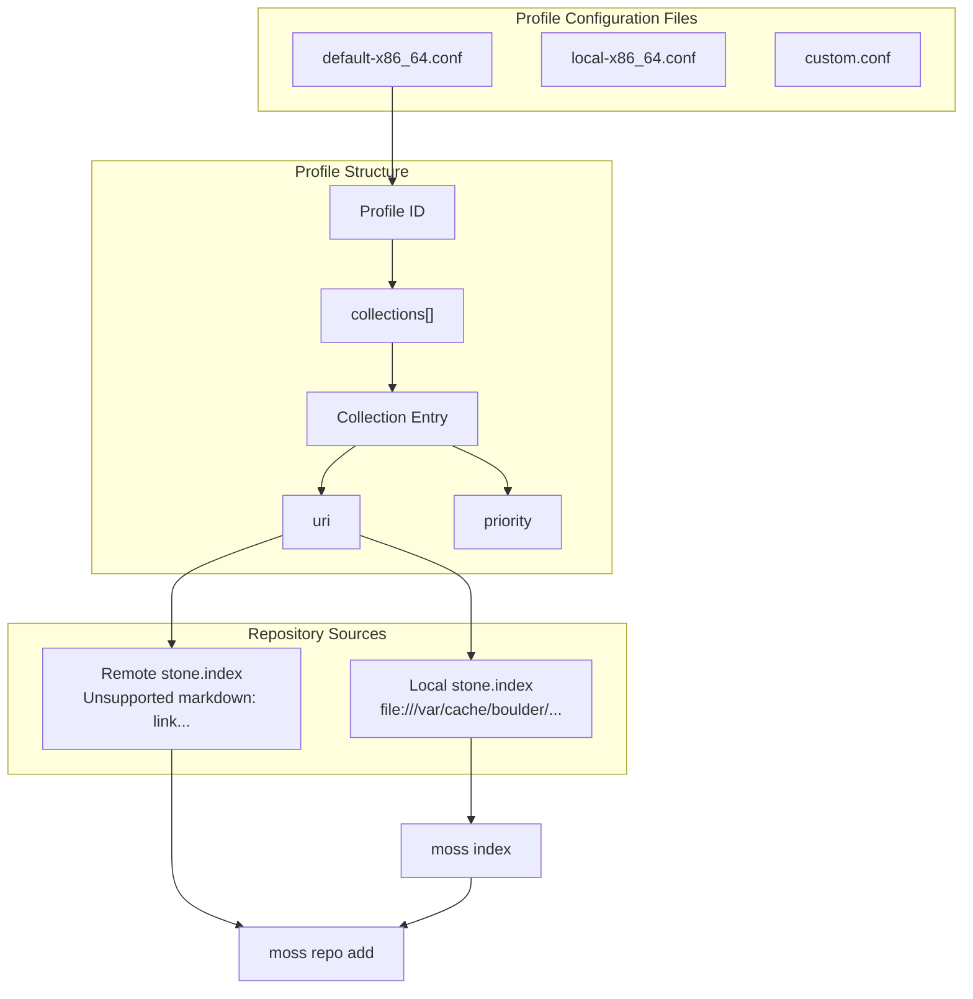
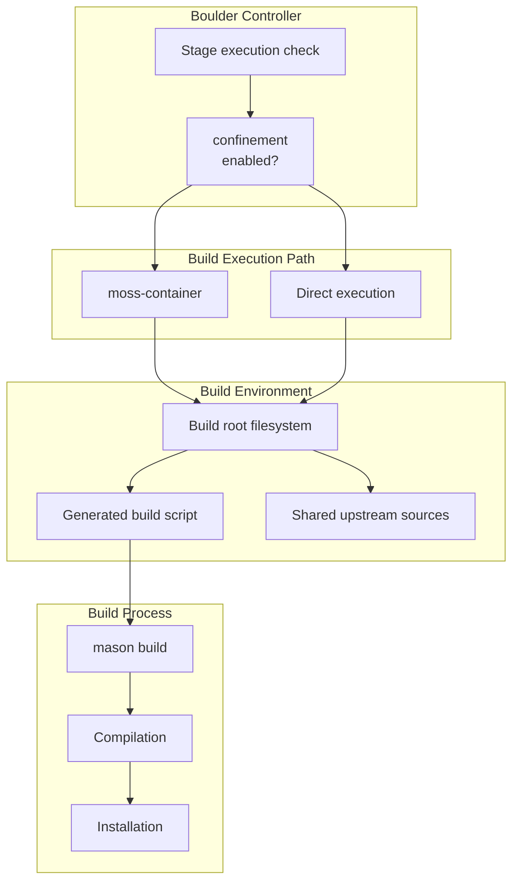
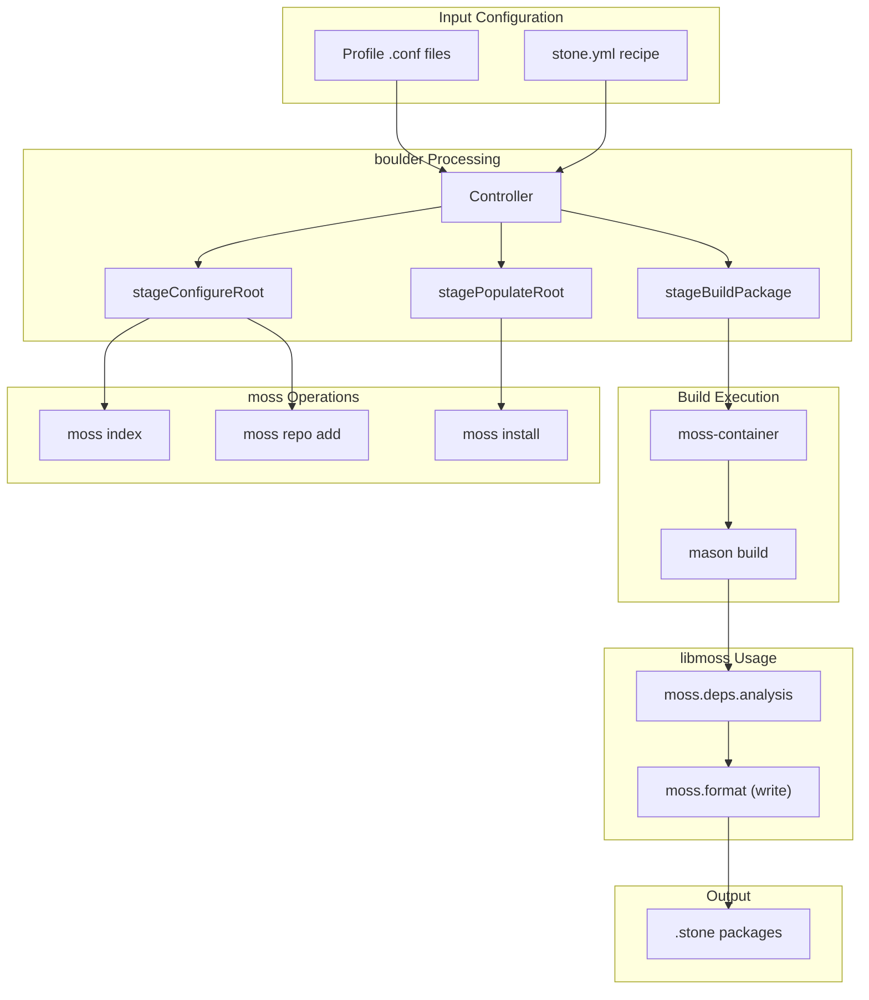

# Integration with moss Ecosystem

Relevant source files

* [.gitignore](../.gitignore)
* [data/default-x86\_64.conf](../data/default-x86_64.conf)
* [data/environment.in](../data/environment.in)
* [data/meson.build](../data/meson.build)
* [dub.json](../dub.json)
* [source/boulder/stages/configure\_root.d](../source/boulder/stages/configure_root.d)
* [source/boulder/stages/populate\_root.d](../source/boulder/stages/populate_root.d)
* [source/mason/build/analysers/elves.d](../source/mason/build/analysers/elves.d)

This document describes how boulder-d-legacy/ integrates with the moss package management ecosystem through library linkage, binary invocation, and shared data formats. Boulder depends on both libmoss libraries (for core functionality) and moss binaries (for package operations). This integration enables boulder to resolve dependencies, install build requirements, create packages in the moss format, and optionally execute builds in isolated containers.

For information about build profiles and repository configuration, see [Build Profiles and Repository Configuration](5.5-build-profiles-and-repository-configuration). For details on dependency analysis algorithms, see [Dependency Resolution and Analysis](7.2-dependency-resolution-and-analysis).

## Library Dependency Structure

Boulder links against multiple libmoss libraries to access shared functionality. The dependency is declared in the DUB build configuration and provides access to moss's core APIs.



**Dependency Declaration**

Sources: [dub.json14-18](../dub.json#L14-L18)

The project declares its libmoss dependency in the DUB configuration:

```
"dependencies": {
    "libmoss": {
        "path": "../libmoss"
    }
}
```

This provides access to the following libmoss modules:

| Module | Purpose | Used By |
| --- | --- | --- |
| `moss.core` | Core data structures, CLI utilities | All components |
| `moss.fetcher` | Download and cache management | `boulder.controller`, upstream fetching |
| `moss.deps.analysis` | ELF analysis, dependency detection | `mason.build.analysers` |
| `moss.format` | Stone package format I/O | Package emission, reading |
| `moss.config` | Profile and configuration parsing | `boulder.profile.Profile` |

**Dependency Analysis Integration**

Sources: [source/mason/build/analysers/elves.d18](../source/mason/build/analysers/elves.d#L18-L18)

The ELF analyser imports moss's dependency analysis framework:

```
public import moss.deps.analysis;
```

This provides the `Analyser`, `FileInfo`, `FileType`, and `AnalysisReturn` types used throughout mason's analysis system. Functions like `deferElfInclusion` and `copyElfDebug` use these types to process ELF files and extract dependency information.

## moss Binary Invocation

Boulder invokes the `moss` binary to perform package management operations within build roots. The binary path is typically `/usr/bin/moss` and is executed with specific subcommands for different operations.



**Repository Indexing and Configuration**

Sources: [source/boulder/stages/configure\_root.d48-84](../source/boulder/stages/configure_root.d#L48-L84)

The `stageConfigureRoot` function invokes `moss` to set up repositories:

1. **Index local repositories** (lines 55-57):

   ```
   auto idxResult = executeCommand(context.mossBinary, [
       "moss", "index", profilePath
   ], env);
   ```

   Updates `stone.index` files for local collections before use.
2. **Add repository collections** (lines 71-74):

   ```
   auto result = executeCommand(context.mossBinary, [
       "-y", "repo", "add", "-D", context.job.hostPaths.rootfs,
       collection.id, collection.uri, "-p", to!string(collection.priority)
   ], env);
   ```

   Registers each repository collection with the build root's moss installation.

**Dependency Installation**

Sources: [source/boulder/stages/populate\_root.d77-83](../source/boulder/stages/populate_root.d#L77-L83)

The `stagePopulateRoot` function installs build dependencies:

```
auto result = executeCommand(context.mossBinary, [
    "-y", "install", "-D", context.job.hostPaths.rootfs
] ~ requiredInstalled, env);
```

This installs essential build tools and recipe-specified dependencies into the build root. The `-D` flag specifies the target root directory, and `-y` auto-confirms the operation.

**Package Lists by Toolchain**

Sources: [source/boulder/stages/populate\_root.d34-75](../source/boulder/stages/populate_root.d#L34-L75)

| Category | Packages | Condition |
| --- | --- | --- |
| Base packages | `bash`, `boulder`, `coreutils`, `dash`, `diffutils`, `gawk`, `glibc-devel`, `grep`, `fakeroot`, `findutils`, `libarchive`, `linux-headers`, `pkgconf`, `sed`, `util-linux` | Always installed |
| Compiler cache | `binary(ccache)` | If `context.compilerCache` enabled |
| EMUL32 support | `glibc-32bit-devel`, `fakeroot-32bit` | If `recipe.emul32` enabled |
| GNU toolchain | `binutils`, `gcc-devel` (+32bit variants) | If `toolchain == "gnu"` |
| LLVM toolchain | `clang` (+32bit, libcxx variants) | If `toolchain == "llvm"` |
| Recipe dependencies | From `buildDependencies` and `checkDependencies` | Always |

## Profile and Repository Configuration

Boulder uses profile configuration files to define repository collections. These profiles determine where moss looks for packages when resolving build dependencies.



**Default Profile Configuration**

Sources: [data/default-x86\_64.conf1-8](../data/default-x86_64.conf#L1-L8)

The default profile references the upstream volatile repository:

```
- default-x86_64:
    collections:
        - volatile:
            uri: "https://dev.serpentos.com/volatile/x86_64/stone.index"
            description: "Volatile moss repo"
            priority: 0
```

**Local Development Profile**

Sources: [data/default-x86\_64.conf9-20](../data/default-x86_64.conf#L9-L20)

The local profile adds a higher-priority local repository:

```
- local-x86_64:
    collections:
        - volatile:
            uri: "https://dev.serpentos.com/volatile/x86_64/stone.index"
            description: "Volatile moss repo"
            priority: 0
        - local:
            uri: "file:///var/cache/boulder/repos/local-x86_64/stone.index"
            description: "Local development moss repo"
            priority: 10
```

Collections with higher priority values take precedence during dependency resolution. This allows locally-built packages to override remote versions.

**Profile Installation Location**

Sources: [data/meson.build5-9](../data/meson.build#L5-L9)

Profile configuration files are installed to:

```
${prefix}/share/boulder/profiles.conf.d/
```

## moss-container Integration

For confined builds, boulder invokes `moss-container` to execute build operations in an isolated environment. This provides reproducibility and prevents build scripts from accessing or modifying the host system.



**Container vs Direct Execution**

Sources: [source/boulder/stages/populate\_root.d27-31](../source/boulder/stages/populate_root.d#L27-L31) [source/boulder/stages/configure\_root.d37-40](../source/boulder/stages/configure_root.d#L37-L40)

Several stages check the `context.confinement` flag to determine execution mode:

```
if (!context.confinement)
{
    return StageReturn.Skipped;
}
```

When confinement is disabled:

* `stageConfigureRoot` and `stagePopulateRoot` are skipped
* Build scripts execute directly on the host
* Useful for debugging or when container support is unavailable

When confinement is enabled:

* Full build root is configured with repositories and dependencies
* `moss-container` executes the build in an isolated namespace
* Provides filesystem, network, and process isolation

## Toolchain Binary Integration

Mason uses system binaries from the installed toolchain for various build operations. These binaries are invoked based on the configured toolchain (LLVM vs GNU).

**ELF Processing Tools**

Sources: [source/mason/build/analysers/elves.d60-142](../source/mason/build/analysers/elves.d#L60-L142)

| Operation | LLVM Binary | GNU Binary | Usage |
| --- | --- | --- | --- |
| Debug extraction | `/usr/bin/llvm-objcopy` | `/usr/bin/objcopy` | `--only-keep-debug` to extract debug symbols |
| Debug linking | `/usr/bin/llvm-objcopy` | `/usr/bin/objcopy` | `--add-gnu-debuglink` to link debug info |
| Stripping | `/usr/bin/llvm-strip` | `/usr/bin/strip` | Remove symbols from binaries |

The toolchain selection is determined by `buildContext.spec.options.toolchain`:

```
bool useLLVM = buildContext.spec.options.toolchain == "llvm";
auto command = useLLVM ? "/usr/bin/llvm-objcopy" : "/usr/bin/objcopy";
```

**Debug Symbol Handling**

Sources: [source/mason/build/analysers/elves.d54-110](../source/mason/build/analysers/elves.d#L54-L110)

The `copyElfDebug` function:

1. Determines target path: `usr/lib/debug/.build-id/{XX}/{YYYY}.debug` (64-bit) or `usr/lib32/debug/.build-id/{XX}/{YYYY}.debug` (32-bit)
2. Extracts debug info: `objcopy --only-keep-debug {binary} {debug_file}`
3. Links debug info: `objcopy --add-gnu-debuglink {debug_file} {binary}`
4. Collects the debug file for packaging

This creates separate `-dbginfo` packages containing debug symbols.

## Data Flow Summary



**Integration Summary Table**

| Integration Point | Component | Purpose | Implementation |
| --- | --- | --- | --- |
| Library dependency | `libmoss` | Core functionality | DUB dependency, direct imports |
| Binary invocation | `moss` | Package management | `executeCommand()` calls |
| Container runtime | `moss-container` | Build isolation | Subprocess execution |
| Dependency analysis | `moss.deps.analysis` | ELF/dependency scanning | Direct library usage |
| Package format | `moss.format` | Stone package I/O | Library API calls |
| Configuration | `moss.config` | Profile parsing | Library API calls |
| Toolchain binaries | `objcopy`, `strip`, etc. | ELF manipulation | Direct binary execution |

Sources: [dub.json14-18](../dub.json#L14-L18) [source/boulder/stages/configure\_root.d55-74](../source/boulder/stages/configure_root.d#L55-L74) [source/boulder/stages/populate\_root.d79-83](../source/boulder/stages/populate_root.d#L79-L83) [source/mason/build/analysers/elves.d18](../source/mason/build/analysers/elves.d#L18-L18) [data/default-x86\_64.conf1-20](../data/default-x86_64.conf#L1-L20)